> 迁移说明：本文整合原有的“电商计价系统 DDD 实践”和“领域驱动设计读书笔记”两篇文章，把通用方法论与计价案例收敛为一个持续维护的入口。旧地址仅承担兼容迁移，不在正文中暴露归档路径。

领域驱动设计不是一套必须完整照搬的技术清单，而是一种把业务知识变成可讨论、可验证、可演进模型的协作方式。本文先解释为什么需要 DDD，再建立战略与战术设计的共同语言，随后用电商计价域贯穿需求分析、模型、代码、集成与测试，最后给出渐进迁移和误区检查清单。

<!-- more -->

### 目录

- [一、为什么需要领域驱动设计](#一为什么需要领域驱动设计)
- [二、领域驱动设计的核心概念](#二领域驱动设计的核心概念)
- [三、战略设计：划分业务边界](#三战略设计划分业务边界)
- [四、战术设计：构建领域模型](#四战术设计构建领域模型)
- [五、电商计价域的 DDD 实战](#五电商计价域的-ddd-实战)
- [六、从模型到系统架构](#六从模型到系统架构)
- [七、实施误区与演进清单](#七实施误区与演进清单)
- [八、总结与参考资料](#八总结与参考资料)

## 一、为什么需要领域驱动设计


DDD 的原始主张是让模型成为团队处理核心复杂性的共同工具，可从 [Eric Evans 的 Domain-Driven Design 入口](https://www.domainlanguage.com/ddd/) 和 [Martin Fowler 对 Domain-Driven Design 的概述](https://martinfowler.com/bliki/DomainDrivenDesign.html) 交叉理解：重点不是套用模式数量，而是让语言、模型与实现持续对齐。


### 为什么需要 DDD？

在软件开发中，我们经常遇到这样的困境：

这些问题表面上是「代码难懂」，根因却常常是**模型与协作方式**没有随业务一起演进：需求一变就加接口、加表字段，却很少问「领域里的概念是否变了、边界是否该调整」。不同团队的表现形式不同——有的是接口爆炸，有的是报表与线上一套规则、运营另一套口径——但症结类似：缺少共享且精确的语言与结构。

**业务复杂性**：代码无法清晰表达业务意图
- 一个简单的"下单"功能，代码散落在多个 Service 中，很难理解完整的业务流程
- 业务规则隐藏在 SQL、if-else 堆砌中，修改一个规则需要改动多处代码
- 新人接手项目，看了一个月代码还是不懂业务
- 例如：促销叠加「满减 + 券 + 会员价」时，折扣计算分散在订单服务、营销配置和后台任务里，很少有人能一步说清成交价是如何算出来的。
- 例如：部分退款、换货、补发等变体流程各自加分支，**领域概念**（如「履约」「可退金额」）从未在代码里显式命名，排查问题只能靠打断点。

**团队沟通**：技术与业务的鸿沟
- 产品说"用户下单后锁定库存"，开发理解成"创建订单后更新库存状态"，两者不是一回事
- 技术术语污染业务讨论："OrderEntity"、"OrderDTO"、"OrderVO"，业务专家听不懂
- 需求评审会变成"翻译大会"
- 例如：业务口中的「锁库」可能指预留、冻结或可售量扣减；开发实现的却是「下单后改库存状态字段」。若不共建 **Ubiquitous Language（通用语言）**，接口、报表与客服话术会长期不一致。

**代码腐化**：随时间推移质量下降
- 最初设计优雅的系统，几年后变成"大泥球"
- 修改一处影响多处，不敢重构
- 技术债累积，维护成本越来越高
- 例如：为赶工期在 `OrderService` 里直接调支付 RPC、写物流表、发消息，**边界**逐渐模糊后，任何小需求都可能牵一发而动全身，重构成本被无限推迟。

DDD（领域驱动设计）正是为了解决这些问题而生。

这些问题往往不是「再多写几个 Service」能解决的，而是需要让**业务结构**在模型里可见：哪些是核心域、边界画在哪里、跨团队协作时用什么语言描述规则。后文会反复用订单案例，把抽象概念落到可评审、可实现的粒度。

---

### 两本书的定位

**蓝皮书：《领域驱动设计：软件核心复杂性应对之道》**
- 作者：Eric Evans，2003年
- 地位：DDD 的奠基之作，建立了完整的概念体系
- 特点：
  - 偏理论，概念性强
  - 战略设计讲得深入（限界上下文、上下文映射）
  - 战术模式作为基础介绍
- 适合：建立 DDD 的完整认知体系
- 强项：帮你把「限界上下文」「上下文映射」「战略精炼」等概念串成一张地图，避免只见战术模式、不见整体结构。
- 何时读：准备做系统拆分、治理大型单体或与产品共建领域语言之前；若团队连聚合、实体都还没概念，可先扫战术章节再回读战略部分。
- 阅读预期：部分案例偏传统企业信息化语境，初学者可主动把叙事换成互联网交易场景；本文以订单为主线，正是为了降低这种「时代感错位」带来的距离。

**红皮书：《实现领域驱动设计》**
- 作者：Vaughn Vernon，2013年
- 地位：蓝皮书的实践补充，被称为"IDDD"
- 特点：
  - 偏实战，大量代码示例
  - 战术设计讲得细致（尤其是聚合设计）
  - 融入了现代实践（事件驱动、CQRS、微服务）
- 适合：学习如何落地 DDD
- 强项：聚合设计、应用服务、领域事件、有界上下文落地的代码组织方式写得很细，适合对照自己的项目做 **checklist** 式自查。
- 何时读：已经在做模块化或微服务、需要具体的类与包结构参考时；若尚无蓝皮书里的战略概念，建议先建立「上下文」与「映射」的直觉，再读红皮书战术细节会更省力。
- 阅读预期：示例代码量较大，不必逐行跟写；更建议用「对照清单」的方式记下：聚合边界、应用服务职责、领域事件发布点是否与你的模块相吻合。

**两本书的关系**：
- 蓝皮书建立认知框架，红皮书填充实现细节
- 蓝皮书告诉你"是什么"和"为什么"，红皮书告诉你"怎么做"
- 建议先读蓝皮书的战略设计，再读红皮书的战术设计
- 只读红皮书容易「只见分层与示例、不见为何如此切分」；只读蓝皮书又容易停在概念层，落地时缺少参照，因此两本交叉阅读更稳。
- 时间极紧时，可优先：蓝皮书中的限界上下文与上下文映射 + 红皮书中的聚合、领域事件与集成章节，再按项目痛点回补其余篇目。

---

### 本文的阅读地图

**如何使用这篇笔记**：

1. **系统学习**（推荐初学者）
   - 按顺序阅读：引言 → 核心概念 → 战略设计 → 战术设计 → 架构落地 → 实施指南
   - 每个章节都有电商案例和代码示例
   - 预计阅读时间：2-3小时
   - 建议边读边整理一页「术语表」：把本文出现的领域词与你们业务里的说法对齐，读后能直接用于评审或设计文档。
   - 遇到战略与战术两章都出现的概念（如上下文与聚合边界），可用订单案例串起来，避免孤立记忆定义。
   - 每读完一章试写三句话：本章针对哪种业务痛点、对应哪种 DDD 手段、订单案例里哪一步能印证；若写不出，通常说明还停留在「认名词」而非「能讨论」的阶段。

2. **快速查阅**（熟悉概念者）
   - 跳转到具体章节查阅概念定义
   - 使用 Q&A 部分快速找到问题答案
   - 查看架构图和代码示例
   - 可按关键词检索：限界上下文、聚合根、领域事件、防腐层等，把本文当词典；若与 30 号文对照阅读，可快速定位「模式组合」与「纯 DDD 概念」的边界。
   - 查阅时优先看小节标题与加粗定义，再回到订单例子验证是否理解一致。

3. **项目应用**（实战导向）
   - 先读"实施指南"了解何时用 DDD
   - 再读"战略设计"了解如何划分上下文
   - 最后读"战术设计"了解如何设计聚合
   - 建议在迭代会上挑一个真实争议点（如「已支付未发货能否取消」），试用本文的通用语言与上下文划分方式推演一遍，再决定是否在代码里引入对应边界。
   - 落地时不必一次上齐所有模式：先稳定上下文边界与聚合不变量，再逐步引入事件与集成方式。

**与 30 号文章的关系**：
本文专注于 DDD 本身，而  讲解了 DDD 与 Clean Architecture、CQRS 的关系。两篇文章互为补充：
- 30 号文章：架构模式的对比和组合
- 本文：DDD 的深入讲解和实践
- 若你关心「分层是否必须」「CQRS 是否与 DDD 绑定」这类问题，可先在 30 号文中看模式对比与取舍，再回到本文把**领域模型与上下文**讨论清楚，避免把架构风格误当成领域本身。
- 若团队已在实践 **Clean Architecture**，可把本文的聚合、领域事件看作内层规则如何暴露给外层用例；上下文映射则对应跨边界时如何防止外层概念泄漏进核心模型。

**与电商系列文章的关系**：
本文使用电商场景作为贯穿案例，与以下文章形成呼应：
- [20-ecommerce-overview.md](/books/system-design-primer/part03/01-ecommerce-overview.html) - 电商系统概览
- [21-ecommerce-listing.md](/books/system-design-primer/part02/11-product-center-supply-lifecycle.html) - 商品列表
- [22-ecommerce-inventory.md](/books/system-design-primer/part03/04-inventory-system.html) - 库存系统
- [29-ecommerce-payment-system.md](/books/system-design-primer/part03/10-payment-system.html) - 支付系统
- 阅读系列文时，可对照本文中的上下文划分，看同一能力在概览、列表、库存、支付等文中分别落在哪个子域、由哪个团队主责。
- 若你当前只负责其中一条链路（例如支付回调），仍建议先浏览订单全路径，再深入自己的上下文，避免局部优化破坏全局一致性。

---

### 贯穿全文的电商案例

为了让概念更具体，本文使用**电商订单场景**作为主线案例：

**业务场景**：用户在电商平台下单购买商品

一条常见路径是：浏览商品 → 加购 → 结算 → 创建订单 → 锁/扣库存 → 发起支付 → 支付成功 → 通知履约与物流。途中会出现超时关单、库存不足、支付失败回滚、部分退款等分支；这些分支正好暴露**跨上下文协作**与**领域规则**该放在哪里讨论。

**涉及的上下文**：
- **订单上下文**：订单生命周期管理（创建、取消、状态流转与订单级不变量）
- **库存上下文**：库存扣减和锁定（可售量、预留与释放的语义需与订单语言对齐）
- **商品上下文**：商品信息查询（价格、规格、上下架与订单快照如何解耦）
- **支付上下文**：支付流程处理（支付单、渠道回调与订单状态如何映射）
- **物流上下文**：物流单管理（出库、揽收与订单完成如何衔接）

**为什么选择订单**：
- 业务流程复杂：涉及状态机、跨上下文协调
- 聚合设计典型：Order 是经典的聚合根示例
- 实战价值高：几乎所有电商平台都有订单系统
- 容易理解：读者对电商下单流程都有直观认知
- 与日常经验贴近：秒杀、运费、发票、赠品等变体容易从生活场景切入讨论，降低领域建模的入门门槛。
- 不变量丰富：例如「已支付总额与明细一致」「取消后库存必须按规则释放」，适合讲清聚合内一致性边界。
- 集成点多：订单与库存、支付、物流之间的同步与异步协作，适合演示 **Anti-Corruption Layer（防腐层）**、领域事件等集成手段而不显得牵强。

**案例在全文中的用法**（读到对应章节时可对照本节路径思考）：
- **战略设计**：把订单、库存、支付、物流画成限界上下文，讨论上下游、合作关系与防腐层应落在哪里，避免「一个订单大表走天下」。
- **战术设计**：以 Order 为聚合根，讨论订单明细、金额、状态流转中哪些规则必须同事务一致提交，哪些宜通过领域事件异步通知其他上下文。
- **架构落地与实施**：当出现秒杀、回调延迟、对账不一致等工程现实时，如何把补丁写回模型（而不是在模型外再堆一层 if-else），是后文会反复对照订单场景说明的重点。

**读后续章节时可带着的问题**（答案分散在战略、战术与落地各节）：
- 用户点击「提交订单」的瞬间，订单侧与库存侧各自必须成立的不变量是什么？哪一侧应是权威？
- 支付回调到达时，是更新订单状态为主，还是以支付上下文的状态为主再同步到订单？如何避免双重写入与乱序？
- 超时关单、库存释放、支付关单三者若由不同定时任务驱动，如何用事件或显式用例描述保证业务上「只关一次、关得对」？

从战略设计到战术设计，我们都会用订单场景来说明概念；你在各节看到的示意图与伪代码，都可以尝试替换为自己系统的名词做一遍「语言校验」。

**可选小练习**：用非技术语言写清你们系统里「下单成功」对顾客、客服、财务分别意味着什么，再与上文订单路径对照；标出含义不一致或一词多义的词——它们往往就是限界上下文与通用语言工作的起点。

---

## 二、领域驱动设计的核心概念


边界决定一个词在哪个模型中成立；[Fowler 对 Bounded Context 的说明](https://martinfowler.com/bliki/BoundedContext.html) 提醒我们，同名概念跨边界时可以有不同模型，关键是明确翻译关系，而不是追求全公司唯一对象。


在深入战略设计和战术设计之前，我们需要先建立 DDD 的核心术语体系。这些概念是理解后续内容的基础。

---

### 2.1 统一语言（Ubiquitous Language）

**定义**：团队（包括开发者、业务专家、产品经理）共同使用的语言，贯穿需求分析、设计、代码实现的全过程。

**价值**：
- 消除「翻译成本」：业务说「下单」，代码里也是 `PlaceOrder`，而不是 `CreateOrderEntity`
- 提高沟通效率：技术与业务用同一套术语讨论问题
- 代码即文档：代码能被业务专家读懂

**如何建立统一语言**：

1. **与业务专家协作**
   - 事件风暴工作坊：识别领域事件和命令
   - 术语表维护：记录所有关键概念的定义
   - 定期 Review：确保术语使用一致

2. **在代码中体现**
   - 类名、方法名使用业务术语
   - 避免技术术语污染
   - 注释用业务语言描述

**电商实践案例**：

**好的命名**（体现业务语言）：

```go
// 领域事件
type OrderPlacedEvent struct {
    OrderID   string
    UserID    string
    PlacedAt  time.Time
}

// 领域命令
func (o *Order) PlaceOrder(items []OrderItem) error {
    // 业务逻辑
}

// 值对象
type OrderItem struct {
    ProductID string
    Quantity  int
    Price     Money
}
```

**不好的命名**（技术术语污染）：

```go
// ❌ 技术味太重
type OrderDTO struct { }
type OrderEntity struct { }
type OrderVO struct { }

// ❌ 业务语言丢失
func CreateOrderRecord(data map[string]interface{}) error { }
func InsertOrderTable(order Order) error { }
```

**术语标准化**：

在电商领域，同一个概念可能有多种说法，需要统一：

| 业务概念 | 可能的说法 | 统一后的术语 | 说明 |
|---------|-----------|------------|------|
| 用户下单 | 「下单」、「创建订单」、「提交订单」 | `PlaceOrder` | 选择最符合业务语言的术语 |
| 库存 | 「库存」、「可售库存」、「在途库存」 | `AvailableInventory`, `InTransitInventory` | 明确区分不同类型的库存 |
| 订单取消 | 「取消订单」、「关闭订单」 | `CancelOrder` | 与业务专家确认语义 |

**反例：技术术语污染业务**

```go
// ❌ 错误示例
type OrderRepository interface {
    SaveEntity(entity OrderEntity) error
    FindById(id int) (*OrderDTO, error)
}

// 问题：
// 1. "Entity"、"DTO" 是技术术语，业务专家听不懂
// 2. "Save"、"Find" 是数据库操作语言，不是业务语言
// 3. 业务说「锁库存」，代码里找不到对应的概念
```

```go
// ✅ 正确示例
type OrderRepository interface {
    Save(order *Order) error
    FindByID(orderID OrderID) (*Order, error)
}

// 改进：
// 1. 去掉技术术语
// 2. 使用领域对象（Order）而非 DTO
// 3. 方法名简洁清晰
```

**统一语言的维护**：

1. **术语表**（Glossary）

创建项目 Wiki 或文档，记录所有关键术语：

```markdown
# 订单领域术语表

- **订单（Order）**：用户提交的购买请求，包含商品、数量、收货地址等信息
- **订单项（OrderItem）**：订单中的单个商品条目
- **下单（PlaceOrder）**：用户提交订单的动作
- **支付订单（PayOrder）**：用户完成支付的动作
- **取消订单（CancelOrder）**：用户或系统取消订单
- **订单状态（OrderStatus）**：订单的当前状态（待支付、已支付、已取消、已完成）
```

2. **领域模型图**

用 UML 类图或 Mermaid 图可视化领域模型：

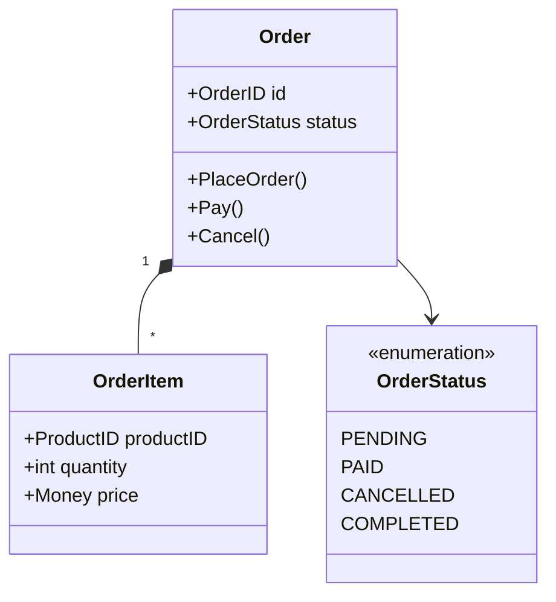

**要点总结**：
- 统一语言不仅仅是命名，而是完整的概念体系
- 业务术语应该贯穿需求、设计、代码的全过程
- 代码即文档，代码应该能被业务专家读懂
- 避免技术术语（Entity、DTO、VO）污染业务语言

---

### 2.2 限界上下文（Bounded Context）

**定义**：模型的明确边界。一个模型只在一个上下文内有效，不同上下文中的同一个词可以有不同的含义。

**核心思想**：不要追求全局统一的大模型，而是在不同的边界内建立各自的模型。

**为什么需要限界上下文**：

想象一个电商平台，如果我们试图建立一个「全局统一的商品模型」：

```go
// ❌ 试图建立全局统一模型（注定失败）
type Product struct {
    // 商品上下文需要的字段
    ID          string
    Name        string
    Description string
    Category    string
    Images      []string
    Attributes  map[string]string

    // 库存上下文需要的字段
    AvailableQty int
    ReservedQty  int
    WarehouseID  string

    // 订单上下文需要的字段
    Price        Money
    DiscountRule string

    // 营销上下文需要的字段
    RecommendScore float64
    Keywords       []string

    // 字段越加越多，最终变成「大泥球」
}
```

**问题**：
- 不同上下文关注点不同，但被迫共享一个模型
- 修改任何一个字段都可能影响所有上下文
- 模型越来越臃肿，难以维护

**解决方案：限界上下文**

在不同的上下文中，建立各自的模型：

**商品上下文**（关注商品信息）：

```go
// 商品上下文中的 Product
type Product struct {
    ID          ProductID
    Name        string
    Description string
    Category    Category
    Images      []ImageURL
    Attributes  []ProductAttribute
}
```

**库存上下文**（关注库存数量）：

```go
// 库存上下文中的 Product（只关注数量）
type InventoryItem struct {
    ProductID    ProductID  // 通过 ID 引用商品
    AvailableQty int
    ReservedQty  int
    WarehouseID  WarehouseID
}
```

**订单上下文**（关注价格快照）：

```go
// 订单上下文中的 OrderItem（保存下单时的快照）
type OrderItem struct {
    ProductID   ProductID
    ProductName string  // 快照：下单时的商品名
    Price       Money   // 快照：下单时的价格
    Quantity    int
}
```

**关键认知**：
- 同一个词（「Product」）在不同上下文有不同含义
- 「Product」在商品上下文是聚合根，包含详细信息
- 「Product」在库存上下文只关注数量
- 「Product」在订单上下文只是一个快照
- 不要追求全局统一模型

---

**电商平台的限界上下文划分**：

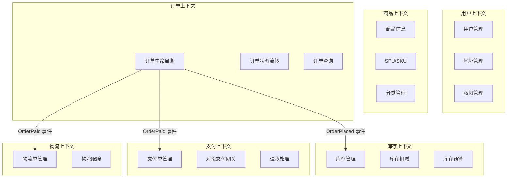

**各上下文的关注点**：

| 上下文 | 核心聚合 | 主要职责 | 「Order」的含义 |
|-------|---------|---------|---------------|
| **订单上下文** | Order | 订单生命周期管理、状态流转 | 聚合根，包含完整订单信息 |
| **支付上下文** | Payment | 支付流程、对接支付网关 | 只是一个外部引用（订单号） |
| **物流上下文** | Shipment | 物流单管理、轨迹跟踪 | 只是一个外部引用（订单号） |

**关键点**：
- 每个上下文有明确的边界和职责
- 同一个概念在不同上下文有不同模型
- 上下文之间通过 API 或事件通信，不直接共享数据库

---

**上下文的识别方法**：

1. **基于业务能力**
   - 每个上下文对应一个业务能力
   - 例如：浏览商品、下单、支付、发货是不同的业务能力

2. **基于语言边界**
   - 术语含义发生变化的地方就是上下文边界
   - 例如：「商品」在商品上下文和库存上下文中含义不同

3. **基于数据一致性边界**
   - 需要强一致性的数据放在同一上下文
   - 可以最终一致性的数据可以跨上下文
   - 例如：Order 和 OrderItem 必须强一致，所以在同一上下文

4. **基于团队结构**（康威定律）
   - 系统架构会反映组织结构
   - 每个团队负责一个或少数上下文
   - 例如：订单团队负责订单上下文

**要点总结**：
- 限界上下文是模型的边界
- 不要追求全局统一模型
- 同一个词在不同上下文可以有不同含义
- 上下文之间通过明确的接口通信

---

### 2.3 领域、子域分类

**定义**：根据业务价值和复杂度，将整个业务领域划分为不同类型的子域。

**三种子域类型**：

1. **核心域（Core Domain）**
   - 定义：业务的核心竞争力，最复杂、最有价值的部分
   - 特征：差异化优势、复杂业务规则、频繁变化
   - 投资策略：自研，精心设计，持续投入

2. **支撑域（Supporting Subdomain）**
   - 定义：支撑核心域运转，业务特定但不是竞争力
   - 特征：必需但不产生差异化、中等复杂度
   - 投资策略：简单设计，够用即可

3. **通用域（Generic Subdomain）**
   - 定义：通用功能，行业标准，可以外购或使用开源
   - 特征：无差异化、低复杂度、稳定
   - 投资策略：外采或开源，不要重复造轮子

---

**电商平台的子域分类**：

**核心域**（投入 60% 人力）：
- **订单履约**
  - 为什么是核心域：直接影响 GMV 和用户体验
  - 复杂度：状态机、工作流、异常处理、跨上下文协调
  - 投资策略：20 人团队，精心设计，持续优化

- **库存管理**
  - 为什么是核心域：防止超卖，影响用户信任
  - 复杂度：分布式锁、高并发、实时扣减
  - 投资策略：15 人团队，高可用设计

- **推荐算法**
  - 为什么是核心域：提升转化率的关键
  - 复杂度：机器学习、实时计算、A/B 测试
  - 投资策略：15 人团队，算法持续迭代

**支撑域**（投入 30% 人力）：
- 用户管理：标准 CRUD，5 人
- 地址管理：地址解析和验证，3 人
- 优惠券系统：规则引擎，5 人
- 客服系统：工单管理，5 人

**通用域**（投入 10% 人力，主要外采）：
- 消息通知：阿里云短信、SendGrid
- 文件存储：OSS、S3
- 日志系统：ELK Stack
- 监控告警：Prometheus + Grafana

**判断标准矩阵**：

| 子域 | 业务价值 | 复杂度 | 变化频率 | 差异化 | 类型 |
|-----|---------|--------|---------|--------|------|
| 订单履约 | ⭐⭐⭐⭐⭐ | ⭐⭐⭐⭐ | ⭐⭐⭐⭐ | ⭐⭐⭐⭐ | 核心域 |
| 库存管理 | ⭐⭐⭐⭐⭐ | ⭐⭐⭐⭐⭐ | ⭐⭐⭐ | ⭐⭐⭐⭐ | 核心域 |
| 推荐算法 | ⭐⭐⭐⭐⭐ | ⭐⭐⭐⭐⭐ | ⭐⭐⭐⭐ | ⭐⭐⭐⭐⭐ | 核心域 |
| 优惠券 | ⭐⭐⭐ | ⭐⭐⭐ | ⭐⭐⭐ | ⭐⭐ | 支撑域 |
| 用户管理 | ⭐⭐⭐ | ⭐⭐ | ⭐⭐ | ⭐ | 支撑域 |
| 消息通知 | ⭐⭐ | ⭐ | ⭐ | ⭐ | 通用域 |
| 文件存储 | ⭐ | ⭐ | ⭐ | ⭐ | 通用域 |

**要点总结**：
- 明确区分核心域、支撑域、通用域
- 核心域投入最多资源，精心设计
- 通用域优先外采，不要重复造轮子
- 每年重新评估，根据业务战略调整

---

### 2.4 上下文映射（Context Mapping）

**定义**：描述不同限界上下文之间的关系和集成方式。

**价值**：
- 明确团队协作方式
- 指导系统集成策略
- 管理上下文间的依赖关系

**常见映射模式**：

---

#### 1. 共享内核（Shared Kernel）

**定义**：两个上下文共享一部分代码或模型。

**适用场景**：紧密协作的两个团队

**电商案例**：订单和库存共享商品基础信息

```go
// 共享内核：商品基础信息
package shared

type ProductBasicInfo struct {
    ProductID ProductID
    Name      string
    SKU       string
}
```

**优点**：减少重复，保持一致性

**风险**：
- 修改需要双方协调
- 可能导致隐式耦合
- 团队自治性降低

**最佳实践**：
- 共享内核应该非常小
- 明确共享的范围
- 建立清晰的变更协调机制

---

#### 2. 客户-供应商（Customer-Supplier）

**定义**：下游（客户）依赖上游（供应商），上游需要考虑下游的需求。

**电商案例**：订单上下文（客户）依赖商品上下文（供应商）

```go
// 商品上下文提供的 API（供应商）
type ProductQueryService interface {
    // 批量查询（考虑订单可能有多个商品）
    GetProductsByIDs(ids []ProductID) ([]Product, error)

    // 简化模型（订单只需要基本信息）
    GetProductBasicInfo(id ProductID) (*ProductBasicInfo, error)
}
```

**上游职责**：
- 提供明确的 API 契约
- 考虑下游的需求（批量查询、性能要求）
- 保证 API 稳定性和版本兼容

**下游职责**：
- 明确表达需求
- 不要直接操作上游的数据库

---

#### 3. 防腐层（Anti-Corruption Layer, ACL）

**定义**：下游建立隔离层，避免上游变化影响自己的领域模型。

**适用场景**：
- 对接外部系统（第三方支付、物流）
- 对接遗留系统
- 上游频繁变化

**电商案例**：订单上下文对接第三方支付（微信、支付宝）

```go
// 领域层：定义统一的支付接口
type PaymentGateway interface {
    CreatePayment(order *Order, amount Money) (*PaymentResult, error)
    QueryPaymentStatus(paymentID string) (PaymentStatus, error)
}

// 基础设施层：微信支付适配器（防腐层）
type WechatPaymentAdapter struct {
    wechatClient *wechat.Client
}

func (a *WechatPaymentAdapter) CreatePayment(order *Order, amount Money) (*PaymentResult, error) {
    // 1. 将领域模型转换为微信的请求格式
    wechatReq := &wechat.UnifiedOrderRequest{
        OutTradeNo: string(order.ID()),
        TotalFee:   int(amount.Cents()),
        Body:       "订单支付",
    }

    // 2. 调用微信 API
    wechatResp, err := a.wechatClient.UnifiedOrder(wechatReq)
    if err != nil {
        return nil, err
    }

    // 3. 将微信响应转换回领域模型
    return &PaymentResult{
        PaymentID:   wechatResp.PrepayID,
        RedirectURL: wechatResp.CodeURL,
    }, nil
}
```

**关键点**：
- 领域层定义接口（依赖倒置）
- 防腐层在基础设施层实现
- 只暴露领域需要的抽象，隐藏第三方细节
- 不同支付渠道实现同一接口

---

#### 4. 开放主机服务（Open Host Service, OHS）

**定义**：上游提供标准化的 API 服务，供多个下游使用。

**电商案例**：商品上下文提供标准的 REST API

```bash
# 商品查询 API
GET /api/products/{id}
GET /api/products/batch?ids=1,2,3

# 标准化的响应格式
{
  "productId": "123",
  "name": "iPhone 14",
  "price": {
    "amount": 5999,
    "currency": "CNY"
  }
}
```

**优点**：
- 一对多的服务提供
- 统一的接口标准
- 易于集成

---

#### 5. 遵奉者（Conformist）

**定义**：下游完全遵循上游的模型，不做转换。

**适用场景**：上游非常强势或无法改变（如税务系统、银行系统）

**电商案例**：对接税务系统，必须使用税务系统的数据格式

---

**电商平台的完整上下文映射**：

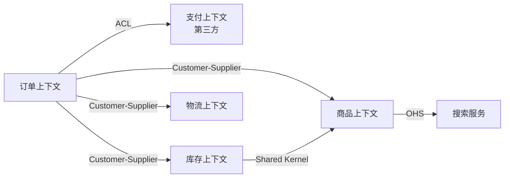

**要点总结**：
- 上下文映射明确了上下文间的集成方式
- 不同模式适用于不同场景
- 防腐层用于对接外部系统
- 客户-供应商模式最常用

---

## 三、战略设计：划分业务边界


发现边界时，可结合 [Fowler 对 Event Storming 的介绍](https://martinfowler.com/articles/201803-event-storming.html) 与 [Brandolini 的 EventStorming 方法入口](https://www.eventstorming.com/)：先按业务事件还原事实与决策，再讨论系统和团队边界，避免从现有表结构倒推领域。


战略设计回答的是「边界在哪里、团队如何协作、集成关系如何表达」——在写聚合与仓储之前，先把子域类型、限界上下文与上下文映射说清楚，战术设计才有落点。本节仍以电商订单链路为主线，说明如何从业务中识别子域、如何划分上下文，以及如何把防腐层、共享内核与客户-供应商关系落到代码与 API 上。

---

### 3.1 如何识别和划分子域

子域（Subdomain）分类（核心域 / 支撑域 / 通用域）不是贴标签比赛，而是**投资策略**：决定把最优秀的人力和设计精力投在哪里，哪里可以「够用即可」，哪里应外采或开源。判断时建议同时看四个维度，而不是只看「是否赚钱」。

#### 识别方法：四维度评估

每个子域从以下四个维度评估：

1. **业务价值（Business Value）**
   - 高：直接影响核心竞争力和收入
   - 中：支撑业务运转，但不是差异化优势
   - 低：通用功能，不产生业务价值

2. **复杂度（Complexity）**
   - 高：业务规则复杂，需要深度领域建模
   - 中：有一定业务逻辑
   - 低：简单 CRUD

3. **变化频率（Change Frequency）**
   - 高：业务规则频繁变化
   - 中：偶尔调整
   - 低：基本稳定

4. **差异化（Differentiation）**
   - 高：行业独有，竞争优势所在
   - 中：行业通用做法，但有特色
   - 低：行业标准，无差异化

#### 判断标准矩阵

| 子域类型 | 业务价值 | 复杂度 | 变化频率 | 差异化 | 投资策略 |
|---------|---------|--------|---------|--------|---------|
| **核心域** | 高 | 高 | 高/中 | 高 | 自研，精心设计，持续投入 |
| **支撑域** | 中 | 中 | 中/低 | 中/低 | 自研，简单设计，够用即可 |
| **通用域** | 低 | 低/中 | 低 | 低 | 外采/开源，不要重复造轮子 |

#### 电商平台子域完整分析

以下用星级（⭐）做相对刻度，便于工作坊对齐口径；重点是**相对比较**与**结论**，而非绝对分数。

**核心域候选**：

1. **订单履约**
   - 业务价值：⭐⭐⭐⭐⭐（直接影响 GMV）
   - 复杂度：⭐⭐⭐⭐（状态机、工作流、异常处理）
   - 变化频率：⭐⭐⭐⭐（业务规则频繁调整）
   - 差异化：⭐⭐⭐⭐（履约效率是竞争力）
   - **结论：核心域**

2. **库存管理**
   - 业务价值：⭐⭐⭐⭐⭐（防止超卖、保障可售）
   - 复杂度：⭐⭐⭐⭐⭐（分布式、高并发）
   - 变化频率：⭐⭐⭐（库存策略调整）
   - 差异化：⭐⭐⭐⭐（库存周转与准确性影响效率）
   - **结论：核心域**

3. **推荐算法**
   - 业务价值：⭐⭐⭐⭐⭐（提升转化率）
   - 复杂度：⭐⭐⭐⭐⭐（机器学习、实时计算）
   - 变化频率：⭐⭐⭐⭐（算法持续优化）
   - 差异化：⭐⭐⭐⭐⭐（推荐质量是核心竞争力）
   - **结论：核心域**

**支撑域候选**：

4. **优惠券系统**
   - 业务价值：⭐⭐⭐（支撑营销活动）
   - 复杂度：⭐⭐⭐（规则引擎、计算逻辑）
   - 变化频率：⭐⭐⭐（营销策略调整）
   - 差异化：⭐⭐（大部分平台都有）
   - **结论：支撑域**

5. **用户管理**
   - 业务价值：⭐⭐⭐（必需但不是竞争力）
   - 复杂度：⭐⭐（标准用户 CRUD）
   - 变化频率：⭐⭐（较稳定）
   - 差异化：⭐（行业标准）
   - **结论：支撑域**

6. **地址管理**
   - 业务价值：⭐⭐（辅助功能）
   - 复杂度：⭐⭐（地址解析、验证）
   - 变化频率：⭐（很少变化）
   - 差异化：⭐（无差异）
   - **结论：支撑域**

**通用域候选**：

7. **消息通知（短信、邮件）**
   - 业务价值：⭐⭐（必需但通用）
   - 复杂度：⭐（调用第三方 API）
   - 变化频率：⭐（基本不变）
   - 差异化：⭐（完全无差异）
   - **结论：通用域** → 建议使用云厂商短信、SendGrid 等服务

8. **文件存储**
   - 业务价值：⭐（基础设施）
   - 复杂度：⭐（标准存储）
   - 变化频率：⭐（不变）
   - 差异化：⭐（无差异）
   - **结论：通用域** → 建议使用 OSS、S3 等服务

9. **日志系统**
   - 业务价值：⭐（运维必需）
   - 复杂度：⭐⭐（日志采集、聚合）
   - 变化频率：⭐（不变）
   - 差异化：⭐（无差异）
   - **结论：通用域** → 建议使用 ELK、Splunk 等

#### 决策工作坊方法（团队协作识别子域）

**步骤 1：列出所有子域**

- 全员头脑风暴
- 列出系统的所有功能模块

**步骤 2：四维度打分**

- 每个子域从业务价值、复杂度、变化频率、差异化四个维度打分（例如 1～5 分）
- 团队投票，取平均值或讨论收敛

**步骤 3：分类决策**

- 根据矩阵判断子域类型
- 边界情况必须团队讨论，避免「默认核心域」

**步骤 4：投资策略确定**

- 核心域：分配最优秀的人力，精心设计
- 支撑域：够用即可，不过度设计
- 通用域：评估外采方案

**电商案例的投资策略（示意）**：

```text
核心域（60% 人力）:
- 订单履约：20 人
- 库存管理：15 人
- 推荐算法：15 人

支撑域（30% 人力）:
- 优惠券：5 人
- 用户管理：5 人
- 地址/支付/物流：5 人

通用域（10% 人力）:
- 消息通知：外采（云短信）
- 文件存储：外采（OSS）
- 日志：外采（ELK）
- 运维人力：5 人
```

#### 常见错误

**错误 1：把所有功能都当核心域**

- 表现：每个模块都精心设计，过度投入
- 后果：资源分散，真正的核心域得不到足够重视
- 解决：强制排序，**最多 3～5 个核心域**

**错误 2：低估支撑域的重要性**

- 表现：支撑域设计太粗糙，成为瓶颈
- 后果：核心域被支撑域拖累（性能、可用性、数据质量）
- 解决：支撑域也要有基本的设计质量与 SLO

**错误 3：自研通用域**

- 表现：重复造轮子（自建消息平台、日志栈）
- 后果：大量人力花在非差异化能力上
- 解决：优先考虑外采和开源方案

**错误 4：子域划分过于静态**

- 表现：子域类型一成不变
- 后果：业务战略变化后，投资与组织仍按旧地图走路
- 解决：定期（例如每年）重新评估，与业务战略对齐

#### 决策检查清单

- [ ] 是否从业务价值、复杂度、变化频率、差异化四个维度评估？
- [ ] 核心域数量是否控制在 3～5 个？
- [ ] 核心域是否分配了最优秀的人力？
- [ ] 通用域是否优先考虑了外采/开源？
- [ ] 投资策略是否与业务战略对齐？

---

### 3.2 如何划分限界上下文

限界上下文（Bounded Context）是模型的**一致性边界**与**语言边界**：在边界内术语含义稳定、规则可推敲；跨边界则通过映射与集成协作。划分不是一次性的「微服务切分」，而是对业务能力与协作现实的建模。

#### 划分原则

1. **基于业务能力**
   - 识别核心业务流程
   - 按业务能力聚合功能
   - 电商案例：浏览商品、下单、支付、发货是不同的业务能力

2. **基于团队结构（康威定律）**
   - 系统架构反映组织结构
   - 每个团队负责一个或少数上下文
   - 电商案例：订单团队、商品团队、支付团队

3. **基于数据一致性边界**
   - 强一致性要求通常落在同一上下文内
   - 最终一致性可以跨上下文
   - 电商案例：订单与订单项必须强一致；订单与库存可最终一致

4. **基于语言边界**
   - 不同的业务术语体系
   - 术语含义发生变化的地方往往是边界
   - 电商案例：「商品」在商品上下文与库存上下文中的含义不同

#### 实战：电商平台的上下文演进

**阶段 1：单体架构**

```text
[单一应用]
- 所有功能在一个代码库
- 共享数据库
- 问题: 耦合严重，难以扩展
```

**阶段 2：初步拆分（按功能模块）**

```text
[用户服务] [商品服务] [订单服务] [库存服务]
- 按功能垂直拆分
- 每个服务有独立数据库
- 问题: 边界不清晰，职责混乱，易出现「按表拆分」
```

**阶段 3：DDD 上下文拆分（目标形态）**

```text
[用户上下文]
  - 用户管理、地址管理

[商品上下文]
  - SPU/SKU、商品详情、分类

[订单上下文]（核心域）
  - 订单生命周期管理
  - 订单聚合设计

[库存上下文]（核心域）
  - 可售库存、锁定库存
  - 库存扣减策略

[支付上下文]
  - 支付单管理
  - 对接第三方支付

[物流上下文]
  - 物流单管理
  - 物流轨迹跟踪

[营销上下文]（支撑域）
  - 优惠券、促销活动
```

#### 各限界上下文一览（电商示例）

将「阶段 3」中的上下文落到可评审的表格，便于工作坊对齐语言与责任边界；下表为示意，实际项目需替换为你们自己的统一语言与聚合名。

| 限界上下文 | 子域倾向 | 核心聚合（示例） | 主要职责 | 典型对外能力 | 与周边关系（示例） |
|------------|----------|------------------|----------|----------------|---------------------|
| 用户上下文 | 支撑域 | User、Address | 账户、认证、地址簿 | 查询用户与地址、地址校验与清洗 | 订单通过 API 拉取收货人与地址 |
| 商品上下文 | 视战略而定 | Product（SPU/SKU）、Category | 类目、商品详情、上下架 | 批量查询基础信息、按 ID 拉取售价与标题快照 | 订单 Customer-Supplier；库存可能共享极小内核 |
| 订单上下文 | 核心域 | Order、OrderLine | 下单、改单、取消、状态机 | 创建订单命令、订单查询、领域事件（已下单/已支付） | 依赖商品、库存、支付、物流、营销 |
| 库存上下文 | 核心域 | Stock、Reservation | 可售量、预留、扣减与释放 | 预留、确认扣减、释放预留 | 订阅订单事件；对商品信息需谨慎共享 |
| 支付上下文 | 支撑域 | Payment、Channel | 支付单、渠道路由、对账配合 | 创建支付、查单、回调处理 | 订单经 ACL 对接三方；内部可再分防腐 |
| 物流上下文 | 支撑域 | Shipment、Tracking | 运单、轨迹、承运商对接 | 创建运单、查询轨迹 | 订单 Customer-Supplier |
| 营销上下文 | 支撑域 | Coupon、Promotion | 券实例、活动规则 | 试算优惠、核销资格校验 | 订单在算价阶段调用 |

**使用方式**：把表格当作「上下文清单 v0.1」，在评审中不断改列名与关系，直到与团队口语一致；不要在第一次工作坊就追求填满每个单元格。

#### 从单体走向限界上下文的评审问题

在画架构图之前，先用下面一组问题压一遍假设，能减少「按表拆微服务」式的假边界：

1. **语言是否分叉**：同一词在两个模块是否含义不同？（如「商品」在售前与在库存中）
2. **一致性边界**：哪些不变量必须同事务、哪些可异步最终一致？
3. **变更主体**：谁有权修改这条业务数据？跨团队改同一表往往是边界没划清。
4. **发布节奏**：两侧是否必须独立部署；若永远一起发，拆分紧迫性要重新评估。
5. **失败隔离**：一侧故障时，另一侧能否降级；若不能，是否应暂时同上下文或强化契约。
6. **集成形态**：更适合同步 API、异步事件，还是批量对账；这会反过来约束边界。
7. **测试策略**：能否为单上下文写可重复的领域测试，而不必起全链路集成环境。
8. **数据所有权**：每个业务表是否有唯一写入所有者；读模型若非所有者，是否走明确定义的查询 API。

**落地建议**：选 3～5 个最痛的跨模块需求，把它们从「谁改哪张表」还原成「哪两个上下文在协作、用哪种映射」，往往比一次性画全图更有效。

**每个上下文建议写清四件事**（可放进架构决策记录 ADR）：

- **核心聚合**：谁是聚合根，哪些不变量必须在同事务内成立
- **主要职责**：对外承诺的业务能力（用统一语言写）
- **对外 API**：查询、命令、事件的契约形态
- **与其他上下文的关系**：客户-供应商、防腐层、共享内核等

#### 架构图：电商平台上下文与协作（C4 风格示意）

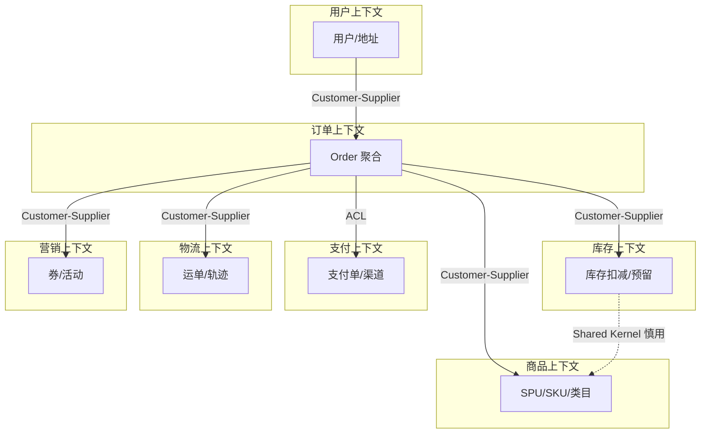

#### 拆分决策树

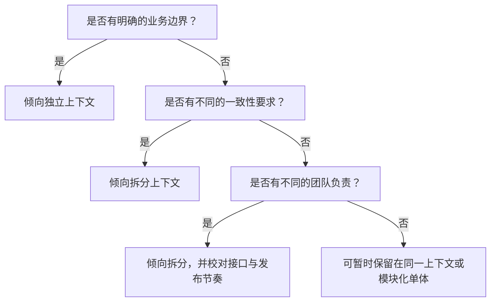

#### 拆分的代价与收益

- **何时拆分**：边界清晰、不同团队主责、不同发布节奏或技术栈诉求强、调用关系可治理
- **何时合并或暂缓拆分**：分布式复杂性（运维、一致性、排障）明显超过拆分收益
- **判断参考**：团队认知负荷、调用链复杂度、数据一致性成本、故障爆炸半径

---

### 3.3 上下文映射的落地

上下文映射（Context Mapping）把「谁依赖谁、如何集成」说清楚。下面三类在电商集成中最常落地：**防腐层**、**共享内核**、**客户-供应商**。

#### 防腐层（ACL）的设计

**场景**：订单上下文对接第三方支付（微信支付、支付宝等）。

**问题**：

- 第三方 API 经常变化
- 不同支付渠道的模型不同
- 不希望外部变化渗透进领域模型

**解决方案**：在基础设施层建立**防腐层**，把外部模型与协议隔离在适配器内。

**架构示意**：

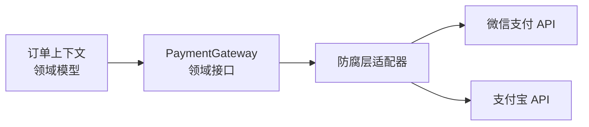

**代码示例**：

```go
// 领域层：统一的支付接口
type PaymentGateway interface {
    CreatePayment(order *Order, amount Money) (*PaymentResult, error)
    QueryPaymentStatus(paymentID string) (PaymentStatus, error)
}

// 基础设施层：防腐层实现
type WechatPaymentAdapter struct {
    wechatClient *wechat.Client
}

func (a *WechatPaymentAdapter) CreatePayment(order *Order, amount Money) (*PaymentResult, error) {
    // 将领域模型转换为微信支付的请求格式
    wechatReq := a.toWechatRequest(order, amount)
    wechatResp, err := a.wechatClient.CreateOrder(wechatReq)
    if err != nil {
        return nil, err
    }
    // 将微信响应转换回领域模型
    return a.toPaymentResult(wechatResp), nil
}
```

**关键设计原则**：

- 领域层定义接口（依赖倒置）
- 防腐层在基础设施层实现
- 只暴露领域需要的抽象，隐藏第三方细节
- 不同支付渠道实现同一接口，订单领域只依赖接口

#### 共享内核的适用场景和风险

**适用场景**：

- 两个团队紧密协作
- 有共同且稳定的概念（变化频率低）
- 共享范围可被文档与测试严格约束

**电商案例**：订单与库存共享**极小**的商品基础信息（如 SKU ID、商品名称快照策略的约定）——注意：共享的是「契约与少量类型」，不是把两个上下文的数据库绑在一起。

**风险**：

- 修改需要双方协调
- 容易产生隐式耦合
- 团队自治性降低

**最佳实践**：

- 共享内核应该**非常小**
- 明确共享范围与演进规则（版本、兼容策略）
- 建立清晰的协调机制（RFC、联合评审）

#### 客户-供应商关系的 API 设计

**场景**：订单上下文（客户）依赖商品上下文（供应商）。

**API 设计原则**：

1. 供应商提供明确的 API 契约
2. 考虑客户的需求（批量查询、缓存策略、限流与降级）
3. 版本管理和兼容性
4. 性能与可用性保障（与 SLO 对齐）

**电商案例**：

```go
// 商品上下文提供的 API（供应商）
type ProductQueryService interface {
    // 批量查询（考虑订单可能有多个商品）
    GetProductsByIDs(ids []ProductID) ([]Product, error)

    // 简化模型（订单只需要基本信息）
    GetProductBasicInfo(id ProductID) (*ProductBasicInfo, error)
}

// ProductBasicInfo 只包含订单需要的字段
type ProductBasicInfo struct {
    ID    string
    Name  string
    Price Money
    // 不包含商品详情、图片等订单不需要的信息
}
```

**关键点**：

- 下游明确表达需求（需要哪些字段、怎样的批量接口）
- 上游设计**面向客户**的 API，而不是暴露内部表结构
- 避免把内部实现细节泄漏为「公共契约」

---

### 3.4 战略设计中的常见问题

#### 问题 1：过度拆分 vs 拆分不足

**过度拆分的表现**：

- 微服务数量远超团队数量
- 简单功能需要跨多个服务
- 分布式事务或补偿到处都是
- 调用链路复杂，难以排障

**电商反例**：将订单拆成订单头服务、订单项服务、订单状态服务——下单路径被迫多次远程调用，**一致性边界被人为打碎**。

**拆分不足的表现**：

- 单个上下文职责过多
- 团队无法独立演进
- 代码库过大，变更冲突频繁

**电商反例**：订单、库存、支付、物流混在一个部署单元里却**没有模块化边界**，最终变成大泥球。

**判断标准**：

- 团队能否相对独立演进
- 是否有清晰的业务边界与统一语言
- 调用复杂度与故障半径是否可控

#### 问题 2：上下文边界不清晰

**表现**：

- 职责混乱：订单服务直接操作库存表
- 数据泄露：对外暴露内部存储形态
- 循环依赖：订单依赖库存，库存又依赖订单

**解决方案**：

- 明确每个上下文的职责边界（写进文档与代码门禁）
- 使用领域事件解耦协作路径
- **禁止**跨上下文直接共享数据库

**电商案例**：

- 错误做法：订单服务直接扣减库存表
- 正确做法：订单发布 `OrderPlaced` / `OrderPaid` 等事件，库存上下文监听并执行预留或扣减（配合幂等与重试）

#### 问题 3：团队结构与技术架构不匹配

**康威定律**：系统架构倾向于反映组织的沟通结构。

**问题场景**：

- 组织按技术栈分层（前端团队、后端团队、DBA 团队）
- 系统却按业务垂直拆分（订单、商品、支付）
- 结果：任何业务功能都要跨多团队排队

**解决方案**：

- 调整团队结构与架构对齐（业务全栈团队）
- 每个团队覆盖一个或少数上下文的端到端交付
- 明确接口负责人与 SLI/SLO

**电商案例**：

- 订单团队负责订单上下文的前后端、数据与运维协作界面
- 商品团队负责商品上下文全栈
- 避免「一个需求要拉五个团队开工会」成为常态

#### 问题 4：忽略上下文映射，直接共享数据库

**问题**：多个服务直接读写同一张业务表。

**后果**：

- 隐式依赖，难以演进与重构
- 数据一致性与并发语义不清晰
- 无法独立部署与扩缩

**解决方案**：

- 每个上下文优先**独立数据库**（或至少独立 schema 与明确所有权）
- 通过 API 或事件集成
- 把映射关系画出来：客户-供应商、防腐层、开放主机服务等

---

**本节小结**：

- 子域分类服务于投资策略：先四维度评估，再用矩阵与工作坊收敛
- 限界上下文划分同时尊重业务能力、一致性、语言与团队现实
- 上下文映射要落地到接口与适配器：ACL 隔离外部，共享内核极度克制，客户-供应商要「面向客户设计 API」
- 常见问题的根因多是边界、组织与数据所有权没有对齐

---

## 四、战术设计：构建领域模型


战术模式用于守护边界内的语义。[Vernon 的 Implementing Domain-Driven Design](https://vaughnvernon.com/) 强调聚合边界，[Fowler 的企业应用架构模式目录](https://martinfowler.com/eaaCatalog.html) 给出 Repository 与 Domain Model 的脉络，[Fowler 对 Domain Model 的说明](https://martinfowler.com/eaaDev/DomainModel.html) 则有助于区分领域模型和事务脚本。CQRS、事件溯源和微服务都不是 DDD 的必选项；只有当读写压力、审计回放或独立部署的收益足以覆盖额外一致性与运维成本时才应引入。


战术设计回答的是「领域模型在代码里长什么样」：如何用实体与值对象表达概念，如何用聚合画出一致性边界，如何用仓储隐藏持久化，以及何时引入领域服务与领域事件。本节仍以**电商订单**为主线，给出可直接对照实现的 Go 示例（为可读性会省略部分工程细节，如错误包装与日志）。

---

### 4.1 实体（Entity）

#### 概念与特征

**实体（Entity）**是有**唯一标识（Identity）**且在时间上延续的对象：同一个订单在状态从「待支付」变为「已支付」之后，仍然是**同一张订单**。与标识相比，属性值可以变化。

| 特征 | 说明 |
|------|------|
| 唯一标识 | 用 ID 区分实例，而不是靠属性组合 |
| 生命周期 | 创建、变更、归档或删除 |
| 可变状态 | 业务操作会改变状态，但身份不变 |
| 封装规则 | 状态转换应由实体方法约束，避免「随处改字段」 |

#### 贫血模型 vs 充血模型

**贫血模型（Anemic Domain Model）**：`struct` 只有字段，业务规则散落在 `Service` 的 `if-else` 中。优点是上手快；缺点是规则分散、难以测试、模型无法表达「订单知道自己能做什么」。

**充血模型（Rich Domain Model）**：实体持有**与身份强相关**的行为与不变量，应用层只做编排。DDD 鼓励在复杂核心域采用后者——不是每个 CRUD 模块都要「充血」，但订单、账户、合同这类对象通常值得。

#### 反例：贫血的 Order

```go
// 仅数据载体，业务规则在 Service 中散落
type Order struct {
	ID         string
	UserID     string
	Status     string
	TotalPrice float64
	Items      []OrderItem
	CreatedAt  time.Time
}

func (s *OrderService) CancelOrder(orderID string) error {
	order, err := s.repo.FindByID(orderID)
	if err != nil {
		return err
	}
	if order.Status == "paid" {
		order.Status = "cancelled"
		if err := s.repo.Save(order); err != nil {
			return err
		}
		return s.refundService.Refund(order.ID)
	}
	return errors.New("cannot cancel")
}
```

问题一眼可见：`Status` 是裸字符串，取消规则与退款编排挤在应用服务里，**订单自身不保证合法状态机**。

#### 正例：充血 Order 与状态值对象

```go
type OrderID string
type UserID string

type OrderStatus string

const (
	OrderStatusPending   OrderStatus = "pending"
	OrderStatusPaid      OrderStatus = "paid"
	OrderStatusShipped   OrderStatus = "shipped"
	OrderStatusCancelled OrderStatus = "cancelled"
)

func (s OrderStatus) CanCancel() bool {
	return s == OrderStatusPaid || s == OrderStatusPending
}

// 实体：封装标识、状态与领域行为
type Order struct {
	id         OrderID
	userID     UserID
	status     OrderStatus
	items      []OrderItem
	totalPrice Money
	createdAt  time.Time
	events     []DomainEvent
}

func (o *Order) Cancel(reason string) error {
	if !o.status.CanCancel() {
		return errors.New("order cannot be cancelled")
	}
	o.status = OrderStatusCancelled
	o.addEvent(OrderCancelledEvent{
		OrderID:     o.id,
		Reason:      reason,
		CancelledAt: time.Now(),
	})
	return nil
}

func (o *Order) addEvent(e DomainEvent) {
	o.events = append(o.events, e)
}
```

#### 实体的关键设计原则

1. **封装业务规则**：哪些状态可以互转，由实体（或值对象）表达，而不是由调用方猜。
2. **保证不变性**：禁止外部绕过方法直接改关键字段；在 Go 中常用小写字段 + 构造/工厂 + 业务方法。
3. **与值对象组合**：金额用 `Money`，状态用 `OrderStatus`，避免魔法字符串与 `float64` 金额。
4. **领域事件（可选但常见）**：状态变更时记录事件，供基础设施在事务成功后发布（详见 4.4）。

#### 生命周期（简图）

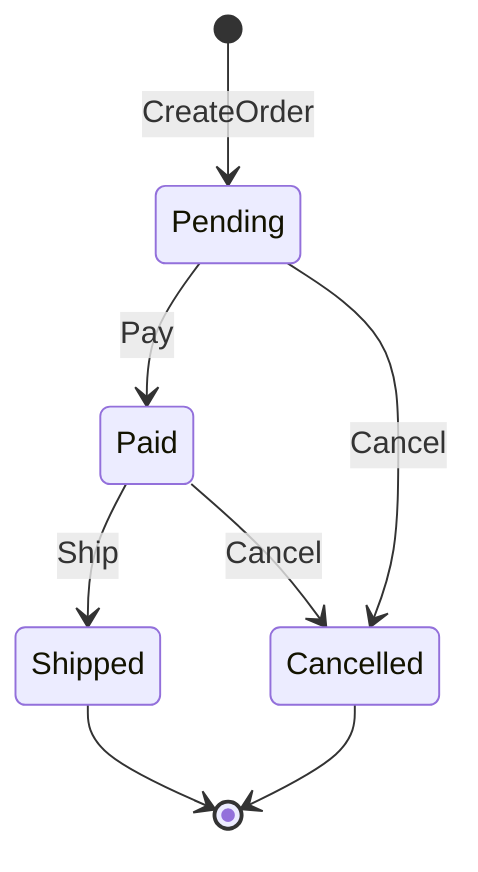

---

### 4.2 值对象（Value Object）

#### 概念与特征

**值对象（Value Object）**没有独立身份，靠**属性值**描述事物；通常**不可变**，用整体替换表示变更。相等语义是**值相等**而非引用相等。

| 特征 | 说明 |
|------|------|
| 无标识 | 不需要 `OrderID` 这类独立 ID |
| 不可变 | 修改返回新实例，不原地改字段 |
| 可替换 | `addr2 := addr1.WithStreet("…")` |
| 自验证 | 构造失败即非法，避免「无效值对象在系统里传递」 |

#### 何时使用值对象

- 描述性概念：`Money`、`Address`、`DateRange`、`Email`。
- 需要值语义：两个「100 CNY」在业务上相等。
- 希望减少无效状态：构造时校验，方法内不破坏不变量。

#### 电商示例：Money

金额用**整数分**存储，避免浮点误差；运算返回新 `Money`，不修改接收者。

```go
import "errors"

type Money struct {
	amount   int64  // 分
	currency string // 如 CNY
}

// AmountCents / Currency 供仓储等外层只读映射，避免跨包访问未导出字段。
func (m Money) AmountCents() int64 { return m.amount }
func (m Money) Currency() string   { return m.currency }

func NewMoneyFromYuan(yuan float64, currency string) Money {
	return Money{amount: int64(yuan * 100), currency: currency}
}

func (m Money) Add(other Money) (Money, error) {
	if m.currency != other.currency {
		return Money{}, errors.New("currency mismatch")
	}
	return Money{amount: m.amount + other.amount, currency: m.currency}, nil
}

func (m Money) Subtract(other Money) (Money, error) {
	if m.currency != other.currency {
		return Money{}, errors.New("currency mismatch")
	}
	if m.amount < other.amount {
		return Money{}, errors.New("insufficient amount")
	}
	return Money{amount: m.amount - other.amount, currency: m.currency}, nil
}

func (m Money) Multiply(qty int) Money {
	if qty < 0 {
		return Money{amount: 0, currency: m.currency}
	}
	return Money{amount: m.amount * int64(qty), currency: m.currency}
}

func (m Money) Equals(other Money) bool {
	return m.amount == other.amount && m.currency == other.currency
}
```

#### 电商示例：Address

```go
type Address struct {
	province string
	city     string
	district string
	street   string
	zipCode  string
}

func (a Address) WithStreet(newStreet string) Address {
	return Address{
		province: a.province,
		city:     a.city,
		district: a.district,
		street:   newStreet,
		zipCode:  a.zipCode,
	}
}

func (a Address) IsValid() bool {
	return a.province != "" && a.city != "" && a.street != ""
}
```

#### 电商示例：OrderItem（作为值对象）

订单行通常**不单独生命周期**：外部不引用「第 3 行」的持久化 ID，而是由订单聚合统一修改。典型做法是 `ProductID` + 下单**快照**（名称、单价）。字段导出便于仓储映射；业务不变量仍由聚合根方法守护。

```go
type ProductID string

type OrderItem struct {
	ProductID   ProductID
	ProductName string
	Quantity    int
	UnitPrice   Money
}

func (item OrderItem) Subtotal() Money {
	return item.UnitPrice.Multiply(item.Quantity)
}
```

#### 值对象 vs 实体：判断口诀

> 「若两个对象属性完全相同，业务上是否仍要区分成两个东西？」

- **是** → 实体（两张订单即使金额相同也是不同订单）。
- **否** → 值对象（两张 100 元纸币在记账语义下可互换）。

---

### 4.3 聚合（Aggregate）

#### 概念

**聚合（Aggregate）**是一组具有**一致性边界**的领域对象：**聚合根（Aggregate Root）**是对外唯一入口，外部只能通过根来修改内部；根负责维护边界内不变量。聚合也常被视为**一个事务边界**（在单体或同一数据库内）。

#### 设计原则（摘自《实现领域驱动设计》）

1. **在边界内保护业务规则不变量**。
2. **设计小聚合**（Small Aggregates），降低锁竞争与并发冲突。
3. **通过 ID 引用其他聚合**（Reference by ID），不直接持有其他根的对象图。
4. **边界外接受最终一致性**：跨聚合用领域事件等方式同步。

#### 聚合结构示意（Order）

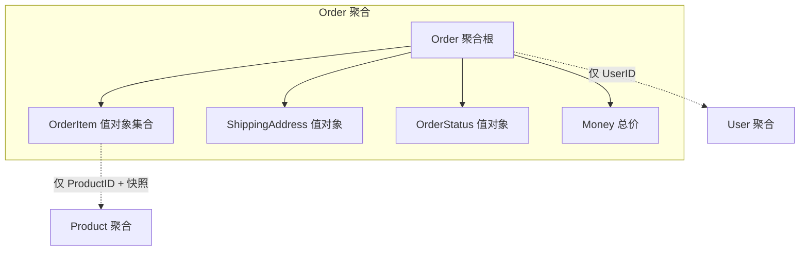

#### 完整示例：Order 聚合根

```go
package example

import (
	"errors"
	"fmt"
	"time"
)

type Payment struct {
	Method PaymentMethod
	PaidAt time.Time
	Amount Money
}

type PaymentMethod string

// Order 聚合根：外部只能通过它的方法改变状态
type Order struct {
	id              OrderID
	userID          UserID
	status          OrderStatus
	items           []OrderItem
	shippingAddress Address
	paymentInfo     Payment
	totalPrice      Money
	createdAt       time.Time
	updatedAt       time.Time
	events          []DomainEvent
}

func CreateOrder(userID UserID, items []OrderItem, address Address) (*Order, error) {
	if len(items) == 0 {
		return nil, errors.New("order must have at least one item")
	}
	if !address.IsValid() {
		return nil, errors.New("invalid shipping address")
	}

	total := Money{amount: 0, currency: "CNY"}
	for _, it := range items {
		var err error
		total, err = total.Add(it.Subtotal())
		if err != nil {
			return nil, err
		}
	}

	now := time.Now()
	order := &Order{
		id:              GenerateOrderID(),
		userID:          userID,
		status:          OrderStatusPending,
		items:           append([]OrderItem(nil), items...),
		shippingAddress: address,
		totalPrice:      total,
		createdAt:       now,
		updatedAt:       now,
	}
	order.addEvent(OrderCreatedEvent{
		OrderID:    order.id,
		UserID:     order.userID,
		TotalPrice: order.totalPrice,
		OccurredOn: now,
	})
	return order, nil
}

func (o *Order) Pay(method PaymentMethod) error {
	if o.status != OrderStatusPending {
		return errors.New("only pending orders can be paid")
	}
	now := time.Now()
	o.status = OrderStatusPaid
	o.paymentInfo = Payment{Method: method, PaidAt: now, Amount: o.totalPrice}
	o.updatedAt = now
	o.addEvent(OrderPaidEvent{
		OrderID:    o.id,
		UserID:     o.userID,
		Amount:     o.totalPrice,
		PaidAt:     now,
		Items:      append([]OrderItem(nil), o.items...),
		OccurredOn: now,
	})
	return nil
}

func (o *Order) Cancel(reason string) error {
	if !o.status.CanCancel() {
		return errors.New("order cannot be cancelled")
	}
	o.status = OrderStatusCancelled
	o.updatedAt = time.Now()
	o.addEvent(OrderCancelledEvent{
		OrderID:     o.id,
		Reason:      reason,
		CancelledAt: o.updatedAt,
	})
	return nil
}

func (o *Order) GetEvents() []DomainEvent {
	return o.events
}

func (o *Order) ClearEvents() {
	o.events = nil
}

func (o *Order) addEvent(e DomainEvent) {
	o.events = append(o.events, e)
}

// 访问器：供基础设施层持久化，避免直接暴露可变字段
func (o *Order) ID() OrderID                  { return o.id }
func (o *Order) UserID() UserID                { return o.userID }
func (o *Order) Status() OrderStatus           { return o.status }
func (o *Order) Items() []OrderItem            { return append([]OrderItem(nil), o.items...) }
func (o *Order) TotalPrice() Money            { return o.totalPrice }
func (o *Order) CreatedAt() time.Time          { return o.createdAt }
func (o *Order) ShippingAddress() Address     { return o.shippingAddress }
func (o *Order) PaymentInfo() Payment          { return o.paymentInfo }

func GenerateOrderID() OrderID {
	return OrderID(fmt.Sprintf("ORD-%d", time.Now().UnixNano()))
}
```

> 说明：`GenerateOrderID` 仅为示例；生产环境应使用发号器、UUID 或数据库序列，并处理时钟回拨与冲突。

#### 关键设计决策

1. **`userID` 而非 `*User`**：用户是另一聚合，订单事务不应加载整张用户对象图。
2. **`OrderItem` 用快照**：价格、名称在下单时刻固化，避免商品改价影响历史订单。
3. **不持有 `*Product`**：跨聚合引用用 ID + 快照，而不是 ORM 式「关联对象」。

#### 常见错误

**错误 1：聚合过大**

```go
// 将库存、支付细节全部塞进 Order —— 事务臃肿、并发差、职责混乱
type Order struct {
	id        OrderID
	items     []OrderItem
	inventory *Inventory // 通常是另一聚合
}
```

**错误 2：跨聚合直接修改**

```go
// 支付时直接扣库存：破坏边界，难以拆分服务
func (o *Order) PayBad(inventory *Inventory) error {
	// ...
	_ = inventory.Deduct(o.items)
	return nil
}

// 更好：发布领域事件，由库存上下文订阅处理
func (o *Order) PayGood(method PaymentMethod) error {
	// ...
	o.addEvent(OrderPaidEvent{ /* ... */ })
	return nil
}
```

**错误 3：绕过聚合根修改内部集合**

```go
// 外部直接改行项目——不变量失守
order.Items()[0] = OrderItem{} // 若 Items 返回切片底层可被改，风险更高
```

正确做法：由 `Order` 提供 `ChangeItemQuantity` 等方法，在根内校验「已支付不可改件数」等规则。

#### 聚合设计检查清单

- [ ] 该边界是否需要**强一致**一起提交？
- [ ] 聚合是否足够小，避免「大锁」？
- [ ] 是否只通过 **ID** 连接其他聚合？
- [ ] 外部是否**只能**通过根操作内部对象？
- [ ] 跨聚合协作是否首选**最终一致**（事件、Saga）？

---

### 4.4 仓储（Repository）+ 领域服务（Domain Service）+ 领域事件（Domain Event）

#### 4.4.1 仓储（Repository）

**仓储**是**面向聚合**的持久化抽象：领域层声明「需要什么」，基础设施层决定「怎么存」。它不同于面向表的 DAO：查询方法宜带**业务语义**，如「待支付超时订单」。

| 对比 | DAO | Repository |
|------|-----|------------|
| 视角 | 表与行 | 聚合与不变量 |
| 方法 | `Insert` / `Update` | `Save` / `FindByID` |
| 查询 | 通用 CRUD | 语义化查询 + 重建对象图 |
| 依赖方向 | 常泄漏到领域 | 接口在领域，实现在基础设施 |

**领域层接口示例**：

```go
import "time"

type OrderRepository interface {
	Save(order *Order) error
	FindByID(id OrderID) (*Order, error)
	Remove(id OrderID) error

	FindPendingOrdersByUser(userID UserID) ([]*Order, error)
	FindOrdersNeedingPayment(before time.Time) ([]*Order, error)
}
```

**PostgreSQL 实现（示意）**：以聚合为单位事务写入订单头与行表，`FindByID` 负责**重建**完整 `Order`。

```go
import (
	"database/sql"
	"time"
)

type PostgresOrderRepository struct {
	db *sql.DB
}

func (r *PostgresOrderRepository) Save(order *Order) error {
	tx, err := r.db.Begin()
	if err != nil {
		return err
	}
	defer func() { _ = tx.Rollback() }()

	_, err = tx.Exec(`
INSERT INTO orders (id, user_id, status, total_amount_cents, currency, created_at, updated_at)
VALUES ($1,$2,$3,$4,$5,$6,$7)
ON CONFLICT (id) DO UPDATE SET
  user_id = EXCLUDED.user_id,
  status = EXCLUDED.status,
  total_amount_cents = EXCLUDED.total_amount_cents,
  currency = EXCLUDED.currency,
  updated_at = EXCLUDED.updated_at`,
		string(order.ID()),
		string(order.UserID()),
		string(order.Status()),
		order.TotalPrice().AmountCents(),
		order.TotalPrice().Currency(),
		order.CreatedAt(),
		time.Now(),
	)
	if err != nil {
		return err
	}

	if _, err := tx.Exec(`DELETE FROM order_items WHERE order_id = $1`, string(order.ID())); err != nil {
		return err
	}
	for _, it := range order.Items() {
		_, err := tx.Exec(`
INSERT INTO order_items (order_id, product_id, product_name, quantity, unit_price_cents, currency)
VALUES ($1,$2,$3,$4,$5,$6)`,
			string(order.ID()),
			string(it.ProductID),
			it.ProductName,
			it.Quantity,
			it.UnitPrice.AmountCents(),
			it.UnitPrice.Currency(),
		)
		if err != nil {
			return err
		}
	}
	return tx.Commit()
}

func (r *PostgresOrderRepository) FindByID(id OrderID) (*Order, error) {
	row := r.db.QueryRow(`
SELECT user_id, status, total_amount_cents, currency, created_at, updated_at
FROM orders WHERE id = $1`, string(id))

	var (
		userID       string
		status       string
		amountCents  int64
		currency     string
		createdAt    time.Time
		updatedAt    time.Time
	)
	if err := row.Scan(&userID, &status, &amountCents, &currency, &createdAt, &updatedAt); err != nil {
		return nil, err
	}

	itemRows, err := r.db.Query(`
SELECT product_id, product_name, quantity, unit_price_cents, currency
FROM order_items WHERE order_id = $1`, string(id))
	if err != nil {
		return nil, err
	}
	defer itemRows.Close()

	var items []OrderItem
	for itemRows.Next() {
		var (
			pid, pname string
			qty        int
			ucents     int64
			ccy        string
		)
		if err := itemRows.Scan(&pid, &pname, &qty, &ucents, &ccy); err != nil {
			return nil, err
		}
		items = append(items, OrderItem{
			ProductID:   ProductID(pid),
			ProductName: pname,
			Quantity:    qty,
			UnitPrice:   Money{amount: ucents, currency: ccy},
		})
	}

	// 通过非导出字段重建聚合：实际项目中可用包内工厂或重建函数
	o := &Order{
		id:         id,
		userID:     UserID(userID),
		status:     OrderStatus(status),
		items:      items,
		totalPrice: Money{amount: amountCents, currency: currency},
		createdAt:  createdAt,
		updatedAt:  updatedAt,
	}
	return o, nil
}
```

> 注意：`Order` 若字段未导出，重建逻辑应放在 `domain` 包内的 `RehydrateOrder(...)` 工厂中，避免仓储跨包写入私有字段。上文为讲解方便采用同包示意。

#### 4.4.2 领域服务（Domain Service）

**领域服务**承载**不属于单一实体或值对象**、但又**纯粹属于领域**的逻辑：通常无状态、不直接依赖数据库。典型场景：**跨多个聚合**的规则、或需要多种输入对象的计算。

与**应用服务**分工：

| 层次 | 职责 | 依赖 |
|------|------|------|
| 领域服务 | 领域规则与计算 | 其他领域对象、接口（由外层实现） |
| 应用服务 | 用例编排、事务、调用仓储与消息 | 基础设施 |

**示例：订单计价（Promotion + User + Items）**

价格计算依赖促销、用户等级等，放在 `Order` 上往往臃肿，可下沉为 `PricingService`：

```go
type Promotion struct {
	Code   string
	Active bool
}

type User struct {
	ID    UserID
	Level int
}

type PricingService interface {
	CalculateOrderPrice(items []OrderItem, user User, promotions []Promotion) (Money, error)
}

type OrderPricingService struct{}

func (OrderPricingService) CalculateOrderPrice(
	items []OrderItem,
	user User,
	promotions []Promotion,
) (Money, error) {
	subtotal := NewMoneyFromYuan(0, "CNY")
	for _, it := range items {
		var err error
		subtotal, err = subtotal.Add(it.Subtotal())
		if err != nil {
			return Money{}, err
		}
	}

	discount := estimateDiscount(subtotal, user, promotions)
	return subtotal.Subtract(discount)
}

func estimateDiscount(subtotal Money, user User, promotions []Promotion) Money {
	// 示意：会员折扣 + 促销标签；真实系统会有规则引擎、券模板等
	_ = promotions
	if user.Level >= 3 && subtotal.AmountCents() > 10_000 {
		return NewMoneyFromYuan(10, subtotal.Currency()) // 减 10 元
	}
	return NewMoneyFromYuan(0, subtotal.Currency())
}
```

其他常见领域服务：**转账**（两端账户聚合）、**库存分配策略**、**运费计算器**等。

#### 4.4.3 领域事件（Domain Event）

**领域事件**表示**已发生**的重要业务事实：命名多用过去时（`OrderPaid`），**不可变**，携带订阅方所需的**最小充分信息**，用于解耦聚合与上下文。

**价值**：

1. 解耦聚合：不直接调用另一上下文的 `Service`。
2. 最终一致性：支付成功后异步扣库存、发通知。
3. 审计与分析：事件流即事实记录（是否做完整事件溯源另当别论）。

**接口与事件定义**：

```go
type DomainEvent interface {
	EventType() string
	OccurredOn() time.Time
}

type OrderCreatedEvent struct {
	OrderID    OrderID
	UserID     UserID
	TotalPrice Money
	OccurredOn time.Time
}

func (e OrderCreatedEvent) EventType() string   { return "OrderCreated" }
func (e OrderCreatedEvent) OccurredOn() time.Time { return e.OccurredOn }

type OrderPaidEvent struct {
	OrderID    OrderID
	UserID     UserID
	Amount     Money
	PaidAt     time.Time
	Items      []OrderItem
	OccurredOn time.Time
}

func (e OrderPaidEvent) EventType() string     { return "OrderPaid" }
func (e OrderPaidEvent) OccurredOn() time.Time { return e.OccurredOn }

type OrderCancelledEvent struct {
	OrderID     OrderID
	Reason      string
	CancelledAt time.Time
}

func (e OrderCancelledEvent) EventType() string     { return "OrderCancelled" }
func (e OrderCancelledEvent) OccurredOn() time.Time { return e.CancelledAt }
```

**应用服务内：事务与发布协调（示意）**

```go
type EventBus interface {
	Publish(events ...DomainEvent)
}

type UnitOfWork interface {
	Begin() UnitOfWork
	Commit() error
	Rollback()
	OnCommit(fn func())
}

type OrderApplicationService struct {
	orderRepo OrderRepository
	eventBus  EventBus
	uow       UnitOfWork
}

func (s *OrderApplicationService) PayOrder(id OrderID, method PaymentMethod) error {
	tx := s.uow.Begin()
	defer tx.Rollback()

	order, err := s.orderRepo.FindByID(id)
	if err != nil {
		return err
	}
	if err := order.Pay(method); err != nil {
		return err
	}
	if err := s.orderRepo.Save(order); err != nil {
		return err
	}

	events := append([]DomainEvent(nil), order.GetEvents()...)
	order.ClearEvents()

	tx.OnCommit(func() {
		s.eventBus.Publish(events...)
	})
	return tx.Commit()
}
```

**订阅方（其他上下文）**：处理器应**幂等**（至少一次投递）。

```go
type InventoryService interface {
	DeductForPaidOrder(orderID OrderID, items []OrderItem) error
}

type OrderPaidInventoryHandler struct {
	svc InventoryService
}

func (h OrderPaidInventoryHandler) Handle(e OrderPaidEvent) error {
	return h.svc.DeductForPaidOrder(e.OrderID, e.Items)
}

type NotificationService interface {
	SendPaymentSuccess(userID UserID, orderID OrderID)
}

type OrderPaidNotificationHandler struct {
	svc NotificationService
}

func (h OrderPaidNotificationHandler) Handle(e OrderPaidEvent) error {
	h.svc.SendPaymentSuccess(e.UserID, e.OrderID)
	return nil
}
```

#### 下单—支付链路的事件编排（Saga / 进程管理器思路）

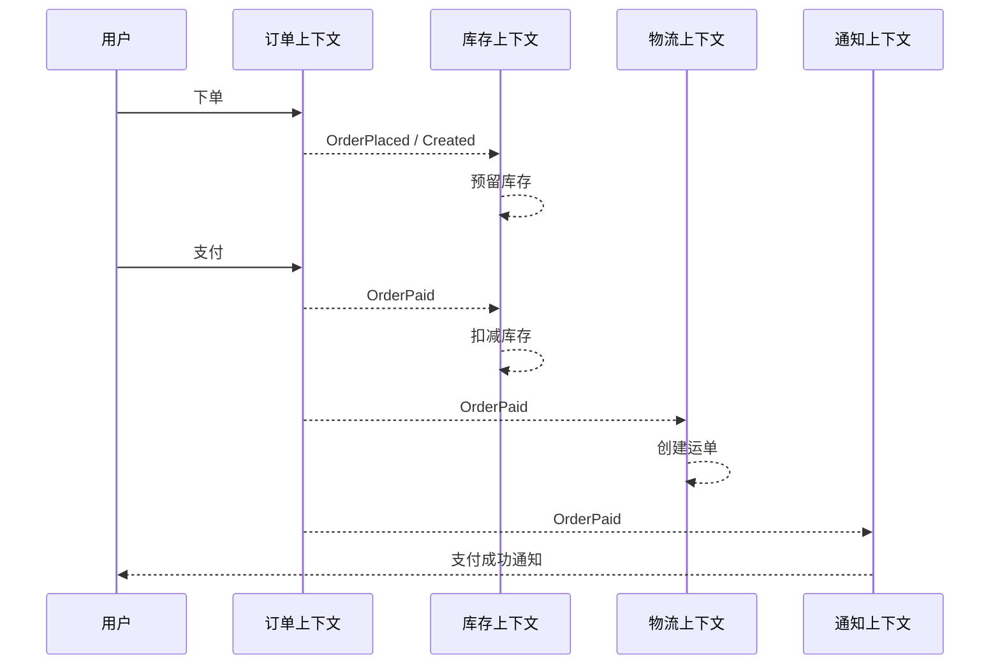

#### 事件设计原则小结

1. **不可变**：发布后不改写事件内容；纠错用补偿事件。
2. **过去时命名**：表达「已经发生」。
3. **自足性**：订阅者尽量少打回源系统；必要字段写在事件里。
4. **投递语义**：消息中间件上实现**至少一次**时，消费者必须**幂等**。
5. **与事务**：常见做法是**事务提交成功后再发布**（事务外发箱 Outbox 等模式可进一步保证一致性，此处不展开）。

**本节小结**：

- **实体**标识生命周期，封装状态机与不变量；避免贫血模型在核心域泛滥。
- **值对象**描述属性、不可变、值相等；金额与地址等应用值对象可显著减少 bug。
- **聚合**定义一致性边界，小聚合 + ID 引用 + 事件协作是实践主基调。
- **仓储**以聚合为读写单位；**领域服务**补齐跨对象规则；**领域事件**支撑解耦与最终一致。

---

## 五、电商计价域的 DDD 实战


下列实现示例延续 [Vernon 的 IDDD Sample](https://vaughnvernon.com/IDDD-sample/) 所体现的分层与事件思路，但以计价语言重写；代码用于展示边界和不变量，不要求照搬目录、框架或消息中间件。


### 5.1 用一个可验收的计价请求开始

计价域最危险的起点是“写一个计算公式”。公式只能回答某一时刻怎样加减，不能回答谁有权提供输入、规则为何生效、冲突如何裁决、结果能否重放，以及下单后凭什么证明用户看到的价格就是支付价格。一个可验收的请求至少要包含销售渠道、地区、用户、商品行、数量、请求时间和货币；一个可验收的结果至少要包含逐行价格、订单级调整、费用、税、应付总额、命中规则、失败原因与追踪标识。把这些词写进接口和测试，团队才是在实现同一个业务。

需求讨论应从实例而不是抽象名词开始。假设上海站点的一名会员购买两件商品：商品目录给出日常价，营销上下文给出会员折扣和跨店满减，履约上下文给出运费，税费模块给出税额。团队要逐项确认规则适用范围、门槛基数、叠加顺序、舍入位置、退款分摊和有效时间。每一个仍然用“按以前逻辑处理”回答的问题，都是尚未显式化的领域知识。

计价结果不是若干数字的临时容器，而是一次业务裁决。它应能解释“原价多少、为何减免、在哪一步舍入、谁提供证据、何时失效”。这使客服可以解释、财务可以对账、测试可以构造断言、风控可以回放，也使研发不必依赖某位熟悉历史代码的人口述规则。

### 5.2 统一语言与输入所有权

计价团队应把“原价、销售价、成交价、应付价”拆开。原价通常来自商品或价格上下文；销售价可能已经包含渠道定价；成交价是在商品级和订单级优惠之后形成；应付价还可能包含运费、税费和抵扣。每个词都要有唯一计算阶段、数据所有者和时间语义。若产品文档说“订单金额”，而代码里同时用它表示优惠前后两个值，错误迟早会出现在门槛判断或退款分摊中。

输入所有权比字段数量更重要。商品上下文拥有商品身份和可售属性，价格上下文拥有基础价格版本，营销上下文拥有资格与优惠定义，用户上下文拥有会员事实，订单上下文拥有购买意图与价格快照。计价上下文读取这些事实并作出裁决，但不应反向成为所有数据的权威副本。跨上下文传递的应是稳定契约或值对象，而不是对方数据库的表结构。

时间必须是显式输入。促销是否有效、会员等级是否已变更、汇率使用哪个时点，都不能藏在任意位置调用系统时钟。把评估时间作为请求的一部分，既能支持历史回放，也能让测试固定边界条件。对于“支付时价格变了怎么办”，模型应明确选择重新计价、锁价或人工兜底，而不是让调用顺序偶然决定结果。

### 5.3 Money 值对象与精度纪律

Money 至少由金额最小单位与币种组成。金额使用整数可以避免二进制浮点误差，但不能因此忽略币种的小数位、无小数货币、舍入模式和现金支付最小面额。币种标识应使用 [ISO 的 ISO 4217 currency codes](https://www.iso.org/iso-4217-currency-codes.html) 维护的代码语义；模型还应拒绝不同币种直接相加，要求汇率换算产生新的、带证据的 Money。

舍入不是显示层细节。按行舍入后求和与先汇总再舍入可能产生差额；百分比优惠、税费和退款分摊都必须声明舍入阶段。一个可靠规则是：内部计算保留业务所需精度，在明确的业务边界舍入，并把无法整除的尾差按确定算法分配到具体订单行。算法必须稳定，例如按金额降序再按行号打破平局，这样重试和回放才会得到相同结果。

负数也需要领域解释。优惠金额可用正数表示“减免”，由 PriceBreakdown 决定如何合计；不要让调用者通过正负号猜语义。应付总额通常不得小于零，但退款、余额调整等其他上下文可能允许负向金额。把不变量放在对应值对象或聚合中，能避免一个通用 Money 类型被迫承载互相冲突的政策。

### 5.4 规则建模：资格、效果与互斥分离

一条定价规则可以拆成三个问题：它是否适用，适用后产生什么调整，它与其他规则如何组合。资格判断读取商品、用户、渠道、时间和数量等事实；效果计算产生固定减免、比例减免、改写单价或费用调整；组合策略处理互斥、择优、封顶和先后顺序。分开后，新增“仅新用户可用”通常只扩展资格，不必复制优惠算法。

规则优先级不能只靠一个整数。整数能排序，却表达不了“会员折扣可与店铺券叠加，但不可与秒杀价叠加；平台券在店铺券之后计算；运费券只作用于运费”。更稳妥的模型是先按作用域分组，再根据互斥组选择候选，最后由显式流水线应用。每一步都向 PriceBreakdown 写入规则标识、基数、调整额和拒绝原因。

“最优惠”也需要定义。对用户最省钱、对平台成本最低、对商家补贴约束最友好，可能是不同解。若业务要求自动择优，策略应在有限候选集合上计算并记录被淘汰方案；若候选组合可能爆炸，应先利用互斥组、预算和作用域剪枝。任何启发式选择都要成为可测试政策，而不是散落的循环提前退出。

### 5.5 计算流水线与不变量

可读的计价流水线通常按“规范化输入—加载事实—生成候选—裁决组合—计算费用与税—校验—生成结果”推进。阶段之间传递不可变中间结果，能降低后续规则意外修改前序基数的风险。流水线并不意味着所有业务都必须线性；需要迭代的税费或配送选择，可以封装为一个有明确收敛条件的阶段。

计价聚合守护的是一次报价的一致性，而不是把商品、营销、订单和用户全部装进一个大对象。它可以维护请求、输入快照、调整明细、总额和版本，并保证总额等于各部分之和、同一互斥组至多命中一条、调整不超过封顶、每个订单行都有币种一致的结果。外部事实以快照或引用进入，不在聚合内部远程查询。

不变量要在变更发生时检查。若先暴露 SetDiscount、SetFee 等 setter，最后才由应用服务调用 Validate，任何遗漏都可能保存非法状态。更好的做法是只开放有业务含义的方法，例如 ApplyPromotion、AllocateOrderDiscount、AddShippingFee；方法接收完成决策所需参数，成功后对象始终有效。

### 5.6 跨上下文协作与反腐层

计价上下文不应理解营销服务的数据库字段，也不应把商品服务返回的巨大 DTO 直接传入领域层。适配器先把外部响应翻译成 PricingProduct、EligiblePromotion 和 CustomerSegment 等本地概念；外部枚举新增或字段缺失时，变化停在反腐层。翻译失败应携带来源、版本和可重试性，便于应用层决定降级还是拒绝报价。

同步查询适合用户正在等待且必须新鲜的事实，异步订阅适合允许短暂陈旧、查询量大或需要本地决策的事实。选择不应只由技术偏好决定：基础价若错误会造成资损，可能需要版本化强校验；会员标签短暂延迟若仅影响小额权益，可以用本地投影并配置补偿。每个依赖都要写出新鲜度目标、超时策略、缺失策略和责任团队。

接口返回成功不等于报价正确。应用层应把依赖版本一起写入 PriceQuote，例如价格表版本、促销规则版本、用户分群版本和评估时间。下单使用报价时可验证是否过期；客服回放时能重建当时输入；监控也能按版本定位异常峰值。

### 5.7 快照、幂等与订单衔接

展示页报价、提交订单报价和支付金额承担不同承诺。展示价强调低延迟，可以允许受控缓存；提交订单必须形成可追溯快照；支付通常只验证订单快照的有效性和完整性，不应悄悄重跑全部促销。若业务允许支付前重价，必须把差异展示给用户并重新确认。

幂等键应对应业务意图，而不是某次 HTTP 请求。客户端重试创建报价时，可用 cartId、购物意图版本和计价参数摘要形成键；服务端保存键与结果，在同一键输入不一致时返回冲突。这样网络超时后的重试不会重复消耗一次性权益，也不会生成多个互相竞争的价格快照。

订单保存快照时要区分“引用”和“证据”。规则名称等展示信息可以复制，优惠资格的最终权威仍在原上下文；但成交价、分摊结果和输入版本是订单履约与退款需要的证据，应随订单保存。快照结构必须版本化，旧订单读取不能依赖当前规则代码仍然存在。

### 5.8 领域事件与可靠发布

QuoteCalculated、QuoteAccepted 和QuoteExpired 是已经发生的业务事实，名称使用过去式，并包含事件标识、聚合标识、发生时间、模式版本和最小必要载荷。不要把“发送短信”命名为领域事件，也不要把完整聚合序列化后广播给所有消费者。前者混淆事实与命令，后者泄漏内部模型并制造隐性耦合。

数据库事务与消息发布之间存在双写窗口。计价或订单聚合在同一事务写入业务数据与 outbox 记录，再由独立发布器重试投递，是 [Richardson 对 Transactional Outbox 的模式说明](https://microservices.io/patterns/data/transactional-outbox.html) 所覆盖的典型做法。它不保证消费者只收到一次，所以消费者仍要按事件标识去重，并让处理逻辑可安全重放。

跨团队事件需要机器可读契约。[AsyncAPI 3.0 文档](https://www.asyncapi.com/docs) 可描述异步通道与消息，[CloudEvents 1.0](https://cloudevents.io/) 可统一事件信封；二者解决的层次不同，可以组合使用。契约要声明必填字段、兼容规则、示例、所有者与弃用窗口，消费者契约测试则验证生产者变更没有破坏既有订阅者。

### 5.9 应用服务、仓储与错误协议

应用服务负责用例编排：校验请求、加载外部事实、调用领域模型、保存聚合、提交事务并返回 DTO。它不应重新实现折扣公式，也不应把 transport 层错误码传入领域对象。仓储以领域概念暴露 Get、Save 等接口，基础设施层处理 SQL、缓存和乐观锁；保存失败时，应用层根据错误类型决定重试、冲突响应或告警。

HTTP API 应把领域拒绝、输入错误、版本冲突和依赖不可用区分开。错误体可遵循 [IETF RFC 9457 Problem Details](https://www.rfc-editor.org/rfc/rfc9457.html)，使用稳定的 type 标识问题类别，并通过扩展字段携带 ruleId、quoteId 或可重试提示。不要把内部堆栈、SQL 或供应商响应原样暴露给调用方。

领域错误要面向业务表达，例如 CurrencyMismatch、RuleNotEligible、QuoteExpired、ConcurrentModification。适配器再把它们映射为 HTTP 状态、错误类型和本地化文案。这样同一用例通过 HTTP、消息或批处理调用时仍共享相同领域语义，协议差异停留在最外层。

### 5.10 测试边界与可观测证据

Money、资格、效果、互斥和分摊算法适合快速单元测试；聚合测试验证不变量与事件；应用服务测试使用端口替身验证编排；适配器测试验证外部契约翻译；少量端到端测试覆盖真实数据库、消息和关键依赖。不要用端到端测试穷举促销组合，也不要通过大量 mock 断言内部调用顺序来替代业务结果断言。

规则测试应采用表格驱动与性质测试。表格覆盖典型实例和边界：门槛前后、有效期端点、零数量、不同币种、封顶、互斥和平局。性质测试验证更一般的不变量：总额不为负、分摊之和等于调整额、相同输入重复计算结果一致、行顺序变化不会改变无顺序语义的结果。生产事故应先沉淀成最小复现样例，再修正模型。

观测指标要能对应领域决策。除延迟和错误率外，还应记录规则命中率、拒绝原因分布、优惠成本、重价差异、过期报价比例、outbox 积压和事件处理延迟。日志使用 quoteId、orderId、ruleId 和版本串联，但避免记录完整用户隐私或可伪造金额。追踪只能告诉我们请求经过哪里，PriceBreakdown 才能说明为什么得到这个价格。

### 5.11 决策案例一：商品级折扣与订单级满减

假设购物车包含甲商品两件和乙商品一件。甲参加八折，订单满三百再减五十。第一项决策是满减门槛使用原价、商品级优惠后的金额，还是排除某些特价商品后的金额。三种口径都可能合理，模型不能用一个含糊的 Subtotal 代替。可以定义 ItemAdjustmentBase 与 OrderThresholdBase 两个值对象，并由规则明确读取哪一个。

第二项决策是五十元如何分摊。按优惠后行金额比例分摊，退款时最容易保持订单总额；但尾差必须落到确定订单行，并记录每行承担的订单级优惠。若退款时重新按剩余商品计算，会把购买时的促销政策改写成退款时政策，造成用户、商家和平台账务不一致。正确做法通常是保存成交分摊，退款政策另建规则处理。

第三项决策是规则解释。结果明细不仅写“优惠五十元”，还应给出规则标识、门槛基数、命中区间、分摊方式和版本。客服看到的解释与机器计算来自同一个 PriceBreakdown，避免代码算一套、文案配置又维护一套。

### 5.12 决策案例二：秒杀价、会员价与优惠券

秒杀常被误写成优先级最高的普通折扣，但它往往同时包含库存配额、用户限购、时间窗口和不可叠加政策。计价域只负责价格裁决，资格和配额事实由营销或活动上下文提供；计价请求携带已确认的活动候选及版本。若配额必须在报价时占用，则这是跨上下文流程，应显式建模预占、过期释放与下单确认，而不是在 Calculate 内部偷偷扣减库存。

会员价与秒杀价可能是二选一，也可能先选较低价再允许使用平台券。模型应先产生候选基础价，再执行互斥组选择，最后进入可叠加调整阶段。用“priority=100”只能得到顺序，无法说明为什么另一个候选被拒绝。RuleDecision 应记录 rejectedBy、exclusiveGroup 和比较结果，让选择逻辑可测试、可解释。

优惠券失败也不总是整个报价失败。用户主动选择的券不可用时，提交订单应返回明确拒绝，防止静默换成更贵结果；系统自动推荐的券不可用时，可以重新择优并在结果中说明。是否允许降级属于用例政策，由应用服务选择领域策略，不应由远程调用超时偶然决定。

### 5.13 决策案例三：跨店、跨品类与作用域

跨店满减会同时涉及平台活动、商家承担比例和多个店铺订单。把所有店铺商品放进单个订单聚合，会让交易边界无限扩大；完全按店铺独立计算，又无法判断平台级门槛。可将计价会话视为一次跨店裁决，先生成全局调整，再把结果分摊到店铺子单。订单上下文最终各自保存分摊证据，而平台活动预算由营销上下文独立结算。

品类券要求商品分类事实在评估时稳定。直接读取商品当前分类会使历史报价无法回放；请求应携带已版本化的计价分类快照。这里的“计价分类”不一定等同展示导航分类，二者变化节奏与业务目的不同，应通过反腐层翻译，避免商品前台调整目录导致优惠规则意外失效。

跨作用域规则的先后必须可见。商品级调整通常先于订单级门槛，费用级优惠只作用于配送费，支付级立减则可能不改变订单商品成交价。若所有调整都塞进一个 Discount 列表，财务分录、退款和商家结算都会失去依据。PriceBreakdown 应按作用域保留独立小计，并定义总额公式。

### 5.14 决策案例四：多币种展示与结算

国际站点可能用用户偏好币种展示，却用商家结算币种成交。展示换算可以使用短期缓存汇率，最终报价则需要汇率标识、来源、有效时间和舍入规则。Money 仍然只表达单一币种金额，换算由 ExchangeRate 值对象或领域服务完成，输出新的 Money 与 ConversionEvidence；禁止把汇率塞进 Money 后让任意加法自动换算。

优惠门槛在哪种币种判断必须明确。若活动写“满 100 美元减 10 美元”，先将商品换成美元再比较，和在本币比较等值金额可能因舍入产生边界差异。规则定义应固定基准币种与比较精度，结果记录换算前后值。对于接近门槛的请求，测试要覆盖汇率精度和有效期端点。

退款不应使用退款当天汇率重算原成交优惠。通常应沿用订单快照中的成交币种、换算证据和分摊结果；若支付渠道以另一币种退款产生汇兑差，差额属于支付或财务政策，而不是修改历史 PriceQuote。上下文边界在这里直接决定账务是否可解释。

### 5.15 决策案例五：库存、配送与税费

库存数量影响阶梯价，但计价不应把库存扣减纳入自己的数据库事务。对普通报价，可以读取可售性快照；对稀缺活动，可由库存上下文返回带期限的预占凭证。计价结果引用凭证，订单确认后再完成占用。凭证过期属于明确领域结果，调用方重新计价，而不是无限重试同一请求。

配送费可能依赖地址、重量、店铺、配送方式和商品优惠后的金额。为了避免计价与履约互相递归，应先定义依赖方向：履约提供配送选项和基础费用，计价应用费用券并形成应付费用；若免邮门槛取优惠后金额，计价流水线必须明确该阶段，且不得再次触发无限配送重算。需要迭代时，应设最大次数和稳定条件。

税费同样不是简单尾加。含税价、未税价、优惠是否影响税基、运费是否计税都由地区政策决定。计价域可以定义 TaxQuote 端口并保存税务服务返回的证据，但不复制税法。依赖不可用时，是拒绝成交、使用短期缓存还是标记待复核，应由地区和风险等级配置，不能统一吞掉错误返回零税。

### 5.16 决策案例六：规则发布与有效时间

促销配置从草稿到生效应经历校验、审批、模拟和发布。运行时只读取不可变规则版本；修改已发布规则实际是创建新版本。这样同一 quoteVersion 可以稳定指向完整规则集合，回放不依赖后来被覆盖的数据库行。紧急下线可以改变规则可用性，但仍要保存操作人、原因和生效时刻。

有效时间建议使用半开区间，即开始时刻包含、结束时刻不包含，避免相邻版本在边界同时生效。时区是规则属性或统一转换政策，不能依赖服务器本地时区。跨夏令时地区需要用明确时区标识解释“当地零点”，并在发布前模拟缺失或重复的本地时间。

发布前模拟应使用脱敏样本和合成边界样例，比较新旧版本的命中率、优惠成本和用户价格差。超出阈值时阻止发布或要求更高级审批。模拟不是为了证明新规则绝对正确，而是把大范围意外变化从线上事故提前变成可讨论证据。

### 5.17 决策案例七：降级与资损边界

依赖失败时“返回原价”看似安全，实际上可能违反已向用户承诺的权益；“返回最低价”又可能造成无上限资损。每个依赖应定义失败模式：基础价缺失通常不能报价，自动推荐优惠缺失可以标记降级，用户已领取权益校验失败可能要求重试或稍后提交，税务失败则依地区合规政策处理。

降级结果必须进入领域结果和监控。QuoteStatus 可以区分 Confirmed、Degraded 和Rejected，并列出缺失证据。展示层对 Degraded 报价不能伪装成最终承诺；订单应用服务也可以禁止接受某些降级类型。这样技术可用性策略与业务风险政策在接口上对齐。

熔断只减少故障扩散，不决定业务结果。熔断器打开后，适配器返回结构化 DependencyUnavailable，应用服务再按场景政策选择缓存、候补提供者或拒绝。把默认金额写在基础设施层会绕过领域审计，是资损事故常见来源。

### 5.18 决策案例八：并发、版本与重试

用户修改购物车与提交订单可能并发发生。计价请求携带 cartVersion，结果也绑定该版本；订单接受报价时同时核对购物车版本、报价版本和有效期。只凭 cartId 读取最新状态，会让用户确认的页面与后端实际下单内容不一致。版本冲突应返回可恢复错误，引导客户端刷新，而不是盲目覆盖。

规则发布与报价计算并发时，计算过程应固定一个规则集快照。不能前半段读取旧促销，后半段读取新门槛。实现上可以先解析 ruleSetVersion，再按版本加载全部规则；若存储无法提供一致快照，则需要在应用层复制不可变版本或用事务读保证。

乐观锁失败后的重试必须重新评估输入是否仍有效。保存报价这种纯派生结果通常可以安全重算；消耗优惠资格或预占库存则不能只重放写操作，必须依赖幂等凭证确认先前副作用。重试策略应限制次数、加入抖动，并在最终失败时保留关联标识供人工调查。

### 5.19 决策案例九：退款、取消与售后

退款首先读取订单价格快照，而不是调用当前计价引擎重算。商品级优惠可直接按已保存分摊退回；订单级满减需要政策决定部分退款是否追回优惠。若退货后剩余金额低于原门槛，可以按原成交分摊退款，也可以重新核算并扣回差额，两者对用户体验和财务都有影响，必须由售后规则明确。

优惠券是否退回属于营销上下文决策。订单发布 RefundCompleted 或 OrderCancelled 事实，营销根据券类型、过期时间和退款原因决定返还；订单不应直接更新券表。计价快照提供使用证据，事件提供发生事实，二者结合避免同步调用把售后流程锁死在营销服务可用性上。

多次部分退款需要累计不变量：累计退款不得超过可退金额，各行累计退款不得超过成交分摊，最后一次退款吸收合法尾差。把这些规则放进 Refund 聚合或订单售后聚合，比在每个渠道适配器各写一套计算更可靠。

### 5.20 决策案例十：从影子计算到切流

替换旧计价引擎时，不应直接把全部流量切给新模型。第一阶段让新引擎读取同一输入做影子计算，不影响用户结果；比较总额、明细和拒绝原因，并按业务允许差异分类。仅比较最终总额会漏掉分摊错误，这类错误可能在退款或结算时才暴露。

第二阶段选择低风险渠道或品类灰度，把报价版本写入订单，确保后续链路能识别来源。灰度指标除技术错误率外，还要关注价格差异、优惠成本、订单转化、客服投诉和人工对账。超过阈值自动回退，但保留失败样本用于修正规则。

第三阶段逐步扩大流量，并冻结旧系统的新功能，只修复阻断迁移的问题。双写期间必须明确哪个系统是事实源，禁止运营人员在两边分别改规则。最终下线前完成历史订单读取、退款、对账和审计路径验证；迁移完成的标准不是旧服务无流量，而是所有依赖旧语义的业务能力都有明确去向。


在构建电商计价系统的过程中，价格计算并非简单的"标价"，而是由基础价格、营销折扣、平台费用、用户抵扣等多层因素叠加而成。随着业务规模扩大，我们面临着三大核心挑战：

**1. 隐晦性（Obscurity）**

- **抽象层面的隐晦**：同一个"价格"概念，在不同场景下含义不同
  - 商品详情页展示价：用户看到的价格
  - 订单价：创建订单时的价格快照
  - 支付价：最终扣款价格
  
- **实现层面的隐晦**：代码中的术语混乱
  - 有人叫`originalPrice`，有人叫`marketPrice`
  - 有人叫`salePrice`，有人叫`discountPrice`
  - 业务人员和技术人员理解不一致

**2. 耦合性（Coupling）**

- **代码层面**：价格计算逻辑散落在各处
  - 商品服务有一套计算
  - 订单服务又重复计算
  - 支付服务再计算一次
  
- **模块层面**：计价依赖多个外部服务
  - 促销服务（获取活动信息）
  - 商品服务（获取基础价格）
  - 用户服务（判断用户类型）
  
- **系统层面**：前后端价格不一致导致资损

**3. 变化性（Variability）**

- **业务需求频繁变化**
  - 促销规则每周调整（双11期间优先级变化）
  - 新增促销类型（买赠、满减、阶梯价）
  - 不同地区有不同定价策略
  
- **品类扩展需求**
  - 实物商品、虚拟商品、服务类商品
  - 每种品类有特殊的计价规则

### 1.3 初期设计的问题

最初的实现方式是**面向过程的事务脚本**：

```go
// ❌ 问题代码示例
func CalculatePrice(itemID, userID int64, quantity int) (int64, error) {
    // 1. 获取商品基础信息
    item := getItemFromDB(itemID)
    basePrice := item.Price
    
    // 2. 检查是否有秒杀
    if flashSale := getFlashSale(itemID); flashSale != nil {
        basePrice = flashSale.Price
    }
    
    // 3. 检查新用户
    if isNewUser(userID) {
        if newUserPrice := getNewUserPrice(itemID); newUserPrice < basePrice {
            basePrice = newUserPrice
        }
    }
    
    // 4. 计算数量价格
    totalPrice := basePrice * quantity
    
    // 5. 加上服务费
    if fee := getAdminFee(itemID); fee > 0 {
        totalPrice += fee
    }
    
    // 6. 减去优惠券
    if voucher := getUserVoucher(userID); voucher != nil {
        totalPrice -= voucher.Amount
    }
    
    return totalPrice, nil
}
```

**核心问题**：
- ❌ 业务逻辑分散在各个函数中，难以理解整体流程
- ❌ 缺乏业务概念的抽象，只有数据获取和计算
- ❌ 新增促销类型需要修改核心计算逻辑
- ❌ 无法支持复杂的业务规则（如买N件享M折）
- ❌ 测试困难，需要Mock大量外部依赖

---

### 5.21 计价领域的核心概念

在介绍计价系统的DDD实践之前，先回顾一下DDD的核心概念。

### 2.1 什么是领域？

领域由三部分组成：

```text
┌─────────────────────────────────────────┐
│              领域（Domain）              │
├─────────────────────────────────────────┤
│                                          │
│  涉众域 (Stakeholders)                   │
│    └─ 用户：商家、运营、消费者、财务     │
│                                          │
│  问题域 (Problem Space)                  │
│    └─ 业务价值：如何定价？如何促销？     │
│                                          │
│  解决方案域 (Solution Space)             │
│    └─ 解决方案：四层计价模型             │
│                                          │
└─────────────────────────────────────────┘
```

**计价领域示例**：
- **涉众域**：商家（定价）、运营（促销）、消费者（购买）、财务（结算）
- **问题域**：如何准确计算价格？如何支持多种促销？如何保证一致性？
- **解决方案域**：统一的计价模型、规则引擎、价格快照

### 2.2 什么是领域驱动设计？

> 针对特定业务领域，用户在面对业务问题时有对应的解决方案，这些问题与方案构成了领域知识。领域驱动设计就是围绕这些知识来设计系统。

**计价领域知识**：
- **流程**：商品展示 → 加入购物车 → 创建订单 → 支付结算
- **规则**：促销优先级、费用计算规则、优惠抵扣规则
- **方法**：四层计价模型、价格快照机制

---

### 5.22 计价领域的战略设计

### 3.1 确定用例

我们使用**用例图**来表达用户与系统的交互：

```text
┌─────────────────────────────────────────────────────┐
│              计价系统用例图                          │
├─────────────────────────────────────────────────────┤
│                                                      │
│  商家 (Merchant)                                     │
│    ├─ 设置商品价格                                   │
│    ├─ 配置促销活动                                   │
│    └─ 查看销售数据                                   │
│                                                      │
│  运营 (Operator)                                     │
│    ├─ 创建营销活动                                   │
│    ├─ 配置优惠券                                     │
│    └─ 调整费用规则                                   │
│                                                      │
│  消费者 (Customer)                                   │
│    ├─ 查看商品价格                                   │
│    ├─ 创建订单                                       │
│    └─ 支付结算                                       │
│                                                      │
│  财务 (Finance)                                      │
│    ├─ 查看结算明细                                   │
│    └─ 对账                                          │
│                                                      │
└─────────────────────────────────────────────────────┘
```

### 3.2 统一语言（Ubiquitous Language）

从用例中抽取概念，建立**统一语言**。这是DDD最关键的一步。

#### 基础价格术语

| 中文术语 | 英文术语 | Term | 含义 |
|---------|---------|------|------|
| 市场原价 | Market Price | `market_price` | 商品的市场标价，来自供应商 |
| 折扣价 | Discount Price | `discount_price` | 平台日常销售价 |
| 划线价 | Listed Price | `listed_price` | 用于展示的对比价格 |

#### 促销术语

| 中文术语 | 英文术语 | Term | 含义 |
|---------|---------|------|------|
| 促销价 | Promotion Price | `promotion_price` | 参与促销活动后的价格 |
| 秒杀价 | Flash Sale Price | `flash_sale_price` | 限时秒杀活动价格 |
| 新用户价 | New User Price | `new_user_price` | 新用户专享价格 |
| 满减价 | Threshold Price | `threshold_price` | 满XX减XX后的价格 |

#### 费用术语

| 中文术语 | 英文术语 | Term | 含义 |
|---------|---------|------|------|
| 平台服务费 | Platform Fee | `platform_fee` | 平台收取的服务费 |
| 配送费 | Delivery Fee | `delivery_fee` | 物流配送费用 |
| 手续费 | Handling Fee | `handling_fee` | 支付渠道手续费 |

#### 最终价格术语

| 中文术语 | 英文术语 | Term | 含义 |
|---------|---------|------|------|
| 计价金额 | Pricing Amount | `pricing_amount` | 单个SKU的计价金额 |
| 最终价格 | Final Price | `final_price` | 用户最终支付价格 |
| 结算金额 | Settlement Amount | `settlement_amount` | 商家结算金额 |

**统一语言的重要性**：

```text
案例：某电商平台的混乱

改造前：
- 技术团队：MarketPrice、DiscountPrice、ActualPrice
- 产品团队：原价、活动价、实付价
- 运营团队：建议零售价、会员价、到手价
- 客服团队：标价、优惠后价格、支付价

结果：
- 沟通成本高（每次对话都要先对齐概念）
- 需求理解错误（产品要改"活动价"，技术改了"优惠后价格"）
- 价格bug频发（前端显示"实付价"，后端计算的是"到手价"）

改造后：
- 所有团队统一使用：市场原价、折扣价、促销价、最终价格
- 文档、代码、会议统一使用这些术语
- 新人一周即可理解价格体系
```

### 3.3 概念模型（Concept Model）

基于统一语言，建立**概念模型**，明确概念之间的关系：

```text
┌───────────────────────────────────────────────────────────────┐
│                     计价领域概念模型                           │
└───────────────────────────────────────────────────────────────┘

                    ┌─────────────────┐
                    │   PriceEntity   │
                    │   (价格实体)     │
                    └────────┬────────┘
                             │
                    ┌────────┴────────┐
                    │                 │
         ┌──────────▼──────────┐  ┌──▼──────────────┐
         │    BasePrice        │  │   Promotion     │
         │    (基础价格)        │  │   (促销)        │
         │  • MarketPrice      │  │  • FlashSale    │
         │  • DiscountPrice    │  │  • NewUserPrice │
         │  • ListedPrice      │  │  • ThresholdDiscount │
         └─────────────────────┘  └─────────────────┘
                    │
         ┌──────────┴──────────┐
         │                     │
    ┌────▼────────┐      ┌────▼──────────┐
    │    Fee      │      │   Discount    │
    │   (费用)     │      │   (优惠)      │
    │ • Platform  │      │ • Voucher     │
    │ • Delivery  │      │ • Points      │
    │ • Handling  │      │ • Payment     │
    └─────────────┘      └───────────────┘
         │                     │
         └──────────┬──────────┘
                    │
              ┌─────▼─────┐
              │FinalPrice │
              │ (最终价格) │
              └───────────┘
```

**概念关系说明**：
- **PriceEntity** 包含 (1:1) **BasePrice** - 每个商品有且只有一个基础价格
- **PriceEntity** 可能有 (1:0..N) **Promotion** - 可以参与多个促销（但只能选一个）
- **Order** 可能有 (1:0..N) **Fee** - 订单可能产生多种费用
- **Order** 可能有 (1:0..N) **Discount** - 订单可能使用多种优惠
- **Order** 产生 (1:1) **FinalPrice** - 最终计算出唯一的支付价格

### 3.4 子域划分（Subdomain）

将复杂问题拆解为多个简单问题，我们基于**问题域**进行拆分：

```text
┌─────────────────────────────────────────────────────────┐
│              计价领域 (Pricing Domain)                   │
├─────────────────────────────────────────────────────────┤
│                                                          │
│  核心子域 (Core Subdomain)                               │
│  ┌───────────────────────────────────────────────┐     │
│  │  定价子域 (Pricing Subdomain)                  │     │
│  │  • 问题：如何准确计算价格？                    │     │
│  │  • 方案：四层计价模型                          │     │
│  │  • 职责：价格计算、校验、快照                  │     │
│  └───────────────────────────────────────────────┘     │
│                                                          │
│  支撑子域 (Supporting Subdomain)                         │
│  ┌──────────────────┐  ┌──────────────────┐           │
│  │  促销子域         │  │  商品子域         │           │
│  │  (Promotion)     │  │  (Item)          │           │
│  │  • 促销规则管理   │  │  • 商品信息      │           │
│  │  • 活动配置      │  │  • 库存管理      │           │
│  └──────────────────┘  └──────────────────┘           │
│                                                          │
│  ┌──────────────────┐  ┌──────────────────┐           │
│  │  用户子域         │  │  支付子域         │           │
│  │  (User)          │  │  (Payment)       │           │
│  │  • 用户信息      │  │  • 支付方式      │           │
│  │  • 用户分群      │  │  • 优惠券        │           │
│  └──────────────────┘  └──────────────────┘           │
│                                                          │
│  通用子域 (Generic Subdomain)                            │
│  ┌──────────────────┐  ┌──────────────────┐           │
│  │  缓存子域         │  │  配置子域         │           │
│  │  (Cache)         │  │  (Config)        │           │
│  └──────────────────┘  └──────────────────┘           │
│                                                          │
└─────────────────────────────────────────────────────────┘
```

**拆分原则**：

1. **定价域（核心）**：专注价格计算逻辑，这是业务的核心竞争力
2. **促销域（支撑）**：管理促销规则，为定价提供数据支持
3. **商品域（支撑）**：提供商品基础信息
4. **用户域（支撑）**：提供用户信息和分群数据
5. **支付域（支撑）**：处理支付和优惠券
6. **缓存/配置域（通用）**：技术基础设施

**为什么这样拆分？**

```text
问题：为什么不把所有逻辑都放在一个"定价域"？

答案：
1. 业务职责分离
   - 促销规则（运营负责）
   - 商品定价（商家负责）
   - 用户分群（市场负责）
   
2. 团队分工
   - 定价团队：核心计算逻辑
   - 促销团队：活动和规则
   - 商品团队：商品信息
   
3. 变化频率不同
   - 定价逻辑：相对稳定
   - 促销规则：频繁变化
   - 商品信息：偶尔变化
```

### 3.5 上下文映射（Context Mapping）

定义子域之间的协作关系：

```text
┌─────────────────────────────────────────────────────────────┐
│              上下文映射关系                                  │
└─────────────────────────────────────────────────────────────┘

        ┌──────────────────┐
        │   Pricing        │
        │   Context        │
        │   (定价上下文)    │
        └────────┬─────────┘
                 │
    ┌────────────┼────────────┬────────────┐
    │            │            │            │
    │ ACL        │ ACL        │ ACL        │ ACL: Anti-Corruption Layer
    │            │            │            │      (防腐层)
    ▼            ▼            ▼            ▼
┌────────┐  ┌────────┐  ┌────────┐  ┌────────┐
│Promotion│  │  Item  │  │  User  │  │Payment │
│Context  │  │Context │  │Context │  │Context │
└────────┘  └────────┘  └────────┘  └────────┘
```

**防腐层的作用**：

防腐层（Anti-Corruption Layer）保护领域模型不被外部系统污染。

```go
// ❌ 错误：直接依赖外部服务的数据结构
type PricingService struct {
    promotionClient *external.PromotionClient
}

func (s *PricingService) GetPromotionPrice(itemID int64) int64 {
    // 直接使用外部结构，耦合到外部系统
    promoData := s.promotionClient.GetPromotion(itemID)
    return promoData.ActivityPrice  // 如果外部改字段名，这里就挂了
}

// ✅ 正确：通过防腐层转换
type PricingService struct {
    promotionAdapter PromotionAdapter  // 防腐层接口
}

// 防腐层接口（定价域定义）
type PromotionAdapter interface {
    GetPromotionInfo(itemID int64) *PromotionInfo
}

// 定价域的促销信息（领域模型）
type PromotionInfo struct {
    ActivityID int64
    Price      int64
    Type       PromotionType
}

// 防腐层实现（基础设施层）
type PromotionAdapterImpl struct {
    externalClient *external.PromotionClient
}

func (a *PromotionAdapterImpl) GetPromotionInfo(itemID int64) *PromotionInfo {
    // 外部数据转换为领域模型
    externalData := a.externalClient.GetPromotion(itemID)
    
    return &PromotionInfo{
        ActivityID: externalData.ActivityId,
        Price:      externalData.ActivityPrice,
        Type:       convertType(externalData.ActivityType),
    }
}
```

**收益**：
- ✅ 外部系统变化不影响领域模型
- ✅ 保持领域模型的纯粹性
- ✅ 易于切换外部服务实现

---

### 5.23 计价领域的战术设计

战略设计得到了概念模型和子域划分，战术设计则是将概念模型映射为代码模型。

### 4.1 实体（Entity）与值对象（Value Object）

#### 实体：有唯一标识和生命周期

```go
// ✅ 实体：PriceEntity（价格实体）
type PriceEntity struct {
    // 唯一标识
    ItemID int64
    SkuID  int64
    
    // 生命周期状态
    Status PriceStatus  // Draft(草稿)、Active(生效)、Expired(过期)
    
    // 属性（使用值对象）
    basePrice    *BasePrice
    promotions   []Promotion
    fees         []Fee
    
    // 时间戳
    CreatedAt time.Time
    UpdatedAt time.Time
}

// 实体的行为（封装业务规则）
func (e *PriceEntity) ApplyPromotion(promo Promotion) error {
    // 业务规则1：促销价不能高于折扣价
    if promo.Price > e.basePrice.DiscountPrice {
        return errors.New("promotion price cannot exceed discount price")
    }
    
    // 业务规则2：同一类型的促销只能有一个
    for _, existing := range e.promotions {
        if existing.Type == promo.Type {
            return errors.New("promotion type already exists")
        }
    }
    
    e.promotions = append(e.promotions, promo)
    e.UpdatedAt = time.Now()
    return nil
}

func (e *PriceEntity) Activate() error {
    // 业务规则：只有草稿状态可以激活
    if e.Status != Draft {
        return errors.New("only draft price can be activated")
    }
    
    e.Status = Active
    e.UpdatedAt = time.Now()
    return nil
}
```

#### 值对象：无唯一标识，不可变

```go
// ✅ 值对象：Price（价格）
type Price struct {
    amount   int64   // 金额（分为单位）
    currency string  // 货币类型
}

// 不可变：所有操作返回新对象
func NewPrice(amount int64, currency string) (Price, error) {
    if amount < 0 {
        return Price{}, errors.New("price cannot be negative")
    }
    return Price{amount: amount, currency: currency}, nil
}

// 值对象的行为（返回新对象）
func (p Price) Add(other Price) (Price, error) {
    if p.currency != other.currency {
        return Price{}, errors.New("currency mismatch")
    }
    return Price{
        amount:   p.amount + other.amount,
        currency: p.currency,
    }, nil
}

func (p Price) Multiply(factor int64) Price {
    return Price{
        amount:   p.amount * factor,
        currency: p.currency,
    }
}

func (p Price) IsZero() bool {
    return p.amount == 0
}

// ✅ 值对象：Promotion（促销）
type Promotion struct {
    activityID int64
    name       string
    price      Price
    startTime  time.Time
    endTime    time.Time
}

// 值对象的行为
func (p Promotion) IsActive() bool {
    now := time.Now()
    return now.After(p.startTime) && now.Before(p.endTime)
}

func (p Promotion) IsExpired() bool {
    return time.Now().After(p.endTime)
}
```

**实体 vs 值对象的判断标准**：

```text
问题：某个概念应该是实体还是值对象？

判断标准：
1. 是否需要追踪其变化历史？
   - 需要 → 实体
   - 不需要 → 值对象

2. 是否关心"哪一个"？
   - 关心 → 实体（如：哪个商品）
   - 不关心 → 值对象（如：100元就是100元）

3. 是否有生命周期？
   - 有 → 实体（如：价格实体从创建到生效到过期）
   - 无 → 值对象（如：金额没有生命周期）

案例：
- 商品价格：实体（需要知道是哪个商品的价格）
- 100元：值对象（不关心是哪张100元钞票）
- 订单：实体（需要追踪订单状态变化）
- 收货地址：值对象（相同地址信息是等价的）
```

### 4.2 聚合根（Aggregate Root）

聚合根是一组相关对象的入口，保证业务规则的一致性。

**聚合根设计原则**：
1. 满足业务一致性（促销、费用、价格必须一致）
2. 满足数据完整性（不存在没有基础价格的价格实体）
3. 考虑技术限制（避免加载过大数据）

```go
// ✅ 聚合根：PricingAggregate
type PricingAggregate struct {
    // 聚合根ID
    id string
    
    // 实体
    priceEntity *PriceEntity
    
    // 值对象
    context *PricingContext
    
    // 领域事件
    events []DomainEvent
    
    // 版本号（乐观锁）
    version int64
}

// 聚合根的行为（封装业务规则）
func (a *PricingAggregate) CalculatePrice() (*PricingResult, error) {
    // 步骤1：业务规则校验
    if err := a.validate(); err != nil {
        return nil, err
    }
    
    // 步骤2：选择促销（业务规则）
    promotion := a.selectPromotion()
    
    // 步骤3：计算基础价格
    baseAmount := a.calculateBaseAmount(promotion)
    
    // 步骤4：计算费用
    feeAmount := a.calculateFees()
    
    // 步骤5：应用优惠
    discountAmount := a.applyDiscounts()
    
    // 步骤6：计算最终价格
    finalPrice := baseAmount + feeAmount - discountAmount
    if finalPrice < 0 {
        finalPrice = 0  // 价格保护
    }
    
    // 步骤7：生成领域事件
    a.addEvent(&PriceCalculatedEvent{
        AggregateID: a.id,
        FinalPrice:  finalPrice,
        Timestamp:   time.Now(),
    })
    
    return &PricingResult{
        FinalPrice: finalPrice,
        Breakdown:  a.buildBreakdown(baseAmount, feeAmount, discountAmount),
    }, nil
}

// 业务规则：选择促销（优先级规则）
func (a *PricingAggregate) selectPromotion() *Promotion {
    promotions := a.priceEntity.promotions
    
    // 规则1：秒杀优先（优先级最高）
    for _, promo := range promotions {
        if promo.Type == FlashSale && promo.IsActive() {
            return &promo
        }
    }
    
    // 规则2：新用户价（次优先级）
    if a.context.IsNewUser {
        for _, promo := range promotions {
            if promo.Type == NewUserPrice && promo.IsActive() {
                return &promo
            }
        }
    }
    
    // 规则3：默认折扣价
    return nil  // 使用基础折扣价
}

// 业务规则校验
func (a *PricingAggregate) validate() error {
    // 规则1：市场价必须大于0
    if a.priceEntity.basePrice.MarketPrice <= 0 {
        return errors.New("market price must be positive")
    }
    
    // 规则2：折扣价不能大于市场价
    if a.priceEntity.basePrice.DiscountPrice > a.priceEntity.basePrice.MarketPrice {
        return errors.New("discount price cannot exceed market price")
    }
    
    // 规则3：数量必须大于0
    if a.context.Quantity <= 0 {
        return errors.New("quantity must be positive")
    }
    
    return nil
}

// 领域事件管理
func (a *PricingAggregate) addEvent(event DomainEvent) {
    a.events = append(a.events, event)
}

func (a *PricingAggregate) GetEvents() []DomainEvent {
    return a.events
}

func (a *PricingAggregate) ClearEvents() {
    a.events = []DomainEvent{}
}
```

**聚合根边界的确定**：

```text
问题：什么应该放在聚合根内？什么应该放在聚合根外？

判断标准：
1. 是否需要保证事务一致性？
   - 需要 → 放在聚合根内
   - 不需要 → 放在聚合根外

2. 是否需要同时修改？
   - 需要 → 放在聚合根内
   - 不需要 → 放在聚合根外

3. 是否影响聚合根的状态？
   - 影响 → 放在聚合根内
   - 不影响 → 放在聚合根外

案例：
定价聚合根内：
- 基础价格（必须同时存在）
- 促销信息（影响最终价格）
- 费用信息（影响最终价格）

定价聚合根外：
- 用户信息（只是查询，不修改）
- 商品库存（独立的聚合根）
- 订单信息（独立的聚合根）
```

### 4.3 领域服务（Domain Service）

**什么时候使用领域服务？**

不适合放在聚合根里的领域逻辑，可以放在领域服务中：

```go
// ❌ 不适合放在聚合根：跨聚合根的逻辑
// 例：从多个促销活动中选择最优的一个

// ✅ 使用领域服务
type PromotionSelectionService struct {
    rules []SelectionRule
}

// 领域服务：选择最优促销
func (s *PromotionSelectionService) SelectBestPromotion(
    promotions []*Promotion,
    context *PricingContext,
) *Promotion {
    var bestPromotion *Promotion
    lowestPrice := int64(math.MaxInt64)
    
    for _, promo := range promotions {
        // 检查是否适用
        if !s.isApplicable(promo, context) {
            continue
        }
        
        // 选择价格最低的
        if promo.Price < lowestPrice {
            lowestPrice = promo.Price
            bestPromotion = promo
        }
    }
    
    return bestPromotion
}

func (s *PromotionSelectionService) isApplicable(
    promo *Promotion,
    context *PricingContext,
) bool {
    // 检查时间有效性
    if !promo.IsActive() {
        return false
    }
    
    // 检查用户类型
    if promo.Type == NewUserPrice && !context.IsNewUser {
        return false
    }
    
    // 检查购买数量
    if context.Quantity < promo.MinQuantity {
        return false
    }
    
    return true
}

// 领域服务：复杂价格计算（如：买N件享M折）
type BundlePriceCalculator struct{}

func (c *BundlePriceCalculator) Calculate(
    basePrice int64,
    quantity int64,
    config *BundleConfig,
) int64 {
    // 计算可享受优惠的轮数
    rounds := quantity / config.MinQuantity
    effectiveRounds := min(rounds, config.MaxRounds)
    
    // 计算每轮优惠
    var discountPerRound int64
    switch config.DiscountType {
    case PercentageDiscount:
        // 百分比折扣：basePrice * minQty * (1 - discount%)
        discountPerRound = basePrice * config.MinQuantity * config.Discount / 10000
    case FixedDiscount:
        // 固定金额折扣
        discountPerRound = config.Discount
    case FixedPrice:
        // 固定总价：原价 - 固定价
        discountPerRound = basePrice * config.MinQuantity - config.Discount
    }
    
    // 总价 = 原价 * 数量 - 优惠 * 有效轮数
    return basePrice * quantity - discountPerRound * effectiveRounds
}
```

**领域服务 vs 应用服务**：

```text
领域服务（Domain Service）：
- 包含业务逻辑
- 操作领域对象
- 无状态
- 例：促销选择、复杂价格计算

应用服务（Application Service）：
- 编排领域对象
- 处理事务
- 协调外部服务
- 例：处理HTTP请求、管理数据库事务
```

### 4.4 贫血模型 vs 充血模型

**我们的选择：混合模式**

```go
// ✅ 核心领域逻辑：充血模型
type PricingAggregate struct {
    id          string
    priceEntity *PriceEntity
    
    // 富含业务逻辑的方法
}

func (a *PricingAggregate) CalculatePrice() (*PricingResult, error) {
    // 封装复杂的业务规则
    // 包含促销选择、价格计算、优惠应用等逻辑
}

func (a *PricingAggregate) ApplyPromotion(promo *Promotion) error {
    // 封装促销应用的业务规则
}

// ✅ 简单CRUD：贫血模型
type PriceSnapshot struct {
    ID         int64
    OrderID    int64
    Price      int64
    CreatedAt  time.Time
}

// 简单的数据访问对象，没有业务逻辑
type PriceSnapshotRepository interface {
    Save(snapshot *PriceSnapshot) error
    FindByOrderID(orderID int64) (*PriceSnapshot, error)
}
```

**选择标准**：

```text
充血模型（适用场景）：
- 核心业务逻辑复杂
- 业务规则频繁变化
- 需要封装业务不变性

贫血模型（适用场景）：
- 简单CRUD操作
- 数据传输对象（DTO）
- 持久化对象（PO）

混合使用：
- 领域层：充血模型（封装业务逻辑）
- 应用层：贫血模型（DTO）
- 基础设施层：贫血模型（PO）
```

### 4.5 体现业务语义的代码

代码应该体现业务含义，让非技术人员也能理解：

```go
// ❌ 错误：没有业务含义
func (a *PricingAggregate) UpdateStatus(status int) error {
    a.status = status  // 什么业务操作？为什么要这样做？
    return nil
}

// ✅ 正确：清晰的业务语义
func (a *PricingAggregate) SubmitForReview() error {
    // 业务规则：只有草稿状态可以提交审核
    if a.status != Draft {
        return errors.New("only draft pricing can be submitted for review")
    }
    
    // 业务操作：提交审核
    a.status = PendingReview
    a.submittedAt = time.Now()
    
    // 发布领域事件
    a.addEvent(&PricingSubmittedEvent{
        AggregateID: a.id,
        SubmittedAt: time.Now(),
    })
    
    return nil
}

func (a *PricingAggregate) Approve(approver string, comment string) error {
    // 业务规则：只有待审核状态可以审批通过
    if a.status != PendingReview {
        return errors.New("only pending pricing can be approved")
    }
    
    // 业务操作：审批通过
    a.status = Approved
    a.approver = approver
    a.approvalComment = comment
    a.approvedAt = time.Now()
    
    // 发布领域事件
    a.addEvent(&PricingApprovedEvent{
        AggregateID: a.id,
        Approver:    approver,
        ApprovedAt:  time.Now(),
    })
    
    return nil
}

func (a *PricingAggregate) Reject(reviewer string, reason string) error {
    // 业务规则：只有待审核状态可以拒绝
    if a.status != PendingReview {
        return errors.New("only pending pricing can be rejected")
    }
    
    // 业务操作：拒绝
    a.status = Rejected
    a.reviewer = reviewer
    a.rejectionReason = reason
    a.rejectedAt = time.Now()
    
    // 发布领域事件
    a.addEvent(&PricingRejectedEvent{
        AggregateID: a.id,
        Reason:      reason,
        RejectedAt:  time.Now(),
    })
    
    return nil
}
```

**收益**：
- ✅ 代码即文档（看方法名就知道做什么）
- ✅ 业务规则显式化（不需要深入代码才能理解）
- ✅ 易于沟通（产品和技术可以用同样的语言）

### 4.6 价格快照与一致性保障

#### 4.6.1 业务场景与挑战

在电商系统中，用户从浏览商品（PDP）到最终下单，价格可能发生变化，这是一个非常常见且重要的问题。

**典型场景**：
```text
用户路径：
PDP展示价格 → 加入购物车 → 创建订单
   100元          105元          ???

价格变化的原因：
1. 促销活动已结束（时间到期）
2. 促销库存已用完
3. 缓存未更新（PDP用了旧缓存）
4. 用户身份变化（新用户期限过期）
5. 前后端计算逻辑不一致
6. 价格规则版本不同
```

**核心挑战**：
- ❌ 价格不一致导致用户投诉
- ❌ 可能造成资损风险
- ❌ 影响用户购买体验
- ❌ 需要平衡准确性和用户体验

#### 4.6.2 价格快照机制设计

**核心思路**：在PDP阶段生成价格快照，用户加购/创单时验证快照有效性。

```go
// 价格快照值对象
type PriceSnapshot struct {
    snapshotID    string        // 快照ID
    itemID        int64         // 商品ID
    userID        int64         // 用户ID
    displayPrice  int64         // 展示价格
    promotionID   int64         // 促销活动ID
    snapshotTime  time.Time     // 快照时间
    expireAt      time.Time     // 过期时间
    ruleVersion   string        // 规则版本
}

// 快照不可变
func NewPriceSnapshot(
    itemID int64,
    userID int64,
    priceResult *PricingResult,
    ttl time.Duration,
) *PriceSnapshot {
    return &PriceSnapshot{
        snapshotID:   generateSnapshotID(),
        itemID:       itemID,
        userID:       userID,
        displayPrice: priceResult.FinalPrice,
        promotionID:  priceResult.PromotionID,
        snapshotTime: time.Now(),
        expireAt:     time.Now().Add(ttl),
        ruleVersion:  priceResult.RuleVersion,
    }
}

// 快照是否有效
func (s *PriceSnapshot) IsValid() bool {
    return time.Now().Before(s.expireAt)
}

// 快照是否即将过期
func (s *PriceSnapshot) IsExpiringSoon(threshold time.Duration) bool {
    return time.Until(s.expireAt) < threshold
}
```

#### 4.6.3 完整实现方案

**方案1：PDP阶段生成快照**

```go
// 领域服务：价格快照管理
type PriceSnapshotService struct {
    snapshotRepo SnapshotRepository
    cache        CacheService
}

// PDP阶段：生成价格快照
func (s *PriceSnapshotService) CreateSnapshot(
    itemID int64,
    userID int64,
    priceResult *PricingResult,
) (*PriceSnapshot, error) {
    // 1. 创建快照（10分钟有效期）
    snapshot := NewPriceSnapshot(
        itemID,
        userID,
        priceResult,
        10*time.Minute,
    )
    
    // 2. 存储到Redis（快速访问）
    snapshotKey := fmt.Sprintf("price_snapshot:%d:%d", userID, itemID)
    err := s.cache.SetEx(snapshotKey, snapshot, 10*time.Minute)
    if err != nil {
        return nil, fmt.Errorf("failed to cache snapshot: %w", err)
    }
    
    // 3. 异步持久化（用于审计）
    go s.snapshotRepo.Save(snapshot)
    
    return snapshot, nil
}

// 创单阶段：验证价格快照
func (s *PriceSnapshotService) ValidateSnapshot(
    itemID int64,
    userID int64,
    expectedPrice int64,
) (*SnapshotValidationResult, error) {
    // 1. 获取快照
    snapshotKey := fmt.Sprintf("price_snapshot:%d:%d", userID, itemID)
    snapshot, err := s.cache.Get(snapshotKey)
    
    if err != nil || snapshot == nil {
        // 快照不存在或已过期
        return &SnapshotValidationResult{
            Status:  SnapshotExpired,
            Message: "价格快照已过期，请刷新后重试",
        }, nil
    }
    
    // 2. 检查快照是否即将过期
    if snapshot.IsExpiringSoon(2 * time.Minute) {
        return &SnapshotValidationResult{
            Status:  SnapshotExpiringSoon,
            Message: "价格快照即将过期，建议尽快下单",
        }, nil
    }
    
    // 3. 价格比对（容忍度±1元）
    priceDiff := abs(expectedPrice - snapshot.displayPrice)
    tolerance := int64(100) // ±1元
    
    if priceDiff <= tolerance {
        // 价格一致或差异在容忍范围内
        return &SnapshotValidationResult{
            Status:       SnapshotValid,
            SnapshotID:   snapshot.snapshotID,
            ActualPrice:  expectedPrice,
            Message:      "价格验证通过",
        }, nil
    }
    
    // 4. 价格差异较大，需要用户确认
    return &SnapshotValidationResult{
        Status:       PriceChanged,
        SnapshotID:   snapshot.snapshotID,
        OldPrice:     snapshot.displayPrice,
        NewPrice:     expectedPrice,
        PriceDiff:    priceDiff,
        Message:      fmt.Sprintf("价格已变动%+.2f元，请确认后继续", float64(priceDiff)/100),
        ChangeReason: s.detectPriceChangeReason(snapshot),
    }, nil
}

// 检测价格变化原因
func (s *PriceSnapshotService) detectPriceChangeReason(
    snapshot *PriceSnapshot,
) string {
    // 1. 检查促销是否结束
    promotion := s.promotionService.GetPromotion(snapshot.promotionID)
    if promotion == nil || promotion.IsExpired() {
        return "促销活动已结束"
    }
    
    // 2. 检查促销库存
    if promotion.Stock <= 0 {
        return "促销库存已售罄"
    }
    
    // 3. 检查用户资格
    if promotion.Type == NewUserPromotion {
        user := s.userService.GetUser(snapshot.userID)
        if !user.IsNewUser() {
            return "新用户专享活动已结束"
        }
    }
    
    return "商品价格已调整"
}
```

**方案2：活动有效期前置校验**

```go
// 领域服务：促销有效期管理
type PromotionExpirationService struct {
    warningThreshold time.Duration // 预警阈值（如15分钟）
}

// 检查促销是否即将过期
func (s *PromotionExpirationService) CheckExpiration(
    promotion *Promotion,
) *ExpirationWarning {
    if promotion == nil {
        return nil
    }
    
    timeLeft := time.Until(promotion.EndTime)
    
    // 活动剩余时间 < 预警阈值
    if timeLeft > 0 && timeLeft < s.warningThreshold {
        return &ExpirationWarning{
            PromotionID:  promotion.ActivityID,
            TimeLeft:     timeLeft,
            Message:      fmt.Sprintf("活动即将结束（剩余%d分钟），请尽快下单", int(timeLeft.Minutes())),
            ActivityEndTime: promotion.EndTime,
            Urgency:      s.calculateUrgency(timeLeft),
        }
    }
    
    return nil
}

// 计算紧急程度
func (s *PromotionExpirationService) calculateUrgency(timeLeft time.Duration) UrgencyLevel {
    switch {
    case timeLeft < 2*time.Minute:
        return UrgencyCritical  // 紧急：倒计时显示
    case timeLeft < 5*time.Minute:
        return UrgencyHigh      // 高：红色提示
    case timeLeft < 15*time.Minute:
        return UrgencyMedium    // 中：黄色提示
    default:
        return UrgencyLow       // 低：无需提示
    }
}

// PDP价格计算时集成过期检查
func (a *PricingAggregate) CalculatePDPPrice() (*PricingResult, error) {
    // 正常计算价格
    result := a.calculatePrice()
    
    // 检查促销过期
    if result.Promotion != nil {
        warning := s.expirationService.CheckExpiration(result.Promotion)
        if warning != nil {
            result.ExpirationWarning = warning
        }
    }
    
    return result, nil
}
```

**方案3：库存预锁定**

```go
// 领域服务：促销库存管理
type PromotionStockService struct {
    stockRepo StockRepository
    lockCache CacheService
}

// 加购时预锁定促销库存
func (s *PromotionStockService) ReserveStock(
    itemID int64,
    userID int64,
    quantity int64,
    ttl time.Duration,
) (*StockReservation, error) {
    // 1. 检查促销库存
    promotion := s.promotionRepo.GetPromotion(itemID)
    if promotion == nil {
        return nil, errors.New("promotion not found")
    }
    
    // 2. 尝试锁定库存（使用Redis分布式锁）
    lockKey := fmt.Sprintf("stock_lock:%d:%d", itemID, userID)
    locked, err := s.lockCache.SetNX(lockKey, quantity, ttl)
    
    if !locked || err != nil {
        return nil, errors.New("failed to reserve stock")
    }
    
    // 3. 扣减库存（乐观锁）
    success := s.stockRepo.DeductStock(itemID, quantity, promotion.Version)
    if !success {
        // 回滚锁
        s.lockCache.Delete(lockKey)
        return nil, errors.New("stock not available")
    }
    
    // 4. 创建预订记录
    reservation := &StockReservation{
        ReservationID: generateReservationID(),
        ItemID:        itemID,
        UserID:        userID,
        Quantity:      quantity,
        LockedUntil:   time.Now().Add(ttl),
        Status:        ReservationActive,
    }
    
    s.stockRepo.SaveReservation(reservation)
    
    return reservation, nil
}

// 释放库存（超时或取消订单）
func (s *PromotionStockService) ReleaseStock(reservationID string) error {
    reservation := s.stockRepo.GetReservation(reservationID)
    if reservation == nil {
        return errors.New("reservation not found")
    }
    
    // 回补库存
    s.stockRepo.IncreaseStock(reservation.ItemID, reservation.Quantity)
    
    // 删除锁
    lockKey := fmt.Sprintf("stock_lock:%d:%d", reservation.ItemID, reservation.UserID)
    s.lockCache.Delete(lockKey)
    
    // 更新预订状态
    reservation.Status = ReservationReleased
    s.stockRepo.UpdateReservation(reservation)
    
    return nil
}
```

#### 4.6.4 用户体验优化

**价格变动提示策略**：

```go
// 应用服务：订单创建（集成价格验证）
func (s *OrderApplicationService) CreateOrder(
    req *CreateOrderRequest,
) (*OrderResult, error) {
    // 1. 验证价格快照
    validation, err := s.snapshotService.ValidateSnapshot(
        req.ItemID,
        req.UserID,
        req.ExpectedPrice,
    )
    if err != nil {
        return nil, err
    }
    
    // 2. 处理不同验证结果
    switch validation.Status {
    case SnapshotValid:
        // 价格一致，正常创建订单
        return s.createOrderNormally(req, validation.ActualPrice)
        
    case SnapshotExpired:
        // 快照过期，重新计算价格并返回
        newPrice := s.pricingService.CalculatePrice(req)
        return &OrderResult{
            Status:   OrderPriceRecalculated,
            Message:  "价格已更新，请确认",
            OldPrice: req.ExpectedPrice,
            NewPrice: newPrice.FinalPrice,
            RequireConfirmation: true,
        }, nil
        
    case PriceChanged:
        // 价格变动，需要用户确认
        return &OrderResult{
            Status:   OrderPriceChanged,
            Message:  validation.Message,
            OldPrice: validation.OldPrice,
            NewPrice: validation.NewPrice,
            PriceDiff: validation.PriceDiff,
            ChangeReason: validation.ChangeReason,
            RequireConfirmation: true,
        }, nil
        
    case SnapshotExpiringSoon:
        // 即将过期，提示但允许创建
        order, err := s.createOrderNormally(req, validation.ActualPrice)
        if err != nil {
            return nil, err
        }
        order.Warning = validation.Message
        return order, nil
        
    default:
        return nil, errors.New("unknown validation status")
    }
}

// 价格变动确认后创建订单
func (s *OrderApplicationService) CreateOrderWithPriceConfirmation(
    req *CreateOrderRequest,
    confirmedPrice int64,
) (*OrderResult, error) {
    // 用户已确认价格变动，使用新价格创建订单
    req.ExpectedPrice = confirmedPrice
    req.PriceConfirmed = true
    
    return s.createOrderNormally(req, confirmedPrice)
}
```

**前端UI交互示例**：

```javascript
// 前端处理价格变动
async function createOrder(items) {
    const response = await api.createOrder({
        items: items,
        expectedPrice: getTotalPrice(items),
        snapshotID: getSnapshotID(items),
    });
    
    // 处理价格变动
    if (response.status === 'price_changed') {
        const confirmed = await showPriceChangeDialog({
            title: '价格变动提示',
            oldPrice: response.oldPrice,
            newPrice: response.newPrice,
            priceDiff: response.priceDiff,
            reason: response.changeReason,
            message: response.message,
        });
        
        if (confirmed) {
            // 用户确认，使用新价格创建订单
            return await api.createOrder({
                items: items,
                expectedPrice: response.newPrice,
                priceConfirmed: true,
            });
        } else {
            // 用户取消
            return null;
        }
    }
    
    // 处理价格重新计算
    if (response.status === 'price_recalculated') {
        const confirmed = await showPriceRecalculatedDialog({
            message: '价格已更新，请确认',
            oldPrice: response.oldPrice,
            newPrice: response.newPrice,
        });
        
        if (confirmed) {
            return await createOrder(items); // 重试
        }
    }
    
    return response;
}
```

#### 4.6.5 监控与告警

```go
// 领域服务：价格一致性监控
type PriceConsistencyMonitor struct {
    metrics MetricsService
    alerter AlertService
}

// 记录价格差异
func (m *PriceConsistencyMonitor) RecordPriceDifference(
    itemID int64,
    snapshotPrice int64,
    actualPrice int64,
    reason string,
) {
    diff := abs(actualPrice - snapshotPrice)
    diffPercent := float64(diff) / float64(snapshotPrice) * 100
    
    // 记录指标
    m.metrics.RecordPriceDiff(itemID, diff, diffPercent)
    
    // 差异过大告警
    if diffPercent > 10 {
        m.alerter.Send(&Alert{
            Level:   AlertLevelHigh,
            Title:   "价格差异过大",
            Message: fmt.Sprintf("商品%d价格差异%.2f%%", itemID, diffPercent),
            Reason:  reason,
        })
    }
}

// 监控快照过期率
func (m *PriceConsistencyMonitor) RecordSnapshotExpiration(
    itemID int64,
    expiredAt time.Time,
) {
    m.metrics.IncSnapshotExpirationCount(itemID)
    
    // 快照过期率过高告警
    expirationRate := m.metrics.GetSnapshotExpirationRate(time.Hour)
    if expirationRate > 0.2 { // 20%
        m.alerter.Send(&Alert{
            Level:   AlertLevelMedium,
            Title:   "快照过期率过高",
            Message: fmt.Sprintf("过去1小时快照过期率%.2f%%", expirationRate*100),
        })
    }
}
```

#### 4.6.6 最佳实践总结

| 措施 | 说明 | 优先级 |
|------|------|--------|
| **价格快照** | PDP生成快照（10分钟），加购/创单时验证 | P0 |
| **价格校验** | 前端传入期望价格，后端验证（容忍度±1元） | P0 |
| **活动预警** | 活动剩余时间<15分钟时前置提示 | P1 |
| **库存预锁** | 加购时预锁定促销库存（5分钟） | P1 |
| **降级策略** | 促销失效时自动降级到原价 | P0 |
| **用户提示** | 价格变动时明确告知原因并二次确认 | P0 |
| **监控告警** | 价格差异率、快照过期率监控 | P1 |

**关键设计原则**：
1. **快照不可变**：价格快照创建后不可修改，保证一致性
2. **短期有效**：快照有效期10-15分钟，平衡准确性和体验
3. **容忍小差异**：±1元差异可接受，避免频繁提示
4. **明确告知**：价格变动时必须告知原因和差异金额
5. **用户确认**：价格上涨时必须用户二次确认
6. **降级保护**：促销失效时自动降级到原价，不阻断流程

---


下面八个问题来自团队在落地 DDD 时反复遇到的困惑：从**贫血模型**、**服务边界**、**一致性**到**跨聚合协作**、**代码结构**、**迁移路径**、**框架适配**以及**何时不必用 DDD**。每个问题都给出可操作的判断标准、电商语境下的例子和示意代码，便于对照本文前文的战略 / 战术 / 架构章节阅读。

---

### 5.11 复盘：如何避免贫血模型？

#### 问题现象

- 实体只有 getter/setter，几乎没有表达业务含义的方法。
- 业务规则全部堆在 `*Service` 里，实体沦为「数据库行的内存镜像」。
- 新人读代码时只能顺着 Service 的调用链猜规则，**领域语言**在类型系统里缺席。

#### 为什么会出现贫血模型

- 长期习惯 **Controller–Service–DAO** 三层，默认「Service 写逻辑」。
- 不清楚**不变量**与**生命周期**应该由谁守护。
- 部分框架或代码生成器鼓励「纯数据类 + 注解」，进一步固化贫血形态。

#### DDD 的解决思路：数据与行为合一

**原则**：与某概念强相关的规则，应落在**拥有该状态**的对象上；应用服务只做**用例级编排**（加载、调用领域对象、提交、发布副作用）。

#### 对比示例：电商「取消订单」

**贫血模型**（不推荐）：

```go
// Order 只有数据
type Order struct {
	ID         string
	Status     string
	TotalPrice float64
}

type OrderService struct {
	orderRepo     OrderRepository
	refundService RefundService
}

func (s *OrderService) CancelOrder(orderID string) error {
	order := s.orderRepo.FindByID(orderID)

	if order.Status != "paid" && order.Status != "pending" {
		return errors.New("cannot cancel")
	}

	wasPaid := order.Status == "paid"
	order.Status = "cancelled"
	s.orderRepo.Save(order)

	if wasPaid {
		s.refundService.Refund(order.ID, order.TotalPrice)
	}
	return nil
}
```

**充血模型**（推荐）：

```go
type Order struct {
	id         OrderID
	status     OrderStatus
	totalPrice Money
}

func (o *Order) Cancel(reason string) error {
	if !o.status.CanCancel() {
		return errors.New("order cannot be cancelled")
	}
	o.status = OrderStatusCancelled
	o.addEvent(OrderCancelledEvent{
		OrderID: o.id,
		Reason:  reason,
	})
	return nil
}

// 应用服务变薄：编排而非堆砌规则
type OrderApplicationService struct {
	orderRepo OrderRepository
	eventBus  EventBus
}

func (s *OrderApplicationService) CancelOrder(orderID string, reason string) error {
	order, err := s.orderRepo.FindByID(orderID)
	if err != nil {
		return err
	}
	if err := order.Cancel(reason); err != nil {
		return err
	}
	if err := s.orderRepo.Save(order); err != nil {
		return err
	}
	s.eventBus.Publish(order.GetEvents()...)
	return nil
}
```

#### 判断标准（一句话）

问自己：**「这条规则究竟属于谁的生命周期？」**

- 属于 `Order` 的业务规则 → 放进 `Order`（实体 / 聚合根）。
- 需要协调多个聚合或外部系统 → **应用服务**或**领域服务**编排。
- 持久化、消息、HTTP 等 → **基础设施**，通过接口接入。

---

### 5.12 边界：如何划分服务（或模块）边界？

#### 问题现象

- 微服务很多，但一次需求要改三四个仓库，**协作成本**比单体还高。
- 同步调用链过长，延迟与故障面放大。
- 「按表拆服务」或「按技术层拆」导致事务被迫分布式化。

#### 常见错误划分

- **按技术职能**：例如单独的「订单头服务」「订单项服务」「订单状态服务」，一次下单三次 RPC。
- **按数据表机械映射**：表即服务，忽略**业务能力**与**语言边界**。
- **拍脑袋拆分**：没有上下文地图与数据所有权共识。

#### DDD 方案：以限界上下文为边界

**划分原则**：

1. **业务能力**：每个上下文最好对应一条清晰的业务能力（如「接单计价」「库存承诺」「收款」）。
2. **语言边界**：同一词在不同团队含义不同处，往往是上下文分界线。
3. **数据一致性**：需要**强一致维护的不变量**尽量落在**同一聚合 / 同一上下文**内。
4. **团队结构**：理想情况下一个团队主要 owning 一个上下文，减少扯皮。

#### 电商示意

**不推荐**：

```text
[订单头服务] [订单项服务] [订单状态服务]
→ 下单需多次远程调用，一致性难做，演进成本高
```

**更合理**：

```text
[订单上下文]
  - 聚合：Order（含 OrderItem、状态机）
  - 职责：订单生命周期
  - 边界：订单相关强一致不变量

[库存上下文]
  - 聚合：Inventory 等
  - 职责：可售 / 预留 / 释放
  - 边界：库存不变量
```

#### 决策清单（拆分前自检）

- [ ] 是否有**清晰的业务边界**与独立演化故事？
- [ ] 是否可以**独立发布**，且不依赖「偷偷读别家库表」？
- [ ] 团队能否**端到端负责**该能力（含 SLA、监控、数据）？
- [ ] 拆分后是否仍能用**最终一致性**讲清楚跨上下文协作？

更完整的电商平台划分可对照本文**第三部分（战略设计）**的上下文地图与集成关系。

---

### 5.13 一致性：如何保证聚合内一致性？

#### 问题现象

- 并发下库存**超卖**，或订单状态与支付结果**不一致**。
- 「最后写入获胜」掩盖了业务冲突，对账时才发现错账。
- 长事务锁表，吞吐下降。

#### DDD 观点：聚合是事务与一致性边界

- **一个事务内**只提交**一个聚合**的变更（惯例）；聚合内用模型保证**不变量**。
- **并发控制**应落在聚合粒度（版本号、乐观锁、必要时 `SELECT FOR UPDATE`）。
- **数据库约束**（如 `CHECK (available_qty >= 0)`）是最后一道防线，不能替代模型。

#### 示例：订单上的乐观锁

```go
type Order struct {
	id      OrderID
	version int
	// ...
}

// 仓储保存时校验版本（示意）
func (r *PostgresOrderRepository) Save(order *Order) error {
	res, err := r.db.Exec(
		`UPDATE orders SET status = $1, version = version + 1
		 WHERE id = $2 AND version = $3`,
		order.Status(), order.ID(), order.Version(),
	)
	if err != nil {
		return err
	}
	n, _ := res.RowsAffected()
	if n == 0 {
		return errors.New("concurrent modification detected")
	}
	return nil
}
```

#### 示例：悲观锁（同一聚合内的临界区）

```go
func (s *OrderApplicationService) CancelOrder(orderID string) error {
	order, err := s.orderRepo.FindByIDForUpdate(orderID)
	if err != nil {
		return err
	}
	if err := order.Cancel("user requested"); err != nil {
		return err
	}
	return s.orderRepo.Save(order)
}
```

#### 库存预留与超卖

```go
type Inventory struct {
	productID    ProductID
	availableQty int
	reservedQty  int
	version      int
}

func (inv *Inventory) Reserve(qty int) error {
	if inv.availableQty < qty {
		return errors.New("insufficient inventory")
	}
	inv.availableQty -= qty
	inv.reservedQty += qty
	return nil
}
```

```sql
-- 数据库层约束示例（具体语法随库而定）
ALTER TABLE inventory ADD CONSTRAINT check_qty CHECK (available_qty >= 0);
```

#### 小结

- **聚合边界 ≈ 事务边界**（实践中的默认假设）。
- **版本号 / 锁**解决并发写冲突；**约束**兜住极端竞态。
- 跨聚合的协调交给**事件与最终一致性**（见 Q4），而不是把多个聚合硬塞进同一事务。

---

### 5.14 协作：如何处理跨聚合（跨上下文）操作？

#### 问题现象

- 下单要同时动订单、库存、支付，团队第一反应是「上分布式事务」。
- XA / 2PC 带来**可用性与性能**问题，运维与排障成本高。
- 失败路径不清晰，补偿逻辑散落在各处。

#### DDD 方案：聚合内强一致，聚合间最终一致

- **单个聚合**内：本地事务 + 模型不变量。
- **多个聚合 / 上下文**：**领域事件**、消息中间件、必要时 **Saga / 补偿**。
- 明确接受：**跨边界的一致性通常是最终一致**，用业务规则与对账兜底。

#### 反例：把一切都绑进分布式事务

```go
func (s *OrderService) PlaceOrder(...) error {
	tx := s.distributedTx.Begin()
	// ...
	s.orderRepo.SaveInTx(tx, order)
	s.inventoryRepo.ReserveInTx(tx, items)
	return tx.Commit()
}
```

#### 正例：事件驱动解耦

```go
// 订单上下文：创建订单并发布事实
func (s *OrderApplicationService) PlaceOrder(...) error {
	order := NewOrder(...)
	if err := s.orderRepo.Save(order); err != nil {
		return err
	}
	s.eventBus.Publish(OrderPlacedEvent{
		OrderID: order.ID(),
		Items:   order.Items(),
	})
	return nil
}

// 库存上下文：订阅订单已放置
type OrderPlacedHandler struct {
	inventorySvc InventoryService
}

func (h *OrderPlacedHandler) Handle(e OrderPlacedEvent) error {
	return h.inventorySvc.ReserveInventory(e.OrderID, e.Items)
}
```

```go
func (s *InventoryService) ReserveInventory(orderID OrderID, items []LineItem) error {
	// 锁定库存、持久化后发布下一事实
	// ...
	s.eventBus.Publish(InventoryReservedEvent{OrderID: orderID})
	return nil
}
```

#### Saga 与补偿（示意）

```text
订单创建 → 库存锁定 → 支付 → 完成
            ↓ 失败
         释放库存 / 取消订单（补偿）
```

```go
type InventoryReservationFailedHandler struct {
	orders OrderApplicationService
}

func (h *InventoryReservationFailedHandler) Handle(e InventoryReservationFailedEvent) error {
	return h.orders.CancelOrder(e.OrderID, "inventory unavailable")
}
```

#### 关键点

- 用**事件**表达「已发生的事实」，降低模块耦合。
- 为失败设计**显式补偿**与**幂等**，配合监控与人工介入通道（见本文 **5.4**、**6.2**）。

---

## 六、从模型到系统架构


模型进入系统架构后，首先处理依赖方向与集成责任，而不是立即拆服务。[Microsoft 的 Microservices architecture 指南](https://learn.microsoft.com/en-us/azure/architecture/guide/architecture-styles/microservices) 可作为服务边界的工程参照，[Richardson 的 Microservices Patterns 入口](https://microservices.io/) 可用于核对 Saga 等协作模式；它们都不改变“先验证领域边界”的前提。

事件驱动需要区分通知、状态转移和事件携带状态，可参考 [Fowler 对 Event-Driven Architecture 的分类](https://martinfowler.com/articles/201701-event-driven.html)；消息路由、通道和端点语义可回到 [Hohpe 与 Woolf 的 Enterprise Integration Patterns](https://www.enterpriseintegrationpatterns.com/)。一致性、重试和有序性取舍还应结合 [Kleppmann 的 Designing Data-Intensive Applications](https://dataintensive.net/) 与 [Fowler 汇编的 Patterns of Distributed Systems](https://martinfowler.com/articles/patterns-of-distributed-systems/) 评审。

若计价查询与写入模型的负载确实不同，可以比较 [Richardson 的 CQRS pattern](https://microservices.io/patterns/data/cqrs.html) 和 [Microsoft 的 CQRS pattern](https://learn.microsoft.com/en-us/azure/architecture/patterns/cqrs)，但应先证明单模型无法满足目标。同步 HTTP 契约使用 [OpenAPI 3.1](https://spec.openapis.org/oas/latest.html) 描述，异步事件沿用前文的 AsyncAPI 与 CloudEvents 约定。


### 6.1 从模型边界推导部署边界

分层和六边形架构首先是代码依赖规则：领域模型位于内层，应用层组织用例，端口表达核心所需能力，数据库、消息、HTTP 和第三方 SDK 都是可替换适配器。它们可以在单体中完整成立，不要求每层部署成独立服务。对计价系统而言，先在一个进程内把价格、营销、商品与订单模块的所有权和调用方向理顺，往往比立即增加网络边界更能降低复杂度。

服务拆分应同时检查四类证据：业务语言是否稳定不同，数据是否有明确所有者，团队是否能独立交付，运行时目标是否需要独立扩缩。只满足“代码很多”不是拆分理由。计价引擎可能因高计算负载需要独立扩缩，但规则管理后台未必需要；二者可以属于同一限界上下文，却采用不同部署单元。反过来，两个限界上下文也可暂时共处模块化单体，只要依赖只能经公开端口发生。

### 6.2 契约、迁移与回退

同步接口要区分提交命令与查询结果。创建报价是带幂等语义的用例，查询报价只读取已经形成的裁决；不要让 GET 请求在读取时偷偷重新计算。异步接口则区分领域事件与集成事件：前者服务于模型内部事实，后者经过筛选、版本化和隐私审查后发布给其他上下文。二者可以由同一事务触发，却不必共享数据结构。

迁移采用绞杀路径：先建立反腐层包住旧系统，再让新模型影子计算，随后按渠道或品类灰度，最后把旧调用者逐个迁到新契约。每阶段保留可操作回退开关，但回退不应删除已生成的版本与审计证据。双轨期间用同一业务标识关联新旧结果，差异分类到输入、规则、舍入、依赖或实现问题，而不是只统计“金额不一致”。

### 6.3 测试与可观测性的架构位置

测试边界跟随架构边界。领域层用纯内存测试验证金额、规则和聚合不变量；应用层以假的端口验证用例编排和失败政策；适配器用契约测试验证 SQL 映射、HTTP 翻译与消息模式；端到端测试只覆盖创建报价、接受报价、下单与退款等少数关键旅程。若一个规则只能启动全部基础设施才能测试，说明业务语义仍与框架耦合。

可观测性不是在最外层统一打印请求日志。领域决策产生结构化 DecisionTrace，应用层补充用例、耗时与依赖版本，适配器加入协议和资源指标。三者通过 quoteId 和 traceId 关联，又各自遵守隐私边界。告警应对应可行动风险：重价差异突然升高、特定规则拒绝异常、过期报价激增、outbox 持续积压，都比笼统的“接口错误率上升”更快指向责任边界。


战略设计与战术设计解决「边界与模型」；**架构落地**则回答「目录怎么摆、分层怎么切、和 CQRS / 消息怎么配合」。本节给出经典四层、Go 目录示例、CQRS 读写分离思路，以及 Kafka 等消息设施上的事件驱动集成要点，可与  对照阅读。

---

### 5.1 DDD 的分层架构

#### 经典四层

```text
┌─────────────────────────────────┐
│   表现层 (Presentation Layer)    │  ← HTTP/gRPC 接口、序列化
├─────────────────────────────────┤
│   应用层 (Application Layer)     │  ← 用例编排、事务边界
├─────────────────────────────────┤
│   领域层 (Domain Layer)          │  ← 实体、值对象、聚合、领域服务
├─────────────────────────────────┤
│  基础设施层 (Infrastructure)     │  ← 数据库、消息队列、第三方服务
└─────────────────────────────────┘
```

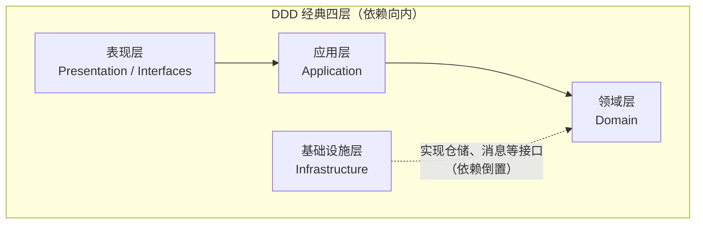

#### 各层职责与代码形态

**1. 表现层（Interfaces / Presentation）**

- **职责**：接入协议（HTTP、gRPC、消息消费者），解析输入、调用应用层、组装响应。
- **不应包含**：业务规则与不变量（只做适配与校验边界）。

```go
// HTTP Handler 示例
type OrderHandler struct {
	orderAppService *OrderApplicationService
}

func (h *OrderHandler) PlaceOrder(c *gin.Context) {
	var req PlaceOrderRequest
	if err := c.BindJSON(&req); err != nil {
		c.JSON(400, gin.H{"error": err.Error()})
		return
	}
	orderID, err := h.orderAppService.PlaceOrder(
		req.UserID,
		req.Items,
		req.ShippingAddress,
	)
	if err != nil {
		c.JSON(500, gin.H{"error": err.Error()})
		return
	}
	c.JSON(200, gin.H{"orderID": orderID})
}
```

**2. 应用层（Application）**

- **职责**：编排用例、控制事务、在提交后发布领域事件；**薄薄一层**。
- **包含**：Application Service、DTO、应用级事件处理器（若团队这样划分）。

```go
type OrderApplicationService struct {
	orderRepo    OrderRepository
	inventoryAPI InventoryAPIClient
	eventBus     EventBus
	uow          UnitOfWork
}

func (s *OrderApplicationService) PlaceOrder(
	userID UserID,
	items []OrderItem,
	address Address,
) (OrderID, error) {
	if err := s.inventoryAPI.CheckInventory(items); err != nil {
		return "", err
	}
	order, err := NewOrder(userID, items, address)
	if err != nil {
		return "", err
	}
	tx := s.uow.Begin()
	defer tx.Rollback()
	if err := s.orderRepo.Save(order); err != nil {
		return "", err
	}
	events := append([]DomainEvent(nil), order.GetEvents()...)
	order.ClearEvents()
	tx.OnCommit(func() {
		s.eventBus.Publish(events...)
	})
	if err := tx.Commit(); err != nil {
		return "", err
	}
	return order.ID(), nil
}
```

**3. 领域层（Domain）**

- **职责**：核心业务逻辑与不变量。
- **包含**：实体、值对象、聚合、领域服务、仓储**接口**、领域事件。
- **特点**：不依赖具体数据库、框架或消息 SDK。

```go
type Order struct {
	id     OrderID
	status OrderStatus
}

func (o *Order) Pay(payment PaymentMethod) error {
	if o.status != OrderStatusPending {
		return errors.New("only pending orders can be paid")
	}
	o.status = OrderStatusPaid
	o.addEvent(OrderPaidEvent{
		OrderID: o.id,
		Method:  payment,
	})
	return nil
}
```

**4. 基础设施层（Infrastructure）**

- **职责**：技术细节实现。
- **包含**：仓储实现、Outbox、Kafka Producer、缓存、第三方 HTTP 客户端等。

```go
type PostgresOrderRepository struct {
	db *sql.DB
}

func (r *PostgresOrderRepository) Save(order *Order) error {
	// INSERT / UPDATE，映射聚合根与持久化模型
	return nil
}
```

#### 依赖方向与 Clean Architecture 对照

```text
表现层 ──→ 应用层 ──→ 领域层 ←── 基础设施层
                         ↑
                         │
                    （依赖倒置）
```

- **依赖向内**：越外层越「面向用例与交付」，越内层越稳定。
- **依赖倒置**：基础设施实现领域层定义的端口（接口）。

| DDD 分层 | Clean Architecture | 说明 |
|---------|-------------------|------|
| 表现层 | Interface Adapters | HTTP / gRPC / 消息适配 |
| 应用层 | Use Cases | 用例编排与事务 |
| 领域层 | Entities（核心企业规则） | 与框架无关的领域模型 |
| 基础设施层 | Frameworks & Drivers | DB、MQ、外部系统 |

更系统的对照与 CQRS 分层变体见  第四、五部分。

---

### 5.2 目录结构设计

下面给出一个典型的 **Go 单体服务内按 DDD 分层 + 按聚合分包** 的目录骨架（可按团队规范微调 `internal` 与 `pkg` 的边界）。

```text
order-service/
├── cmd/
│   └── server/
│       └── main.go                    # 入口
├── internal/
│   ├── domain/                        # 领域层
│   │   ├── order/                     # Order 聚合
│   │   │   ├── order.go               # 聚合根
│   │   │   ├── order_item.go          # 实体或值对象
│   │   │   ├── order_status.go        # 值对象 / 枚举
│   │   │   ├── order_repository.go    # 仓储接口
│   │   │   └── order_test.go
│   │   ├── pricing/
│   │   │   └── pricing_service.go     # 领域服务
│   │   ├── events/
│   │   │   ├── order_placed.go
│   │   │   ├── order_paid.go
│   │   │   └── order_cancelled.go
│   │   └── shared/
│   │       ├── money.go
│   │       ├── address.go
│   │       └── user_id.go
│   ├── application/
│   │   ├── service/
│   │   │   └── order_service.go
│   │   ├── dto/
│   │   │   ├── place_order_request.go
│   │   │   └── order_response.go
│   │   └── eventhandler/
│   │       └── order_paid_handler.go
│   ├── infrastructure/
│   │   ├── persistence/
│   │   │   ├── postgres_order_repo.go
│   │   │   └── migrations/
│   │   ├── messaging/
│   │   │   └── kafka_event_bus.go
│   │   └── api/
│   │       └── inventory_client.go
│   └── interfaces/
│       ├── http/
│       │   ├── handler/
│       │   │   └── order_handler.go
│       │   └── router.go
│       └── grpc/
│           └── order_service.go
├── pkg/                               # 可被外部模块稳定引用的库（谨慎暴露）
│   └── eventbus/
│       └── event_bus.go
├── configs/
│   └── config.yaml
├── go.mod
└── go.sum
```

**目录原则小结**：

1. **按层分**：`domain` / `application` / `infrastructure` / `interfaces` 一目了然。
2. **按聚合分**：`domain/order`、`domain/inventory` 等，避免「一个大 package 装所有实体」。
3. **依赖方向**：`domain` 不 import 其他层；外层依赖内层。
4. **测试贴近源码**：`order_test.go` 与 `order.go` 同目录，降低阅读成本。

**命名习惯（示例）**：

- 领域对象：`order.go`、`order_item.go`
- 仓储接口：`order_repository.go`；实现：`postgres_order_repo.go`
- 应用服务：`order_service.go`；领域服务：`pricing_service.go`

**与 Java / Spring Boot 常见布局对照**（概念等价，语法不同）：

```text
order-service/
└── src/main/java/com/example/order/
    ├── domain/
    │   ├── model/
    │   ├── service/
    │   └── repository/          # 仓储接口
    ├── application/
    │   └── service/
    ├── infrastructure/
    │   ├── persistence/
    │   └── messaging/
    └── interfaces/
        └── rest/
```

---

### 5.3 DDD + CQRS

**CQRS（Command Query Responsibility Segregation）**把「改状态的写模型」和「查数据的读模型」在模型与存储上拆开，常与事件驱动的读模型投影结合。

#### 何时引入

**适合**：

- 读写比例悬殊（读多写少）或 SLA 不同。
- 查询要跨聚合、跨上下文拼宽表，直接在写库上 join 成本高。
- 需要独立扩展读路径（缓存、搜索、物化视图）。

**谨慎**：

- 典型 CRUD、读写都简单且一致性强需求集中在单表。
- 团队尚无「最终一致」运维与监控经验时，不要一上来全站 CQRS。

#### 电商订单：写模型规范化、读模型宽表

**矛盾**：

- **写**：下单要保证 `Order` 与 `OrderItem` 等同聚合（或同一事务边界）内强一致。
- **读**：订单列表要展示用户昵称、商品主图、物流摘要等，来自多上下文；写库范式化则查询痛苦。

**思路**：写侧维持聚合与事务；读侧用事件增量维护投影（Elasticsearch、Redis、专用读库均可）。

```text
写模型（订单上下文）
├── Order 聚合（规范化存储）
├── OrderRepository → PostgreSQL
└── 发布 OrderPlaced、OrderPaid 等事件

读模型（查询侧）
├── 订阅领域事件
├── 构建 OrderListView 等宽表 / 文档
└── 查询走 ES / 只读副本 / 缓存
```

**写模型（示意）**：

```go
type Order struct {
	ID     string
	UserID string
	Status string
}

func (s *OrderApplicationService) PlaceOrder(/* ... */) error {
	order := /* 构建聚合 */
	if err := s.orderRepo.Save(order); err != nil {
		return err
	}
	s.eventBus.Publish(OrderPlacedEvent{OrderID: order.ID, /* ... */})
	return nil
}
```

**读模型（投影构建示意）**：

```go
type OrderListView struct {
	OrderID       string
	UserName      string
	UserAvatar    string
	ProductNames  []string
	ProductImages []string
	TotalPrice    float64
	Status        string
	CreatedAt     time.Time
}

type OrderListViewBuilder struct {
	searchClient SearchClient
	userRepo     UserLookup
	productRepo  ProductLookup
}

func (b *OrderListViewBuilder) OnOrderPlaced(event OrderPlacedEvent) {
	user := b.userRepo.FindByID(event.UserID)
	products := b.productRepo.FindByIDs(event.ProductIDs)
	view := OrderListView{
		OrderID:      event.OrderID,
		UserName:     user.Name,
		ProductNames: extractNames(products),
		TotalPrice:   event.TotalPrice,
		Status:       "Pending",
		CreatedAt:    event.OccurredOn,
	}
	_ = b.searchClient.IndexOrderListView(view)
}
```

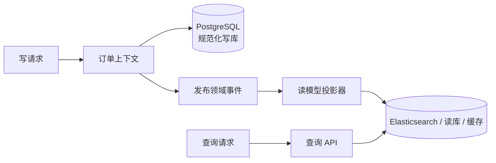

**设计要点**：

1. **写模型**负责事务与不变量；**读模型**可滞后，但要可观测（延迟、积压）。
2. 同一业务可有**多套读模型**（列表、详情、运营报表）。
3. 读写可**独立扩缩**与选型（OLTP + 搜索 / 分析引擎）。

更多分层与 CQRS 变体仍推荐对照  第五部分。

---

### 5.4 DDD + 事件驱动架构

领域事件在**限界上下文之间**传递「已发生的事实」；落地时通常配合 **Kafka**（高吞吐、持久化、可回放）、**RabbitMQ**（灵活路由）、**NATS**（轻量）等中间件。选型取决于顺序性、投递语义、运维形态，这里不展开产品对比。

#### 下单—支付链路的逻辑视图

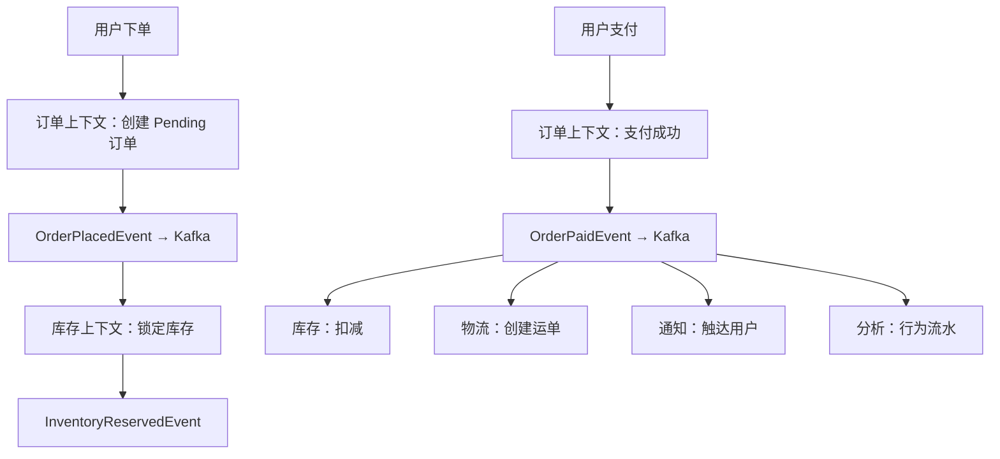

#### 发布与订阅（接口 + Kafka 示意）

```go
type EventBus interface {
	Publish(topic string, event DomainEvent) error
}

type KafkaEventBus struct {
	producer sarama.SyncProducer
}

func (bus *KafkaEventBus) Publish(topic string, event DomainEvent) error {
	data, err := json.Marshal(event)
	if err != nil {
		return err
	}
	msg := &sarama.ProducerMessage{
		Topic: topic,
		Key:   sarama.StringEncoder(event.AggregateID()),
		Value: sarama.ByteEncoder(data),
	}
	_, _, err = bus.producer.SendMessage(msg)
	return err
}
```

```go
type OrderPaidEventHandler struct {
	inventoryService InventoryService
	processed        ProcessedEventStore
}

func (h *OrderPaidEventHandler) Handle(event OrderPaidEvent) error {
	if h.processed.Exists(event.EventID) {
		return nil
	}
	if err := h.inventoryService.DeductInventory(event.OrderID, event.Items); err != nil {
		return err
	}
	return h.processed.Mark(event.EventID)
}
```

#### 长流程与 Saga（补偿）

事件编排实现**最终一致**；若需要显式「多步远程调用 + 补偿」，可引入 **Saga / 流程管理器**（与消息驱动可并存）。

```text
订单已创建 → 锁定库存 → 支付 → 扣减库存 → 创建运单
                ↓ 失败           ↓ 失败
            释放库存         释放库存 + 退款
```

```go
type OrderSaga struct {
	orderRepo    OrderRepository
	inventoryAPI InventoryAPIClient
	paymentAPI   PaymentAPIClient
	logisticsAPI LogisticsAPIClient
}

func (s *OrderSaga) Execute(orderID string) error {
	if err := s.inventoryAPI.Reserve(orderID); err != nil {
		return err
	}
	if err := s.paymentAPI.Pay(orderID); err != nil {
		_ = s.inventoryAPI.Release(orderID)
		return err
	}
	if err := s.inventoryAPI.Deduct(orderID); err != nil {
		_ = s.paymentAPI.Refund(orderID)
		_ = s.inventoryAPI.Release(orderID)
		return err
	}
	if err := s.logisticsAPI.CreateShipment(orderID); err != nil {
		// 示例：物流失败策略依业务而定，可记录待人工处理
		log.Printf("shipment failed: %v", err)
	}
	return nil
}
```

#### 关键工程要点

1. **消费者幂等**：至少一次投递下，重复消息不得破坏不变量。
2. **顺序与分区键**：同一聚合或业务流程使用稳定 `key` 映射到分区，避免乱序破坏状态机假设。
3. **重试与死信**：可重试错误与不可重试错误要区分； poison message 要隔离。
4. **补偿与对账**：跨上下文失败路径要可观测、可人工介入。

**本节小结**：

- **四层架构**划定职责与依赖方向，**依赖倒置**把技术细节挡在领域之外。
- **目录**按层 + 按聚合组织，有利于演进与代码导航。
- **CQRS**分离写模型与读模型，读侧多用**事件投影**换查询性能与扩展性。
- **事件驱动**用中间件连接上下文，配合**幂等、顺序、重试、Saga** 才能长期运维。

---

## 七、实施误区与演进清单


演进阶段应把幂等、超时、退避和故障隔离当成可验证政策，[AWS Builders’ Library](https://aws.amazon.com/builders-library/) 提供了面向生产实践的讨论。清单的目的不是一次性获得“DDD 合规”标签，而是让每次改变都能说明边界、风险、证据与回退路径。


从书本概念到团队日常交付，还需要回答：**要不要上 DDD**、**遗留系统怎么迁**、**工作坊怎么开**、**哪些坑别踩**。本节给出一套偏工程落地的 checklist 与阶段化路径，仍以电商为叙事背景。

---

### 6.1 何时使用 DDD

#### 往往值得投入的场景

1. **业务复杂**：规则多、变更多，状态机 / 促销 / 履约链路长。
2. **长生命周期**：系统会持续迭代，模型需要可演进、可讨论。
3. **多团队协作**：需要清晰的上下文边界与接口契约，降低「口口相传」成本。
4. **领域专家可参与**：能共建**统一语言**与验收示例（哪怕从简版术语表开始）。

#### 不太划算的场景

1. **简单 CRUD**：后台配置、纯表单管理，战术 DDD 全套易过度。
2. **短周期交付**：例如小于 3 个月的工具型项目，学习曲线摊不薄。
3. **技术主导、领域稀薄**：日志管道、纯基础设施类系统，DDD 核心收益有限。
4. **团队零铺垫硬上**：没有教练或共读，容易学成「伪 DDD」。

#### 决策矩阵（业务复杂度 × 周期）

| 业务复杂度 / 项目周期 | 短期（少于 6 个月） | 中期（6～18 个月） | 长期（大于 18 个月） |
|----------------------|-------------------|-------------------|---------------------|
| **简单**（CRUD 为主） | 不必强行 DDD | 不必强行 DDD | 可在核心域**轻量**战术 DDD |
| **中等**（有明显规则） | 以战术设计为主，边界先行 | 推荐 DDD | 推荐 DDD |
| **复杂**（状态机、工作流） | 推荐 DDD | 强烈推荐 | 强烈推荐 |

#### 快速自检（满足 3 条以上可认真考虑 DDD）

- [ ] 业务规则超出「单表 CRUD + if-else」可维护范围  
- [ ] 系统预期持续演进而非一次性交付  
- [ ] 能拉到业务方定期评审模型与术语  
- [ ] 团队规模与模块边界需要显式治理（通常多于 3 人协作同一产品）  
- [ ] 未来会有多个子系统 / 上下文集成（支付、库存、营销等）

---

### 6.2 从既有系统迁移到 DDD

遗留**单体 + 贫血服务 + 共享大库**是常见起点。建议采用**绞杀者模式（Strangler Fig）**：新能力用新结构承接，旧能力渐进搬迁，全程保持可发布。

#### 阶段 0：现状（典型问题）

```text
[单体应用]
├── UserService
├── ProductService
├── OrderService（贫血模型，规则散在 Service）
└── 共享数据库
```

- 业务规则散落、难以单测；团队不敢改「核心路径」。

#### 阶段 1：识别边界（少改代码，多对齐认知）

**目标**：用统一语言描述「聚合、上下文、事件」，形成共识图纸。

**行动**：

1. 组织 **Event Storming**（见 6.3），先事件后命令再聚合。
2. 标出核心聚合（如 `Order` + `OrderItem`）与上下文（订单、库存、支付、商品）。
3. 画**上下文映射**（客户-供应商、防腐层、开放主机服务等）。

**产出**：领域草图、上下文边界说明、聚合设计备忘。  
**周期感**：约 1～2 周（视领域规模与参与人可用性）。

#### 阶段 2：在代码里「收口」到聚合

**目标**：把订单相关不变量迁回 `Order` 聚合，服务层变薄。

**之前（贫血）**：

```go
func (s *OrderService) CancelOrder(orderID string) error {
	order := s.db.QueryOrder(orderID)
	if order.Status == "paid" {
		s.db.Exec("UPDATE orders SET status = 'cancelled' WHERE id = ?", orderID)
		return s.refundService.Refund(orderID)
	}
	return nil
}
```

**之后（充血 + 应用服务编排）**：

```go
func (o *Order) Cancel(reason string) error {
	if !o.status.CanCancel() {
		return errors.New("order cannot be cancelled")
	}
	o.status = OrderStatusCancelled
	o.addEvent(OrderCancelledEvent{OrderID: o.id, Reason: reason})
	return nil
}

func (s *OrderApplicationService) CancelOrder(orderID string) error {
	order, err := s.orderRepo.FindByID(orderID)
	if err != nil {
		return err
	}
	if err := order.Cancel("user requested"); err != nil {
		return err
	}
	return s.orderRepo.Save(order)
}
```

**周期感**：2～4 周（取决于测试防护与耦合程度）。

#### 阶段 3：引入领域事件，拆掉直连

**之前**：订单服务直接调用库存、退款接口，失败策略缠在一起。

```go
func (s *OrderService) CancelOrder(orderID string) {
	// ...
	s.inventoryService.ReleaseInventory(orderID)
	s.refundService.Refund(orderID)
}
```

**之后**：聚合内产生事件，提交后发布；库存 / 支付上下文各自订阅。

```go
func (s *OrderApplicationService) CancelOrder(orderID string) error {
	order, err := s.orderRepo.FindByID(orderID)
	if err != nil {
		return err
	}
	if err := order.Cancel("user requested"); err != nil {
		return err
	}
	if err := s.orderRepo.Save(order); err != nil {
		return err
	}
	s.eventBus.Publish(order.GetEvents()...)
	return nil
}
```

**周期感**：2～3 周（含幂等、重试与监控）。

#### 阶段 4：服务化 / 数据库拆分（在边界验证之后）

**目标**：订单上下文独立部署、独立数据存储，通过 API + 事件集成。

```text
[单体]
   ↓
[单体 + 订单服务]（可能经历双写 / 数据迁移）
   ↓
[订单服务] + [剩余单体] → 继续拆分其他上下文
```

**周期感**：4～6 周起，高度依赖数据一致性与流量迁移策略。

#### 阶段 5：持续演进

- 继续按上下文拆分；为读路径引入 CQRS / 投影；完善可观测性与对账工具。

#### 成功要素与风险

- **渐进**：禁止「停机半年重写」。  
- **可运行**：每个迭代都可发布、可回滚。  
- **对齐**：产品、研发、测试对术语与边界一致。  
- **价值优先**：从**核心域**下手，支撑域允许简单模式。  
- **风险**：双写期要有对账；灰度与特性开关；保留回滚剧本。

---

### 6.3 团队协作

#### Event Storming（事件风暴）简版流程

**参与者**：领域专家、开发、产品、测试（可选运维）。

1. **橙贴：领域事件** —— 「订单已创建」「库存已锁定」「订单已支付」。  
2. **蓝贴：命令** —— 谁触发？来自用户还是策略？  
3. **黄贴：聚合 / 策略** —— 哪个模型负责执行命令、维护不变量？  
4. **边界与上下文** —— 在哪里术语含义变化、事务必须切开？  
5. **关系** —— 客户-供应商、防腐层、发布语言等。

**产出**：端到端流程墙、候选聚合列表、上下文地图草稿。

```text
[下单] → OrderPlaced → [锁定库存] → InventoryReserved → [支付] → OrderPaid → ...
```

**工具**：实体墙 + 便利贴；远程可用 Miro、FigJam 等白板。

#### 与领域专家共建统一语言

- 维护**术语表（Glossary）**：中英文、禁用同义词混用。  
- **代码即文档**：类型名、方法名尽量用业务词（`PlaceOrder` 而非 `SubmitData`）。  
- **定期 Review**：新需求先问「改的是哪个上下文、哪个聚合」。  
- **可视化**：上下文图、核心序列图挂在团队可见处。

**电商术语表示例**：

| 术语 | 含义 |
|------|------|
| 下单（PlaceOrder） | 用户提交购买意图，生成待支付订单 |
| 锁库存（ReserveInventory） | 为订单预留可售库存，防超卖 |
| 订单已支付（OrderPaid） | 支付成功后的领域事实，触发履约链路 |

---

### 6.4 常见陷阱

#### 陷阱 1：为 DDD 而 DDD（过度设计）

**现象**：简单配置模块也硬拆聚合、事件、六边形，团队抱怨「样板比业务还多」。  
**对策**：用**子域分类**投资；核心域厚建模，支撑域允许贫血或事务脚本。

#### 陷阱 2：贫血模型回潮

**现象**：实体只有 getter/setter，所有规则在 `*Service`；领域层名存实亡。

```go
type Order struct {
	ID     string
	Status string
}

func (s *OrderService) Cancel(order *Order) {
	if order.Status == "paid" {
		order.Status = "cancelled"
	}
}
```

**对策**：反复问「这条规则属于哪个对象的生命周期？」；把状态机放进聚合；服务只做编排。

#### 陷阱 3：聚合切错（过大或互相践踏）

**过大**：把订单、库存、支付塞进同一聚合，事务与并发锁灾难。  
**跨聚合直接改**：`order.Inventory.Deduct()` 破坏边界。

```go
// 不推荐：库存不应作为订单聚合的内部可变部分
type Order struct {
	Items     []OrderItem
	Inventory *Inventory
}
```

**对策**：小聚合、**ID 引用**、跨聚合用**领域事件**或显式应用层编排 + 反腐蚀。

#### 陷阱 4：忽略上下文映射与数据所有权

**现象**：多服务读写同表、隐式依赖、无法独立部署。  
**对策**：一上下文优先**一库**；集成只走 API / 事件；把映射关系画成团队契约。

#### 陷阱 5：过早微服务化

**现象**：边界未验证就拆十几个服务，分布式事务与运维成本爆炸。  
**对策**：**模块化单体**先固化上下文；验证协作与数据边界后，再拆部署单元。

**本节小结**：

- **是否采用 DDD** 看复杂度、周期、团队与演进预期，用矩阵与 checklist 收敛决策。  
- **迁移**用绞杀者模式分阶段：认清边界 → 聚合收口 → 事件解耦 → 服务与数据拆分 → 持续演进。  
- **协作**靠 Event Storming 与术语表，让模型可讨论、可验收。  
- **避坑**的核心是：别过度、别贫血、别大聚合、别共享数据库、别过早拆分。

---


### 7.5 可逐项勾选的误区检查清单

- [ ] 我们先写了业务实例、术语和不变量，再决定是否引入框架或模式。
- [ ] 同一个术语在当前限界上下文内只有一个明确含义；跨上下文同名概念有翻译规则。
- [ ] 聚合只包含必须在同一事务内保持一致的状态，没有把整个业务流程塞进一个对象。
- [ ] 实体的方法表达业务意图，不依赖应用服务按正确顺序调用一组 setter 才能有效。
- [ ] Money 明确币种、精度、舍入阶段和尾差分摊，禁止不同币种直接运算。
- [ ] 规则资格、效果、互斥与优先级分离，并为边界、平局和组合爆炸准备测试。
- [ ] 外部上下文通过端口和反腐层接入，领域层不读取其他服务的数据表或 DTO。
- [ ] 报价包含输入版本、评估时间和明细，能解释、回放并支撑订单价格快照。
- [ ] 聚合内一致性由事务保证，跨聚合流程显式接受最终一致性、补偿与人工兜底。
- [ ] 事件表达已发生的事实，载荷最小且版本化；消费者按事件标识幂等处理。
- [ ] 业务数据与事件通过 Outbox 等机制避免双写窗口，并监控积压与失败重试。
- [ ] HTTP 和异步契约都有稳定错误语义、兼容规则、所有者和弃用窗口。
- [ ] CQRS 只在读写模型确实需要不同形态时使用，未把简单查询问题升级为双模型治理。
- [ ] 事件溯源只在完整历史是核心需求且团队能承担回放、版本与存储成本时使用。
- [ ] 微服务拆分发生在边界经过模块化验证之后，不以部署单元代替领域分析。
- [ ] 单元测试覆盖规则与不变量，契约测试覆盖边界翻译，端到端测试只守关键旅程。
- [ ] 指标和日志能回答哪些规则命中、为何拒绝、哪个版本异常，而不泄漏敏感信息。
- [ ] 每一步迁移都有基线、验收指标、回退方案和责任人，不追求一次性重写。

### 7.6 依赖治理：如何组织代码结构，避免循环依赖？

#### 问题现象

- `domain` 包 `import` 了 `infra` 或具体 ORM，**依赖方向倒置失败**。
- 包之间互相引用，编译器报错或被迫用「接口下沉到奇怪位置」的 workaround。
- 单元测试必须启动数据库或全局容器。

#### DDD + 依赖倒置

- **领域层**只依赖本层抽象与语言标准库（理想情况）。
- **应用层**依赖领域接口，组织用例。
- **基础设施层**实现领域定义的 **Repository / Gateway** 等接口。
- **依赖方向**：外层依赖内层；**装配**在 `main` 或 composition root 完成。

#### 推荐目录（示意）

```text
internal/
├── domain/
│   ├── order/
│   │   ├── order.go
│   │   └── order_repository.go   # 接口
│   └── shared/
│       └── money.go
├── application/
│   └── order_service.go
└── infrastructure/
    └── persistence/
        └── postgres_order_repo.go
```

#### 领域层定义接口

```go
// domain/order/order_repository.go
package order

type OrderRepository interface {
	Save(order *Order) error
	FindByID(id OrderID) (*Order, error)
}
```

#### 基础设施实现接口

```go
// infrastructure/persistence/postgres_order_repo.go
package persistence

import "myapp/domain/order"

type PostgresOrderRepository struct {
	db *sql.DB
}

func (r *PostgresOrderRepository) Save(o *order.Order) error { /* ... */ return nil }
func (r *PostgresOrderRepository) FindByID(id order.OrderID) (*order.Order, error) {
	return nil, nil
}
```

#### 应用层依赖接口

```go
// application/order_service.go
package application

import "myapp/domain/order"

type OrderApplicationService struct {
	orderRepo order.OrderRepository
}
```

#### 在 main 中装配

```go
func main() {
	db := connectDB()
	orderRepo := persistence.NewPostgresOrderRepository(db)
	orderSvc := application.NewOrderApplicationService(orderRepo)
	_ = orderSvc
}
```

#### 小结

- **接口归属领域**，**实现归属基础设施**；这是 Clean Architecture 与 DDD 常见的结合点（详见本文 **第五部分** 与 ）。

---

### 7.7 演进路径：如何从单体渐进演进到 DDD 与微服务？

#### 核心矛盾

- 一次性重写风险极高；不停机迁移又容易被历史耦合拖死。

#### 推荐策略：绞杀者模式 + 分阶段验证

与本文 **6.2** 一致，这里给出**路线图浓缩版**：

```text
阶段 1：识别聚合与限界上下文（以工作坊与文档为主，少改代码）
   ↓
阶段 2：在代码中收口不变量（贫血 → 充血，应用服务变薄）
   ↓
阶段 3：引入领域事件，拆掉跨模块直连与「顺手调一下别家 Service」
   ↓
阶段 4：在边界验证后拆分部署单元与数据存储
   ↓
阶段 5：持续演进（CQRS、读模型、可观测性、对账）
```

#### 原则

- **渐进**：每一迭代都可发布、可回滚。
- **从核心域开始**：先让赚钱路径模型清晰，再推广到支撑域。
- **每阶段验证价值**：用缺陷率、需求吞吐、沟通成本度量，而不是「是否更多类文件」。

电商迁移的**前后代码对比与周期感**见 **6.2** 各子阶段。

---

### 7.8 框架适配：DDD 如何与 ORM / 框架共存？

#### 问题现象

- ORM 要求**导出字段**、**无参构造**，与「封装 + 工厂创建」冲突。
- 把 JPA 注解直接贴在「领域实体」上，领域层被持久化细节污染。

#### 思路：领域模型与持久化模型分离（适配器）

**领域对象**保持封装与不变量；**PO / Entity / Document** 面向框架；**仓储**负责双向转换。

#### Go + GORM 示意

```go
// domain/order/order.go
type Order struct {
	id     OrderID
	status OrderStatus
}

func (o *Order) ID() OrderID { return o.id }
```

```go
// infrastructure/persistence/order_po.go
type OrderPO struct {
	ID     string `gorm:"primaryKey"`
	Status string
}

func OrderFromPO(po *OrderPO) *order.Order { /* 映射 */ return nil }
func OrderToPO(o *order.Order) *OrderPO   { /* 映射 */ return nil }
```

```go
func (r *PostgresOrderRepository) Save(o *order.Order) error {
	po := OrderToPO(o)
	return r.db.Save(po).Error
}
```

#### Java + JPA 示意

```java
// domain — 纯业务构造与行为
public class Order {
    private OrderID id;
    private OrderStatus status;
    private Order() {}
    public static Order restore(OrderID id, OrderStatus status) { /* ... */ return null; }
}
```

```java
// infrastructure — JPA 专用
@Entity
@Table(name = "orders")
public class OrderJpaEntity {
    @Id private String id;
    private String status;
    public OrderJpaEntity() {}
    public Order toDomain() { return null; }
    public static OrderJpaEntity fromDomain(Order o) { return null; }
}
```

#### 小结

- **框架约束留在最外层**；领域保持可测试、可阅读、可讨论。
- 转换成本通常远低于「领域与数据库 schema 锁死」带来的长期利息。

---

### 7.9 适用边界：何时不应该用 DDD？

#### 明确不太划算的场景

1. **简单 CRUD 为主**：后台配置、元数据管理，业务规则稀薄。
2. **报表 / 分析为主**：读多写少、以 SQL / OLAP 为核心，领域行为弱。
3. **纯技术或管道型系统**：日志、监控、同步工具，价值在工程而非领域模型。
4. **极短周期项目**：例如少于数月且一次性交付，学习与设计成本摊不薄。
5. **团队条件不成熟**：无人能与业务共建统一语言，却强行套用战术模式样板。

#### 判断口诀

```text
业务复杂度低 + 短期交付     → 通常不必上全套 DDD
业务复杂度低 + 长期维护     → 可考虑「轻量战术」或仅在核心域加厚模型
业务复杂度高                 → 强烈推荐系统运用战略 + 战术设计
```

#### 可替代方案

- 经典 **MVC + Service + 事务脚本** 足以支撑许多后台系统。
- 读路径复杂时，**SQL + DTO + 专用查询服务**往往更直接。
- 工具类系统可用**函数式管道**、配置驱动等更简单结构。

#### 核心原则

**不要为了 DDD 而 DDD。** 先判断复杂性与生命周期，再选择建模深度；本文 **6.1** 的矩阵与 checklist 可与本问对照使用。

---


## 八、总结与参考资料

DDD 的价值不在于让代码出现更多名词，而在于把关键业务决策放进一个能被产品、研发、测试和运营共同校验的模型。战略设计先明确价格、营销、商品、用户与订单的语言和所有权；战术设计再用值对象、聚合、服务、仓储与事件守护局部规则。计价案例说明：真正困难的不是加减乘除，而是时间、版本、互斥、舍入、证据和跨边界协作。

落地时应从一个有业务价值、边界相对清楚的用例开始，先写实例、术语和不变量，再选择架构。分层、六边形和反腐层帮助模型免受基础设施侵蚀；Outbox、契约和幂等处理跨边界可靠性；CQRS、事件溯源与微服务仅在问题和收益都足够明确时采用。模型不是一次设计完成的图，而是伴随业务事实、事故和反馈持续演进的共同资产。

### DDD 原典与模式

1. Evans, *Domain-Driven Design*, 2003 — https://www.domainlanguage.com/ddd/
2. Vernon, *Implementing Domain-Driven Design*, 2013 — https://vaughnvernon.com/
3. Vernon, IDDD Sample, 2013 — https://vaughnvernon.com/IDDD-sample/
4. Fowler, *Patterns of Enterprise Application Architecture*, 2002 — https://martinfowler.com/eaaCatalog.html
5. Fowler, “BoundedContext”, 2014 — https://martinfowler.com/bliki/BoundedContext.html
6. Fowler, “DomainDrivenDesign”, 2006 — https://martinfowler.com/bliki/DomainDrivenDesign.html
7. Fowler, “Domain Model”, 2003 — https://martinfowler.com/eaaDev/DomainModel.html

### 架构与集成

8. Fowler, “What do you mean by Event-Driven?”, 2017 — https://martinfowler.com/articles/201701-event-driven.html
9. Fowler, “Introducing Event Storming”, 2018 — https://martinfowler.com/articles/201803-event-storming.html
10. Hohpe & Woolf, *Enterprise Integration Patterns*, 2003 — https://www.enterpriseintegrationpatterns.com/
11. Richardson, *Microservices Patterns*, 2018 — https://microservices.io/
12. Richardson, “CQRS”, microservices.io — https://microservices.io/patterns/data/cqrs.html
13. Richardson, “Transactional Outbox”, microservices.io — https://microservices.io/patterns/data/transactional-outbox.html
14. Microsoft, “Microservices architecture” — https://learn.microsoft.com/en-us/azure/architecture/guide/architecture-styles/microservices
15. Microsoft, “CQRS pattern” — https://learn.microsoft.com/en-us/azure/architecture/patterns/cqrs

### 云原生与规范

16. AWS, *Builders’ Library* — https://aws.amazon.com/builders-library/
17. CNCF, CloudEvents 1.0, 2019 — https://cloudevents.io/
18. AsyncAPI Initiative, AsyncAPI 3.0, 2024 — https://www.asyncapi.com/docs
19. OpenAPI Initiative, OpenAPI 3.1 — https://spec.openapis.org/oas/latest.html
20. IETF, RFC 9457, 2023 — https://www.rfc-editor.org/rfc/rfc9457.html
21. ISO, ISO 4217 currency codes — https://www.iso.org/iso-4217-currency-codes.html

### 计价与货币语义

22. Kleppmann, *Designing Data-Intensive Applications*, 2017 — https://dataintensive.net/
23. Brandolini, EventStorming, eventstorming.com — https://www.eventstorming.com/
24. Fowler, *Patterns of Distributed Systems* — https://martinfowler.com/articles/patterns-of-distributed-systems/
