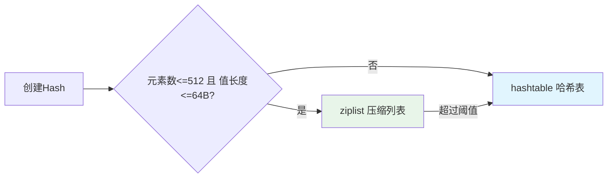

> 本文深入剖析 Redis 的核心原理、数据结构底层实现、电商场景最佳实践。包含 Hash ziplist 字节级内存分析、渐进式 rehash 机制、缓存一致性方案等。

## 📋 目录导航

### 一、基础篇
1. [Redis 核心特性与使用场景](#redis-核心特性与使用场景)
2. [五种数据类型与底层实现](#redis-5种数据类型和底层数据结构)
3. [常用命令与时间复杂度](#redis-常用命令)

### 二、数据结构深度剖析
1. [Hash 底层实现详解](#hash-底层实现原理详解)（⭐ 核心重点）
   - ziplist 压缩列表（字节级分析）
   - hashtable 哈希表（渐进式 rehash）
   - 实战案例：`{name: "iPhone", price: 5999}`
2. [String/SDS 实现](#string-底层实现)
3. [List 实现（ziplist/linkedlist/quicklist）](#list-底层实现)
4. [Set 实现（intset/hashtable）](#set-底层实现)
5. [ZSet 实现（ziplist/skiplist）](#zset-底层实现)

### 三、缓存设计与实践
1. [缓存使用场景](#redis-使用场景)（计数器、限流、队列）
2. [缓存与DB一致性](#怎么考虑缓存和db数据一致性的问题)
3. [缓存异常处理](#缓存异常与对应的解决办法)（雪崩、穿透、击穿）
4. [本地缓存 vs 远程缓存](#选择local-remote-multilevel-cache)

### 四、高级特性
1. [内存管理](#计算所需的缓存的容量当容量超过限制时的淘汰策略)（淘汰策略、过期键删除）
2. [持久化机制](#redis-两种数据持久化的原理以及优缺点)（RDB、AOF）
3. [分布式方案](#redis分布式方案)（主从、哨兵、集群）
4. [Lua 脚本](#redis--lua)

### 五、性能优化
1. [为什么 Redis 这么快](#redis-为什么这么快)
2. [单线程模型](#redis-为什么使用单线程模型)
3. [性能调优实践](#性能调优与监控)
4. [大 Key、热 Key 问题](#大key和热key问题)

### 六、实战案例
1. [分布式锁实现](#redis实现分布式锁)
2. [BloomFilter 应用](#bloomfilter-实践)
3. [秒杀系统设计](#秒杀系统设计)
4. [排行榜实现](#排行榜实现)

---

## Redis 核心特性与使用场景

### 核心特性总览

| 特性 | 说明 | 优势 |
|------|------|------|
| **内存存储** | 数据全部在内存中 | 极快的读写速度（10w+ QPS） |
| **单线程模型** | 命令串行执行 | 避免锁竞争，简化并发 |
| **多种数据结构** | String/Hash/List/Set/ZSet | 覆盖多种业务场景 |
| **持久化支持** | RDB + AOF | 数据不丢失 |
| **主从复制** | 读写分离 | 高可用、高并发 |
| **集群模式** | 分片存储 | 横向扩展能力 |

### 典型应用场景

#### 缓存加速（上游数据/数据库/外部聚合数据）

```go
// 查询商品详情
func GetProduct(productID string) (*Product, error) {
    // 1. 先查缓存
    key := "product:" + productID
    data, err := rdb.Get(ctx, key).Result()
    if err == nil {
        return json.Unmarshal(data)  // 缓存命中
    }
    
    // 2. 缓存未命中，查询 DB
    product, err := db.QueryProduct(productID)
    if err != nil {
        return nil, err
    }
    
    // 3. 回写缓存（设置过期时间）
    rdb.Set(ctx, key, json.Marshal(product), 1*time.Hour)
    return product, nil
}
// 存储 JSON 对象
rdb.Set(ctx, "user:123", `{"name":"alice","age":25}`, 0)

// 存储计数器
rdb.Set(ctx, "visit:count", 0, 0)

```

**性能提升**：DB 查询 100ms → Redis 查询 1ms（提升 100 倍）


### 计数器场景（incr + int）
1. 库存扣减（最核心场景）这是计数器最广泛的应用。在秒杀或大促期间，直接操作数据库库存会瞬间拖垮磁盘 I/O。
 - 逻辑： 
  1. 活动开始前，将商品库存同步到 Redis：SET stock:sku:1001 50。 
  2. 用户下单时，执行：DECR stock:sku:1001。 
  3. 如果返回值 >= 0，放行去写订单；如果返回值 < 0，立即返回“已售罄”。
  4. 优势： 内存级操作，单机可支撑 10w+ TPS，彻底杜绝超卖。

2. 高频限流（防刷与风控）
- 逻辑： 
  1. Key 为 limit:user:{uid}:api:{api_name}。 
  2. 每次请求执行 INCR。 
  3. 如果是首次调用（返回 1），设置过期时间 EXPIRE 60（即 1 分钟限流）。 
  4. 如果返回值超过阈值（如 100），直接拒绝请求。

### ZSet 使用场景

### List 使用场景
1. 在秒杀瞬间，由于流量远超数据库承受能力，先将请求“队列化”。
  - 操作： 用户的请求到达后，通过 LPUSH 压入一个排队列 seckill:queue:product_id。
  - 处理： 后台开启固定数量的 Worker 进程，通过 RPOP 或 BRPOP 获取请求进行后续减库存操作。
  - 优势： 削峰填谷，保护后端核心系统

2. 浏览最近查看的商品（Top 10） 如果你在商城详情页下方展示“最近查看”，你可能需要先读取前 10 个显示给用户
```
  // 1. 先读取前 10 个给前端展示，不删除
  products, _ := rdb.LRange(ctx, "user:history:123", 0, 9).Result()

  // 2. 如果用户点开了某个商品，你再往里加，并裁剪
  pipe := rdb.Pipeline()
  pipe.LPush(ctx, "user:history:123", "new_product_id")
  pipe.LTrim(ctx, "user:history:123", 0, 9) // 只保留最新的10个
  pipe.Exec(ctx)
```

1. 缓存数据（db，service) 的数据，提高访问效率
     - 缓存容量评估
     - 缓存过期机制，时间
     - 缓存miss，溯源和监控
     - 缓存雪崩,大面积key失效DB保护。
     - 缓存击穿：热key击穿保护
     - 缓存穿透：无效key击穿DB保护
     - 缓存更新和一致性问题
     - 缓存热key和大key问题
2. 限流和计数。lua脚本。（int,incr,lua）
     - 计数器 （临界值和frozen)
     - token （常用）
     - 漏桶（平滑）
     - 基于redis的分布式限流：https://pandaychen.github.io/2020/09/21/A-DISTRIBUTE-GOREDIS-RATELIMITER-ANALYSIS/
     - https://blog.csdn.net/crazymakercircle/article/details/130035504
3. 延时队列
   - 使用 ZSET+ 定时轮询的方式实现延时队列机制，任务集合记为 taskGroupKey
   - 生成任务以 当前时间戳 与 延时时间 相加后得到任务真正的触发时间，记为 time1，任务的 uuid 即为 taskid，当前时间戳记为 curTime
   - 使用 ZADD taskGroupKey time1 taskid 将任务写入 ZSET
   - 主逻辑不断以轮询方式 ZRANGE taskGroupKey curTime MAXTIME withscores 获取 [curTime,MAXTIME) 之间的任务，记为已经到期的延时任务（集）
   - 处理延时任务，处理完成后删除即可
   - 保存当前时间戳 curTime，作为下一次轮询时的 ZRANGE 指令的范围起点
   - https://github.com/bitleak/lmstfy
4. 消息队列
   - redis 支持 List 数据结构，有时也会充当消息队列。使用生产者：LPUSH；消费者：RBPOP 或 RPOP 模拟队列
5. 分布式锁：https://juejin.cn/post/6936956908007850014
6. bloomfilter: https://juejin.cn/post/6844903862072000526
   
      $m = -\frac{nln(p)}{(ln2)^2}$

      $k=\frac{m}{n}ln(2)$
   ```
   n 是预期插入的元素数量（数据规模），例如 20,000,000。
   p 是预期的误判率，例如 0.001。
   m 是位数组的大小。
   k 是哈希函数的数量。
   ```


---

## 二、数据结构深度剖析

> 深入理解 Redis 五种数据类型的底层实现原理，掌握内存优化技巧。

**参考资料**：
- [Redis 五种数据类型底层结构详解](https://juejin.cn/post/6844904192042074126)
- [Redis 设计与实现](http://redisbook.com/)

---

### Hash 底层实现原理详解

Redis Hash 采用**两种编码方式**，根据数据特征自动选择：

#### 1. 编码选择策略



**配置参数（redis.conf）：**
```conf
hash-max-ziplist-entries 512   # 最大元素个数
hash-max-ziplist-value 64       # 单个value最大长度（字节）
```

#### 2. ziplist（压缩列表）- 内存优化

**适用场景**：小对象存储（如商品详情、Session、小型 List）

ziplist 是 Redis 为节省内存设计的**紧凑型数据结构**，所有数据存储在**一块连续的内存**中。

##### 2.1 整体结构

```
+----------+----------+--------+---------+---------+-----+---------+--------+
| zlbytes  | zltail   | zllen  | entry1  | entry2  | ... | entryN  | zlend  |
+----------+----------+--------+---------+---------+-----+---------+--------+
  4字节      4字节      2字节    变长      变长            变长      1字节
```

| 字段 | 长度 | 说明 |
|------|------|------|
| **zlbytes** | 4 字节 | 整个 ziplist 占用的总字节数（包括 zlbytes 自身） |
| **zltail** | 4 字节 | 到尾节点的偏移量（用于快速定位尾部，支持反向遍历） |
| **zllen** | 2 字节 | 节点数量，最大 65535；超过则需遍历整个列表计数 |
| **entry** | 变长 | 实际数据节点，每个节点长度不固定 |
| **zlend** | 1 字节 | 固定为 `0xFF`，标记 ziplist 结束 |

##### 2.2 Entry 节点详细结构（三部分）

每个 entry 由三部分组成：

```
+----------+----------+----------+
| prevlen  | encoding | content  |
+----------+----------+----------+
  1或5字节   1-5字节    变长
```

###### **Part 1: prevlen（前一节点长度）**

记录**前一个节点的长度**，用于**从后向前遍历**。

```c
// 编码规则
if (前一节点长度 < 254 字节) {
    prevlen = 1 字节      // 直接存储长度值
} else {
    prevlen = 5 字节      // 第1字节=0xFE，后4字节存实际长度
}
```

**示例**：
- 前一节点 10 字节 → `prevlen = 0x0A`（1字节）
- 前一节点 300 字节 → `prevlen = 0xFE 0x00 0x00 0x01 0x2C`（5字节）

###### **Part 2: encoding（编码类型）**

记录 **content 的数据类型和长度**，Redis 使用变长编码节省空间。

**字符串编码**（前 2 位标识）：

| 编码格式 | 说明 | 长度范围 |
|----------|------|----------|
| `00pppppp` | 1字节，后6位存长度 | 0 - 63 字节 |
| `01pppppp qqqqqqqq` | 2字节，14位存长度 | 64 - 16383 字节 |
| `10______ [4字节]` | 5字节，后续4字节存长度 | > 16383 字节 |

**整数编码**（前 2 位为 `11`）：

| 编码值 | 说明 | 数据长度 |
|--------|------|----------|
| `11000000` | int16_t | 2 字节 |
| `11010000` | int32_t | 4 字节 |
| `11100000` | int64_t | 8 字节 |
| `11110000` | 24 位整数 | 3 字节 |
| `11111110` | 8 位整数 | 1 字节 |
| `1111xxxx` | 0-12 的整数直接编码在后4位 | **0 字节**（无 content） |

###### **Part 3: content（实际数据）**

存储实际的数据内容，根据 `encoding` 字段解析：
- **字符串**：原始字节数组
- **整数**：二进制整数（小端序）

##### 2.3 实际内存布局示例

存储 Hash：`{name: "iPhone", price: 5999}`

```
偏移 | 字段        | 值                  | 说明
-----|------------|---------------------|------------------
0-3  | zlbytes    | 0x0000003F (63)     | 总大小 63 字节
4-7  | zltail     | 0x00000035 (53)     | 尾节点偏移 53
8-9  | zllen      | 0x0004 (4)          | 4个节点（2 field + 2 value）

10   | prevlen    | 0x00                | 第一个节点
11   | encoding   | 0x04                | 字符串长度 4
12-15| content    | "name"              | field
     | (共 6 字节)

16   | prevlen    | 0x06                | 前一节点 6 字节
17   | encoding   | 0x06                | 字符串长度 6
18-23| content    | "iPhone"            | value
     | (共 8 字节)

24   | prevlen    | 0x08                | 前一节点 8 字节
25   | encoding   | 0x05                | 字符串长度 5
26-30| content    | "price"             | field
     | (共 7 字节)

31   | prevlen    | 0x07                | 前一节点 7 字节
32   | encoding   | 0xC0                | int16_t
33-34| content    | 0x176F (5999)       | value（整数优化）
     | (共 4 字节)

35   | zlend      | 0xFF                | 结束标记
```

**内存计算**：10（头）+ 6 + 8 + 7 + 4 + 1（尾）= **36 字节**

##### 2.4 遍历机制

**正向遍历（从头到尾）**：
```c
ptr = ziplist + 10;  // 跳过头部
while (*ptr != 0xFF) {
    // 解析 encoding，计算节点长度
    node_len = prevlen_size + encoding_size + content_size;
    ptr += node_len;  // 跳到下一个节点
}
```

**反向遍历（从尾到头）**：
```c
ptr = ziplist + zltail;  // 直接定位尾节点
while (ptr > ziplist + 10) {
    prevlen = parse_prevlen(ptr);  // 读取 prevlen
    ptr -= prevlen;  // 跳到前一个节点
}
```

##### 2.5 连锁更新问题（Cascade Update）

**问题**：插入/删除节点可能导致后续节点的 `prevlen` 字段长度变化。

**场景示例**：
```
初始状态：[253B] [253B] [253B]
          每个节点的 prevlen 占 1 字节

插入大节点：[253B] [260B] [???] [???]
                     ↑
          前一节点变为 260 字节 (>254)
          当前节点的 prevlen 需从 1 字节扩展为 5 字节
          当前节点长度从 253 → 257 字节
          下一个节点的 prevlen 也需扩展...
```

**影响**：
- **最坏时间复杂度**：O(n²)（所有节点连锁更新）
- **内存重分配**：连续的 `realloc` 操作
- **实际概率**：极低（需要大量节点刚好在 254 字节边界）

**Redis 优化**：
- 预先检查是否会触发连锁更新
- 一次性分配足够内存，减少 `realloc` 次数

##### 2.6 编码示例（Go 代码）

```go
// 示例：字符串 "hello" 的 encoding
// 长度 5 < 63，使用 00pppppp 格式
encoding := 0b00000101  // 0x05

// 示例：整数 100 的 encoding
// 范围在 int16 内，使用 11000000
encoding := 0b11000000  // 0xC0
content := []byte{0x64, 0x00}  // 小端序 100

// 示例：整数 12 的 encoding
// 0-12 直接编码在 encoding 中
encoding := 0b11111100  // 0xFC，后4位 1100 = 12
// 无需 content 字段！
```

##### 2.7 优势与限制

**✅ 优势**：
- **内存高效**：无指针开销，紧凑存储
  - 对比链表：每个节点省 16 字节（prev + next 指针）
- **CPU 缓存友好**：连续内存，预读优化
- **智能编码**：整数压缩、变长存储
- **双向遍历**：通过 `zltail` 和 `prevlen` 实现

**❌ 限制**：
- **查找慢**：O(n) 顺序遍历，不适合大数据
- **连锁更新**：最坏 O(n²)（实际很少发生）
- **内存重分配**：插入/删除需 `realloc`
- **默认阈值**：
  - Hash: 512 entries
  - List: 512 entries
  - ZSet: 128 entries

##### 2.8 应用场景总结

| 数据类型 | 使用 ziplist 条件 | 典型场景 |
|----------|-------------------|----------|
| **Hash** | entries ≤ 512, value ≤ 64B | 商品基础信息、用户 Session |
| **List** | entries ≤ 512 | 消息队列、浏览历史 |
| **ZSet** | entries ≤ 128, member ≤ 64B | 小型排行榜、优先队列 |

**监控命令**：
```bash
# 查看编码类型
redis> OBJECT ENCODING mykey
"ziplist"

# 查看内存占用
redis> MEMORY USAGE mykey
(integer) 184

# 查看 ziplist 详细信息（DEBUG 命令）
redis> DEBUG OBJECT mykey
Value at:0x7f8a9c0a0a00 refcount:1 encoding:ziplist serializedlength:48
```

#### 3. hashtable（哈希表）- 性能优化

**适用场景**：大量字段或需要快速查找

**核心结构**：经典拉链法哈希表

```c
// Redis 字典结构（dict）
typedef struct dict {
    dictht ht[2];        // 两个哈希表，ht[1] 用于 rehash
    long rehashidx;      // rehash 进度，-1 表示未进行
} dict;

// 哈希表结构（dictht）
typedef struct dictht {
    dictEntry **table;   // 哈希表数组（指针数组）
    unsigned long size;  // 大小（2的幂次方）
    unsigned long used;  // 已有节点数
} dictht;

// 哈希节点（dictEntry）
typedef struct dictEntry {
    void *key;           // 键
    void *value;         // 值
    struct dictEntry *next;  // 链表指针（解决冲突）
} dictEntry;
```

**可视化结构**：详见 [redis-hashtable.mmd](/diagrams/mermaid/redis-hashtable.mmd)

```
dict
├── ht[0] (主哈希表)
│   ├── table[0] → NULL
│   ├── table[1] → entry(name:iPhone) → NULL
│   ├── table[2] → entry(price:5999) → entry(stock:100) → NULL  (拉链法)
│   └── ...
└── ht[1] (rehash用)
    └── NULL (未使用)
```

#### 4. 渐进式 Rehash 机制（核心）

**触发条件**：
```c
// 扩容
1. 负载因子 = used/size >= 1 (无BGSAVE/BGREWRITEAOF时)
2. 负载因子 >= 5 (强制扩容)

// 缩容
负载因子 < 0.1
```

**渐进式 Rehash 流程**：
1. 为 `ht[1]` 分配空间（扩容为 `used * 2` 的最小 2^n）
2. `rehashidx = 0` 开始迁移
3. **每次增删改查操作时**，顺带迁移 `ht[0].table[rehashidx]` 的所有数据到 `ht[1]`
4. 全部迁移完成后，释放 `ht[0]`，将 `ht[1]` 设为 `ht[0]`

**可视化流程**：详见 [redis-rehash-process.mmd](/diagrams/mermaid/redis-rehash-process.mmd)

**Rehash 期间的操作**：
```c
查找：先查 ht[0]，未找到再查 ht[1]
新增：直接写入 ht[1]（新数据不进旧表）
删除/更新：在 ht[0] 或 ht[1] 中找到后操作
```

**为什么用渐进式？**
- 避免一次性 rehash 大量数据导致 Redis 阻塞（毫秒级→微秒级）
- 分摊到每次操作中，对单次请求影响极小

#### 5. 哈希函数

```c
// Redis 使用 MurmurHash2（速度快、分布均匀）
hash = MurmurHash2(key, len);
index = hash & dict->ht[x].sizemask;  // 位运算代替取模，性能优
```

#### 6. 性能对比

| 操作 | ziplist | hashtable |
|------|---------|-----------|
| HSET | O(n) | O(1) 平均 |
| HGET | O(n) | O(1) 平均 |
| HDEL | O(n) | O(1) 平均 |
| HGETALL | O(n) | O(n) |
| 内存占用 | **低**（无指针） | **高**（指针+空间换时间） |
| CPU缓存 | **友好**（连续） | 一般（随机访问） |
| 适用场景 | < 512字段小对象 | 大量字段快速查找 |

#### 7. 电商场景最佳实践

```go
// ✅ 推荐：商品详情缓存（字段适中，频繁部分更新）
rdb.HSet(ctx, "product:1001", map[string]interface{}{
    "name":      "iPhone 15",
    "price":     "5999",
    "stock":     "100",
    "seller_id": "10086",
})

// 只更新库存，无需读取整个对象
rdb.HIncrBy(ctx, "product:1001", "stock", -1)

// ✅ 推荐：用户 Session 存储
rdb.HSet(ctx, "session:abc123", "uid", "88888")
rdb.HSet(ctx, "session:abc123", "role", "buyer")
rdb.Expire(ctx, "session:abc123", 30*time.Minute)

// ❌ 避免：大 Hash（> 10000 字段）
// 问题：HGETALL 阻塞、集群数据倾斜、持久化慢
// 解决：拆分为多个小 Hash，如 product:1001:base、product:1001:detail
```

#### 8. Hash vs String(JSON)

| 维度 | Hash | String (JSON) |
|------|------|---------------|
| 内存 | ziplist 模式更省 | JSON 序列化开销大 |
| 部分更新 | ✅ `HSET field` | ❌ 需整体 GET→改→SET |
| 序列化 | 无需序列化 | 需 JSON 编解码（CPU开销） |
| 查询灵活性 | `HMGET` 精确取字段 | `GET` 整体取出 |
| 适用场景 | 频繁部分字段更新 | 整体读写、复杂嵌套结构 |

**选择建议**：
- **用 Hash**：对象字段 < 1000，需要单独读写某些字段（如库存）
- **用 String**：对象结构复杂嵌套（JSON），整体读写居多

#### 9. 监控与调优

```bash
# 1. 查找大 key
redis-cli --bigkeys

# 2. 查看 Hash 编码
redis-cli> OBJECT ENCODING product:1001
"ziplist"  # 或 "hashtable"

# 3. 查看内存占用
redis-cli> MEMORY USAGE product:1001
(integer) 184

# 4. 调整编码阈值（根据业务调整）
CONFIG SET hash-max-ziplist-entries 1024
CONFIG SET hash-max-ziplist-value 128
```

---

### String 底层实现

#### String/SDS 核心结构

Redis String 实际是 **SDS（Simple Dynamic String）**，而非 C 字符串。

#### SDS 结构

```c
struct sdshdr {
    int len;        // 已使用长度
    int free;       // 剩余可用空间
    char buf[];     // 实际数据
};
```

#### 优势对比

| 特性 | C 字符串 | SDS |
|------|----------|-----|
| 获取长度 | O(n) 遍历 | O(1) 直接读 len |
| 缓冲区溢出 | 不检查，易溢出 | 自动扩容，安全 |
| 内存重分配 | 每次都需要 | 空间预分配 + 惰性释放 |
| 二进制安全 | 否（遇 `\0` 结束） | 是（记录长度） |

#### 编码类型

String 有 3 种编码：

```bash
# 1. int 编码（整数）
SET count 100
OBJECT ENCODING count  # "int"

# 2. embstr 编码（短字符串 ≤ 44 字节）
SET short "hello"
OBJECT ENCODING short  # "embstr"

# 3. raw 编码（长字符串 > 44 字节）
SET long "very long string..."
OBJECT ENCODING long  # "raw"
```

**embstr vs raw**：
- **embstr**：SDS 和 redisObject 在连续内存（一次分配）
- **raw**：SDS 和 redisObject 分开分配（两次分配）

#### 应用场景

```go
// 1. 计数器
rdb.Incr(ctx, "page:views")

// 2. 分布式 ID 生成
id := rdb.Incr(ctx, "order:id").Val()

// 3. 限流（固定窗口）
count := rdb.Incr(ctx, "limit:user:123").Val()
if count == 1 {
    rdb.Expire(ctx, "limit:user:123", 60*time.Second)
}
if count > 100 {
    return ErrRateLimited
}

// 4. Session 存储
rdb.Set(ctx, "session:token_abc", userJSON, 30*time.Minute)
```

---

### List 底层实现

List 在 Redis 3.2 之前使用 **ziplist** 或 **linkedlist**，3.2+ 统一使用 **quicklist**。

#### quicklist 结构

```
quicklist = ziplist 链表

[ziplist1] ⇄ [ziplist2] ⇄ [ziplist3] ⇄ [ziplist4]
    ↓             ↓             ↓             ↓
  [a,b,c]      [d,e,f]      [g,h,i]      [j,k,l]
```

**设计思想**：
- **ziplist**：内存紧凑，但大量数据时性能差
- **linkedlist**：插入快，但内存碎片多
- **quicklist**：折中方案，每个节点是一个小 ziplist

#### 配置参数

```conf
# 每个 ziplist 的最大大小（字节）
list-max-ziplist-size -2  # -2 表示 8KB

# 两端不压缩的节点数（LZF 压缩）
list-compress-depth 0  # 0 表示不压缩
```

#### 应用场景

```go
// 1. 消息队列（FIFO）
rdb.LPush(ctx, "queue:tasks", task1, task2)  // 生产者
task := rdb.RPop(ctx, "queue:tasks")         // 消费者

// 2. 最近浏览记录（LIFO）
rdb.LPush(ctx, "user:123:history", productID)
rdb.LTrim(ctx, "user:123:history", 0, 9)  // 只保留最新 10 条

// 3. 时间线（Timeline）
rdb.LPush(ctx, "timeline:user:123", postID)
posts := rdb.LRange(ctx, "timeline:user:123", 0, 19)  // 最新 20 条

// 4. 阻塞队列（BRPOP）
task := rdb.BRPop(ctx, 5*time.Second, "queue:tasks")  // 阻塞等待
```

#### 性能对比

| 操作 | 时间复杂度 | 说明 |
|------|-----------|------|
| LPUSH/RPUSH | O(1) | 头尾插入 |
| LPOP/RPOP | O(1) | 头尾弹出 |
| LINDEX | O(n) | 按索引查询 |
| LRANGE | O(n) | 范围查询 |
| LINSERT | O(n) | 中间插入 |

---

### Set 底层实现

Set 使用 **intset** 或 **hashtable** 编码。

#### intset（整数集合）

**适用条件**：
- 所有元素都是整数
- 元素数量 ≤ 512（`set-max-intset-entries`）

**结构**：
```c
typedef struct intset {
    uint32_t encoding;  // INTSET_ENC_INT16/INT32/INT64
    uint32_t length;    // 元素数量
    int8_t contents[];  // 有序数组
};
```

**特点**：
- ✅ 有序存储，二分查找 O(log n)
- ✅ 内存紧凑
- ❌ 插入/删除需移动元素 O(n)

#### 应用场景

```go
// 1. 标签系统
rdb.SAdd(ctx, "user:123:tags", "VIP", "男性", "90后")
tags := rdb.SMembers(ctx, "user:123:tags")

// 2. 共同好友
rdb.SAdd(ctx, "user:123:friends", "456", "789")
rdb.SAdd(ctx, "user:456:friends", "123", "789")
common := rdb.SInter(ctx, "user:123:friends", "user:456:friends")  // [789]

// 3. 去重（抽奖池）
rdb.SAdd(ctx, "lottery:pool", userIDs...)
winner := rdb.SPop(ctx, "lottery:pool")  // 随机抽取

// 4. 点赞用户列表
rdb.SAdd(ctx, "post:1001:likes", "user:123")
isLiked := rdb.SIsMember(ctx, "post:1001:likes", "user:123")
likeCount := rdb.SCard(ctx, "post:1001:likes")
```

---

### ZSet 底层实现

ZSet 使用 **ziplist** 或 **skiplist + hashtable** 编码。

#### ziplist 编码

**条件**：
- 元素数量 ≤ 128（`zset-max-ziplist-entries`）
- 单个元素 ≤ 64 字节（`zset-max-ziplist-value`）

**存储格式**：
```
[member1, score1, member2, score2, ...]
按 score 有序存储
```

#### skiplist + hashtable 编码

**为什么用两种结构？**
- **skiplist**：按 score 有序，范围查询 O(log n)
- **hashtable**：按 member 查找，O(1) 获取 score

**skiplist 结构**：
```
Level 3:  1 --------------------------------> 100
Level 2:  1 -------> 50 -------------------> 100
Level 1:  1 --> 25 > 50 --> 75 ------------> 100
Level 0:  1 > 10 > 25 > 50 > 75 > 90 > 100
```

平均查找复杂度：O(log n)

#### 应用场景

```go
// 1. 排行榜
rdb.ZAdd(ctx, "rank:score", &redis.Z{Score: 5999, Member: "user:123"})
top10 := rdb.ZRevRange(ctx, "rank:score", 0, 9)  // 前 10 名

// 2. 延时队列
rdb.ZAdd(ctx, "delay:queue", &redis.Z{
    Score:  float64(time.Now().Add(5*time.Minute).Unix()),
    Member: taskID,
})
// 定时拉取到期任务
tasks := rdb.ZRangeByScore(ctx, "delay:queue", &redis.ZRangeBy{
    Min: "0",
    Max: strconv.Itoa(int(time.Now().Unix())),
})

// 3. 权重推荐
rdb.ZAdd(ctx, "recommend:user:123", &redis.Z{Score: 0.95, Member: "item:1001"})
recommended := rdb.ZRevRangeByScore(ctx, "recommend:user:123", &redis.ZRangeBy{
    Min: "0.8",
    Max: "+inf",
    Count: 10,
})

// 4. 微信步数排行榜
rdb.ZAdd(ctx, "steps:2026-01-08", &redis.Z{Score: 10000, Member: "user:123"})
myRank := rdb.ZRevRank(ctx, "steps:2026-01-08", "user:123")  // 我的排名
```

---

## 三、缓存设计与实践

> 掌握缓存使用模式、一致性方案、异常处理策略，构建高可用缓存系统。

---

### 缓存容量规划与内存管理

#### 内存淘汰策略
```
- noeviction(默认策略)：对于写请求不再提供服务，直接返回错误（DEL请求和部分特殊请求除外）
- allkeys-lru：从所有key中使用LRU算法进行淘汰
- volatile-lru：从设置了过期时间的key中使用LRU算法进行淘汰
- allkeys-random：从所有key中随机淘汰数据
- volatile-random：从设置了过期时间的key中随机淘汰
- volatile-ttl：在设置了过期时间的key中，根据key的过期时间进行淘汰，越早过期的越优先被淘汰
LFU算法是Redis4.0里面新加的一种淘汰策略。它的全称是Least Frequently Used

```
[redis 内存淘汰策略解析](https://juejin.cn/post/6844903927037558792)

### 过期键删除策略

过期策略通常有以下三种：
- 定时过期：每个设置过期时间的key都需要创建一个定时器，到过期时间就会立即清除。该策略可以立即清除过期的数据，对内存很友好；但是会占用大量的CPU资源去处理过期的数据，从而影响缓存的响应时间和吞吐量。
- 惰性过期：只有当访问一个key时，才会判断该key是否已过期，过期则清除。该策略可以最大化地节省CPU资源，却对内存非常不友好。极端情况可能出现大量的过期key没有再次被访问，从而不会被清除，占用大量内存。
- 定期过期：每隔一定的时间，会扫描一定数量的数据库的expires字典中一定数量的key，并清除其中已过期的key。该策略是前两者的一个折中方案。通过调整定时扫描的时间间隔和每次扫描的限定耗时，可以在不同情况下使得CPU和内存资源达到最优的平衡效果。
(expires字典会保存所有设置了过期时间的key的过期时间数据，其中，key是指向键空间中的某个键的指针，value是该键的毫秒精度的UNIX时间戳表示的过期时间。键空间是指该Redis集群中保存的所有键。)


---

## 四、高级特性

> 掌握持久化、分布式架构、Lua 脚本等高级特性，构建生产级 Redis 系统。

---

### 持久化机制（RDB、AOF）

Redis 提供两种持久化方案：

- **RDB (Redis DataBase)**：快照方式，紧凑的二进制数据
- **AOF (Append Only File)**：追加日志方式，记录所有写操作

**详细对比**：[Redis持久化原理](http://kaito-kidd.com/2020/06/29/redis-persistence-rdb-aof/)


---

### 本地缓存 vs 远程缓存

<p align="center">
  
</p>

#### 双buffer vs LRU/LFU
<p align="center">
  
</p>

<p align="center">
  
</p>

本地缓存的双缓冲机制和本地LRU（Least Recently Used）算法都是常见的缓存优化技术，它们具有不同的优点和缺点。

1. 双缓冲机制：
   - 优点：
     - 提高并发性能：双缓冲机制使用两个缓冲区，一个用于读取数据，另一个用于写入数据。这样可以避免读写冲突，提高了并发性能。
     - 提高数据访问效率：由于读取操作不会直接访问主缓存，而是读取缓冲区的数据，因此可以更快地获取数据。
   - 缺点：
     - 内存开销增加：双缓冲机制需要维护两个缓冲区，这会增加内存开销。
     - 数据延迟：数据更新定时同步，有一定延时。

2. 本地LRU算法：
   - 优点：
     - 数据访问效率高：LRU算法根据数据的访问顺序进行缓存替换，将最近最少使用的数据淘汰出缓存。这样可以保留最常用的数据，提高数据的访问效率。
     - 简单有效：LRU算法的实现相对简单，只需要维护一个访问顺序链表和一个哈希表即可。
   - 缺点：
     - 缓存命中率下降：如果数据的访问模式不符合LRU算法的假设，即最近访问的数据在未来也是最有可能被访问的，那么LRU算法的效果可能不理想，缓存命中率会下降。
     - 对于热点数据不敏感：LRU算法只考虑了最近的访问情况，对于热点数据（频繁访问的数据）可能无法有效地保留在缓存中。

综合来看，双缓冲机制适用于需要提高并发性能、批量更新等场景，但会增加内存开销。本地LRU算法适用于需要提高数据访问效率的场景，但对于访问模式不符合LRU假设的情况下，缓存命中率可能下降。在实际应用中，可以根据具体需求和场景选择适合的缓存优化技术。


### 缓存与DB一致性方案

#### 一致性问题分析

当使用 Redis 缓存 DB 数据时，DB 数据会发生 UPDATE，如何考虑 Redis 和 DB 数据的一致性问题呢？
- 通常来说，对于流量较小的业务来说，可以设置较小的expire time,可以将redis和db的不一致的时间控制在一定的范围内部
- 对于缓存和db一致性要求较高的场合，通常采用的是先更新db，再删除或者更新redis，考虑到并发性和两个操作的原子性（删除或者更新可能会失败），可以增加重试机制（双删除），如果考虑主从延时，可以引入mq做延时双删
- http://kaito-kidd.com/2021/09/08/how-to-keep-cache-and-consistency-of-db/
<p align="center">
  
</p>


<p align="center">
  
</p>


|  缓存更新方式  |  优缺点  | 
| -- | -- |
| 缓存模式+TTL | 业务代码只更新DB，不更新cache，设置较短的TTL(通常分钟级），依靠cache过期无法找到key时回源DB，热key过期可能回导致请求大量请求击穿到DB，需要使用分布式锁或者singleflight等方式避免这种问题 |
| 定时刷新模式 | 定时任务异步获取DB数据刷新到cache，读请求可不回源，需要考虑刷新时间和批量读写 |
| 写DB,写cache | 在并发条件下，DB写操作顺序和cache操作不同保证顺序一致性，需要增加分布式锁等操作 |
| 写DB，删除cache| 删除cache可能失败，需要增加重试，重试也可能失败，比较复杂的加个MQ补偿重试 |


### 思考：
- 对一致性要求有多强？
- TTL 设置的时长
- 并发冲突可能性
- 热key缓存击穿保护


### 缓存异常处理（雪崩、穿透、击穿）

#### 三大缓存问题

1. **缓存雪崩**：大面积 Key 同时失效或删除，导致请求全部打到 DB
2. **缓存穿透**：查询不存在的 Key（恶意攻击），绕过缓存直击 DB
3. **缓存击穿**：热点 Key 失效瞬间，高并发请求击穿到 DB

**详细方案**：[缓存异常解决方案](https://juejin.im/post/6844903651182542856)

---

## 五、性能优化

> 理解 Redis 高性能原理，掌握性能调优技巧，解决大Key/热Key问题。

---

### 为什么 Redis 这么快？

#### 核心原因

1. **完全基于内存**：绝大部分请求是纯粹的内存操作，非常快速。数据存在内存中，类似于 HashMap，HashMap 的优势就是查找和操作的时间复杂度都是 O(1)；
- 2、数据结构简单，对数据操作也简单，Redis 中的数据结构是专门进行设计的；
- 3、采用单线程，避免了不必要的上下文切换和竞争条件，也不存在多进程或者多线程导致的切换而消耗 CPU，不用去考虑各种锁的问题，不存在加锁释放锁操作，没有因为可能出现死锁而导致的性能消耗；
- 4、使用多路 I/O 复用模型，非阻塞 IO；
- 5、**自建 VM 机制**：使用底层模型不同，它们之间底层实现方式以及与客户端之间通信的应用协议不一样，Redis 直接自己构建了 VM 机制，因为一般的系统调用系统函数的话，会浪费一定的时间去移动和请求。

**详细分析**：[单线程 Redis 为什么快？](http://kaito-kidd.com/2020/06/28/why-redis-so-fast/)

---

### 单线程模型

#### 为什么使用单线程？

**参考**：[Redis 单线程设计](https://draveness.me/whys-the-design-redis-single-thread/)

**优势**：
- 避免上下文切换
- 无需考虑锁问题
- 实现简单清晰

**劣势**：
- 无法利用多核 CPU
- 长耗时命令会阻塞

---

### 大Key和热Key问题

#### 什么是大Key？

```bash
# 什么是大 Key？
- String: value > 10KB
- Hash/List/Set/ZSet: 元素数量 > 10000
```

---

### 分布式方案（主从、哨兵、集群）

#### 架构演进路线

| 阶段 | 方案 | 特点 | 局限性 |
|------|------|------|--------|
| 1 | **单机版** | 简单直接 | 单点故障、容量有限、并发有限 |
| 2 | **主从复制** | 读写分离、高可用 | 主从延迟、无自动故障转移 |
| 3 | **哨兵模式 (Sentinel)** | 自动故障转移 | 难以扩容、主库写入瓶颈 |
| 4 | **集群模式 (Cluster)** | 横向扩展、高可用 | 复杂度高、跨slot操作受限 |
| 5 | **Codis** | 中心化管理、易运维 | 需要额外组件（Zookeeper） |

#### 主从复制

**特点**：
- 主库（Master）负责写操作
- 从库（Slave）负责读操作
- 主库数据自动同步到从库

**问题**：
- 主从延迟导致数据不一致
- 无自动故障恢复，需人工介入

#### 哨兵模式 (Sentinel)

**目标**：解决主从复制的自动故障恢复问题

**工作机制**：
- 监控主从运行状态
- 当 Master 故障时，通过 Raft 选举
- Leader 哨兵选择优先级最高的 Slave 作为新 Master
- 其他 Slave 从新 Master 同步数据

**局限性**：
- 难以扩容
- 单机存储、读写能力受限
- 所有 Redis 节点都有全量数据，内存冗余

#### Redis Cluster 集群模式

**特点**：
- 无中心架构，去中心化
- 数据分片，每个节点存储部分数据（16384 个槽）
- 通过路由找到对应节点
- 支持横向和纵向扩展
- 自动故障转移

**优势**：
- 哨兵的所有优点
- 可动态扩容/缩容
- 数据分布式存储

#### Codis

**特点**：
- 豌豆荚开源方案
- 中心化管理（Zookeeper/Etcd）
- Proxy 层路由
- Dashboard 可视化管理

**GitHub**：https://github.com/CodisLabs/codis

**参考资料**：
- [Redis 分布式架构演进](https://blog.csdn.net/QQ1006207580/article/details/103243281)
- [Redis 集群化方案对比：Codis、Twemproxy、Redis Cluster](http://kaito-kidd.com/2020/07/07/redis-cluster-codis-twemproxy/)

---

### Lua 脚本

#### 为什么使用 Lua？

Redis 执行 Lua 脚本具有以下特性：

1. **原子性**：脚本执行期间不会执行其他脚本或命令
2. **独占性**：Redis 一旦开始执行 Lua 脚本，就会一直执行完该脚本
3. **应用广泛**：分布式锁、限流、秒杀等场景

#### 使用注意事项
- 使用 Lua 脚本实现原子性操作的 CAS，避免不同客户端先读 Redis 数据，经过计算后再写数据造成的并发问题
- 前后多次请求的结果有依赖关系时，最好使用 Lua 脚本将多个请求整合为一个；但请求前后无依赖时，使用 pipeline 方式，比 Lua 脚本方便
- 为了保证安全性，在 Lua 脚本中不要定义自己的全局变量，以免污染 Redis 内嵌的 Lua 环境。因为 Lua 脚本中你会使用一些预制的全局变量，比如说 redis.call()
- 注意 Lua 脚本的时间复杂度，Redis 的单线程同样会阻塞在 Lua 脚本的执行中，Lua 脚本不要进行高耗时操作
- Redis 要求单个 Lua 脚本操作的 key 必须在同一个 Redis 节点上，因此 Redis Cluster 方式需要设置 HashTag（实际中不太建议这样操作）


---

## Redis 常用命令

### 连接命令

```bash
# 连接 Redis
redis-cli -h host -p port -a password

# 切换数据库
SELECT 0

# 测试连接
PING  # 返回 PONG
```

### 基础命令

| 命令 | 说明 | 时间复杂度 |
|------|------|-----------|
| `SET key value [NX\|XX] [EX seconds]` | 设置键值 | O(1) |
| `GET key` | 获取值 | O(1) |
| `DEL key [key ...]` | 删除键 | O(N) |
| `EXISTS key [key ...]` | 检查键是否存在 | O(N) |
| `TTL key` | 查询过期时间（秒） | O(1) |
| `EXPIRE key seconds` | 设置过期时间 | O(1) |
| `SCAN cursor [MATCH pattern]` | 扫描键（推荐） | O(1) |
| `KEYS pattern` | 模式匹配键（⚠️ 生产环境禁用） | O(N) |

**⚠️ 生产环境注意**：
- **禁用 `KEYS *`**：遍历所有键，时间复杂度 O(N)，会阻塞 Redis
- **推荐使用 `SCAN`**：渐进式遍历，不阻塞服务器


## 性能调优与监控

### 大Key和热Key问题

#### 什么是大Key？

#### 大 Key 危害

```bash
# 什么是大 Key？
- String: value > 10KB
- Hash/List/Set/ZSet: 元素数量 > 10000

# 危害
1. 内存占用过大，可能 OOM
2. 单个操作耗时长，阻塞其他请求
3. 主从同步慢，导致从库延迟
4. 持久化慢（RDB/AOF）
5. 集群数据倾斜
```

#### 发现大 Key

```bash
# 1. 扫描整个实例
redis-cli --bigkeys

# 2. 扫描指定数据库
redis-cli -n 0 --bigkeys

# 3. 分析 RDB 文件
redis-rdb-tools dump.rdb --command memory --bytes 10240

# 4. 使用 MEMORY USAGE 命令
redis> MEMORY USAGE mykey
(integer) 1048576
```

#### 解决方案

```go
// 1. 拆分大 Key
// 错误：单个 Hash 存储所有商品
HSET products 1001 "{...}" 1002 "{...}" ... 10000 "{...}"

// 正确：按分片拆分
for i := 0; i < 10; i++ {
    rdb.HSet(ctx, fmt.Sprintf("products:shard:%d", i), productID, data)
}

// 2. 压缩数据
data := compress(largeJSON)
rdb.Set(ctx, key, data)

// 3. 设置合理过期时间
rdb.Set(ctx, key, value, 1*time.Hour)

// 4. 异步删除大 Key
rdb.Unlink(ctx, largeKey)  // 非阻塞删除
```

#### 热 Key 危害

```bash
# 什么是热 Key？
QPS > 10000 的 Key（如秒杀商品）

# 危害
1. 单个 Redis 节点流量过大
2. CPU 占用过高
3. 网络带宽打满
4. 集群节点负载不均
```

#### 解决方案

```go
// 1. 本地缓存 + Redis 二级缓存
localCache := cache.New(5*time.Minute, 10*time.Minute)

func GetHotKey(key string) (string, error) {
    // 先查本地缓存
    if val, found := localCache.Get(key); found {
        return val.(string), nil
    }
    
    // 再查 Redis
    val, err := rdb.Get(ctx, key).Result()
    if err == nil {
        localCache.Set(key, val, cache.DefaultExpiration)
    }
    return val, err
}

// 2. 多副本分散请求
func GetHotKeyWithReplica(key string) (string, error) {
    // 随机选择副本
    replica := rand.Intn(10)
    replicaKey := fmt.Sprintf("%s:replica:%d", key, replica)
    return rdb.Get(ctx, replicaKey).Result()
}

// 3. 限流保护
limiter := rate.NewLimiter(10000, 20000)  // 10000 QPS, burst 20000
if !limiter.Allow() {
    return ErrTooManyRequests
}
```

---

### 监控指标

#### 关键指标

```bash
# 1. 内存使用
redis> INFO memory
used_memory:1073741824             # 已使用内存
used_memory_peak:2147483648        # 峰值内存
used_memory_rss:1610612736         # 物理内存
mem_fragmentation_ratio:1.5        # 碎片率

# 2. 性能指标
redis> INFO stats
instantaneous_ops_per_sec:10000    # 当前 QPS
total_commands_processed:1000000   # 总命令数
rejected_connections:0             # 拒绝连接数
expired_keys:1000                  # 过期键数量
evicted_keys:0                     # 淘汰键数量

# 3. 持久化
redis> INFO persistence
rdb_last_save_time:1641024000      # 最后 RDB 时间
rdb_changes_since_last_save:1000   # 自上次 RDB 变更数
aof_enabled:1                      # AOF 是否开启
aof_last_rewrite_time_sec:2        # 最后 AOF 重写耗时

# 4. 复制
redis> INFO replication
role:master                        # 角色
connected_slaves:2                 # 从库数量
master_repl_offset:1000000         # 主库偏移量
repl_backlog_size:1048576          # 积压缓冲区大小

# 5. 慢查询
redis> SLOWLOG GET 10
1) 1) (integer) 1
   2) (integer) 1641024000
   3) (integer) 50000              # 耗时 50ms
   4) 1) "KEYS"
      2) "*"
```

#### 监控告警

```yaml
# Prometheus 监控规则
groups:
  - name: redis_alerts
    rules:
      # 内存使用率 > 80%
      - alert: RedisMemoryHigh
        expr: redis_memory_used_bytes / redis_memory_max_bytes > 0.8
        for: 5m
        
      # QPS > 50000
      - alert: RedisQPSHigh
        expr: rate(redis_commands_processed_total[1m]) > 50000
        for: 5m
        
      # 慢查询 > 10ms
      - alert: RedisSlowLog
        expr: redis_slowlog_length > 100
        for: 10m
        
      # 主从延迟 > 10s
      - alert: RedisReplLag
        expr: redis_master_repl_offset - redis_slave_repl_offset > 10000000
        for: 5m
```

---

## 六、实战案例

> 基于真实业务场景，掌握分布式锁、BloomFilter、秒杀、排行榜等高级应用。

---

### 分布式锁实现

Redis 为单进程单线程模式，采用队列模式将并发访问变成串行访问，且多客户端对 Redis 的连接并不存在竞争关系。

#### 基本实现

```go
// SETNX + EXPIRE 实现
func Lock(key string, value string, expiration time.Duration) bool {
    return rdb.SetNX(ctx, key, value, expiration).Val()
}

func Unlock(key string, value string) error {
    // 使用 Lua 保证原子性
    script := `
        if redis.call("get", KEYS[1]) == ARGV[1] then
            return redis.call("del", KEYS[1])
        else
            return 0
        end
    `
    return rdb.Eval(ctx, script, []string{key}, value).Err()
}
```

**详细实现**：[Redis 分布式锁](https://juejin.cn/post/6936956908007850014)

---

### BloomFilter 实践

#### 原理

BloomFilter 用于快速判断元素是否存在，**允许误判（False Positive）**，但**不会漏判（No False Negative）**。

```
判断结果 = 一定不存在 or 可能存在
```

### 公式

```
m = -n*ln(p) / (ln2)²    # 位数组大小
k = m/n * ln2            # 哈希函数数量

n = 预期元素数量
p = 误判率
```

**示例**：
```
n = 1,000,000（百万数据）
p = 0.01（1% 误判率）

m = 9,585,059 bits ≈ 1.15 MB
k = 7 个哈希函数
```

### Redis 实现

```go
import "github.com/bits-and-blooms/bloom/v3"

// 1. 创建 BloomFilter
bf := bloom.NewWithEstimates(1000000, 0.01)

// 2. 添加元素
bf.Add([]byte("user:123"))
bf.Add([]byte("user:456"))

// 3. 查询元素
exists := bf.Test([]byte("user:123"))  // true
exists = bf.Test([]byte("user:999"))   // false 或 true（误判）

// 4. 序列化到 Redis
data, _ := bf.GobEncode()
rdb.Set(ctx, "bloomfilter:users", data, 0)

// 5. 从 Redis 加载
data, _ := rdb.Get(ctx, "bloomfilter:users").Bytes()
bf := bloom.New(1, 1)
bf.GobDecode(data)
```

### 应用场景

```go
// 1. 防止缓存穿透
func GetUser(uid string) (*User, error) {
    // 先查 BloomFilter
    if !bloomFilter.Test([]byte(uid)) {
        return nil, ErrUserNotFound  // 一定不存在
    }
    
    // 再查缓存和 DB
    return getUserFromCacheOrDB(uid)
}

// 2. 去重（爬虫 URL）
func ShouldCrawl(url string) bool {
    if bloomFilter.Test([]byte(url)) {
        return false  // 可能已爬取
    }
    bloomFilter.Add([]byte(url))
    return true
}

// 3. 推荐系统去重
func FilterRecommendations(userID string, items []string) []string {
    var result []string
    for _, item := range items {
        key := userID + ":" + item
        if !viewedBF.Test([]byte(key)) {
            result = append(result, item)  // 未看过
        }
    }
    return result
}
```

---

## 秒杀系统设计

### 核心问题

1. **超卖问题**：库存为 10，卖出 100 单
2. **高并发问题**：瞬时 10w+ QPS
3. **恶意刷单**：机器人刷单

### 方案设计

```go
// 1. 预热库存到 Redis
func PreloadStock(productID string, stock int) error {
    key := fmt.Sprintf("seckill:stock:%s", productID)
    return rdb.Set(ctx, key, stock, 0).Err()
}

// 2. Lua 脚本保证原子性扣库存
var decrStockScript = redis.NewScript(`
    local key = KEYS[1]
    local stock = tonumber(redis.call('GET', key))
    if stock <= 0 then
        return -1  -- 库存不足
    end
    redis.call('DECR', key)
    return stock - 1
`)

func DecrStock(productID string) (int, error) {
    key := fmt.Sprintf("seckill:stock:%s", productID)
    result, err := decrStockScript.Run(ctx, rdb, []string{key}).Int()
    if err != nil {
        return 0, err
    }
    if result < 0 {
        return 0, ErrStockNotEnough
    }
    return result, nil
}

// 3. 限流 + 队列削峰
func HandleSeckill(userID, productID string) error {
    // 3.1 用户级限流
    limitKey := fmt.Sprintf("limit:user:%s", userID)
    count := rdb.Incr(ctx, limitKey).Val()
    if count == 1 {
        rdb.Expire(ctx, limitKey, 60*time.Second)
    }
    if count > 5 {
        return ErrTooManyRequests  // 1分钟最多5次
    }
    
    // 3.2 扣库存
    stock, err := DecrStock(productID)
    if err != nil {
        return err
    }
    
    // 3.3 异步创建订单（放入队列）
    order := Order{
        UserID:    userID,
        ProductID: productID,
        CreatedAt: time.Now(),
    }
    rdb.LPush(ctx, "queue:orders", json.Marshal(order))
    
    return nil
}

// 4. 消费订单队列
func ProcessOrders() {
    for {
        data, err := rdb.BRPop(ctx, 5*time.Second, "queue:orders").Result()
        if err != nil {
            continue
        }
        
        var order Order
        json.Unmarshal([]byte(data[1]), &order)
        
        // 写入 MySQL
        db.CreateOrder(&order)
    }
}
```

---

## 排行榜实现

### 实时排行榜

```go
// 1. 更新分数
func UpdateScore(userID string, score int64) error {
    return rdb.ZAdd(ctx, "rank:realtime", &redis.Z{
        Score:  float64(score),
        Member: userID,
    }).Err()
}

// 2. 获取排行榜
func GetTopN(n int) ([]User, error) {
    // 获取前 N 名（分数从高到低）
    result, err := rdb.ZRevRangeWithScores(ctx, "rank:realtime", 0, int64(n-1)).Result()
    if err != nil {
        return nil, err
    }
    
    var users []User
    for _, z := range result {
        users = append(users, User{
            ID:    z.Member.(string),
            Score: int64(z.Score),
        })
    }
    return users, nil
}

// 3. 获取用户排名
func GetUserRank(userID string) (int64, error) {
    rank, err := rdb.ZRevRank(ctx, "rank:realtime", userID).Result()
    if err != nil {
        return 0, err
    }
    return rank + 1, nil  // 排名从 1 开始
}

// 4. 获取用户分数
func GetUserScore(userID string) (int64, error) {
    score, err := rdb.ZScore(ctx, "rank:realtime", userID).Result()
    return int64(score), err
}

// 5. 获取我的附近排名（前后各5名）
func GetNearbyRank(userID string) ([]User, error) {
    rank, err := rdb.ZRevRank(ctx, "rank:realtime", userID).Result()
    if err != nil {
        return nil, err
    }
    
    start := rank - 5
    if start < 0 {
        start = 0
    }
    end := rank + 5
    
    return rdb.ZRevRangeWithScores(ctx, "rank:realtime", start, end).Result()
}
```

### 每日排行榜（自动过期）

```go
func UpdateDailyScore(userID string, score int64, date time.Time) error {
    key := fmt.Sprintf("rank:daily:%s", date.Format("2006-01-02"))
    
    // 更新分数
    pipe := rdb.Pipeline()
    pipe.ZAdd(ctx, key, &redis.Z{Score: float64(score), Member: userID})
    pipe.Expire(ctx, key, 7*24*time.Hour)  // 7天后过期
    _, err := pipe.Exec(ctx)
    return err
}
```

---

## SDK 推荐

### Go Client

```go
// 1. go-redis（推荐）
import "github.com/redis/go-redis/v9"

rdb := redis.NewClient(&redis.Options{
    Addr:     "localhost:6379",
    Password: "",
    DB:       0,
    PoolSize: 100,
})

// 2. redigo
import "github.com/gomodule/redigo/redis"

pool := &redis.Pool{
    MaxIdle:     10,
    MaxActive:   100,
    IdleTimeout: 300 * time.Second,
    Dial: func() (redis.Conn, error) {
        return redis.Dial("tcp", "localhost:6379")
    },
}
```

---

## 核心知识点总结

### 关键数字记忆

| 指标 | 数值 | 说明 |
|------|------|------|
| **性能** | 10w+ QPS | 单机 Redis 性能 |
| **延迟** | 1ms | 内存操作平均延迟 |
| **ziplist 阈值** | 512 entries, 64B | Hash/List 默认阈值 |
| **zset ziplist** | 128 entries, 64B | ZSet 默认阈值 |
| **大 Key** | > 10KB or > 10000 | 需要拆分 |
| **慢查询** | > 10ms | 需要优化 |
| **内存碎片率** | 1.0 - 1.5 | 正常范围 |
| **主从延迟** | < 1s | 健康状态 |

### 数据结构选择决策树

```
需求：存储用户信息
├─ 只需要简单的 key-value？
│  └─ 是 → String（JSON）
├─ 需要部分字段更新？
│  ├─ 字段数 < 500 → Hash（ziplist）
│  └─ 字段数 > 500 → Hash（hashtable）
├─ 需要按顺序存储？
│  ├─ 消息队列 → List（quicklist）
│  ├─ 去重集合 → Set（intset/hashtable）
│  └─ 有序集合 → ZSet（ziplist/skiplist）
```

### 缓存设计检查清单

- [ ] 是否设置了过期时间（TTL）？
- [ ] 是否有缓存更新策略（写穿/写回/旁路）？
- [ ] 是否处理了缓存穿透（BloomFilter）？
- [ ] 是否处理了缓存击穿（分布式锁/singleflight）？
- [ ] 是否处理了缓存雪崩（随机TTL）？
- [ ] 是否监控了大 Key 和热 Key？
- [ ] 是否设置了内存淘汰策略？
- [ ] 是否配置了持久化（RDB/AOF）？
- [ ] 是否考虑了主从/集群高可用？

### 最佳实践速查

```go
// ✅ 推荐做法
1. 设置过期时间：rdb.Set(ctx, key, val, 1*time.Hour)
2. 使用 Pipeline 批量操作：pipe.HSet(ctx, key, field, val)
3. 避免 KEYS 命令：使用 SCAN 替代
4. 使用 Lua 保证原子性：script.Run(ctx, rdb, keys, args)
5. 大 Key 拆分：按哈希分片或按时间分段
6. 热 Key 本地缓存：localCache + Redis 二级缓存
7. 使用连接池：PoolSize: 100
8. 设置超时：DialTimeout/ReadTimeout/WriteTimeout

// ❌ 避免做法
1. 不设置过期时间（内存泄漏）
2. 单次操作大量数据（阻塞）
3. 在循环中发送命令（网络 RTT）
4. 使用 KEYS * 命令（阻塞）
5. 单个 Key 过大（> 10MB）
6. 频繁创建连接（性能差）
7. 无监控告警（问题发现慢）
8. 不做持久化（数据丢失）
```

---

## 可视化图表索引

本文包含详细的数据结构可视化图表，详见：

### Hash 相关
- [redis-hashtable.mmd](/diagrams/mermaid/redis-hashtable.mmd) - Dict 和 Hashtable 结构
- [redis-rehash-process.mmd](/diagrams/mermaid/redis-rehash-process.mmd) - 渐进式 Rehash 流程
- [redis-hash-encoding.mmd](/diagrams/mermaid/redis-hash-encoding.mmd) - ziplist vs hashtable 对比
- [redis-hashtable-preview.md](/diagrams/mermaid/redis-hashtable-preview.md) - 完整预览

### Ziplist 相关
- [redis-ziplist-detail.mmd](/diagrams/mermaid/redis-ziplist-detail.mmd) - Ziplist 详细结构
- [redis-ziplist-memory.mmd](/diagrams/mermaid/redis-ziplist-memory.mmd) - 内存布局实例
- [redis-ziplist-hash-visual.mmd](/diagrams/mermaid/redis-ziplist-hash-visual.mmd) - Hash 实战可视化
- [redis-ziplist-hash-preview.md](/diagrams/mermaid/redis-ziplist-hash-preview.md) - 实战预览 ⭐

### 实战案例
- [redis-ziplist-hash-example.md](/diagrams/mermaid/redis-ziplist-hash-example.md) - Hash `{name:"iPhone", price:5999}` 完整分析（字节级）

### 数据结构对比
- [redis-datastructure-comparison.mmd](/diagrams/mermaid/redis-datastructure-comparison.mmd) - ziplist vs linkedlist vs hashtable

---

## 推荐阅读

### 官方文档
1. [Redis 官方文档](https://redis.io/docs/)
2. [Redis 命令参考](https://redis.io/commands/)
3. [Redis 数据类型](https://redis.io/docs/data-types/)

### 深度文章
1. [Redis 设计与实现（黄健宏）](http://redisbook.com/) - 深入源码级别
2. [Redis 深度历险（钱文品）](https://juejin.cn/book/6844733724618129422) - 实战进阶
3. [美团技术团队 - 缓存那些事](https://tech.meituan.com/2017/03/17/cache-about.html)
4. [Kaito's Blog - Redis 系列](http://kaito-kidd.com/categories/#Redis)
   - [Redis持久化是如何做的？](http://kaito-kidd.com/2020/06/29/redis-persistence-rdb-aof/)
   - [单线程Redis为什么快？](http://kaito-kidd.com/2020/06/28/why-redis-so-fast/)
   - [Redis集群化方案对比](http://kaito-kidd.com/2020/07/07/redis-cluster-codis-twemproxy/)
   - [如何保持缓存与数据库的一致性？](http://kaito-kidd.com/2021/09/08/how-to-keep-cache-and-consistency-of-db/)
   - [Redis最佳实践：7个维度+43条规范](http://kaito-kidd.com/2021/03/04/redis-best-practice-optimization-road/)
   - [Redis的15个坑](http://kaito-kidd.com/2021/03/14/redis-trap/)

### 实战案例
1. [秒杀系统设计](https://gongfukangee.github.io/2019/06/09/SecondsKill/)
2. [微信步数排行榜实现](https://www.cnblogs.com/zwwhnly/p/13041641.html)
3. [分布式锁实现](https://juejin.cn/post/6936956908007850014)
4. [BloomFilter应用](https://juejin.cn/post/6844903862072000526)

### 性能优化
1. [你的 Redis 为什么变慢了？](https://cloud.tencent.com/developer/article/1724076)
2. [阿里云 Redis 延迟事件处理建议](https://help.aliyun.com/zh/redis/user-guide/suggestions-for-handling-common-latency-events)
3. [Redis 常用命令时间复杂度](http://blog.caoxl.com/2018/11/28/Redis-Time-Complexity/)

### 面试题库
1. [Redis 面试题汇总](https://blog.csdn.net/ThinkWon/article/details/103522351)
2. [一不小心肝出了4W字的Redis面试教程](https://juejin.cn/post/6868409018151337991)

---

## 更新日志

- **2026-01-08**: 重大更新
  - ✅ 新增 Hash 底层实现详解（ziplist 字节级分析 + hashtable 渐进式 rehash）
  - ✅ 新增 String/List/Set/ZSet 底层实现说明
  - ✅ 新增性能优化章节（大Key/热Key 处理）
  - ✅ 新增监控告警方案
  - ✅ 新增实战案例（秒杀、排行榜、BloomFilter）
  - ✅ 新增可视化图表索引
  - ✅ 优化文章结构，增加目录导航
  
- **2024-03-06**: 初始版本
  - 基础内容：数据类型、缓存策略、持久化、分布式方案

---

**持续更新中，欢迎收藏！** 🚀
