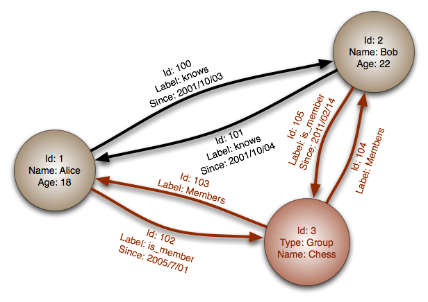
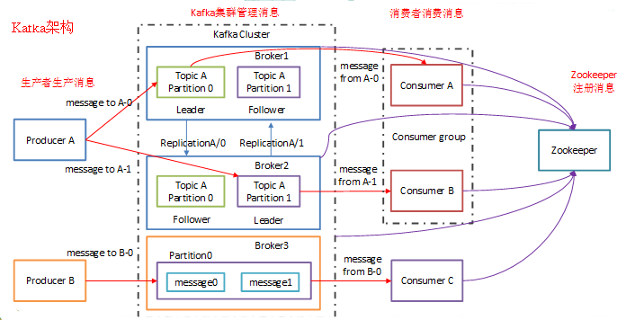
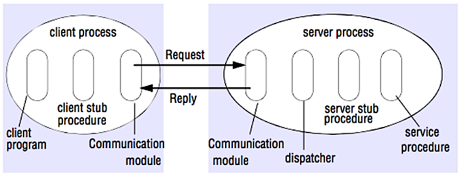

## 关键指标
- 可用性，接口成功率，SLA多少个九来衡量；数据的正确性（一致性）；异常容灾
- 可扩展，是否支持水平扩容？服务扩容？依赖的中间件是否支持水平扩容？
- 性能。低延时latency和高吞吐throughput，在同步系统中一般低延时意味着高吞吐。有些异步接口，需要考虑异步处理逻辑，例如订单和发货系统。
- CAP 理论
- BASE 理论
- 一致模式
  - 最终一致性
  - 强一致性
- [分布式理论：CAP、BASE与ACID](https://monkeysayhi.github.io/2018/03/09/%E5%88%86%E5%B8%83%E5%BC%8F%E7%90%86%E8%AE%BA%EF%BC%9ACAP%E3%80%81BASE%E4%B8%8EACID/)
- 大多数 NoSQL 无法实现真正符合 ACID 的事务，支持[最终一致](#最终一致性)。
**BASE** 通常被用于描述 NoSQL 数据库的特性。相比 [CAP 理论](#cap-理论)，BASE 强调可用性超过一致性。
- **基本可用** - 系统保证可用性。
- **软状态** - 即使没有输入，系统状态也可能随着时间变化。
- **最终一致性** - 经过一段时间之后，系统最终会变一致，因为系统在此期间没有收到任何输入。


## 架构

<p align="center">
  
  <br/>
</p>


## 域名系统

### Amazon Route 53域名系统
<p align="center">
  
  <br/>
  <strong><a href="https://aws.amazon.com/cn/route53">Amazon Route 53 工作原理</a></strong>
</p>


### 域名解析的过程
<p align="center">
  
  <br/>
  <strong><a href="http://www.slideshare.net/srikrupa5/dns-security-presentation-issa">来源：DNS 安全介绍</a></strong>
</p>

域名系统是把 www.example.com 等域名转换成 IP 地址。域名系统是分层次的，一些 DNS 服务器位于顶层。当查询（域名） IP 时，路由或 ISP 提供连接 DNS 服务器的信息。较底层的 DNS 服务器缓存映射，它可能会因为 DNS 传播延时而失效。DNS 结果可以缓存在浏览器或操作系统中一段时间，时间长短取决于[存活时间 TTL](https://en.wikipedia.org/wiki/Time_to_live)。


* **A 记录（地址）** ─ 指定域名对应的 IP 地址记录。
* **CNAME（规范）** ─ 一个域名映射到另一个域名或 `CNAME` 记录（ example.com 指向 www.example.com ）或映射到一个 `A` 记录。
* **NS 记录（域名服务）** ─ 指定解析域名或子域名的 DNS 服务器。
* **MX 记录（邮件交换）** ─ 指定接收信息的邮件服务.

### 域名管理服务
- [Route 53](https://aws.amazon.com/route53/)
- [CloudFlare](https://www.cloudflare.com/dns/)

### 常用命令
- nslookup
- dig

### 来源及延伸阅读
* [DNS 架构](https://technet.microsoft.com/en-us/library/dd197427(v=ws.10).aspx)
* [Wikipedia](https://en.wikipedia.org/wiki/Domain_Name_System)
* [关于 DNS 的文章](https://support.dnsimple.com/categories/dns/)
* [DNS Technical Reference](https://learn.microsoft.com/en-us/previous-versions/windows/it-pro/windows-server-2008-r2-and-2008/dd197461(v=ws.10))


## 内容分发网络（CDN）
<p align="center">
  
  <br/>
  <strong><a href="https://www.creative-artworks.eu/why-use-a-content-delivery-network-cdn/">来源：为什么使用 CDN</a></strong>
</p>

内容分发网络（CDN）是一个全球性的代理服务器分布式网络，它从靠近用户的位置提供内容。通常，HTML/CSS/JS，图片和视频等静态内容由 CDN 提供，虽然亚马逊 CloudFront 等也支持动态内容。CDN 的 DNS 解析会告知客户端连接哪台服务器。

将内容存储在 CDN 上可以从两个方面来提供性能:

* 从靠近用户的数据中心提供资源
* 通过 CDN 你的服务器不必真的处理请求

### CDN 推送（push）

当你服务器上内容发生变动时，推送 CDN 接受新内容。直接推送给 CDN 并重写 URL 地址以指向你的内容的 CDN 地址。你可以配置内容到期时间及何时更新。内容只有在更改或新增是才推送，流量最小化，但储存最大化。

### CDN 拉取（pull）

CDN 拉取是当第一个用户请求该资源时，从服务器上拉取资源。你将内容留在自己的服务器上并重写 URL 指向 CDN 地址。直到内容被缓存在 CDN 上为止，这样请求只会更慢，

[存活时间（TTL）](https://en.wikipedia.org/wiki/Time_to_live)决定缓存多久时间。CDN 拉取方式最小化 CDN 上的储存空间，但如果过期文件并在实际更改之前被拉取，则会导致冗余的流量。

高流量站点使用 CDN 拉取效果不错，因为只有最近请求的内容保存在 CDN 中，流量才能更平衡地分散。

### 缺陷：CDN

* CDN 成本可能因流量而异，可能在权衡之后你将不会使用 CDN。
* 如果在 TTL 过期之前更新内容，CDN 缓存内容可能会过时。
* CDN 需要更改静态内容的 URL 地址以指向 CDN。

### 来源及延伸阅读

* [全球性内容分发网络](http://repository.cmu.edu/cgi/viewcontent.cgi?article=2112&context=compsci)
* [CDN 拉取和 CDN 推送的区别](http://www.travelblogadvice.com/technical/the-differences-between-push-and-pull-cdns/)
* [Wikipedia](https://en.wikipedia.org/wiki/Content_delivery_network)


## 负载均衡器（网关）


<p align="center">
  
  <br/>
</p>

<p align="center">
  
  <br/>
  <strong><a href="http://horicky.blogspot.com/2010/10/scalable-system-design-patterns.html">来源：可扩展的系统设计模式</a></strong>
</p>

负载均衡器将传入的请求分发到应用服务器和数据库等计算资源。无论哪种情况，负载均衡器将从计算资源来的响应返回给恰当的客户端。负载均衡器的效用在于:

* 防止请求进入不好的服务器
* 防止资源过载
* 帮助消除单一的故障点
* **SSL 终结** ─ 解密传入的请求并加密服务器响应，这样的话后端服务器就不必再执行这些潜在高消耗运算了。
* 不需要再每台服务器上安装 [X.509 证书](https://en.wikipedia.org/wiki/X.509)。
* **Session 留存** ─ 如果 Web 应用程序不追踪会话，发出 cookie 并将特定客户端的请求路由到同一实例。
* 通常会设置采用[工作─备用](#工作到备用切换active-passive) 或 [双工作](#双工作切换active-active) 模式的多个负载均衡器，以免发生故障。

负载均衡器能基于多种方式来路由流量:
* 随机
* 最少负载
* Session/cookie
* [轮询调度或加权轮询调度算法](http://g33kinfo.com/info/archives/2657)
* [四层负载均衡](#四层负载均衡)
* [七层负载均衡](#七层负载均衡)

### 四层负载均衡

四层负载均衡根据监看[传输层](#通讯)的信息来决定如何分发请求。通常，这会涉及来源，目标 IP 地址和请求头中的端口，但不包括数据包（报文）内容。四层负载均衡执行[网络地址转换（NAT）](https://www.nginx.com/resources/glossary/layer-4-load-balancing/)来向上游服务器转发网络数据包。

### 七层负载均衡器

七层负载均衡器根据监控[应用层](#通讯)来决定怎样分发请求。这会涉及请求头的内容，消息和 cookie。七层负载均衡器终结网络流量，读取消息，做出负载均衡判定，然后传送给特定服务器。比如，一个七层负载均衡器能直接将视频流量连接到托管视频的服务器，同时将更敏感的用户账单流量引导到安全性更强的服务器。

以损失灵活性为代价，四层负载均衡比七层负载均衡花费更少时间和计算资源，虽然这对现代商用硬件的性能影响甚微。

### 水平扩展

负载均衡器还能帮助水平扩展，提高性能和可用性。使用商业硬件的性价比更高，并且比在单台硬件上**垂直扩展**更贵的硬件具有更高的可用性。相比招聘特定企业系统人才，招聘商业硬件方面的人才更加容易。

#### 缺陷：水平扩展
* 水平扩展引入了复杂度并涉及服务器复制
* 服务器应该是无状态的:它们也不该包含像 session 或资料图片等与用户关联的数据。
* session 可以集中存储在数据库或持久化[缓存](#缓存)（Redis、Memcached）的数据存储区中。
* 缓存和数据库等下游服务器需要随着上游服务器进行扩展，以处理更多的并发连接。

### 缺陷：负载均衡器
* 如果没有足够的资源配置或配置错误，负载均衡器会变成一个性能瓶颈。
* 引入负载均衡器以帮助消除单点故障但导致了额外的复杂性。
* 单个负载均衡器会导致单点故障，但配置多个负载均衡器会进一步增加复杂性。


## 反向代理（web 服务器）
<p align="center">
  
  <br/>
  <strong><a href="https://upload.wikimedia.org/wikipedia/commons/6/67/Reverse_proxy_h2g2bob.svg">资料来源：维基百科</a></strong>
  <br/>
</p>

反向代理是一种可以集中地调用内部服务，并提供统一接口给公共客户的 web 服务器。来自客户端的请求先被反向代理服务器转发到可响应请求的服务器，然后代理再把服务器的响应结果返回给客户端。

带来的好处包括：
- **增加安全性** - 隐藏后端服务器的信息，屏蔽黑名单中的 IP，限制每个客户端的连接数。
- **提高可扩展性和灵活性** - 客户端只能看到反向代理服务器的 IP，这使你可以增减服务器或者修改它们的配置。
- **本地终结 SSL 会话** - 解密传入请求，加密服务器响应，这样后端服务器就不必完成这些潜在的高成本的操作。免除了在每个服务器上安装 [X.509](https://en.wikipedia.org/wiki/X.509) 证书的需要
- **压缩** - 压缩服务器响应
- **缓存** - 直接返回命中的缓存结果
- **静态内容** - 直接提供静态内容
  - HTML/CSS/JS
  - 图片
  - 视频
  - 等等

#### 负载均衡器与反向代理

- 当你有多个服务器时，部署负载均衡器非常有用。通常，负载均衡器将流量路由给一组功能相同的服务器上。
- 即使只有一台 web 服务器或者应用服务器时，反向代理也有用，可以参考上一节介绍的好处。
- NGINX 和 HAProxy 等解决方案可以同时支持第七层反向代理和负载均衡。

#### 不利之处：反向代理

- 引入反向代理会增加系统的复杂度。
- 单独一个反向代理服务器仍可能发生单点故障，配置多台反向代理服务器（如[故障转移](https://en.wikipedia.org/wiki/Failover)）会进一步增加复杂度。

### 来源及延伸阅读
- [反向代理与负载均衡](https://www.nginx.com/resources/glossary/reverse-proxy-vs-load-balancer/)
- [NGINX 架构](https://www.nginx.com/blog/inside-nginx-how-we-designed-for-performance-scale/)
- [HAProxy 架构指南](http://www.haproxy.org/download/1.2/doc/architecture.txt)
- [Wikipedia](https://en.wikipedia.org/wiki/Reverse_proxy)
- [NGINX 架构](https://www.nginx.com/blog/inside-nginx-how-we-designed-for-performance-scale/)
- [HAProxy 架构指南](http://www.haproxy.org/download/1.2/doc/architecture.txt)
- [可扩展性](http://www.lecloud.net/post/7295452622/scalability-for-dummies-part-1-clones)
- [Wikipedia](https://en.wikipedia.org/wiki/Load_balancing_(computing))
- [四层负载平衡](https://www.nginx.com/resources/glossary/layer-4-load-balancing/)
- [七层负载平衡](https://www.nginx.com/resources/glossary/layer-7-load-balancing/)
- [ELB 监听器配置](http://docs.aws.amazon.com/elasticloadbalancing/latest/classic/elb-listener-config.html)
- https://zhuanlan.zhihu.com/p/508672222
- https://cloud.tencent.com/developer/article/1049707


## 应用层网关
<p align="center">
  
  <br/>
  <strong><a href="https://tech.meituan.com/2021/05/20/shepherd-api-gateway.html">百亿规模API网关服务Shepherd的设计与实现</a></strong>
</p>

将 Web 服务层与应用层（也被称作平台层）分离，可以独立缩放和配置这两层。添加新的 API 只需要添加应用服务器，而不必添加额外的 web 服务器。用于完成基础的:
- 参数校验
- 协议转换等
- 鉴权
- 限流
- 监控、日志
- 熔断（错误率较高时，熔断机制）
- 降级策略（比如电商搜索时正常情况下提供搜索+个性化服务，高负载时仅提供搜索服务，非核心功能降级）
- [Shopee Games API 网关设计与实现](https://www.modb.pro/db/474513)
- [百亿规模API网关服务Shepherd的设计与实现](https://tech.meituan.com/2021/05/20/shepherd-api-gateway.html)
- [grpc-gateway](https://github.com/grpc-ecosystem/grpc-gateway)


## 单体服务、微服务、Service Mesh
<p align="center">
  
  <br/>
  <strong><a href="https://www.zhihu.com/question/56125281">什么是服务治理</a></strong>
</p>

- 单体服务（Monolithic Services）：单体服务是指将整个应用程序作为一个单一的、紧密耦合的单元进行开发、部署和运行的架构模式。在单体服务中，应用程序的各个功能模块通常运行在同一个进程中，并共享相同的数据库和资源。单体服务的优点是开发简单、部署方便，但随着业务规模的增长，单体服务可能变得庞大且难以维护。

- 微服务（Microservices）：微服务是一种将应用程序拆分为一组小型、独立部署的服务的架构模式。每个微服务都专注于单个业务功能，并通过轻量级的通信机制（如RESTful API或消息队列）进行相互通信。微服务的优点是灵活性高、可扩展性好，每个微服务可以独立开发、测试、部署和扩展。然而，微服务架构也带来了分布式系统的复杂性和管理的挑战。

- Service Mesh：Service Mesh是一种用于解决微服务架构中服务间通信和治理问题的基础设施层。它通过在服务之间插入一个专用的代理（称为Sidecar）来提供服务间的通信、安全性、可观察性和弹性的功能。Service Mesh可以提供流量管理、负载均衡、故障恢复、安全认证、监控和追踪等功能，而不需要在每个微服务中显式实现这些功能。常见的Service Mesh实现包括Istio、Linkerd和Consul Connect等。


## 微服务
<p align="center">
  
  <br/>
  <strong><a href="https://grpc.io/docs/what-is-grpc/introduction">gRPC 概述</a></strong>
</p>

与此讨论相关的话题是 [微服务](https://en.wikipedia.org/wiki/Microservices)，可以被描述为一系列可以独立部署的小型的，模块化服务。每个服务运行在一个独立的线程中，通过明确定义的轻量级机制通讯，共同实现业务目标。<sup><a href=https://smartbear.com/learn/api-design/what-are-microservices>1</a></sup>例如，Pinterest 可能有这些微服务： 用户资料、关注者、Feed 流、搜索、照片上传等。

### 服务发现
**ZooKeeper**
- ZooKeeper是一个开源的分布式协调服务，最初由雅虎开发并后来成为Apache软件基金会的顶级项目。
- ZooKeeper提供了一个分布式的、高可用的、强一致性的数据存储服务。它的设计目标是为构建分布式系统提供可靠的协调机制。
- ZooKeeper使用基于ZAB（ZooKeeper Atomic Broadcast）协议的一致性算法来保证数据的一致性和可靠性。
- ZooKeeper提供了一个类似于文件系统的层次化命名空间（称为ZNode），可以存储和管理数据，并支持对数据的读写操作。
- ZooKeeper还提供了一些特性，如临时节点、顺序节点和观察者机制，用于实现分布式锁、选举算法和事件通知等。

**etcd**
- etcd是一个开源的分布式键值存储系统，由CoreOS开发并后来成为Cloud Native Computing Foundation（CNCF）的项目之一。
- etcd被设计为一个高可用、可靠的分布式存储系统，用于存储和管理关键的配置数据和元数据。
- etcd使用Raft一致性算法来保证数据的一致性和可靠性，Raft是一种强一致性的分布式共识算法。
- etcd提供了一个简单的键值存储接口，可以存储和检索键值对数据，并支持对数据的原子更新操作。
- etcd还提供了一些高级特性，如目录结构、事务操作和观察者机制，用于构建复杂的分布式系统和应用

- [Etcd](https://coreos.com/etcd/docs/latest) 
- [Zookeeper](https://zookeeper.apache.org) 
- [Consul](https://www.consul.io/docs/index.html)
- [grpc](https://grpc.io/docs)

## Service Mesh
<p align="center">
  
  <br/>
  <strong><a href="https://istio.io/latest/about/service-mesh/">service Mesh 是怎么工作的</a></strong>
</p>


## mysql 数据库
<p align="center">
  
  <br/>
  <strong><a href="https://www.youtube.com/watch?v=w95murBkYmU">资料来源：扩展你的用户数到第一个一千万</a></strong>
</p>


### [延伸思考和学习](./middleware-mysql.md)
- 如何正确建表。类型选择、主键约束、not null、编码方式等
- 外建约束、还是业务约束
- mysql join 还是业务关联等
- 如何使用index优化查询
- 如何使用事物acid
- DDL注意事项
- 是否需呀分库分表
- 历史数据如何处理
- 如何扩展mysql？垂直分、水平分、主备复制、主主复制
- 性能调优？架构优化、索引优化、sql优化、连接池优化、缓存优化


## redis 键值存储系统
<p align="center">
  
</p>

### [延伸思考和学习](./middleware-redis.md)
- redis 五种数据结构
- redis 使用场景。缓存数据、计数器和限流、分布式锁、bloomfilter等
- redis key 过期时间
- redis 存储数据一致性的容忍度
- redis 扩展和分不少方案
- redis 热key和大key问题


## 文档类型存储(es)

<p align="center">
  
</p>

### [延伸思考和学习](./middleware-elasticsearch.md)
- ES index 的mapping结构
- setting 分片和副本机制
- 分词器
- 检索query dsl
- 读写流程
- 集群架构和规划
- 读写优化

## 列型存储(hbase)

<p align="center">
  
  <br/>
  <strong><a href="http://blog.grio.com/2015/11/sql-nosql-a-brief-history.html">资料来源: SQL 和 NoSQL，一个简短的历史</a></strong>
</p>

> 抽象模型：嵌套的 `ColumnFamily<RowKey, Columns<ColKey, Value, Timestamp>>` 映射

类型存储的基本数据单元是列（名／值对）。列可以在列族（类似于 SQL 的数据表）中被分组。超级列族再分组普通列族。你可以使用行键独立访问每一列，具有相同行键值的列组成一行。每个值都包含版本的时间戳用于解决版本冲突。

Google 发布了第一个列型存储数据库 [Bigtable](http://www.read.seas.harvard.edu/~kohler/class/cs239-w08/chang06bigtable.pdf)，它影响了 Hadoop 生态系统中活跃的开源数据库 [HBase](https://www.mapr.com/blog/in-depth-look-hbase-architecture) 和 Facebook 的 [Cassandra](http://docs.datastax.com/en/archived/cassandra/2.0/cassandra/architecture/architectureIntro_c.html)。像 BigTable，HBase 和 Cassandra 这样的存储系统将键以字母顺序存储，可以高效地读取键列。

列型存储具备高可用性和高可扩展性。通常被用于大数据相关存储。

#### 来源及延伸阅读：列型存储

- [SQL 与 NoSQL 简史](http://blog.grio.com/2015/11/sql-nosql-a-brief-history.html)
- [BigTable 架构](http://www.read.seas.harvard.edu/~kohler/class/cs239-w08/chang06bigtable.pdf)
- [Hbase 架构](https://www.mapr.com/blog/in-depth-look-hbase-architecture)
- [Cassandra 架构](http://docs.datastax.com/en/archived/cassandra/2.0/cassandra/architecture/architectureIntro_c.html)

### 图数据库

<p align="center">
  
  <br/>
  <strong><a href="https://en.wikipedia.org/wiki/File:GraphDatabase_PropertyGraph.png"/>资料来源：图数据库</a></strong>
</p>

> 抽象模型： 图

在图数据库中，一个节点对应一条记录，一个弧对应两个节点之间的关系。图数据库被优化用于表示外键繁多的复杂关系或多对多关系。

图数据库为存储复杂关系的数据模型，如社交网络，提供了很高的性能。它们相对较新，尚未广泛应用，查找开发工具或者资源相对较难。许多图只能通过 [REST API](#表述性状态转移rest) 访问。

#### 相关资源和延伸阅读：图
- [图数据库](https://en.wikipedia.org/wiki/Graph_database)
- [Neo4j](https://neo4j.com/)
- [FlockDB](https://blog.twitter.com/2010/introducing-flockdb)

#### 来源及延伸阅读：NoSQL

- [数据库术语解释](http://stackoverflow.com/questions/3342497/explanation-of-base-terminology)
- [NoSQL 数据库 - 调查及决策指南](https://medium.com/baqend-blog/nosql-databases-a-survey-and-decision-guidance-ea7823a822d#.wskogqenq)
- [可扩展性](http://www.lecloud.net/post/7994751381/scalability-for-dummies-part-2-database)
- [NoSQL 介绍](https://www.youtube.com/watch?v=qI_g07C_Q5I)
- [NoSQL 模式](http://horicky.blogspot.com/2009/11/nosql-patterns.html)

### SQL 还是 NoSQL

<p align="center">
  
  <br/>
  <strong><a href="https://www.infoq.com/articles/Transition-RDBMS-NoSQL/">资料来源：从 RDBMS 转换到 NoSQL</a></strong>
</p>

选取 **SQL** 的原因:

- 结构化数据
- 严格的模式
- 关系型数据
- 需要复杂的联结操作
- 事务
- 清晰的扩展模式
- 既有资源更丰富：开发者、社区、代码库、工具等
- 通过索引进行查询非常快

选取 **NoSQL** 的原因：

- 半结构化数据
- 动态或灵活的模式
- 非关系型数据
- 不需要复杂的联结操作
- 存储 TB （甚至 PB）级别的数据
- 高数据密集的工作负载
- IOPS 高吞吐量

适合 NoSQL 的示例数据：

- 埋点数据和日志数据
- 排行榜或者得分数据
- 临时数据，如购物车
- 频繁访问的（“热”）表
- 元数据／查找表

#### 来源及延伸阅读：SQL 或 NoSQL

- [扩展你的用户数到第一个千万](https://www.youtube.com/watch?v=w95murBkYmU)
- [SQL 和 NoSQL 的不同](https://www.sitepoint.com/sql-vs-nosql-differences/)

## 缓存

<p align="center">
  
  <br/>
  <strong><a href="http://horicky.blogspot.com/2010/10/scalable-system-design-patterns.html">资料来源：可扩展的系统设计模式</a></strong>
</p>

缓存可以提高页面加载速度，并可以减少服务器和数据库的负载。在这个模型中，分发器先查看请求之前是否被响应过，如果有则将之前的结果直接返回，来省掉真正的处理。

数据库分片均匀分布的读取是最好的。但是热门数据会让读取分布不均匀，这样就会造成瓶颈，如果在数据库前加个缓存，就会抹平不均匀的负载和突发流量对数据库的影响。

### 缓存级别
- 客户端缓存
缓存可以位于客户端（操作系统或者浏览器），[服务端](#反向代理web-服务器)或者不同的缓存层。
- CDN 缓存，[CDN](#内容分发网络cdn) 也被视为一种缓存。
- Web 服务器缓存
[反向代理](#反向代理web-服务器)和缓存（比如 [Varnish](https://www.varnish-cache.org/)）可以直接提供静态和动态内容。Web 服务器同样也可以缓存请求，返回相应结果而不必连接应用服务器。
- 应用服务缓存(本地缓存)
- 缓存服务器（remote cache）
- 数据库本身的缓存


### 双buffer vs LRU/LFU

<p align="center">
  
</p>

本地缓存的双缓冲机制和本地LRU（Least Recently Used）算法都是常见的缓存优化技术，它们具有不同的优点和缺点。

1. 双缓冲机制：
   - 优点：
     - 提高并发性能：双缓冲机制使用两个缓冲区，一个用于读取数据，另一个用于写入数据。这样可以避免读写冲突，提高了并发性能。
     - 提高数据访问效率：由于读取操作不会直接访问主缓存，而是读取缓冲区的数据，因此可以更快地获取数据。
   - 缺点：
     - 内存开销增加：双缓冲机制需要维护两个缓冲区，这会增加内存开销。
     - 数据延迟：数据更新定时同步，有一定延时。

2. 本地LRU算法：
   - 优点：
     - 数据访问效率高：LRU算法根据数据的访问顺序进行缓存替换，将最近最少使用的数据淘汰出缓存。这样可以保留最常用的数据，提高数据的访问效率。
     - 简单有效：LRU算法的实现相对简单，只需要维护一个访问顺序链表和一个哈希表即可。
   - 缺点：
     - 缓存命中率下降：如果数据的访问模式不符合LRU算法的假设，即最近访问的数据在未来也是最有可能被访问的，那么LRU算法的效果可能不理想，缓存命中率会下降。
     - 对于热点数据不敏感：LRU算法只考虑了最近的访问情况，对于热点数据（频繁访问的数据）可能无法有效地保留在缓存中。

综合来看，双缓冲机制适用于需要提高并发性能、批量更新等场景，但会增加内存开销。本地LRU算法适用于需要提高数据访问效率的场景，但对于访问模式不符合LRU假设的情况下，缓存命中率可能下降。在实际应用中，可以根据具体需求和场景选择适合的缓存优化技术。

### 缓存更新的四种模式

<p align="center">
  
</p>

|  缓存更新方式  |  优缺点  | 
| -- | -- |
| 缓存模式+TTL | 业务代码只更新DB，不更新cache，设置较短的TTL(通常分钟级），依靠cache过期无法找到key时回源DB，热key过期可能回导致请求大量请求击穿到DB，需要使用分布式锁或者singleflight等方式避免这种问题 |
| 定时刷新模式 | 定时任务异步获取DB数据刷新到cache，读请求可不回源，需要考虑刷新时间和批量读写 |
| 写DB,写cache | 在并发条件下，DB写操作顺序和cache操作不同保证顺序一致性，需要增加分布式锁等操作 |
| 写DB，删除cache| 删除cache可能失败，需要增加重试，重试也可能失败，比较复杂的加个MQ补偿重试 |


#### 思考：
- 对一致性要求有多强？
- TTL 设置的时长
- 并发冲突可能性
- 热key缓存击穿保护


## 异步

<p align="center">
  
  <br/>
  <strong><a href=http://lethain.com/introduction-to-architecting-systems-for-scale/#platform_layer>资料来源：可缩放系统构架介绍</a></strong>
</p>

异步工作流有助于减少那些原本顺序执行的请求时间。它们可以通过提前进行一些耗时的工作来帮助减少请求时间，比如定期汇总数据。

### 消息队列

<p align="center">
  
</p>

消息队列接收，保留和传递消息。如果按顺序执行操作太慢的话，你可以使用有以下工作流的消息队列：
- 应用程序将作业发布到队列，然后通知用户作业状态
- 一个 worker 从队列中取出该作业，对其进行处理，然后显示该作业完成
不去阻塞用户操作，作业在后台处理。在此期间，客户端可能会进行一些处理使得看上去像是任务已经完成了。例如，如果要发送一条推文，推文可能会马上出现在你的时间线上，但是可能需要一些时间才能将你的推文推送到你的所有关注者那里去。
- **kafka** 是一个令人满意的简单的消息代理，但是消息有可能会丢失。
- **RabbitMQ** 很受欢迎但是要求你适应「AMQP」协议并且管理你自己的节点。
- **Apache Pulsar** Pulsar是一个开源的、可扩展的消息队列和流处理平台。它具有高吞吐量、低延迟和可持久化的特点，支持多租户、多数据中心和多协议等功能


### 任务队列 （xxl-job)
<p align="center">
  
  <br/>
  <strong><a href=https://www.xuxueli.com/xxl-job/#5.3.3%20%E6%9E%B6%E6%9E%84%E5%9B%BE>资料来源：xxl-job系统构架介绍</a></strong>
</p>

如果队列开始明显增长，那么队列大小可能会超过内存大小，导致高速缓存未命中，磁盘读取，甚至性能更慢。[背压](http://mechanical-sympathy.blogspot.com/2012/05/apply-back-pressure-when-overloaded.html)可以通过限制队列大小来帮助我们，从而为队列中的作业保持高吞吐率和良好的响应时间。一旦队列填满，客户端将得到服务器忙或者 HTTP 503 状态码，以便稍后重试。客户端可以在稍后时间重试该请求，也许是[指数退避](https://en.wikipedia.org/wiki/Exponential_backoff)

### 延时任务调度

<p align="center">
  
  <br/>
  <strong><a href=https://github.com/bitleak/lmstfy?tab=readme-ov-file>资料来源：lmstfy github</a></strong>
</p>

#### 延时任务场景
- 延时处理：有时候需要在某个事件发生后的一段时间内执行任务。例如，当用户提交订单后，可以设置一个延时任务，在一段时间后检查是否是支付
- 提醒和通知：延时任务调度可用于发送提醒和通知。例如，你可以设置一个延时任务，在用户注册后的24小时内发送一封欢迎邮件，或在用户下单后的一段时间内发送订单确认通知。
- 缓存刷新：延时任务调度可用于刷新缓存数据。当缓存过期时，可以设置一个延时任务，在一定的延时时间后重新加载缓存数据，以保持数据的新鲜性

#### 可用组件
- redis 包括有序集合（Sorted Set）你可以使用Redis的有序集合来实现延时任务队列。将任务的执行时间作为分数（score），任务的内容作为成员（member），将任务按照执行时间排序。通过定期轮询有序集合，检查是否有任务的执行时间到达，然后执行相应的任务
- https://github.com/bitleak/lmstfy


## 通讯
<p align="center">
  
  <br/>
  <strong><a href=http://www.escotal.com/osilayer.html>资料来源：OSI 7层模型</a></strong>
</p>

### 超文本传输协议（HTTPS/HTTP1.1/HTTP2/HTTP3）

HTTP 是一种在客户端和服务器之间编码和传输数据的方法。它是一个请求/响应协议：客户端和服务端针对相关内容和完成状态信息的请求和响应。HTTP 是独立的，允许请求和响应流经许多执行负载均衡，缓存，加密和压缩的中间路由器和服务器。

一个基本的 HTTP 请求由一个动词（方法）和一个资源（端点）组成。 以下是常见的 HTTP 动词：

| 动词     | 描述             | *幂等  | 安全性  | 可缓存            |
| ------ | -------------- | ---- | ---- | -------------- |
| GET    | 读取资源           | Yes  | Yes  | Yes            |
| POST   | 创建资源或触发处理数据的进程 | No   | No   | Yes，如果回应包含刷新信息 |
| PUT    | 创建或替换资源        | Yes  | No   | No             |
| PATCH  | 部分更新资源         | No   | No   | Yes，如果回应包含刷新信息 |
| DELETE | 删除资源           | Yes  | No   | No             |


**多次执行不会产生不同的结果**。

HTTP 是依赖于较低级协议（如 **TCP** 和 **UDP**）的应用层协议。

#### 来源及延伸阅读：HTTP

* [README](https://www.quora.com/What-is-the-difference-between-HTTP-protocol-and-TCP-protocol)    +
* [HTTP 是什么？](https://www.nginx.com/resources/glossary/http/)
* [HTTP 和 TCP 的区别](https://www.quora.com/What-is-the-difference-between-HTTP-protocol-and-TCP-protocol)
* [PUT 和 PATCH的区别](https://laracasts.com/discuss/channels/general-discussion/whats-the-differences-between-put-and-patch?page=1)

### 传输控制协议（TCP）

<p align="center">
  
  <br/>
  <strong><a href="http://www.wildbunny.co.uk/blog/2012/10/09/how-to-make-a-multi-player-game-part-1/">资料来源：如何制作多人游戏</a></strong>
</p>

TCP 是通过 [IP 网络](https://en.wikipedia.org/wiki/Internet_Protocol)的面向连接的协议。 使用[握手](https://en.wikipedia.org/wiki/Handshaking)建立和断开连接。 发送的所有数据包保证以原始顺序到达目的地，用以下措施保证数据包不被损坏：

- 每个数据包的序列号和[校验码](https://en.wikipedia.org/wiki/Transmission_Control_Protocol#Checksum_computation)。
- [确认包](https://en.wikipedia.org/wiki/Acknowledgement_(data_networks))和自动重传

如果发送者没有收到正确的响应，它将重新发送数据包。如果多次超时，连接就会断开。TCP 实行[流量控制](https://en.wikipedia.org/wiki/Flow_control_(data))和[拥塞控制](https://en.wikipedia.org/wiki/Network_congestion#Congestion_control)。这些确保措施会导致延迟，而且通常导致传输效率比 UDP 低。

为了确保高吞吐量，Web 服务器可以保持大量的 TCP 连接，从而导致高内存使用。在 Web 服务器线程间拥有大量开放连接可能开销巨大，消耗资源过多，也就是说，一个 [memcached](#memcached) 服务器。[连接池](https://en.wikipedia.org/wiki/Connection_pool) 可以帮助除了在适用的情况下切换到 UDP。

TCP  对于需要高可靠性但时间紧迫的应用程序很有用。比如包括 Web 服务器，数据库信息，SMTP，FTP 和 SSH。

以下情况使用 TCP 代替 UDP：

- 你需要数据完好无损。
- 你想对网络吞吐量自动进行最佳评估。

### 用户数据报协议（UDP）

<p align="center">
  
  <br/>
  <strong><a href="http://www.wildbunny.co.uk/blog/2012/10/09/how-to-make-a-multi-player-game-part-1">资料来源：如何制作多人游戏</a></strong>
</p>

UDP 是无连接的。数据报（类似于数据包）只在数据报级别有保证。数据报可能会无序的到达目的地，也有可能会遗失。UDP 不支持拥塞控制。虽然不如 TCP 那样有保证，但 UDP 通常效率更高。

UDP 可以通过广播将数据报发送至子网内的所有设备。这对 [DHCP](https://en.wikipedia.org/wiki/Dynamic_Host_Configuration_Protocol) 很有用，因为子网内的设备还没有分配 IP 地址，而 IP 对于 TCP 是必须的。

UDP 可靠性更低但适合用在网络电话、视频聊天，流媒体和实时多人游戏上。

以下情况使用 UDP 代替 TCP：

* 你需要低延迟
* 相对于数据丢失更糟的是数据延迟
* 你想实现自己的错误校正方法

#### 来源及延伸阅读：TCP 与 UDP

* [游戏编程的网络](http://gafferongames.com/networking-for-game-programmers/udp-vs-tcp/)
* [TCP 与 UDP 的关键区别](http://www.cyberciti.biz/faq/key-differences-between-tcp-and-udp-protocols/)
* [TCP 与 UDP 的不同](http://stackoverflow.com/questions/5970383/difference-between-tcp-and-udp)
* [传输控制协议](https://en.wikipedia.org/wiki/Transmission_Control_Protocol)
* [用户数据报协议](https://en.wikipedia.org/wiki/User_Datagram_Protocol)
* [Memcache 在 Facebook 的扩展](http://www.cs.bu.edu/~jappavoo/jappavoo.github.com/451/papers/memcache-fb.pdf)

### 远程过程调用协议（RPC）

<p align="center">
  
  <br/>
  <strong><a href="http://www.puncsky.com/blog/2016/02/14/crack-the-system-design-interview">Source: Crack the system design interview</a></strong>
</p>

在 RPC 中，客户端会去调用另一个地址空间（通常是一个远程服务器）里的方法。调用代码看起来就像是调用的是一个本地方法，客户端和服务器交互的具体过程被抽象。远程调用相对于本地调用一般较慢而且可靠性更差，因此区分两者是有帮助的。热门的 RPC 框架包括 [Protobuf](https://developers.google.com/protocol-buffers/)、[Thrift](https://thrift.apache.org/) 和 [Avro](https://avro.apache.org/docs/current/)。

RPC 是一个“请求-响应”协议：

* **客户端程序** ── 调用客户端存根程序。就像调用本地方法一样，参数会被压入栈中。
* **客户端 stub 程序** ── 将请求过程的 id 和参数打包进请求信息中。
* **客户端通信模块** ── 将信息从客户端发送至服务端。
* **服务端通信模块** ── 将接受的包传给服务端存根程序。
* **服务端 stub 程序** ── 将结果解包，依据过程 id 调用服务端方法并将参数传递过去。

RPC 调用示例：

```
GET /someoperation?data=anId

POST /anotheroperation
{
  "data":"anId";
  "anotherdata": "another value"
}
```

RPC 专注于暴露方法。RPC 通常用于处理内部通讯的性能问题，这样你可以手动处理本地调用以更好的适应你的情况。


当以下情况时选择本地库（也就是 SDK）：

* 你知道你的目标平台。
* 你想控制如何访问你的“逻辑”。
* 你想对发生在你的库中的错误进行控制。
* 性能和终端用户体验是你最关心的事。

遵循 **REST** 的 HTTP API 往往更适用于公共 API。

#### 缺点：RPC

* RPC 客户端与服务实现捆绑地很紧密。
* 一个新的 API 必须在每一个操作或者用例中定义。
* RPC 很难调试。
* 你可能没办法很方便的去修改现有的技术。举个例子，如果你希望在 [Squid](http://www.squid-cache.org/) 这样的缓存服务器上确保 [RPC 被正确缓存](http://etherealbits.com/2012/12/debunking-the-myths-of-rpc-rest/)的话可能需要一些额外的努力了。

### 表述性状态转移（REST）

REST 是一种强制的客户端/服务端架构设计模型，客户端基于服务端管理的一系列资源操作。服务端提供修改或获取资源的接口。所有的通信必须是无状态和可缓存的。

RESTful 接口有四条规则：

* **标志资源（HTTP 里的 URI）** ── 无论什么操作都使用同一个 URI。
* **表示的改变（HTTP 的动作）** ── 使用动作, headers 和 body。
* **可自我描述的错误信息（HTTP 中的 status code）** ── 使用状态码，不要重新造轮子。
* **[HATEOAS](http://restcookbook.com/Basics/hateoas/)（HTTP 中的HTML 接口）** ── 你的 web 服务器应该能够通过浏览器访问。

REST 请求的例子：

```
GET /someresources/anId

PUT /someresources/anId
{"anotherdata": "another value"}
```

REST 关注于暴露数据。它减少了客户端／服务端的耦合程度，经常用于公共 HTTP API 接口设计。REST 使用更通常与规范化的方法来通过 URI 暴露资源，[通过 header 来表述](https://github.com/for-GET/know-your-http-well/blob/master/headers.md)并通过 GET、POST、PUT、DELETE 和 PATCH 这些动作来进行操作。因为无状态的特性，REST 易于横向扩展和隔离。

#### 缺点：REST

* 由于 REST 将重点放在暴露数据，所以当资源不是自然组织的或者结构复杂的时候它可能无法很好的适应。举个例子，返回过去一小时中与特定事件集匹配的更新记录这种操作就很难表示为路径。使用 REST，可能会使用 URI 路径，查询参数和可能的请求体来实现。
* REST 一般依赖几个动作（GET、POST、PUT、DELETE 和 PATCH），但有时候仅仅这些没法满足你的需要。举个例子，将过期的文档移动到归档文件夹里去，这样的操作可能没法简单的用上面这几个 verbs 表达。
* 为了渲染单个页面，获取被嵌套在层级结构中的复杂资源需要客户端，服务器之间多次往返通信。例如，获取博客内容及其关联评论。对于使用不确定网络环境的移动应用来说，这些多次往返通信是非常麻烦的。
* 随着时间的推移，更多的字段可能会被添加到 API 响应中，较旧的客户端将会接收到所有新的数据字段，即使是那些它们不需要的字段，结果它会增加负载大小并引起更大的延迟。

### RPC 与 REST 比较

| 操作          | RPC                                      | REST                                     |
| ----------- | ---------------------------------------- | ---------------------------------------- |
| 注册          | **POST** /signup                         | **POST** /persons                        |
| 注销          | **POST** /resign<br/>{<br/>"personid": "1234"<br/>} | **DELETE** /persons/1234                 |
| 读取用户信息      | **GET** /readPerson?personid=1234        | **GET** /persons/1234                    |
| 读取用户物品列表    | **GET** /readUsersItemsList?personid=1234 | **GET** /persons/1234/items              |
| 向用户物品列表添加一项 | **POST** /addItemToUsersItemsList<br/>{<br/>"personid": "1234";<br/>"itemid": "456"<br/>} | **POST** /persons/1234/items<br/>{<br/>"itemid": "456"<br/>} |
| 更新一个物品      | **POST** /modifyItem<br/>{<br/>"itemid": "456";<br/>"key": "value"<br/>} | **PUT** /items/456<br/>{<br/>"key": "value"<br/>} |
| 删除一个物品      | **POST** /removeItem<br/>{<br/>"itemid": "456"<br/>} | **DELETE** /items/456                    |

<p align="center">
  <strong><a href="https://apihandyman.io/do-you-really-know-why-you-prefer-rest-over-rpc">资料来源：你真的知道你为什么更喜欢 REST 而不是 RPC 吗</a></strong>
</p>

#### 来源及延伸阅读：REST 与 RPC

* [你真的知道你为什么更喜欢 REST 而不是 RPC 吗](https://apihandyman.io/do-you-really-know-why-you-prefer-rest-over-rpc/)
* [什么时候 RPC 比 REST 更合适？](http://programmers.stackexchange.com/a/181186)
* [REST vs JSON-RPC](http://stackoverflow.com/questions/15056878/rest-vs-json-rpc)
* [揭开 RPC 和 REST 的神秘面纱](http://etherealbits.com/2012/12/debunking-the-myths-of-rpc-rest/)
* [使用 REST 的缺点是什么](https://www.quora.com/What-are-the-drawbacks-of-using-RESTful-APIs)
* [破解系统设计面试](http://www.puncsky.com/blog/2016-02-13-crack-the-system-design-interview)
* [Thrift](https://code.facebook.com/posts/1468950976659943/)
- [为什么在内部使用 REST 而不是 RPC](http://arstechnica.com/civis/viewtopic.php?t=1190508)

## 安全
这一部分需要更多内容。[一起来吧](#贡献)！
安全是一个宽泛的话题。除非你有相当的经验、安全方面背景或者正在申请的职位要求安全知识，你不需要了解安全基础知识以外的内容：
* 在运输和等待过程中加密
* 对所有的用户输入和从用户那里发来的参数进行处理以防止 [XSS](https://en.wikipedia.org/wiki/Cross-site_scripting) 和 [SQL 注入](https://en.wikipedia.org/wiki/SQL_injection)。
* 使用参数化的查询来防止 SQL 注入。
* 使用[最小权限原则](https://en.wikipedia.org/wiki/Principle_of_least_privilege)。

### 来源及延伸阅读

* [为开发者准备的安全引导](https://github.com/FallibleInc/security-guide-for-developers)
* [OWASP top ten](https://www.owasp.org/index.php/OWASP_Top_Ten_Cheat_Sheet)

## 附录

一些时候你会被要求做出保守估计。比如，你可能需要估计从磁盘中生成 100 张图片的缩略图需要的时间或者一个数据结构需要多少的内存。**2 的次方表**和**每个开发者都需要知道的一些时间数据**（译注：OSChina 上有这篇文章的[译文](https://www.oschina.net/news/30009/every-programmer-should-know)）都是一些很方便的参考资料。

### 2 的次方表

```
Power           Exact Value         Approx Value        Bytes
---------------------------------------------------------------
7                             128
8                             256
10                           1024   1 thousand           1 KB
16                         65,536                       64 KB
20                      1,048,576   1 million            1 MB
30                  1,073,741,824   1 billion            1 GB
32                  4,294,967,296                        4 GB
40              1,099,511,627,776   1 trillion           1 TB
```

#### 来源及延伸阅读

* [2 的次方](https://en.wikipedia.org/wiki/Power_of_two)

### 每个程序员都应该知道的延迟数

```
Latency Comparison Numbers
--------------------------
L1 cache reference                           0.5 ns
Branch mispredict                            5   ns
L2 cache reference                           7   ns                      14x L1 cache
Mutex lock/unlock                           25   ns
Main memory reference                      100   ns                      20x L2 cache, 200x L1 cache
Compress 1K bytes with Zippy            10,000   ns       10 us
Send 1 KB bytes over 1 Gbps network     10,000   ns       10 us
Read 4 KB randomly from SSD*           150,000   ns      150 us          ~1GB/sec SSD
Read 1 MB sequentially from memory     250,000   ns      250 us
Round trip within same datacenter      500,000   ns      500 us
Read 1 MB sequentially from SSD*     1,000,000   ns    1,000 us    1 ms  ~1GB/sec SSD, 4X memory
Disk seek                           10,000,000   ns   10,000 us   10 ms  20x datacenter roundtrip
Read 1 MB sequentially from 1 Gbps  10,000,000   ns   10,000 us   10 ms  40x memory, 10X SSD
Read 1 MB sequentially from disk    30,000,000   ns   30,000 us   30 ms 120x memory, 30X SSD
Send packet CA->Netherlands->CA    150,000,000   ns  150,000 us  150 ms

Notes
-----
1 ns = 10^-9 seconds
1 us = 10^-6 seconds = 1,000 ns
1 ms = 10^-3 seconds = 1,000 us = 1,000,000 ns
```

基于上述数字的指标：
* 从磁盘以 30 MB/s 的速度顺序读取
* 以 100 MB/s 从 1 Gbps 的以太网顺序读取
* 从 SSD 以 1 GB/s 的速度读取
* 以 4 GB/s 的速度从主存读取
* 每秒能绕地球 6-7 圈
* 数据中心内每秒有 2,000 次往返

#### 延迟数可视化


#### 来源及延伸阅读

* [每个程序员都应该知道的延迟数 — 1](https://gist.github.com/jboner/2841832)
* [每个程序员都应该知道的延迟数 — 2](https://gist.github.com/hellerbarde/2843375)
* [关于建设大型分布式系统的的设计方案、课程和建议](http://www.cs.cornell.edu/projects/ladis2009/talks/dean-keynote-ladis2009.pdf)
* [关于建设大型可拓展分布式系统的软件工程咨询](https://static.googleusercontent.com/media/research.google.com/en//people/jeff/stanford-295-talk.pdf)

### 其它的系统设计面试题

> 常见的系统设计面试问题，给出了如何解决的方案链接
| 问题                      | 引用                                       |
| ----------------------- | ---------------------------------------- |
| 设计类似于 Dropbox 的文件同步服务   | [youtube.com](https://www.youtube.com/watch?v=PE4gwstWhmc) |
| 设计类似于 Google 的搜索引擎      | [queue.acm.org](http://queue.acm.org/detail.cfm?id=988407)<br/>[stackexchange.com](http://programmers.stackexchange.com/questions/38324/interview-question-how-would-you-implement-google-search)<br/>[ardendertat.com](http://www.ardendertat.com/2012/01/11/implementing-search-engines/)<br/>[stanford.edu](http://infolab.stanford.edu/~backrub/google.html) |
| 设计类似于 Google 的可扩展网络爬虫   | [quora.com](https://www.quora.com/How-can-I-build-a-web-crawler-from-scratch) |
| 设计 Google 文档            | [code.google.com](https://code.google.com/p/google-mobwrite/)<br/>[neil.fraser.name](https://neil.fraser.name/writing/sync/) |
| 设计类似 Redis 的键值存储        | [slideshare.net](http://www.slideshare.net/dvirsky/introduction-to-redis) |
| 设计类似 Memcached 的缓存系统    | [slideshare.net](http://www.slideshare.net/oemebamo/introduction-to-memcached) |
| 设计类似亚马逊的推荐系统            | [hulu.com](http://tech.hulu.com/blog/2011/09/19/recommendation-system.html)<br/>[ijcai13.org](http://ijcai13.org/files/tutorial_slides/td3.pdf) |
| 设计类似 Bitly 的短链接系统       | [n00tc0d3r.blogspot.com](http://n00tc0d3r.blogspot.com/) |
| 设计类似 WhatsApp 的聊天应用     | [highscalability.com](http://highscalability.com/blog/2014/2/26/the-whatsapp-architecture-facebook-bought-for-19-billion.html) |
| 设计类似 Instagram 的图片分享系统  | [highscalability.com](http://highscalability.com/flickr-architecture)<br/>[highscalability.com](http://highscalability.com/blog/2011/12/6/instagram-architecture-14-million-users-terabytes-of-photos.html) |
| 设计 Facebook 的新闻推荐方法     | [quora.com](http://www.quora.com/What-are-best-practices-for-building-something-like-a-News-Feed)<br/>[quora.com](http://www.quora.com/Activity-Streams/What-are-the-scaling-issues-to-keep-in-mind-while-developing-a-social-network-feed)<br/>[slideshare.net](http://www.slideshare.net/danmckinley/etsy-activity-feeds-architecture) |
| 设计 Facebook 的时间线系统      | [facebook.com](https://www.facebook.com/note.php?note_id=10150468255628920)<br/>[highscalability.com](http://highscalability.com/blog/2012/1/23/facebook-timeline-brought-to-you-by-the-power-of-denormaliza.html) |
| 设计 Facebook 的聊天系统       | [erlang-factory.com](http://www.erlang-factory.com/upload/presentations/31/EugeneLetuchy-ErlangatFacebook.pdf)<br/>[facebook.com](https://www.facebook.com/note.php?note_id=14218138919&id=9445547199&index=0) |
| 设计类似 Facebook 的图表搜索系统   | [facebook.com](https://www.facebook.com/notes/facebook-engineering/under-the-hood-building-out-the-infrastructure-for-graph-search/10151347573598920)<br/>[facebook.com](https://www.facebook.com/notes/facebook-engineering/under-the-hood-indexing-and-ranking-in-graph-search/10151361720763920)<br/>[facebook.com](https://www.facebook.com/notes/facebook-engineering/under-the-hood-the-natural-language-interface-of-graph-search/10151432733048920) |
| 设计类似 CloudFlare 的内容传递网络 | [cmu.edu](http://repository.cmu.edu/cgi/viewcontent.cgi?article=2112&context=compsci) |
| 设计类似 Twitter 的热门话题系统    | [michael-noll.com](http://www.michael-noll.com/blog/2013/01/18/implementing-real-time-trending-topics-in-storm/)<br/>[snikolov .wordpress.com](http://snikolov.wordpress.com/2012/11/14/early-detection-of-twitter-trends/) |
| 设计一个随机 ID 生成系统          | [blog.twitter.com](https://blog.twitter.com/2010/announcing-snowflake)<br/>[github.com](https://github.com/twitter/snowflake/) |
| 返回一定时间段内次数前 k 高的请求      | [ucsb.edu](https://icmi.cs.ucsb.edu/research/tech_reports/reports/2005-23.pdf)<br/>[wpi.edu](http://davis.wpi.edu/xmdv/docs/EDBT11-diyang.pdf) |
| 设计一个数据源于多个数据中心的服务系统     | [highscalability.com](http://highscalability.com/blog/2009/8/24/how-google-serves-data-from-multiple-datacenters.html) |
| 设计一个多人网络卡牌游戏            | [indieflashblog.com](https://web.archive.org/web/20180929181117/http://www.indieflashblog.com/how-to-create-an-asynchronous-multiplayer-game.html)<br/>[buildnewgames.com](http://buildnewgames.com/real-time-multiplayer/) |
| 设计一个垃圾回收系统              | [stuffwithstuff.com](http://journal.stuffwithstuff.com/2013/12/08/babys-first-garbage-collector/)<br/>[washington.edu](http://courses.cs.washington.edu/courses/csep521/07wi/prj/rick.pdf) |
| 添加更多的系统设计问题             | [贡献](#贡献)              |

### 真实架构

> 关于现实中真实的系统是怎么设计的文章。

<p align="center">
  
  <br/>
  <strong><a href="https://www.infoq.com/presentations/Twitter-Timeline-Scalability">Source: Twitter timelines at scale</a></strong>
</p>


## Gin web 
我们先思考下，一个完整的Web开发框架需要做哪些事情
- server，作为server，监听端口，接受请求
- router 路由和分组路由，可以把请求路由到对应的处理函数
- middleware 支持中间件，对外部发过来的http请求经过中间件处理，再给到对应的处理函数。例如http请求的日志记录、请求鉴权(比如校验token)、CORS支持、CSRF校验等。
- Crash-free：崩溃恢复，Gin可以捕捉运行期处理http请求过程中的panic并且做recover操作，让服务一直可用。
- JSON validation：JSON验证。Gin可以解析和验证request里的JSON内容，比如字段必填等。当然开发人员也可以选择使用第三方的JSON validation工具，比如[beego validation](https://github.com/beego/beego/tree/develop/core/validation)。
- Error management：错误管理。Gin提供了一种简单的方式可以收集http request处理过程中的错误，最终中间件可以选择把这些错误写入到log文件、数据库或者发送到其它系统。
- Middleware Extendtable：可以自定义中间件。Gin除了自带的官方中间件之外，还支持用户自定义中间件，甚至可以把自己开发的中间件提交到[官方代码仓库](https://github.com/gin-gonic/contrib)里。

参考：
- [web 框架比较](https://github.com/jincheng9/go-tutorial/tree/main/workspace/gin/01)
- https://github.com/gin-gonic/gin
- https://github.com/gin-gonic/contrib


## 任务调度
### 单点调度：https://github.com/robfig/cron
### 分布式调度：https://github.com/xuxueli/xxl-job
将调度行为抽象形成“调度中心”公共平台，而平台自身并不承担业务逻辑，“调度中心”负责发起调度请求。将任务抽象成分散的JobHandler，交由“执行器”统一管理，“执行器”负责接收调度请求并执行对应的JobHandler中业务逻辑。因此，“调度”和“任务”两部分可以相互解耦，提高系统整体稳定性和扩展性
- 调度模块（调度中心）：
负责管理调度信息，按照调度配置发出调度请求，自身不承担业务代码。调度系统与任务解耦，提高了系统可用性和稳定性，同时调度系统性能不再受限于任务模块；
支持可视化、简单且动态的管理调度信息，包括任务新建，更新，删除，GLUE开发和任务报警等，所有上述操作都会实时生效，同时支持监控调度结果以及执行日志，支持执行器Failover。
- 执行模块（执行器，executor）：
负责接收调度请求并执行任务逻辑。任务模块专注于任务的执行等操作，开发和维护更加简单和高效；
接收“调度中心”的执行请求、终止请求和日志请求等

参考：
- https://www.xuxueli.com/xxl-job/
- https://github.com/mousycoder/xxl-job-go-sdk


## zookeeper
Zookeeper是一个高性能、分布式的开源的协作服务；
提供一系列简单的功能，分布式应用可以在此基础上实现例如数据发布/订阅、负载均衡、命名服务、分布式协调/通知、集群管理、Leader选举、分布式锁和分布式队列等。常用的场景：
- 命名服务（Name Service）
- 配置中心
- 分布式锁
- 集群管理

参考：
1. [zookeeper介绍与使用场景](https://juejin.cn/post/6911981919974457358)
2. [golang 操作zookeeper](https://www.cnblogs.com/zhichaoma/p/12640064.html)
3. https://zookeeper.apache.org/
4. https://github.com/go-zookeeper/zk
5. 服务发现 zk https://blog.csdn.net/zyhlwzy/article/details/101847565


## 延时队列

任务队列跟消息队列在使用场景上最大的区别是： 任务之间是没有顺序约束而消息要求顺序(FIFO)，且可能会对任务的状态更新而消息一般只会消费不会更新。 类似 Kafka 利用消息 FIFO 和不需要更新(不需要对消息做索引)的特性来设计消息存储，将消息读写变成磁盘的顺序读写来实现比较好的性能。而任务队列需要能够任务状态进行更新则需要对每个消息进行索引，如果把两者放到一起实现则很难实现在功能和性能上兼得。比如一下场景：
- 定时任务，如每天早上 8 点开始推送消息，定期删除过期数据等
- 任务流，如自动创建 Redis 流程由资源创建，资源配置，DNS 修改等部分组成，使用任务队列可以简化整体的设计和重试流程
- 重试任务，典型场景如离线图片处理


参考：
- 延时队列
- https://juejin.cn/post/7000189281641693192
- https://github.com/bitleak/lmstfy


## backoff 服务异常重试-指数退避算法
在wiki当中对指数退避算法的介绍是：“In a variety of computer networks, binary exponential backoff or truncated binary exponential backoff refers to an algorithm used to space out repeated retransmissions of the same block of data, often as part of network congestion avoidance.”

翻译成中文的意思大概是“在各种的计算机网络中，二进制指数后退或是截断的二进制指数后退使用于一种隔离同一数据块重复传输的算法，常常做为网络避免冲突的一部分”

比如说在我们的服务调用过程中发生了调用失败，系统要对失败的资源进行重试，那么这个重试的时间如何把握，使用指数退避算法我们可以在某一范围内随机对失败的资源发起重试，并且随着失败次数的增加长，重试时间也会随着指数的增加而增加。

当然，指数退避算法并没有人上面说的那么简单，想具体了解的可以具体wiki上的介绍
参考：
- https://en.wikipedia.org/wiki/Exponential_backoff
- github golang 实现：https://github.com/cenkalti/backoff
- https://github.com/cenkalti/backoff


## 限流器 ratelimit
| 实现方式 | 优缺点 | 居中对齐 |
| :-----| :----: | :----: |
| 计数器 | 实现简单，计数器算法容易出现不平滑的情况，瞬间的 qps 有可能超过系统的承载 | 单元格 |
| 令牌桶 | 生成令牌的速度是恒定的，而请求去拿令牌是没有速度限制的。允许统一时刻有一定程度的并发，常用于服务端保护自身| 单元格 |
| 漏桶算 | 单元格 | 单元格 |


## 监控平台
- prometheus,https://prometheus.io/
- grafna,https://www.google.com.hk/search?q=grafana&rlz=1C5GCEM_enCN985CN985&oq=grafana&aqs=chrome..69i57j69i60l3j69i65l3j69i60.8511j0j7&sourceid=chrome&ie=UTF-8


## CI/CD和SRE运维
- jenkins
- docker
- Kubernetes [Kubernetes 入门&进阶实战](https://zhuanlan.zhihu.com/p/339008746)
- 虚拟机与容器的区别？虚拟机需要多一层guestos，隔离更好，一把是用户级别的隔离。而docker则是应用级别的隔离，共享宿主机操作系统。


## 大数据存储和计算
- spark
- spark streaming
- hive
- presto
- Lambda 和 Kappa 架构简介：https://libertydream.github.io/2020/04/12/lambda-%E5%92%8C-kappa-%E7%AE%80%E4%BB%8B/


## 系统设计文档和架构图
- 方案设计与写作
- 方案模版
- 画架构图
- 数据
- 系统和架构设计
- https://wxquare.github.io/2022/05/20/C++/system-design-and-framework-basic/
- 英语能力
- 好用工具


