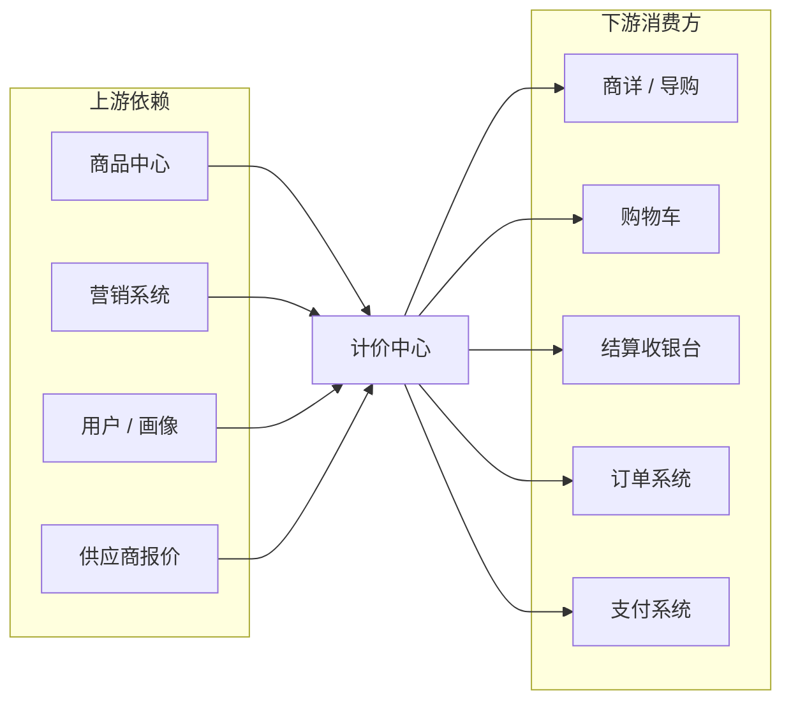
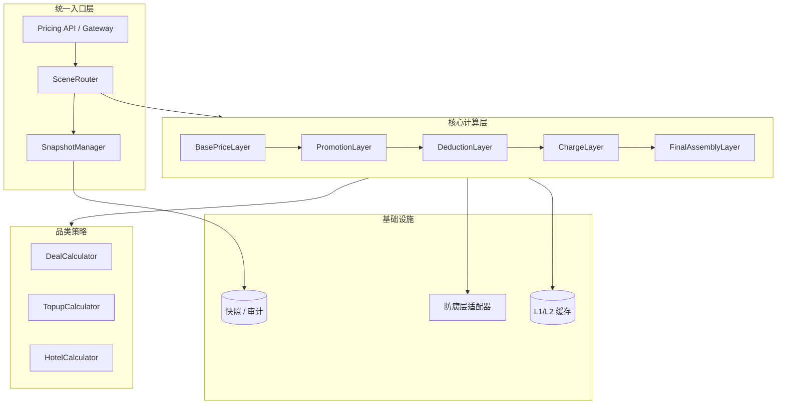
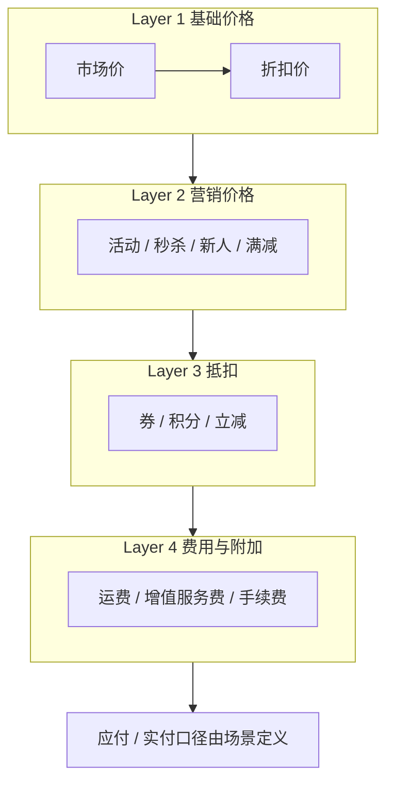
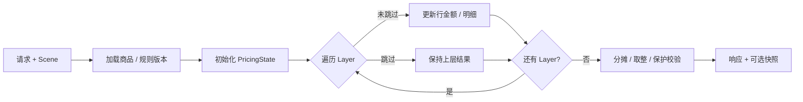
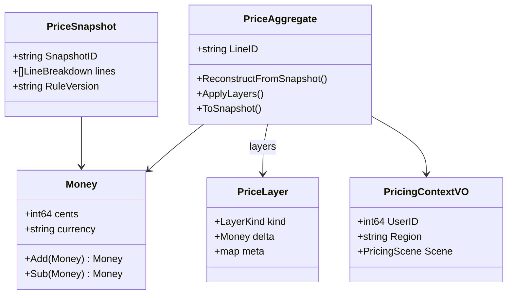
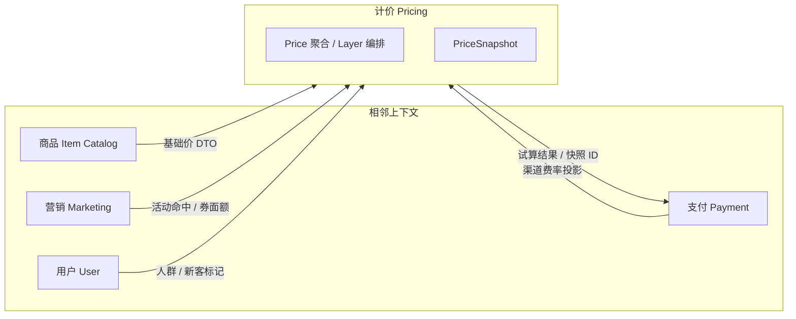
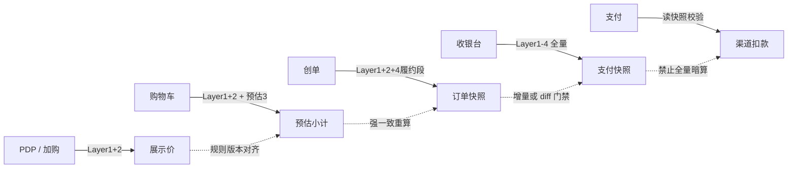
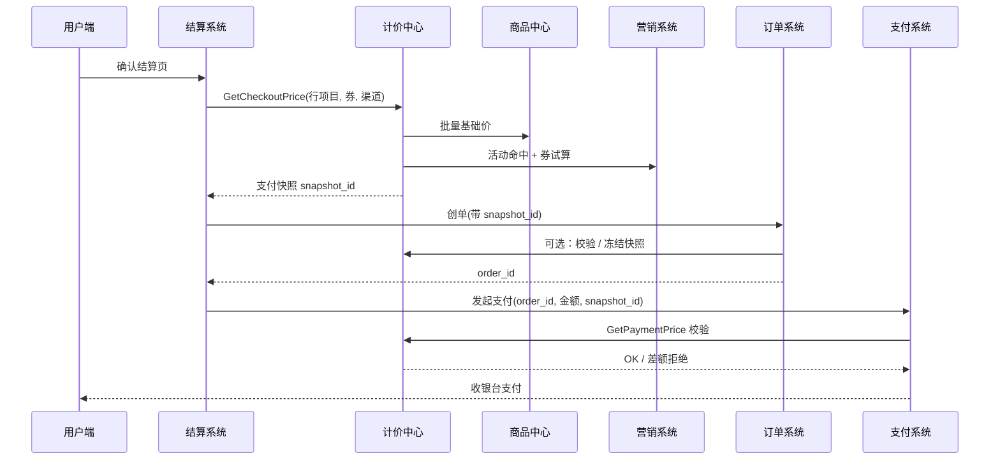

**导航**：[书籍主页](./index.html) | [完整目录](./TOC.html) | [上一章](./chapter10.html) | [下一章](./chapter12.html)

---

# 第11章 计价系统设计与实现

> 本章基于《电商系统设计（五）：计价引擎》与《电商系统设计（六）：计价系统 DDD 实践》整理扩展，聚焦交易链路中的**统一计价能力**：四层价格模型、场景化计算、DDD 战术建模与系统边界。

**阅读提示**：若你更熟悉「订单里直接存一个 `total_amount`」的朴素模型，可以先带着两个问题读完全章——第一，**券与积分为何常常不进创单快照**；第二，**为什么支付阶段坚持校验而不是重算**。搞清这两个问题，就能理解计价中心存在的必然性，而不是把它简单看成「又一个中台服务」。文中 Go 示例为教学裁剪版，省略了错误包装、观测字段与部分依赖注入，落地时请按项目规范补全。

---

## 11.1 背景与挑战

### 11.1.1 价格计算的复杂性

在电商系统中，用户看到的「价格」并非单一标量，而是**多因子分层叠加**的结果：基础售价、营销活动、订单级抵扣、运费与增值服务、支付渠道手续费等，共同决定**订单应付**与**最终支付**。若各系统各自实现一套加减逻辑，极易出现「商详 99 元、下单 105 元」的体验问题，甚至引发**重复优惠、二次扣券**等资损。

典型分解可概括为：

- **基础价格**：市场价、日常折扣价、渠道价等；
- **营销价格**：秒杀、新人价、满减、Bundle 等；
- **抵扣**：优惠券、积分、支付立减等；
- **费用与附加**：运费、碎屏险等平台服务费、跨境或信用卡手续费等。

同一 SKU 在 **PDP（商品详情页）**、**购物车**、**创单**、**收银台**、**支付** 各阶段，对计算深度、一致性与性能的要求并不相同，这要求计价中心以**场景驱动**的方式暴露能力，而不是「一刀切」的全量重算。

在传统拆分里，商品服务算「标价」、营销服务算「活动价」、订单服务在创单时再算一遍总价、支付服务为渠道优惠再算一遍——表面看各团队各管一段，实际上**同一业务概念被多处隐式定义**，边界一模糊就会出现「券用了两次」「满减门槛按行算还是按单算各执一词」等问题。更隐蔽的是：**浮点金额**、**四舍五入顺序**、**外币汇率取整点**不一致，会在大规模订单下累积成对账差异。计价中心的意义，就是把「一次购物旅程中所有与钱有关的加减」收敛到**同一套编排与同一套舍入规则**，让其他系统变成**数据供给方或执行方**，而不是第二个计算器。

### 11.1.2 核心挑战

1. **一致性**：展示价、订单快照、支付金额必须可追溯、可校验；规则版本与快照版本应对齐。
2. **准确性**：金额以**分**为单位的整数运算；订单级优惠需**按比例分摊**到行，否则退款无法闭合。
3. **性能**：PDP / 列表页高 QPS，需多级缓存与轻量路径；创单 / 收银台可接受更高延迟但**不容错算**。
4. **异构品类**：Topup、酒店、机票等定价因子差异大，需要**策略插件**而非巨石 `if-else`。
5. **供应商品类实时价**：报价可能在浏览至支付间变化，需要 **BookingToken**、支付前反查等机制。

此外有两类「软挑战」往往在事故后才被写入复盘：**组织边界**与**产品口径**。前者表现为多个团队各维护一段计算逻辑，接口文档写「参考订单域」，实际上订单域又在调另一套历史脚本；后者表现为 PRD 写「到手价」，但未定义是否含运费、是否含可叠加券的上限——技术再完美的引擎也无法收敛未定义的业务。计价项目启动时，建议把**统一语言表**（见 11.5 与系列第六篇）作为需求评审门禁，与 `SkipLayers` 表双签，再进入排期。

从工程视角，上述挑战可以压成三条硬约束：**算得对**（正确性）、**大家认**（一致性）、**扛得住**（性能与可用性）。其中正确性又依赖两条底座：一是**整数分**与确定的舍入；二是**快照**——把某一刻的规则解释结果固化为事实，后续链路只解释事实，不再在暗处重算。一致性则依赖**版本化**：规则集、活动表、券批次、汇率表都带有业务版本或生效区间，计价请求必须携带「我按哪一版解释」的线索，否则 PDP 与创单永远可能对不齐。

### 11.1.3 设计目标

| 目标 | 说明 |
|------|------|
| 准确性 | 计价结果可审计，关键路径可空跑比对 |
| 一致性 | 统一入口计算，订单 / 支付以快照为准 |
| 高性能 | 前台场景高缓存命中；交易路径少 IO、可并发 |
| 可扩展 | 新营销类型、新费用项以策略 / 配置扩展 |
| 可观测 | 分层耗时、缓存命中、差异告警 |

上述目标之间存在天然张力：例如「极致缓存」与「强一致快照」方向相反，需要通过**场景分流**化解，而不是用一套参数打天下。团队 OKR 里若只写 P99 延迟而不写**差异率 / 资损事件数**，很容易把系统优化成「快但不准」。建议在质量看板上同时跟踪：**快照校验失败次数**、**空跑 diff 超标次数**、**客服价格类工单占比**，与延迟指标并列。

### 11.1.4 计价系统在交易链路中的位置

计价中心位于**商品、营销、库存、订单、支付**之间：向上读取商品基础价与营销规则，向下为购物车、结算、创单、支付提供**试算**与**快照**服务。它是交易链路的**横切基础模块**，不宜承担订单状态机或支付渠道路由等非本域职责。



把计价中心画在枢纽位置，并不是鼓励它成为「上帝服务」，而是强调其 **I/O 边界**：对外是少量稳定的试算与快照 API，对内通过防腐层消化外部世界的变化。实践中常见反模式有两种：其一是计价服务直接读营销库的宽表，把对方存储模型当自己领域模型；其二是把订单状态推进、支付路由塞进计价——二者都会让团队在排障时无法回答「这一分钱到底是谁改的」。本章后续用 DDD 的聚合与 ACL 约束，正是为了避免这两种腐化。

---

## 11.2 计价引擎架构

### 11.2.1 分层架构

计价中心通常分为：**场景入口层（API / Handler）**、**编排与快照层**、**核心计算引擎**、**品类策略**、**防腐适配层**、**缓存与持久化**。入口按 `PricingScene` 路由到不同 Handler，核心引擎以**责任链**顺序执行各 `Layer`，并结合 `Calculator` 做品类扩展。



**与五层实现的关系**：实现上常把「最终汇总、尾差修正、安全校验」独立为 `FinalAssemblyLayer`，于是代码里会看到五段责任链。本书在**业务模型**上仍称四层，是因为前四层对应「可被业务方单独讨论的价格语义」，而 Final 层是**技术组装层**（把四层结果折叠成响应 DTO 与快照 schema），不参与对外营销话术。团队在评审架构图时，应对业务讲四层，对研发可展开五层，避免无谓争论。

**SceneRouter** 的职责不仅是转发：它要注入 `PricingScene`、解析租户 / 地区 / 渠道、挂载灰度与空跑开关，并在入口完成**参数校验**（例如购物车行是否含失效 SKU、供应商品类是否带预订 token）。**SnapshotManager** 则与订单域协作：创单成功后写入订单快照，收银台基于订单行再生成支付快照；二者生命周期不同，**不可混用一张表、一个过期策略**。

### 11.2.2 四层价格模型

为与业务语言对齐，本书将**可叠加的价格语义**归纳为四层（**不含**最终的汇总展示层）：**基础层、营销层、抵扣层、费用层**。引擎内部可再拆「最终汇总」为独立步骤，用于生成明细与快照版本。

| 层级 | 名称 | 典型内容 | 出资方 / 备注 |
|------|------|----------|----------------|
| Layer 1 | 基础价格 | 市场价、折扣价、渠道价、供应商报价 | 商家 / 平台标价 |
| Layer 2 | 营销价格 | 秒杀、新人价、满减、活动价 | 商家或平台营销预算 |
| Layer 3 | 抵扣 | 优惠券、积分、部分支付立减 | 用户权益 |
| Layer 4 | 费用与附加 | 运费、增值服务费、平台服务费、支付手续费 | 用户或平台规则 |



**端到端走数示例（整数分）**：设某 SKU 日常折扣价 98000 分，限时抢购再减 8000 分（Layer 2），创单时加运费 1000 分、碎屏险 5000 分（Layer 4 中与履约相关部分），则订单应付为 98000 − 8000 + 1000 + 5000 = 96000 分。用户进入收银台选择满 500 减 100 的券（此处为 10000 分）与积分抵 10000 分（Layer 3），再选择会产生 2% 信用卡手续费的渠道，手续费基数若约定为「券与积分后的金额」，则应付变为 96000 − 10000 − 10000 = 76000 分，手续费 1520 分，实付 77520 分——具体基数以公司业务规则为准，关键是 **Layer 顺序与基数必须在规则文档与代码注释中一致**，并在快照里记录「手续费按哪一版基数计算」。

**口径说明**：

- **创单（CreateOrder）**：常见做法是 Layer 1 + Layer 2 + **Layer 4 中与订单履约相关的费用**（如运费、增值服务费），**不包含** Layer 3 的券与积分，也不包含**支付渠道手续费**（手续费依赖用户所选渠道，放在收银台）。
- **收银台（Checkout）**：完整执行 Layer 1–4，生成**支付快照**。
- **支付（Payment）**：以快照为准做**校验**，避免再次「全量重算」引入漂移。

Layer 的**顺序不可随意调换**：必须先有「可减的基准」，再谈营销减免，再谈用户权益抵扣，最后才叠加履约与支付相关费用。若把券提前到营销之前，会出现「用券改变满减门槛」这类循环依赖，规则引擎与测试用例都会爆炸。Layer 4 内部也建议**再分子阶段**：先算与履约相关的运费与增值服务费，再在收银台根据用户所选支付渠道计算手续费，这样创单快照不会错误地绑定某一渠道费率。

### 11.2.3 计算流程

计算流程可抽象为：构建 `PricingContext` → 按场景得到 `skipLayers` → 责任链逐层改写 `PricingState` → 品类 `Calculator` 参与行级计算 → `Final` 汇总明细 →（交易路径）**持久化快照**。



**`PricingState` 建议携带的内容**包括：行级中间价、已选营销命中列表、已锁定券批次、供应商报价引用 ID、舍入审计数组、以及每层产生的结构化 `PriceComponent`（类型、金额、出资方、关联业务单号）。Final 之前的各层应尽量避免「只写一个整数总价」——客服与财务追问时，只有明细才能解释**为什么少了一分钱**。供应商品类还要在 state 中携带 **报价过期时刻** 与 **预订 token**，以便支付校验阶段做二次确认或优雅失败。

---

## 11.3 核心实现

### 11.3.1 价格计算器设计

引擎对外暴露稳定接口，对内使用 **`Layer` 责任链 + `Calculator` 策略**：

```go
package pricing

import "context"

// Engine 计价引擎对外接口。
type Engine interface {
	CalculatePrice(ctx context.Context, req *PricingRequest) (*PricingResponse, error)
	CalculateWithDryRun(ctx context.Context, req *PricingRequest) (*PricingResponse, *DryRunResult, error)
	BatchCalculate(ctx context.Context, reqs []*PricingRequest) ([]*PricingResponse, error)
}

// Layer 单层计算：可读写 PricingState。
type Layer interface {
	Name() string
	Order() int
	Process(ctx context.Context, req *PricingRequest, st *PricingState) error
}

// Calculator 品类策略：在单层或多层之间参与行级公式。
type Calculator interface {
	Support(categoryID int64) bool
	Priority() int
	Calculate(ctx context.Context, req *PricingRequest, st *PricingState) error
}
```

**责任链与策略的协作方式**可以概括为：Layer 负责「这一类变价因子在何时进入总式」，Calculator 负责「这一品类如何解释基础输入」。例如酒店品类在 Layer 1 需要把「间夜 × 日历价 × 税费」折叠成一行基准 `Money`；Topup 在 Layer 1 只需要「面额 × 折扣率」。若把品类差异全写进 Layer 1 的 `switch`，Layer 将迅速膨胀；若把 Layer 2 的营销叠加规则写进 Calculator，又会导致营销变更需要改多个品类文件。**推荐做法**是：Layer 保持**与品类无关的通用语义**，Calculator 只处理「如何得到 Layer 1 接受的基准结构」以及少数「品类特有附加费」钩子。

**错误语义**：引擎对外错误应分层——参数非法（4xx）、依赖不可用（5xx 可重试）、规则冲突（4xx 业务码）、资损风险（4xx 拒绝 + 告警）。不要把「营销返回空列表」与「内部 panic」混用同一码，否则 SLO 统计会被污染。对创单路径，任何**未分类错误**都应默认 fail-close，避免生成半张快照。

`initLayers` 中按 `Order()` 排序注册：`BasePrice` → `Promotion` → `Deduction` → `Charge` → `Final`，与 11.2.2 的四层语义一致，**Final** 负责尾差、分摊与明细输出。

场景到层的映射在代码里常表为「跳过列表」，与业务文档交叉对照便于测试覆盖：

```go
func SkipLayersForScene(scene PricingScene) []string {
	switch scene {
	case ScenePDP, SceneAddToCart:
		return []string{"deduction", "charge"}
	case SceneCart:
		return []string{"charge"} // 购物车可预估券；运费常缺省或按默认地址估算
	case SceneCreateOrder:
		// 创单：基础 + 营销 + 与订单绑定的附加费；不含券积分与支付手续费
		return []string{"deduction", "payment_handling_fee"}
	case SceneCheckout:
		return nil
	case ScenePayment:
		return []string{"base_price", "promotion", "deduction", "charge", "final"}
	default:
		return nil
	}
}
```

> 注：`payment_handling_fee` 是否从 Layer 4 拆出，取决于实现里是否将「订单附加费」与「支付渠道费」分为两个子处理器；关键是**创单口径不包含随渠道变化的费率**。

### 11.3.2 快照生成

快照是**防资损**的关键：创单生成**订单价格快照**（含行明细、规则版本、供应商 `BookingToken` 等），收银台生成**支付快照**（含券积分与手续费）。快照应包含：

- `snapshot_id`、`version`、`calculated_at`、`expire_at`；
- 各层贡献的**结构化明细**（便于对账与客服解释）；
- 可选：`rule_bundle_hash` 用于比对「当时用的是什么规则集」。

**快照与订单数据的关系**：订单表应保存 `snapshot_id` 或内嵌只读 JSON，但**不建议在订单域再实现一套价格公式**去「验算」——验算应回调计价或读快照服务，否则双实现又会分叉。快照表建议支持**只追加**：修正价格走新快照版本（`v2`），旧版本保留审计；支付失败回滚不应删除历史快照记录。**TTL**：订单快照常对齐库存锁定时间（如 30 分钟）；支付快照对齐收银台支付超时（如 15 分钟），二者解耦。

### 11.3.3 试算接口

试算与正式计算共用同一套 `Layer`，通过 `Scene` 控制深度：PDP 试算只读展示；购物车允许**预估券**（标注 `estimated=true`）；创单 / 收银台必须**明确用户已选权益**（券码、积分数量、渠道）。

试算响应里应显式区分三类字段：**事实**（已锁定、写入快照）、**建议**（系统推荐最优券但用户未确认）、**估算**（缺地址导致运费按默认规则猜）。前端展示时必须用不同标签，避免用户把「估算运费」当成承诺。对于 **DryRun（空跑比对）**：上线新引擎时，生产流量旁路调用新旧两套，只在差异超阈值时采样上报，可在 `PricingResponse` 中附加 `diff_summary` 而不影响主路径延迟。

### 11.3.4 幂等性保证

计价接口常被上游重试。建议：

- 请求携带 **`Idempotency-Key`** 或业务侧 `request_id`；
- 服务端以「用户 + 场景 + 关键购物车指纹」为维度短 TTL 缓存**响应副本**；
- **生成快照**类写操作与订单号 / 结算单号绑定，防止重复生成两套有效快照。

```go
type SnapshotRepository interface {
	Save(ctx context.Context, s *PriceSnapshot) error
	GetByOrderID(ctx context.Context, orderID string) (*PriceSnapshot, error)
}

func (s *PricingAppService) CreateOrderSnapshot(ctx context.Context, cmd CreateOrderSnapshotCmd) (*PriceSnapshot, error) {
	if snap, err := s.repo.GetByOrderID(ctx, cmd.OrderID); err == nil && snap != nil {
		return snap, nil
	}
	// ... 首次计算后落库
	return s.repo.SaveAndReturn(ctx, cmd)
}
```

**安全校验器（Safety Checker）** 常与幂等一起出现在创单 / 收银台路径：在返回快照前检查「总价不为负」「折扣不超过品类阈值」「优惠不超过商品应付之和」等。校验失败应**拒绝生成快照**而不是静默裁剪，否则会把业务错误伪装成成功交易。对于前端上送金额与后端计算金额的比对，建议以后端为准，前端金额仅作 UX 提示；若必须比对，应使用**宽松阈值**防浮点，或统一为整数分。

---

## 11.4 多级缓存与降级

### 11.4.1 缓存策略

| 场景 | 是否缓存 | TTL 思路 |
|------|----------|----------|
| PDP / 列表批量 | 是 | L1 短 TTL + L2 较长；命中要求高于展示 SLA |
| 购物车 | 部分 | 自营可中等 TTL；供应商品类报价短 TTL |
| 创单 / 收银台 / 支付 | 否（结果可落快照表） | 以强一致计算为主 |

缓存 key 设计要同时防**击穿**与**脏读**：key 中应包含 `item_id`、`sku_id`、`region`、`channel`、`user_segment`（若价随人群变化）、以及**规则版本摘要**。大促时热门商品可采用**单飞（singleflight）**合并回源。对购物车这类高 churn 场景，可缓存「行哈希 → 计价结果」短 TTL，而不是整购物车超长缓存，避免用户改数量后长期读到旧价。

### 11.4.2 降级方案

- **依赖超时**：返回上一版本缓存并打标 `stale=true`（仅允许非交易路径）；
- **营销服务不可用**：PDP 可降级为仅 Layer 1；创单路径应**失败快速**而非静默吞错；
- **供应商报价失败**：使用 DB 缓存价并限制最大陈旧度，超阈值则拦截创单。

降级策略要与**法务与用户协议**对齐：若页面上承诺了「展示价即购买价」，则任何返回陈旧价的降级路径都必须附带明确提示或干脆失败；否则可能构成虚假宣传风险。技术团队常忽略这一点，把「能卖出去」置于「合规展示」之上。**开关治理**上，降级与熔断配置应纳入配置中心审计，谁在什么时间打开「允许陈旧价」，需要可追溯。

### 11.4.3 性能优化要点

- 批量场景用 `errgroup` 并发拉取多 SKU 基础价与活动；
- 热点 SKU **预热**；
- 对 Layer 内 RPC 设置**独立超时与熔断**，避免一层拖垮整条链。

```go
package pricing

import (
	"context"
	"sync"
	"time"
)

type CacheManager struct {
	mu   sync.Mutex
	l1   map[string]cacheEntry
	l1TTL time.Duration
}

type cacheEntry struct {
	val       *PricingResponse
	expiresAt time.Time
}

func NewCacheManager(l1TTL time.Duration) *CacheManager {
	return &CacheManager{l1: make(map[string]cacheEntry), l1TTL: l1TTL}
}

func (c *CacheManager) GetOrCompute(ctx context.Context, key string, fn func(context.Context) (*PricingResponse, error)) (*PricingResponse, error) {
	now := time.Now()
	c.mu.Lock()
	if e, ok := c.l1[key]; ok && now.Before(e.expiresAt) {
		c.mu.Unlock()
		return e.val, nil
	}
	c.mu.Unlock()

	val, err := fn(ctx)
	if err != nil {
		return nil, err
	}
	c.mu.Lock()
	c.l1[key] = cacheEntry{val: val, expiresAt: now.Add(c.l1TTL)}
	c.mu.Unlock()
	return val, nil
}
```

> 生产环境可在 L1 之上再接 Redis、并接入 singleflight；此处展示「先读内存、未命中再计算回写」的最小闭环。

---

## 11.5 DDD 建模实践（重点）

DDD 在计价系统中的价值，在于用**统一语言**消除 `originalPrice` / `salePrice` / `actualPay` 混用，并用**聚合边界**保证「基础价 + 选中营销 + 费用 − 抵扣」在同一事务语义内一致。

### 11.5.1 领域模型设计

**限界上下文**：计价上下文（Pricing Context）与营销、商品、用户、支付等上下文通过 **ACL（防腐层）** 交互。计价上下文中，核心概念包括：`Price`（一次可报价单元）、`PriceLayer`（单层结果）、`Money`（金额值对象）、`PriceSnapshot`（不可变结果事实）、`PricingPolicy`（来自外部的规则投影）。



**限界上下文关系（战略视图）**：计价上下文处于**下游消费位**，对商品、营销、用户、支付等上下文均通过 **ACL** 取数；这些上下文互不直接依赖计价模型，避免「改一个 proto 全仓库编译失败」的耦合。下图省略防腐层实现类，只保留协作方向，便于与架构评审中的上下文地图对照。



**防腐层（ACL）** 在计价落地中几乎与引擎同等重要：营销侧可能叫 `activity_price`，商品侧叫 `sale_price`，支付侧叫 `payable_amount`——计价域只接受自己的 `Money` 与 `PriceLayer`。下面是一个最小对照：应用服务只依赖计价域接口 `PromotionPort`，基础设施里实现适配器，把 RPC DTO 转成值对象。

```go
// domain/ports.go — 由定价上下文定义，由基础设施实现。
type PromotionPort interface {
	ActivePromotions(ctx context.Context, q PromotionQuery) ([]PromotionOffer, error)
}

// domain/promotion_offer.go — 定价上下文内的只读投影。
type PromotionOffer struct {
	ActivityID int64
	Kind       string
	Price      Money
}

// infra/promotion_acl.go
type promotionACL struct{ /* rpc client */ }

func (a *promotionACL) ActivePromotions(ctx context.Context, q PromotionQuery) ([]PromotionOffer, error) {
	// resp := a.client.Query(...)
	// return toOffers(resp)，字段映射、枚举归一、金额转分，全部在此完成
	return nil, nil
}
```

### 11.5.2 聚合根：`Price`（行级报价聚合）

以**订单行 / 购物车行**为粒度定义聚合根 `Price`（本书与实现中可与 `PricingAggregate` 等价命名），保证：

1. 同一行上**互斥营销**的选择规则在一个聚合内完成；
2. **行小计**与**层明细**同步更新；
3. 对外只暴露**已完成校验**的结果。

```go
package domain

import "errors"

type LayerKind int

const (
	LayerBase LayerKind = iota
	LayerPromotion
	LayerDeduction
	LayerCharge
)

// Price 聚合根：表示「一行 SKU 在一次请求下」的可报价过程。
type Price struct {
	lineID   string
	skuID    int64
	quantity int64
	layers   []PriceLayer
	ctx      PricingContext
	version  int64
}

func NewPrice(lineID string, skuID, qty int64, ctx PricingContext) (*Price, error) {
	if qty <= 0 {
		return nil, errors.New("quantity must be positive")
	}
	return &Price{lineID: lineID, skuID: skuID, quantity: qty, ctx: ctx}, nil
}

func (p *Price) ReplaceLayer(kind LayerKind, delta Money, meta map[string]string) error {
	if delta.IsNegative() && kind == LayerBase {
		return errors.New("base layer cannot go negative")
	}
	// 同类层覆盖或追加策略由领域规则决定，此处示意「按 kind 幂等替换」
	p.layers = upsertLayer(p.layers, kind, delta, meta)
	return nil
}

func upsertLayer(existing []PriceLayer, kind LayerKind, delta Money, meta map[string]string) []PriceLayer {
	nl := make([]PriceLayer, 0, len(existing)+1)
	replaced := false
	for _, l := range existing {
		if l.Kind == kind {
			nl = append(nl, PriceLayer{Kind: kind, Delta: delta, Meta: cloneMeta(meta)})
			replaced = true
			continue
		}
		nl = append(nl, l)
	}
	if !replaced {
		nl = append(nl, PriceLayer{Kind: kind, Delta: delta, Meta: cloneMeta(meta)})
	}
	return nl
}

func cloneMeta(m map[string]string) map[string]string {
	if m == nil {
		return nil
	}
	out := make(map[string]string, len(m))
	for k, v := range m {
		out[k] = v
	}
	return out
}

func (p *Price) Subtotal() (Money, error) {
	var sum Money
	for _, l := range p.layers {
		var err error
		sum, err = sum.Add(l.Delta)
		if err != nil {
			return Money{}, err
		}
	}
	return sum, nil
}
```

**聚合边界**：`Price` 内不直接修改「券库存」「活动预算」——这些属于营销聚合，由应用服务先**预留 / 锁定**后再传入 `Price` 已选结果。

若团队纠结「一行 SKU 是否太小」：可以从**一致性边界**反推——任何「必须在同一事务里决定且一起成功或失败」的价格要素，应处于同一聚合；若某些营销是平台级自动领取、失败可静默降级，则不必纳入 `Price` 聚合，而可作为 Layer 2 的只读输入。购物车多行场景下，**行级 `Price` 聚合 + 订单级领域服务**是常见组合：行内互斥活动放在行聚合，跨行满减分摊放在服务。

### 11.5.3 值对象：`Money` 与 `PriceLayer`

**Money**：用 `int64` 分与 `currency` 表达，**不可变**，所有运算返回新值，避免浮点误差。跨境时可在值对象内同时保存「展示币种金额」与「清算币种金额」，但**比较与快照持久化**必须指定其中一种为权威口径，另一种仅作参考字段。舍入规则（银行家舍入 vs 向上取整）应配置化，并在快照中记录 `rounding_mode`，否则三年后审计很难解释「为什么当年这样舍」。

**PriceLayer**：描述单层对金额的**增量贡献**（可为负表示减免），并携带 `meta`（活动 ID、费用类型、出资方 `source=platform|merchant|channel`）供对账。一个实用技巧是为每个 `PriceLayer` 分配**稳定 `component_id`**（UUID 或雪花），在退款回收、部分开票时直接引用，而不是靠数组下标——订单行重排或合并时，下标并不可靠。

```go
// 与上文 Price 同属 domain 包。

type Money struct {
	cents    int64
	currency string
}

func (m Money) Add(o Money) (Money, error) {
	if m.currency != o.currency {
		return Money{}, errors.New("currency mismatch")
	}
	return Money{cents: m.cents + o.cents, currency: m.currency}, nil
}

// Multiply 单价 × 数量；若数量非法应由调用方先校验。
func (m Money) Multiply(qty int64) (Money, error) {
	if qty <= 0 {
		return Money{}, errors.New("quantity must be positive")
	}
	return Money{cents: m.cents * qty, currency: m.currency}, nil
}

func (m Money) IsNegative() bool { return m.cents < 0 }

type PriceLayer struct {
	Kind  LayerKind
	Delta Money
	Meta  map[string]string
}
```

### 11.5.4 领域服务

当逻辑**跨多行**或**不适合放入单一 `Price`** 时，使用领域服务，例如：

- **订单级满减分摊**：余额递减法处理尾差；
- **互斥活动择优**：跨多个候选活动比较用户实付；
- **Bundle 计价**：买 N 享 M 折等。

```go
package domain

import "errors"

// LineAmount 表示一行在分摊前的可参与金额（通常为 Layer1+2+4 之后的行小计，单位：分）。
type LineAmount struct {
	LineID string
	Cents  int64
}

// ApportionmentService：订单级优惠按行权重分摊（余额递减 + 尾差落末行）。
type ApportionmentService struct{}

func (ApportionmentService) Allocate(orderDiscountCents int64, lines []LineAmount) ([]int64, error) {
	if orderDiscountCents < 0 {
		return nil, errors.New("discount must be non-negative")
	}
	if len(lines) == 0 {
		return nil, errors.New("no lines")
	}
	var total int64
	for _, l := range lines {
		if l.Cents < 0 {
			return nil, errors.New("line amount cannot be negative")
		}
		total += l.Cents
	}
	if total == 0 {
		return nil, errors.New("total weight is zero")
	}
	out := make([]int64, len(lines))
	var allocated int64
	for i := 0; i < len(lines)-1; i++ {
		// 按比例向下取整到分
		part := orderDiscountCents * lines[i].Cents / total
		out[i] = part
		allocated += part
	}
	out[len(lines)-1] = orderDiscountCents - allocated
	return out, nil
}
```

领域服务**无状态**，入参出参均为领域对象或值对象。

### 11.5.5 仓储与工厂

- **工厂**：从商品 / 营销 DTO 通过 ACL 组装 `Price` 初始状态；
- **仓储**：`PriceSnapshotRepository` 持久化快照；**不写**聚合根运行态，避免贫血往返；
- **应用服务**：开启事务、调用营销锁定、调用引擎、保存快照、发布「快照已生成」领域事件。

**工厂的职责**是把「外部世界的行项目」翻译成**领域可计算的初始不变式**：数量为正、币种一致、基础层已填入「未乘数量的单价」或「已乘数量的行基准」——二者只能选一种约定，并在团队 wiki 中写死。工厂内不做营销择优，只做**数据完备性**与 ACL 映射；择优属于领域服务或 Layer 2 策略，避免工厂膨胀成第二个引擎。

```go
package domain

// ItemPort 由商品上下文经 ACL 实现。
type ItemPort interface {
	BaseUnitPrice(ctx context.Context, skuID int64) (Money, error)
}

// PriceFactory 从商品行构造聚合根（示意：仅 Layer1 基准）。
type PriceFactory struct {
	items ItemPort
}

type CartLineInput struct {
	LineID string
	SkuID  int64
	Qty    int64
}

func (f *PriceFactory) NewPriceFromLine(ctx context.Context, in CartLineInput, pc PricingContext) (*Price, error) {
	unit, err := f.items.BaseUnitPrice(ctx, in.SkuID)
	if err != nil {
		return nil, err
	}
	p, err := NewPrice(in.LineID, in.SkuID, in.Qty, pc)
	if err != nil {
		return nil, err
	}
	lineBase, err := unit.Multiply(in.Qty)
	if err != nil {
		return nil, err
	}
	if err := p.ReplaceLayer(LayerBase, lineBase, map[string]string{"source": "item_catalog"}); err != nil {
		return nil, err
	}
	return p, nil
}
```

上例中 `Multiply` 可作为 `Money` 上的方法，与「单价 × 数量」语义绑定；若品类要求按「件数阶梯」重算基准，则在工厂之后交给对应 `Calculator`，而不是在工厂里写 `switch category`。

**应用服务与领域层的调用顺序**（创单示例）：校验入参 → 通过工厂构建每行 `Price` 聚合（仅含基础层）→ 调用领域服务选出互斥活动 → 各 `Layer` 在应用层编排下逐步调用 `ReplaceLayer` → `ApportionmentService` 处理订单级减免 → `Price` 聚合生成行视图 → 组装 `PriceSnapshot` 持久化。注意：**券锁定**属于应用层编排步骤，领域层只接收「锁定成功后的面额」作为事实输入，这样聚合不变式才不会依赖远程 RPC 的副作用。

**充血 / 贫血混合策略**：行级 `Price` 与分摊服务采用充血模型承载规则；快照 PO、HTTP DTO 保持贫血，避免把序列化细节泄漏进领域。测试金字塔上，**领域单测**覆盖互斥、尾差、货币错误；**契约测试**覆盖 ACL 与外部服务的字段映射；**端到端**只保留少量黄金用例，防止全链路测试过慢导致无人运行。

---

## 11.6 不同场景的价格计算

### 11.6.1 PDP 场景（商品详情页 / 加购试算）

PDP 的首要 KPI 是**转化**，技术侧对应的是极低延迟与稳定展示。计算上通常停留在 Layer 1 与 Layer 2：用户需要知道「日常卖多少、活动卖多少、我是否命中新人/秒杀」。券与积分如果在 PDP 就做全量最优解，RPC 扇出会爆炸，因此常见做法是：**主路径同步返回展示价**，券预估走异步任务或边缘计算，并在 UI 上用弱提示展示「领券最高可再减 X 元」。

**加购（AddToCart）** 与 PDP 类似，往往不锁任何资源；若要做「凑满减」提示，可在服务端维护轻量规则缓存，仍以 Layer 1–2 为主。PDP 与创单的价格差异若不可避免，必须在交互上降级为「以结算页为准」，同时在日志里记录 `rule_bundle_hash`，便于客诉时复盘。

### 11.6.2 购物车场景

购物车是**多品聚合**与**用户频繁编辑**的交集：行增删、数量变化、地址切换都会触发重算。技术上通常批量拉取基础价与活动，再对共享的订单级优惠做编排；Layer 3 在购物车阶段多为**试算而非锁定**，返回体应用 `estimated` 标记。运费若无默认地址，可返回区间或按城市模板估算，并在进入结算页时用真实地址覆盖。

供应商品类在购物车仍需注意**外部报价抖动**：可短时缓存供应商返回，但 TTL 要显著短于自营；用户停留过久时，结算页应主动提示「价格已更新」。

### 11.6.3 创单场景（订单金额与快照）

创单是价格从「展示」走向「事实」的分水岭：此时应完成与履约相关的费用（运费、服务费等），并**生成订单快照**。不包含券与积分并非技术偷懒，而是业务上常把「用户尚未进入收银台选择的支付权益」排除在订单应付之外，避免订单应付随用户换券剧烈波动；若业务要求订单应付即含券，应在需求层显式调整 Layer 映射，而不是在代码里硬塞。

创单路径还要与**库存预占、营销库存锁定**同事务或同 Saga 编排：计价不负责预占，但要在**预占成功之后**再冻结快照，否则会出现「快照有了库存没了」的僵尸数据。供应商品类在创单常同步拉取供应商报价并生成 **BookingToken**，写入快照供支付确认。

### 11.6.4 支付场景

支付侧理想状态是 **O(1) 查表校验**：读取 `snapshot_id` 对应金额、币种、过期时间，与支付请求比对；供应商品类增加「预订确认」RPC。任何在支付路径重新跑全量 Layer 的做法，都应视为技术债：渠道回调重复、用户重复点击支付，都会让重算路径产生**非确定性**。若必须重算（极少数风控场景），应产生**新快照版本**并阻断旧支付单。

### 11.6.5 场景间的价格一致性保证

1. **规则版本对齐**：请求携带 `rule_version` / `activity_bundle_id`；
2. **快照链**：创单快照 → 收银台在快照之上仅计算「增量」（券、渠道费）或全量重算后对比差异；
3. **强提醒**：当收银台结果与创单快照差异超过业务阈值，阻断或用户确认。

下图从**同一用户旅程**抽象各场景「算到哪一层、是否落快照」：箭头表示时间顺序，方框内为与本章 `SkipLayersForScene` 相呼应的语义（具体跳过列表以实现为准）。把它挂在团队 wiki 上，可减少「购物车为什么和创单差一块运费」的重复解释成本。



**时间维度的一致性**常被忽略：活动配置可能在用户浏览与创单之间切换生效状态，因此仅有「价格」数值不够，还要记录**解释价格的规则时间戳**。另一个角度是**货币与税费**：跨境场景下 PDP 可能只展示本币参考，创单必须锁定报关与税费口径，避免支付阶段因汇率刷新产生合规争议。

**测试策略**：应为每条主路径维护「黄金 JSON」——给定固定输入（商品、活动版本、用户身份、地址），期望输出快照哈希固定；任何引擎重构先跑黄金用例再灰度。对购物车预估与创单事实的差异，产品需定义**可接受区间**（如绝对值 ≤ 1 元或 ≤0.5%），超出即前端强提示，避免客诉升级。

| 场景 | 主要 Layer | 是否生成快照 | 典型 SLA 心态 |
|------|------------|--------------|----------------|
| PDP | 1 + 2 | 否 | 极快、可缓存 |
| 购物车 | 1 + 2（+3 预估） | 否 | 快、可部分预估 |
| 创单 | 1 + 2 + 4（部分） | 订单快照 | 强一致 |
| 收银台 | 1 + 2 + 3 + 4 | 支付快照 | 强一致 |
| 支付 | — | 校验快照 | 强一致、少 IO |

**收银台与创单的时序**：常见用户路径是先创单再进收银台选券，因此支付快照往往**晚于**订单快照生成；若业务允许「未创单先预览收银台」，则要定义预览快照不落库或落短 TTL 缓存，避免用户反复刷新产生大量孤儿快照占满存储。另一个易错点是**部分失败**：创单成功但写快照失败时，必须有补偿任务阻断支付或自动关单，否则会出现「订单存在却无快照」的不可恢复状态。

---

## 11.7 系统边界与职责

### 11.7.1 计价系统的职责边界

**计价中心负责**：

- 统一编排各层价格；
- 输出明细与快照版本；
- 金额校验、尾差、分摊与安全阈值（如最大折扣率）。

**不负责**：

- 营销活动配置与圈品 CRUD；
- 券的发放与库存扣减（由营销执行），计价仅消费「已锁定 / 已选中」结果；
- 支付路由与渠道签约。

### 11.7.2 计价 vs 营销：谁算什么

| 维度 | 营销系统 | 计价系统 |
|------|----------|----------|
| 规则定义 | ✅ 活动、券模板、互斥叠加 | ❌ |
| 最优券搜索（可选） | ✅ 或协同推荐服务 | 可消费候选集 |
| 金额编排 | 提供命中规则与减免额 | ✅ 汇总为价格事实 |
| 执行扣减 | ✅ 锁定 / 核销 | ❌ |

边界口诀：**营销回答「能不能用、用哪条」；计价回答「用了以后多少钱」**。

进一步细化：**「最优券推荐」**可以放在营销、推荐或独立优惠参谋服务里，但「用户已勾选某张券后的应付」必须由计价统一给出，避免前端本地算法与后端不一致。**支付渠道立减**有时由渠道 SDK 返回，计价需约定是「事前写入快照」还是「支付回调后补记账」——两种模式都能做，但不能混用两种口径于同一报表周期。

### 11.7.3 试算 vs 订单价格快照

- **试算**：可重复、可缓存、允许短暂不一致（需标注）；
- **快照**：一次创单事实，**不可变**（修正走补差单、客服单等流程）。

### 11.7.4 基础价 vs 促销价 vs 支付价

- **基础价**：商品域维护的标价体系经 ACL 投影；
- **促销价**：营销规则作用后的价格带；
- **支付价**：在订单应付基础上叠加用户支付相关抵扣与手续费后的**渠道实扣**口径。

**争议场景举例**：若平台补贴在营销侧记账，但支付渠道又有「立减」，需要明确**支付价是否含渠道补贴**、财务对账时**GMV 与实收**各扣哪一段——这属于清结算域的规则，但计价必须在 `PriceComponent` 上打好 `source` 与 `ledger_account` 类标签，否则报表会对不齐。再如「部分退款是否回收满减」：这是营销与订单策略，计价提供**按行分摊的实付结构**即可支撑多种回收算法。

---

## 11.8 与交易链路各系统的集成

### 11.8.1 与商品系统集成（基础价读取）

商品中心提供 **SPU/SKU 主数据、规格价、渠道价**；计价通过 ACL 转为 `Money` 与可选的「划线价」展示字段。约定：**商品系统不实现营销价**，避免双源；若商品侧已有「日常售价」字段，应在数据字典中与计价的 Layer 1 对齐命名。批量接口应支持按 `sku_id IN (...)` 拉取，减少 N+1。

### 11.8.2 与营销系统集成（营销规则应用）

营销系统输出「命中了哪些活动、互斥关系、是否可叠加、券批次剩余」等；计价把这些投影为 `PromotionOffer` 再进入 Layer 2。**锁定 / 核销**仍由营销执行：创单前调用营销「预占」，失败则整单创单失败；计价只消费预占成功后的**面额事实**。若营销 RPC 慢，优先考虑**异步刷新购物车缓存**而非缩短创单超时。

### 11.8.3 与 PDP 集成（加购试算）

PDP 网关调用 `GetItemPrice` 类接口，应带齐 `region`、`platform`、用户分群键；CDN 上只能缓存**匿名价**时，登录态价需回源或边缘二次请求。对 SEO 落地页，注意**缓存穿透**：热门失效 SKU 要有布隆过滤或空值短缓存。

### 11.8.4 与购物车集成（实时试算）

购物车服务维护行表，计价侧接收「行快照 + 指纹」；指纹变化（数量、选中券）即缓存失效。购物车合并（登录前后）要以**服务端合并结果**为准重新试算，避免客户端本地算价。

### 11.8.5 与结算系统集成（确认价格）

结算编排地址、配送方式、可用券列表，调用计价生成**支付快照**；结算页展示的每一项优惠，都应在快照明细中有对应 `component_id`，方便客服追溯。

### 11.8.6 与订单系统集成（创单金额计算）

订单系统保存 `order_snapshot_id` 与行级分摊明细；后续改价（客服改运费）应走**订单变更流程**并生成新快照或差值单，而不是直接 UPDATE 金额字段。订单取消释放营销锁时，计价一般不参与，但要保证**幂等释放**。

### 11.8.7 与支付系统集成（支付金额校验）

支付创建时上传 `snapshot_id` 与应付总额；支付核心对比快照与渠道金额（含外币换算规则）。重复支付回调通过支付单号幂等；**部分支付、合并支付**等高级场景要在协议层约定快照粒度（整单 vs 子单）。

### 11.8.8 集成调用链路与时序

下图刻意省略了库存、地址、风控等横向调用，只保留**价格相关主干**，便于新人建立心智模型；真实链路可用同一 `trace_id` 把多次计价调用（结算预览、创单、支付校验）串成一棵树，观察是否出现「同一次用户操作重复计算三次」的浪费——若有，应通过**快照传递**减少重复扇出。

以下以「用户从结算提交支付」为例展示典型同步调用（简化）：



### 11.8.9 降级与容错策略

- 计价依赖故障时，**交易路径默认 fail-fast**；展示路径可降级；
- 重试需配合**幂等键**避免双快照；
- 全链路 trace id 贯通，便于按 `snapshot_id` 定位规则版本与下游返回。

**超时配置建议**：PDP 调用链应「短超时 + 部分降级」，创单链可「较长超时 + 严格失败」。熔断打开时，要有**人工开关**把流量切到备用集群或旧版本引擎，而不是无限重试。对供应商报价，**超时后是否允许用缓存价创单**属于业务决策：机票酒店类往往不允许，实物自营类可能允许——决策应写在品类策略配置里而不是写死在代码分支。

**审计与合规**：计价日志应能重建「当时为什么是这个价」，包括各层输入输出哈希；日志中避免打印完整用户 PII，但需保留 `user_id` 与 `order_id` 关联键。对外部监管或商家对账，常导出**快照明细**而非实时重算结果。

---

## 11.9 工程实践

### 11.9.1 性能优化

- 分层埋点：每层耗时、RPC 次数、跳过率；
- 批量接口上限（如 100 SKU）与背压；
- 大促前预热与限流按 `scene + category` 维度配置。

除指标外，建议在引擎内建**自适应批大小**：当单次购物车行数超过阈值时自动拆批并发，再合并结果，防止单次请求拖垮 GC。对 Go 服务，注意 **`context` 超时传递**：上游取消时应中断未完成的供应商调用。内存方面，`PricingState` 可能持有大切片，必要时在返回后**显式重置对象池**复用缓冲区，降低大促分配压力。

### 11.9.2 监控告警

- 空跑 diff 金额 / 比例阈值告警；
- 快照校验失败率；
- 供应商报价失败与降级占比。

告警应区分**用户可感知失败**（创单失败率）与**后台差异**（空跑 diff）。对后者可采用采样 + 自动建 JIRA/工单。另建议监控 **「创单成功但快照写入失败」** 这类罕见组合——往往来自数据库半成功状态，需要补偿任务修复。

### 11.9.3 故障处理

- **回滚**：灰度开关切回旧引擎；快照已落库则**不以新逻辑改写历史**；
- **数据修复**：通过补差、退款重算由**财务域流程**驱动，而非直接改库内金额。

演练层面，每季度做一次**「营销配置误发」桌面推演**：若运营错误配置了叠加券，计价能否通过安全校验器拦截？若不能，规则引擎侧也要有**发布前仿真**。事故后复盘要输出「哪一层本应挡住」的改进行项，而不是只修数据。

---

## 11.10 本章小结

本章从交易链路视角定义了**计价中心**的定位：以**四层价格模型**统一基础、营销、抵扣与费用语义，用**场景驱动**的责任链控制计算深度与性能，并以 **DDD** 将 `Price` 聚合、`Money` / `PriceLayer` 值对象与领域服务结合，保障**边界清晰**与**快照一致**。与营销系统的分工上，应坚持「营销定义规则与执行权益，计价产出可审计的价格事实」。落地时务必配套**幂等、分摊、空跑比对与可观测性**，才能在复杂促销与高并发下同时满足体验与资损防控。

**延伸阅读建议**：读完本章可对照第 9 章营销系统边界与第 14 章订单价格快照设计，把「试算 → 创单 → 收银台 → 支付」四个时间点的**口径表**画在团队 wiki 上，作为跨团队评审的检查清单。实现上新加一层价格或一类费用时，先更新该表，再写代码，能显著降低联调返工。

**落地检查清单（摘录）**：① 各场景 `skipLayers` 与产品 PRD 是否逐条签字；② 快照表是否支持版本与只追加；③ 金额是否全链路整数分；④ 分摊单测是否覆盖「末行尾差」与「单行边界」；⑤ ACL 是否禁止领域层引用外部 proto；⑥ 空跑比对是否在灰度期全量开启；⑦ 支付校验失败是否有客服可查的 `snapshot_id` 与规则哈希。团队可在发版前用此清单做十分钟走查，把「架构上正确」落实为「发布时可控」。

**术语说明**：文中 PDP 指商品详情与导购详情类页面；创单指订单创建请求在服务端落库的关键步骤；收银台泛指用户确认支付前选择券、积分与支付方式的交互阶段。不同公司团队命名可能为 Checkout、Cashier 或 Payment Preview，本书统一以「收银台」称呼，重在**语义阶段**而非具体页面 URL。

**与博客原文的映射关系**：四层模型与场景跳过表对应系列第五篇中的分层示例与 `getSkipLayers` 思路；统一语言、子域划分、聚合与防腐层示例对应第六篇中的战略 / 战术设计。本书将两篇合并为交易链路章节写法，删去了部分供应商 YAML 配置与大段业界对比，读者若需查阅更长的配置样例与演进史，可回到博客原文细读。

**稿约说明**：本章正文汉字约一万字以上（随修订浮动），配套多幅 Mermaid 图与若干 Go 代码块；若纸质排版，请注意图宽与代码等宽字体设置，以免版心溢出。引用的接口名为示例，与任何生产代码仓库无强制对应关系。

**编辑备忘**：仓库中对应原文为 `24-ecommerce-pricing-engine.md` 与 `25-ecommerce-pricing-ddd.md`（若他处写作「25-ecommerce-pricing-practice.md」，以仓库内 `25-ecommerce-pricing-ddd.md` 为准）。合并时已将 DDD 篇中的事务脚本反例与上下文映射图转写为本书叙述体例。后续若博客原文更新，请同步修订本章「走数示例」与 `skipLayers` 对照表，以免书籍与线上实现漂移。读者若在落地中遇到本章未覆盖的品类，可沿用「先补 Calculator、再补 Layer 子处理器」的扩展顺序，避免破坏四层语义的一致性。批量计价接口建议对请求体大小与 SKU 个数双限流，并在响应头返回 `X-Pricing-Partial: true` 以标记降级后的不完整结果，便于上游决定是否重试或裁剪展示。此做法在搜索 Hydrate 与推荐列表页尤为实用，可作为默认工程约定。

---

**导航**：[书籍主页](./index.html) | [完整目录](./TOC.html) | [上一章](./chapter10.html) | [下一章](./chapter12.html)
