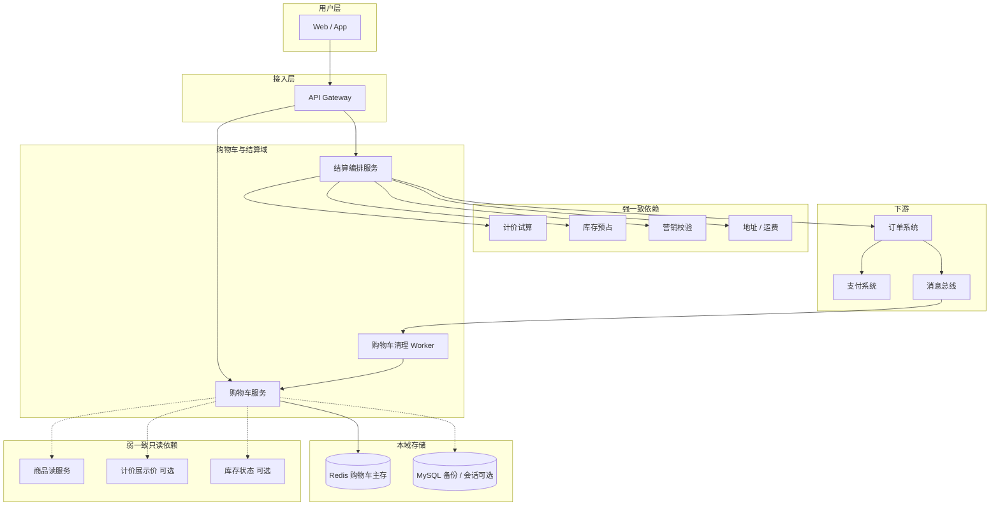
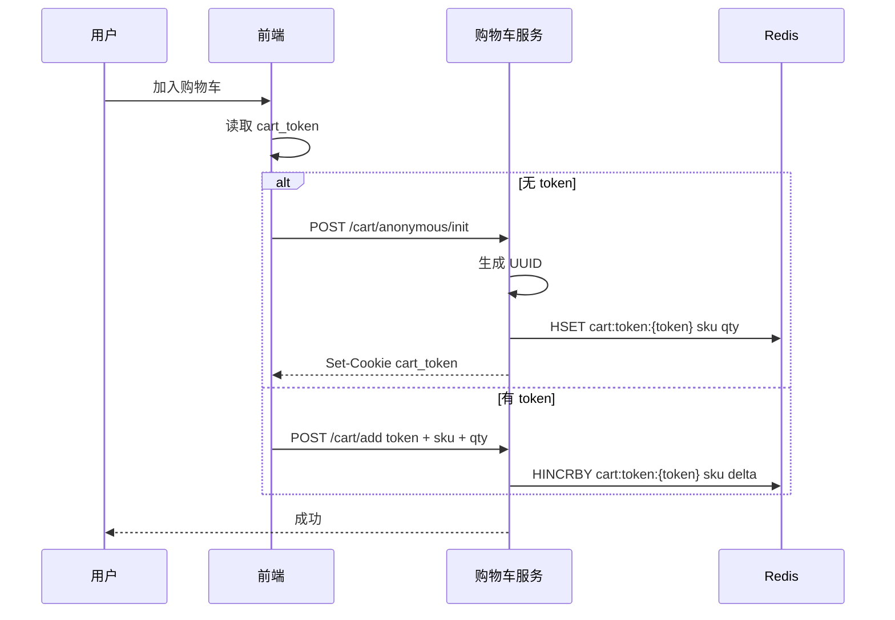
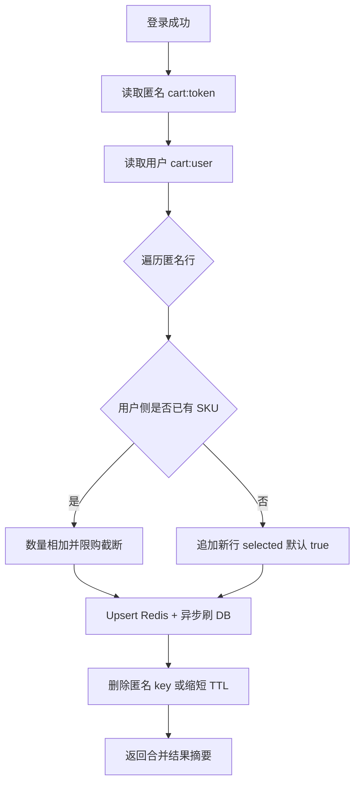
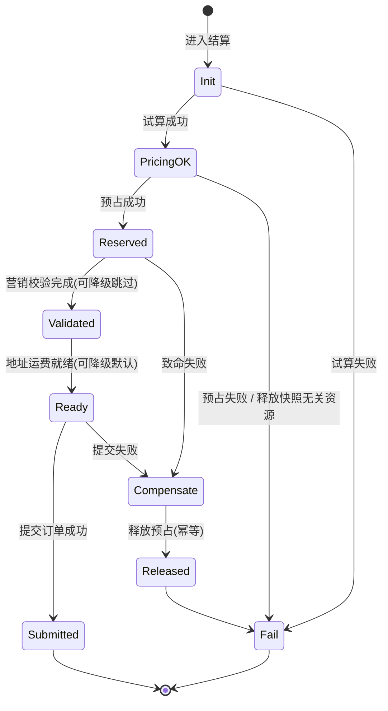
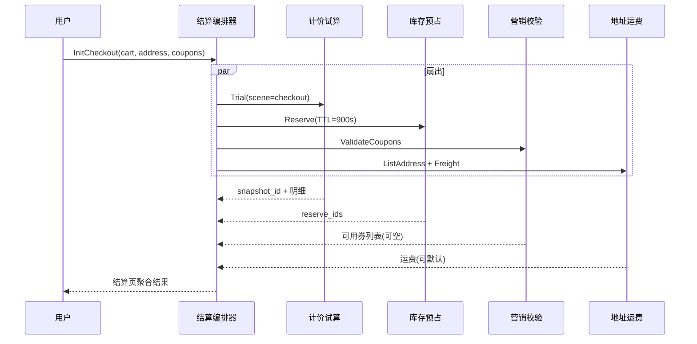
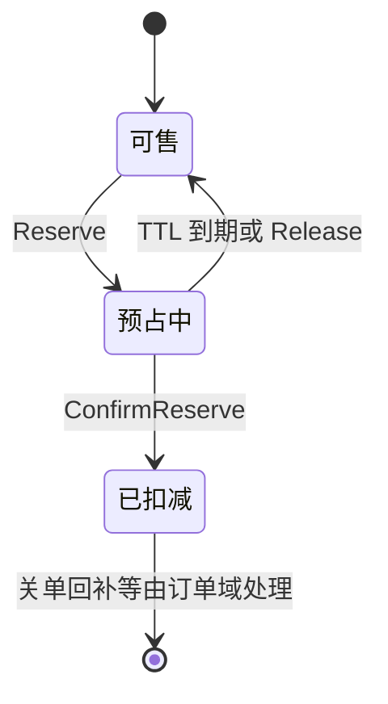
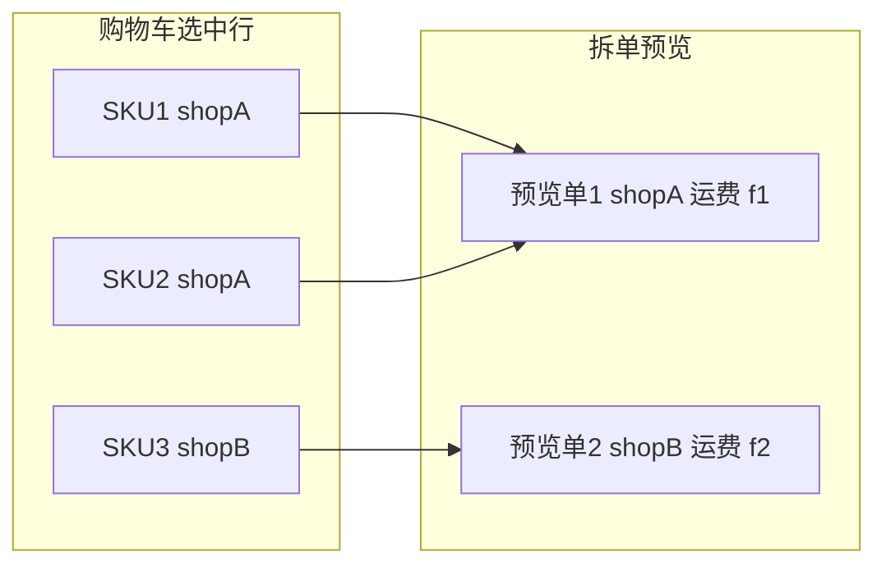
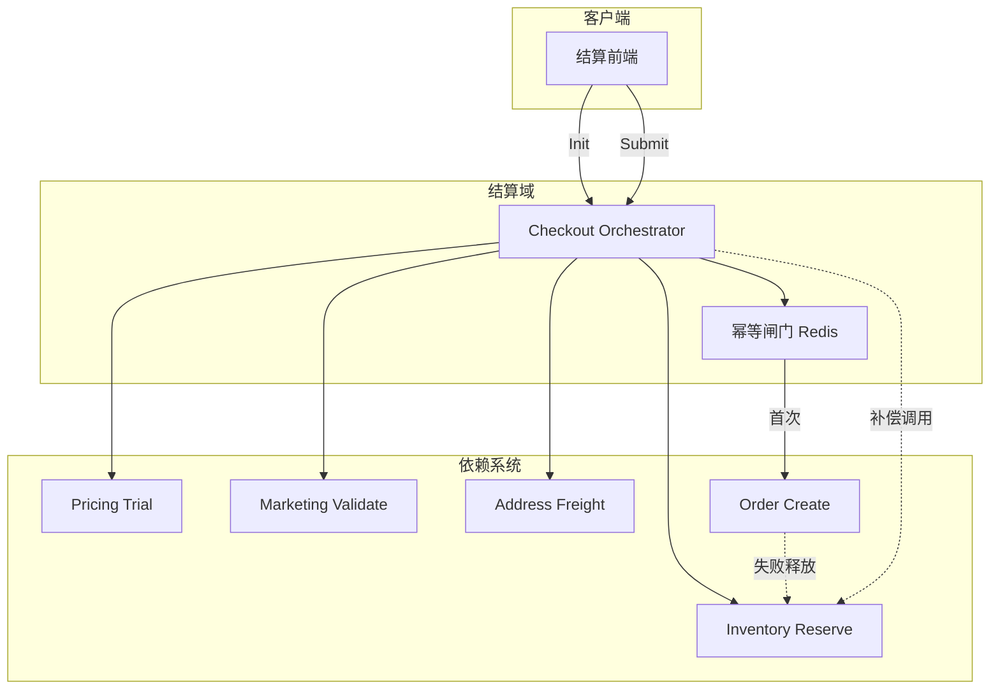

**导航**：[书籍主页](./index.html) | [完整目录](./TOC.html) | [上一章](./chapter12.html) | [下一章](./chapter14.html)

---

# 第13章 购物车与结算

> 本章基于《电商系统设计（十三）：购物车与结算域》整理扩展，聚焦转化漏斗中的**意愿暂存**与**交易前置校验**两段能力：购物车弱一致、不锁资源；结算页强一致、编排计价 / 库存 / 营销 / 地址，并通过 **Saga 补偿** 与 **幂等键** 保证可重入与可回滚。文中 Go 示例为教学裁剪版，落地时请补全超时、观测、注入与错误语义。

**阅读提示**：若你习惯把「购物车、结算、创单」写在同一个服务里，可以带着三个问题读完全章——第一，**预占库存为何不应出现在购物车**；第二，**试算与扣券为何必须拆开两个系统时刻**；第三，**拆单预览与真正拆单的边界应落在哪**。把这三件事想清楚，就能把本章与第 8 章（库存）、第 11 章（计价）、第 14 章（订单）自然衔接起来。

**面试映射**：面试官若问「购物车要不要用分布式锁」，优先回答「行级乐观锁 + Redis 原子写足够，锁购物车会放大死锁与热点」；若问「结算页是不是微服务必须的拆分点」，可以回答「逻辑边界必须清晰，物理部署可渐进」——先把包边界与数据边界立住，比一上来拆两个集群更有性价比。

---

## 13.1 系统定位

### 13.1.1 购物车与结算域

在典型电商链路 **浏览 → 加购 → 结算 → 下单 → 支付** 中，**购物车域**承担「意愿篮」：长期暂存 SKU 与数量、支持跨端查看、允许展示价与可售状态**弱一致滞后**。**结算域（Checkout）**承担「交易前的最后一次强校验」：价格试算拿到 `price_snapshot_id`、库存预占拿到 `reserve_ids`、营销只做**可用性校验**、地址与运费可短时缓存；用户点击提交后，把上述凭证交给订单系统创单，自身**不推进订单状态机**、不执行支付。

二者哲学差异可概括为：

| 维度 | 购物车 | 结算页 |
|------|--------|--------|
| 一致性 | 弱一致可接受 | 价格 / 库存 / 优惠需实时 |
| 资源锁定 | 不锁定 | 预占库存（如 15 分钟） |
| 生命周期 | 可长期保留 | 用完即焚或极短会话 |
| 失败策略 | 标记失效、不阻断浏览 | 关键依赖失败应阻断或明确降级 |

### 13.1.2 核心职责

**购物车服务**应内聚的职责包括：匿名 `cart_token` 发放与校验、登录后合并、Redis 主存储与 DB 异步备份、批量选择与数量修改（乐观锁）、列表 Hydrate（批量读商品、可选读展示价与库存状态）、失效商品标记。**不应**承担：计价规则、库存预占、券扣减、拆单履约路由。

**结算服务**应内聚：进入结算时的 **Saga 编排**（并发试算 / 预占 / 校验 / 地址运费）、提交订单前的 **幂等去重**、订单创建失败时的 **显式释放预占**、拆单与运费的**轻量预览**。**不应**承担：订单持久化与状态机、营销扣券事务、支付渠道路由。

从 **限界上下文（Bounded Context）** 视角看，购物车与结算可以部署为两个服务，也可以先合在一个进程里用包级边界隔离，但**语言层边界**要先立住：购物车领域的聚合通常是「购物车行集合」；结算领域的聚合更接近「一次结算尝试（CheckoutAttempt）」——它甚至不一定要落库，可以以请求上下文 + 外部系统返回的凭证组合存在。把这两个聚合混在一个 `Order` 聚合根里，是单体时代最常见的腐化起点：你会看到订单服务里长出「顺便改下购物车」的私有 API，最后谁也不敢删。

**团队分工建议**：购物车更接近 **增长与体验团队**（关注转化、列表性能、推荐插卡）；结算更接近 **交易与资金安全团队**（关注幂等、补偿、风控）。若组织上同属一个小组，也应在代码评审里用不同的 OWNERS 文件与 SLO 分栏，避免用购物车的发布节奏去承载结算的严谨性，反之亦然。

### 13.1.3 系统架构

下图给出购物车与结算在全局中的位置，以及读写依赖分层（只读展示 vs 强一致编排）。部署上，购物车服务与结算服务可共享网关与部分中间件，但建议 **独立扩容曲线**：大促往往是「加购 QPS」先于「结算 QPS」暴涨，混布会让结算的尾延迟拖慢加购。数据库侧购物车备份表与订单库也应物理隔离，避免创单洪峰影响购物车异步刷盘。



**架构要点**：购物车路径以 **Redis HASH** 为主键模型（`cart:{user_id}` 或 `cart:token:{token}`），结算路径以 **编排器** 为中心。默认推荐 **无状态结算**：每次进入结算重新试算与预占，前端仅持有上一次的 `snapshot_id` / `reserve_ids` 直到提交或超时，这样可以把复杂度压到可接受范围。若产品强需求「刷新页面仍保留勾选与券选择」，可在 13.8 引入轻量 `checkout_session` 并严格对齐预占 TTL 与快照过期时间，否则极易出现「页面看到的是 A 价、提交时已是 B 价」的认知冲突。

**本章显式非目标**：不把支付路由、支付渠道对账、订单履约全状态机纳入结算服务；不展开秒杀极端优化（仅在后文工程小节点到为止）；不把计价规则引擎、库存 Lua 细节、营销券批次台账重写一遍——这些分别归属第 11、8、9 章及订单第 14 章。

**与第 6 章（Saga 总论）的关系**：第 6 章给出编排 / 协同、补偿幂等与事件驱动的一般模式；本章把它落到「购物车弱一致 + 结算强编排」这一条具体链路上。你在评审架构时可以用一句话自检：**购物车里永远不该出现 Saga**，因为那里没有跨系统资源需要一致回滚；**结算页几乎必然出现 Saga**，因为试算、预占、创单分布在不同限界上下文。

---

## 13.2 购物车设计

除「能加购、能合并」外，购物车还需要回答四个体验问题：**加购后价格变了怎么办**、**商品下架了怎么办**、**跨端是否一致**、**风控与刷单边界在哪**。下面分小节把模型与工程一次说透。

### 13.2.1 未登录加购

未登录加购的本质是在**没有稳定用户主键**的前提下，为浏览器会话分配一个**可验证、可过期、可合并**的购物车标识。推荐由后端签发 `cart_token`（UUID），前端写入 **HttpOnly Cookie** 或受控存储，并与 Redis TTL（常见 7～30 天）对齐。

**流程要点**：首次加购若本地无 token，则调用匿名创建接口，服务端生成 token 并 `HSET`；后续请求携带 token 走 `HINCRBY` 或覆盖写入。



服务端应对 `cart_token` 做**签名校验**或存储侧校验，避免伪造 token 横向遍历他人购物车（常见做法：token 即随机高熵 ID，Redis 中不存在则拒绝；或对 token 做 HMAC 绑定设备指纹，视安全等级取舍）。

```go
// AddAnonymousCart 首次匿名加购：创建 token 并写入 Redis
func (s *CartService) AddAnonymousCart(ctx context.Context, skuID int64, qty int) (token string, err error) {
	token = uuid.NewString()
	key := "cart:token:" + token
	if err = s.rdb.HSet(ctx, key, strconv.FormatInt(skuID, 10), qty).Err(); err != nil {
		return "", err
	}
	_ = s.rdb.Expire(ctx, key, 30*24*time.Hour).Err()
	return token, nil
}
```

**安全与滥用面**：匿名桶没有账号体系背书，必须配合 **频控**（同 IP / 同设备加购 QPS）、**购物车行数上限**（例如单桶 120～200 个 SKU）、以及异常 token 批量探测的风控策略。否则黑产可以用海量 token 刷 Redis 与下游 Hydrate，把商品读服务拖成「另一个 DDoS 入口」。

**商品失效在购物车层的语义**：购物车不保证「可结算」，只保证「用户曾表达的意愿可追溯」。典型变化与展示策略如下（结算页会再次强校验）：

| 变化 | 购物车展示 | 是否允许去结算 |
|------|------------|----------------|
| 价格上涨 / 下降 | 展示最新参考价 + 轻提示 | 允许尝试进入结算 |
| 下架 / 禁售 | 行置灰 + 标签 | 不允许勾选结算 |
| 售罄 | 置灰 +「到货提醒」可选 | 不允许勾选结算 |
| SKU 被删除 / 查无此品 | 「商品失效」占位 | 不允许勾选结算 |

### 13.2.2 登录后合并

登录合并要解决三类冲突：**同 SKU 数量合并**、**不同 SKU 追加**、**业务约束**（限购、下架、售罄标记）。合并完成后应**失效匿名桶**（或保留短 TTL 供排障），并把前端 Cookie 清理或覆盖为用户态。



```go
// MergeCart 登录后合并：相同 SKU 数量相加，尊重限购上限
func (s *CartService) MergeCart(ctx context.Context, userID int64, cartToken string) error {
	anonKey := "cart:token:" + cartToken
	userKey := "cart:user:" + strconv.FormatInt(userID, 10)

	pipe := s.rdb.TxPipeline()
	anon, err := s.rdb.HGetAll(ctx, anonKey).Result()
	if err != nil {
		return err
	}
	for skuStr, qtyStr := range anon {
		skuID, _ := strconv.ParseInt(skuStr, 10, 64)
		addQty, _ := strconv.Atoi(qtyStr)
		cur, _ := s.rdb.HGet(ctx, userKey, skuStr).Int()
		newQty := cur + addQty
		if lim := s.limits.MaxQty(ctx, skuID); lim > 0 && newQty > lim {
			newQty = lim
		}
		pipe.HSet(ctx, userKey, skuStr, newQty)
	}
	pipe.Del(ctx, anonKey)
	_, err = pipe.Exec(ctx)
	return err
}
```

**合并冲突的决策表**（实现与产品需一致）：

| 场景 | 处理 | 备注 |
|------|------|------|
| 同 SKU | 数量相加 | 合并后再跑限购 |
| 仅匿名有下架 SKU | 保留并标记 | 让用户手动删 |
| 限购截断 | 调到上限并 toast | 记录审计日志 |
| 选中态 | 默认选中新并入 SKU | 也可继承匿名侧选中态 |

**跨端一致**：Web 与 App 只要最终都映射到 `user_id` 或同一 `cart_token`，Redis 即单一事实来源；DB 异步略滞后通常可接受。若业务强诉求「一端改数量另一端秒开即见」，可在用户维度加可选的 `cart.updated` 推送，但不要反向把推送当成库存真相。

### 13.2.3 Redis + DB 双写

关系库备份层推荐保留「行模型」而非把购物车 JSON blob 一塞了之，便于对账、客服查询与审计。匿名与用户共用一张表时，用 `user_id = 0` + `cart_token` 组合唯一索引：

```sql
CREATE TABLE shopping_cart (
    id BIGINT PRIMARY KEY AUTO_INCREMENT,
    user_id BIGINT NOT NULL DEFAULT 0 COMMENT '0 表示匿名',
    cart_token VARCHAR(64) DEFAULT NULL,
    spu_id BIGINT NOT NULL,
    sku_id BIGINT NOT NULL,
    quantity INT NOT NULL DEFAULT 1,
    selected TINYINT NOT NULL DEFAULT 1,
    version INT NOT NULL DEFAULT 1,
    added_at TIMESTAMP DEFAULT CURRENT_TIMESTAMP,
    updated_at TIMESTAMP DEFAULT CURRENT_TIMESTAMP ON UPDATE CURRENT_TIMESTAMP,
    UNIQUE KEY uk_user_sku (user_id, sku_id),
    UNIQUE KEY uk_token_sku (cart_token, sku_id),
    INDEX idx_user (user_id),
    INDEX idx_token (cart_token)
) COMMENT='购物车备份表';
```

**不存成交价**：购物车行只存 `sku_id`、数量、选中态等「意愿」，不在行上持久化价格。展示价来自商品标价或计价展示接口；否则一旦促销回溯，你会在库里同时存两种真相，客服与技术将无法争论哪一种才是「用户当时看到的意思」。

**推荐主路径**：写 Redis 同步成功即对用户返回成功；DB 通过 **异步队列** 或 **延迟批量刷盘** 落库，并配 **周期对账**（例如每 5 分钟扫描变更桶）以防 Redis 丢数据。**读路径**：优先 `HGETALL` Redis；miss 时读 DB 回填 Redis。

双写要避免「先 DB 后 Redis」导致的高延迟写路径；也要避免「只写 Redis 永不落库」带来的容灾空洞。工程上常采用 **Outbox** 或 **变更版本号**：每次写携带 `updated_at` / `cart_version`，Worker 按版本增量同步。

**故障切换剧本（建议在运维手册一页纸写清）**：当 Redis 集群大面积不可用时，购物车服务应能降级到 **只读 DB 或只接受写队列暂存** 两种模式之一——前者读慢但可用，后者写入排队、返回「稍后在购物车查看」类文案。无论哪种，都要避免「写请求默默丢失」。恢复后应有 **回填工具** 把 DB 最新版本同步到 Redis，并记录一次对账报告。

**对账视角**：定期抽样比对 Redis 与 DB 的行数与数量合计，差异超过阈值触发告警。差异来源通常是异步延迟、Outbox 堆积或历史 bug；不要用手工改 Redis「修数据」作为常规手段，除非同时修 DB 并留审计。

```go
// PersistCartItemAsync 异步落库示例：写 Redis 成功后投递 Outbox
func (s *CartService) PersistCartItemAsync(ctx context.Context, userID, skuID int64, qty int) error {
	key := "cart:user:" + strconv.FormatInt(userID, 10)
	if err := s.rdb.HSet(ctx, key, strconv.FormatInt(skuID, 10), qty).Err(); err != nil {
		return err
	}
	return s.outbox.Enqueue(ctx, CartChangedEvent{UserID: userID, SKUID: skuID, Qty: qty, TS: time.Now().UnixMilli()})
}
```

### 13.2.4 批量操作

批量全选 / 取消、批量删除、批量改数量，建议提供 **单次 RPC 批量接口**，减少往返。并发修改数量时使用 **乐观锁**（DB 表 `version` 字段）或 Redis **Lua 脚本**保证「读改写」原子性。

```sql
UPDATE shopping_cart
SET quantity = ?, version = version + 1, updated_at = NOW()
WHERE user_id = ? AND sku_id = ? AND version = ?;
```

若 `RowsAffected = 0`，返回冲突码让前端重试或刷新列表。批量接口内部仍可按 SKU 分片并行，但要对总耗时设上限，避免长尾拖垮网关。

**购物车列表 Hydrate（只读聚合）**：从 Redis 取出 `sku_id -> qty` 后，批量查询商品中心；展示价与库存状态为可选增强。部分失败应 **降级为占位文案** 而不是整页 500，否则转化率会被技术细节直接打掉。

```go
func (s *CartService) ListVO(ctx context.Context, userID int64) ([]LineVO, error) {
	key := "cart:user:" + strconv.FormatInt(userID, 10)
	raw, err := s.rdb.HGetAll(ctx, key).Result()
	if err != nil {
		return nil, err
	}
	ids := make([]int64, 0, len(raw))
	for k := range raw {
		id, _ := strconv.ParseInt(k, 10, 64)
		ids = append(ids, id)
	}
	prod, _ := s.product.BatchGet(ctx, ids)
	out := make([]LineVO, 0, len(raw))
	for skuStr, qtyStr := range raw {
		skuID, _ := strconv.ParseInt(skuStr, 10, 64)
		qty, _ := strconv.Atoi(qtyStr)
		p := prod[skuID]
		out = append(out, LineVO{SKUID: skuID, Qty: qty, Title: p.Title, Image: p.Image, Shelf: p.Status})
	}
	return out, nil
}
```

---

## 13.3 结算页设计

### 13.3.1 Saga 编排

结算页是典型的 **编排型 Saga（Orchestrated Saga）**：结算服务作为编排器逐步调用子系统，并在失败时执行**逆向补偿**（如释放预占）。它不追求 2PC 的强一致提交，而追求 **可观测、可补偿、幂等** 的业务闭环。

与 **协同式 Saga（Choreography）** 相比：结算链路强依赖「用户此刻在结算页」这一交互闭环，需要集中式的超时、降级与错误文案，编排器模式更利于排障与 SLA 治理；协同式更适合订单创建之后、履约与供应商之间那种长链路、多参与方且希望减少中心耦合的场景（第 6 章对比过二者，这里只强调落地选择）。

**进入结算 vs 提交订单**是两段 Saga：前者可以失败重试、可以部分降级；后者必须短、幂等、尽量少分支。实践中常见反模式是把两段逻辑写进同一个「上帝函数」，导致 Init 阶段的并发优化污染了 Submit 的可证明性。建议代码层拆 `CheckoutInitSaga` 与 `CheckoutSubmitSaga` 两个入口，共用领域服务但不同超时与指标。



**编排顺序的工程权衡**：试算与预占可否并行？若营销结果影响可售组合，可能需要串行；默认实践中常见做法是 **试算与预占并行以换取时延**，失败时按依赖关系补偿：若试算失败但预占已成功，应释放预占；若试算成功预占失败，一般无需回滚试算（快照由计价系统管理生命周期）。下图给出进入结算阶段的并发扇出。



### 13.3.2 价格试算

结算页必须调用计价中心的 **试算接口**（`scene=checkout`），拿到 **应付总额、分项明细、快照 ID 与过期时间**。购物车列表上的价格只能是「参考价」，产品话术需统一为 **「以结算页为准」**，否则客服与舆情成本极高。

试算失败属于 **P0 阻断**：不允许进入可提交状态。可选优化是快照过期后由订单系统二次校验或拒绝创单，但不应在结算页静默使用陈旧价。

**触发重新试算的事件**（与前端埋点一一对应，便于解释「为什么总价跳了」）：

| 事件 | 是否必须重算 | 说明 |
|------|----------------|------|
| 首次进入结算 | 是 | 建立基准快照 |
| 切换收货地址 | 通常要 | 运费与可达店铺集合可能变化 |
| 切换 / 取消优惠券 | 是 | 影响分层抵扣 |
| 修改数量（仍在结算页） | 是 | 行金额与门槛类活动联动 |
| 仅切换发票抬头 | 视税制 | 可能不影响含税价 |

**快照过期的产品策略**：常见做法是快照 30～60 分钟内有效，过期提示用户刷新；订单系统在创单时再做一次 **硬校验**，防止「结算页停留过久」绕过。不要试图在结算服务内「续命」快照，那会把计价系统的版本语义搅浑。

### 13.3.3 库存预占

预占解决的是「从结算到支付窗口内库存被抢走」的体验与超卖风险。预占时长常用 **900 秒**，由库存服务维护 TTL 与释放任务；结算服务在 **订单创建失败** 时显式调用 `release-reserve`，避免等待 TTL 造成的资源浪费。

预占与试算的失败组合处理见 13.6 节补偿表。核心原则：**结算页不实现扣减**，只持有 `reserve_ids` 凭证。

**用户在结算页改数量**：应走「释放旧预占 → 按新数量重新预占」的两段调用，中间态要对前端屏蔽或短锁按钮，避免双份预占。若释放成功而重新预占失败，应整体回退到「请返回购物车重选」的确定语义，而不是半提交。



### 13.3.4 营销校验

结算页调用营销 **只读校验**：判断券是否可用、圈品是否命中、互斥规则是否满足。**不扣券**。扣券放在订单创建事务路径（或订单 Saga 的下一步），避免「结算扣券成功、创单失败」带来的复杂回滚与客诉。

营销超时可 **降级**：隐藏优惠入口，以原价试算结果继续（需产品同意）；若业务不允许无券结算，则应阻断。

**券在结算与订单之间的「两段式」价值**：结算阶段输出的是 **可解释性**（为什么这张券灰掉），订单阶段输出的是 **事实**（券批次余额少了一次）。中间没有第三段「半锁定券」，除非你单独引入锁券服务——那会把领域模型再劈一叉，一般不值得。

**可选：有状态结算会话（复杂度权衡）**：默认仍建议无状态；若产品要求「刷新保留勾选与券」，需要额外持久化会话，并与预占 TTL、快照过期严格对齐，否则会出现「页面展示与提交凭证不一致」。表结构示例见 13.8.3。

---

## 13.4 拆单与地址运费

### 13.4.1 拆单预览

拆单维度通常包括：**跨店铺**、**跨仓**、**自营 / POP**、**不同履约 SLA**。结算页只做 **split-preview**：返回预计子单分组、每组 SKU、预估运费与送达时间；**不生成子订单 ID**，不调重度履约路由。

**预览要回答的用户问题是「我会收到几个包裹、各自多少钱」**，而不是「仓库拣货路径怎么走」。因此预览计算应使用 **与创单一致的拆分规则版本号**（例如 `split_ruleset=2026Q2`），在响应里透传；当订单系统发现规则升级导致结果变化时，可以返回可读错误码，让用户刷新结算页，而不是静默改单。

对于 **同一店铺多仓可发** 的场景，预览可能给出「可能拆」的灰色提示：真正选仓在订单或履约系统完成，预览只基于默认策略做估计。产品文案上建议用「预计」二字，技术文档里要写清楚 **估计误差允许的边界**，避免法务与客服在「预览两包裹实发合一」场景下无解。

**性能**：拆单预览输入是购物车选中行的结构化列表，复杂度通常在 `O(n)` 到 `O(n log n)`（按店铺、类目排序）；不要在预览里调用供应商实时询价类接口，否则结算页会被第三方 SLA 绑架。需要供应商参与的场景，应折叠为「下单后再确认」的异步路径，并在结算页显著提示。



预览接口建议由 **订单域** 提供只读计算（与真正拆单共享规则内核），避免结算域复制一套拆单逻辑。

### 13.4.2 地址选择

地址列表由用户域或履约子域提供。结算页缓存默认地址 ID，切换地址时触发 **运费重算** 与可选的 **试算重算**（运费是否进快照取决于计价模型）。需防止用户用「切换地址」刷爆运费服务：对 `(user_id, address_id, cart_hash)` 做频控与短 TTL 缓存。

**跨境与身份证 / 通关信息**：若地址切换会触发额外字段（实名、税号），不要把敏感信息长期缓存在结算会话里；遵循最小留存原则，提交创单时一次性写入订单快照或合规存储。**地址校验失败**（不可达、风控拦截）应区分「硬失败」与「软提示」：硬失败直接阻断；软提示允许用户继续但要在支付前再次确认。

**默认地址漂移**：用户可能在结算过程中于「地址管理页」修改默认地址。结算服务应以 **进入结算时锁定 address_id** 为主策略；若产品要求实时联动，需要 WebSocket 或轮询刷新，并重新跑试算与预占，复杂度会迅速上升——这是有状态会话最容易踩的坑之一。

### 13.4.3 运费计算

运费计算输入至少包含：**地址结构化信息**、**店铺维度**、**SKU 体积重量模板**、**促销包邮规则**。缓存 Key 示例：`freight:{address_id}:{cart_hash}`，TTL 20～60 秒。购物车变更或地址变更必须使 `cart_hash` 失效。

**运费与试算的关系**要在一开始就写进契约：如果运费进入计价快照，则切换地址必须同时触发试算 + 运费；如果运费独立，则订单系统创单时也要携带运费版本号，否则会出现「结算看到 10 元运费、订单变成 12 元」的纠纷。B2B2C 下常见是 **计价统一收口的应付金额** 已含运费，这时地址服务只作为试算的输入因子，而不是第二套计算器。

**拆单与运费的耦合**：跨店场景下，预览接口宜返回 **按店铺分组的运费数组**，前端展示「每店一笔运费」；不要在前端把多段运费硬加成单一标量，否则与后续子订单对账困难。冷链、大件、送货上门加价等，可作为 **运费模板扩展字段** 由地址 / 履约服务解释，结算域只展示结果不做规则。

---

## 13.5 系统边界与职责

### 13.5.1 购物车域与结算域

| 能力 | 购物车域 | 结算域 |
|------|----------|--------|
| 暂存 SKU / 数量 | 是 | 否（用购物车快照或请求体） |
| 展示 Hydrate | 是 | 仅必要时复用 |
| 试算 / 快照 | 否（可选展示价） | 是 |
| 预占 | 否 | 是 |
| 营销扣减 | 否 | 否（仅校验） |

### 13.5.2 结算与订单

**结算服务**在提交阶段只做三件事：幂等闸门、组装创单请求、调用订单 **Create**。订单系统负责：**真正拆单**、写订单与明细、确认预占转扣减、扣券、发布 `order.created` 事件。结算服务不应写订单表，也不应持有订单状态机。

**为何不能把「创单」继续留在结算服务里**：短期看少一次 RPC，长期看你会得到「结算发布 order.created、订单服务也发布 order.created」的双头龙，消费者不知道以谁为准；更糟的是版本升级时，两个团队对「部分失败是否算创单成功」理解不一致，线上会出现只有结算库有记录、订单库没有的幽灵交易。边界一旦划给订单，就要让订单成为 **订单事实的唯一写入者**。

**BFF（Backend for Frontend）与结算编排器的分工**：移动端 BFF 可以做字段裁剪、聚合多个读接口、甚至缓存用户地址列表；但不要把试算与预占藏在 BFF 里「顺便算一下」，否则 Web 与 App 会各自实现半套结算逻辑。推荐做法是 BFF 薄、结算编排厚、领域服务更厚。

### 13.5.3 资源锁定的归属

| 资源 | 锁定发生地 | 释放 / 确认 |
|------|------------|-------------|
| 库存预占 | 结算进入时 | TTL 自动释放；创单确认；失败显式释放 |
| 价格快照 | 计价系统生成 | 订单校验快照有效性 |
| 营销券 | 未锁定 | 订单创建时扣减 |

### 13.5.4 谁负责拆单预览

建议归属 **订单域只读 API**（或拆单内核库被订单服务托管）。结算域仅编排调用。若预览放在结算服务内，极易与履约变更耦合，出现「预览两单、创单变三单」的舆情风险——需版本化规则与免责声明。

**反模式速查**（评审清单可直接复用）：

| 反模式 | 为何糟糕 | 正确方向 |
|--------|----------|----------|
| 购物车预占库存 | 长期占用，利用率差 | 只在结算预占 |
| 购物车存成交价 | 与促销回溯冲突 | 行上不存价，展示时拉价 |
| 结算页扣券 | 创单失败要回滚券 | 订单扣券 |
| 结算页内嵌拆单履约 | 变更面爆炸 | 预览与真正拆单分离 |
| 结算服务写订单表 | 双写一致性与职责越界 | 只调订单 API |

---

## 13.6 与其他系统集成

### 13.6.1 与订单系统衔接（提交订单）

创单请求应携带：`idempotency_key`、`user_id`、`cart_items`、`price_snapshot_id`、`reserve_ids`、`coupon_ids`、`address_id`、`shipping_method`。订单系统内部再驱动库存确认与营销扣减（详见第 14 章）。

**边界**：结算服务 **不得** 根据创单结果去修改订单状态；支付 URL 的拼装可以放在 BFF，但支付单创建仍应由支付域根据订单事实驱动。结算返回给前端的应是 **订单 ID + 下一步跳转参数**，而不是「假装自己是订单库」。

```go
func (s *CheckoutService) Submit(ctx context.Context, r SubmitRequest) (*SubmitResult, error) {
	orderID, err := s.submitOnce(ctx, r.UserID, r.IdempotencyKey, func(c context.Context) (string, error) {
		return s.orders.Create(c, CreateOrderDTO{
			UserID: r.UserID, Items: r.Items, SnapshotID: r.SnapshotID,
			ReserveIDs: r.ReserveIDs, Coupons: r.Coupons, AddressID: r.AddressID,
		})
	})
	if err != nil {
		_ = s.inv.Release(context.Background(), r.ReserveIDs)
		return nil, err
	}
	return &SubmitResult{OrderID: orderID}, nil
}
```

### 13.6.2 与计价系统集成（价格试算）

结算只认计价返回的 `price_snapshot_id` 与过期时间；不在本地拼接促销表达式。

**契约要点**：试算请求应携带 **场景枚举**、**用户身份**、**地址因子**、**已选券列表** 与 **购物车行**；响应必须包含 **可审计明细** 与 **快照过期时间**。结算服务侧禁止缓存「最终应付」超过秒级，否则与风控频控冲突。

### 13.6.3 与库存系统集成（库存预占）

调用 `POST /inventory/reserve`，设置 `expire_seconds`；保存返回的 `reserve_ids[]` 直至创单成功或失败释放。

**幂等与重试**：预占接口在超时重试场景下必须由库存侧保证 **同一业务重放键** 不产生双倍占用（常见做法是基于 `user_id + checkout_trace` 或 `request_token` 去重）。结算侧则要把 `reserve_ids` 当作 opaque handle，不在本地推断库存数量。

### 13.6.4 与营销系统集成（优惠校验）

调用 `validate-coupons`；返回不可用原因用于前端提示。扣减走订单。

**购物车域为什么不调用营销**：购物车阶段引入营销，会把「意愿篮」变成「半个交易」，用户未表达购买意图就要承担券解释成本；更麻烦的是券规则与圈品频繁变更，购物车 Hydrate 会变成 O(N×规则) 的热点路径。

### 13.6.5 集成调用链路与补偿

下图从「进入结算」到「提交订单」画出主路径与补偿关注点（虚线为异步或失败回退）。



**补偿表（节选）**：

| 失败点 | 已完成 | 补偿 |
|--------|--------|------|
| 试算失败 | 可能已预占 | 释放预占 |
| 预占失败 | 试算成功 | 无需释放价快照 |
| 创单失败 | 预占在 | 释放预占；营销未扣券则无需回券 |
| 支付超时 | 订单进入关单流 | 由订单 / 库存回补（不在本章展开） |

**购物车域边界表（只读展示）**：

| 下游 | 调用 | 购物车不做 |
|------|------|-------------|
| 商品中心 | `POST /product/batch-get` | 不缓存详情、不判定可售真相 |
| 计价（可选） | `batch-display-price` | 不锁价、不算复杂规则 |
| 库存（可选） | `batch-status` | 不预占、不扣减 |
| 营销 | 不调用 | 不算券 |

**结算域边界表（强一致编排）**：

| 下游 | 调用 | 结算不做 |
|------|------|-------------|
| 计价 | `trial-calculate` | 不实现规则引擎 |
| 库存 | `reserve` / 触发 `release` | 不确认扣减 |
| 营销 | `validate-coupons` | 不扣券 |
| 地址 | `list` + `freight/calculate` | 不持久化地址 |
| 订单 | `create` | 不拆单、不推进状态机 |

### 13.6.6 Saga 编排实现

用 Go 的 `errgroup` 控制并发与 `context.WithTimeout` 控制尾延迟，再在汇聚点做决策：

```go
func (s *CheckoutService) InitCheckout(ctx context.Context, req InitRequest) (*InitResult, error) {
	g, ctx := errgroup.WithContext(ctx)
	var trial *TrialResult
	var resv *ReserveResult

	g.Go(func() error {
		c, cancel := context.WithTimeout(ctx, 800*time.Millisecond)
		defer cancel()
		r, err := s.pricing.Trial(c, TrialInput{UserID: req.UserID, Items: req.Items, Scene: "checkout"})
		if err != nil {
			return err
		}
		trial = r
		return nil
	})
	g.Go(func() error {
		c, cancel := context.WithTimeout(ctx, 500*time.Millisecond)
		defer cancel()
		r, err := s.inv.Reserve(c, ReserveInput{UserID: req.UserID, Items: req.Items, TTL: 900 * time.Second})
		if err != nil {
			return err
		}
		resv = r
		return nil
	})
	if err := g.Wait(); err != nil {
		if resv != nil {
			_, _ = s.inv.Release(context.Background(), resv.IDs)
		}
		return nil, err
	}
	return &InitResult{SnapshotID: trial.SnapshotID, Payable: trial.Payable, ReserveIDs: resv.IDs}, nil
}
```

提交阶段保持 **单线程顺序**：幂等 → 创单 → 返回 `order_id`。

**可观测性补充**：为每一次 `InitCheckout` 生成 `checkout_trace_id`，贯穿所有下游 RPC 的 baggage；在日志中打印各依赖耗时直方图标签（`pricing_ms`、`reserve_ms` 等）。Submit 路径额外打印 `idempotency_key` 与返回 `order_id`。这样当「只有某个地区的用户预占失败率升高」时，你可以快速判断是库存分片热点还是地址服务区域路由问题。

**集成测试建议**：至少三类用例要在 CI 里跑通：**Init 成功 + Submit 成功**、**Init 成功后订单返回冲突（模拟幂等）**、**Init 成功后订单失败触发释放**。第四类 **Init 部分依赖超时** 可以放在 nightly，以免拖慢 PR 流水线，但不能没有。

---

## 13.7 幂等性与去重

### 13.7.1 idempotency_key 设计

推荐由前端生成 **UUIDv4** 作为 `Idempotency-Key` 请求头或 JSON 字段，并在用户点击「提交订单」的**第一次交互**即固定，重试与自动重连复用同一键。服务端在结算网关或结算服务使用 Redis：

```
SET idempotency:{user_id}:{key} -> processing NX EX 120
```

成功后写入 `order_id` 作为值；重复请求直接返回缓存结果。**订单表**保留唯一索引 `(user_id, idempotency_key)` 作为最终兜底。

键空间建议包含 `user_id`，避免跨用户碰撞；TTL 覆盖「用户犹豫 + 网络抖动」窗口即可。

**键的生命周期与返回语义**：第一次提交进行中时，Redis 里可以是 `processing` 占位；成功后写入 `order_id` 并延长 TTL，重复请求应返回 **同一 `order_id`** 与 **同一支付跳转参数**，HTTP 层可用 `200` 或 `409`+业务体，但务必前后端约定一致。若创单失败删除了 Redis 键，客户端重试会生成新 UUID——这是允许的，但要评估「用户连点导致多笔预占」的极端情况；更好的 UX 是在失败提示里保留「重试同一单」入口，由前端复用旧键。

**与订单系统幂等的叠床架屋是否有必要**：有必要。网关 Redis 去重解决 **极短时间窗内的风暴重放**；数据库唯一索引解决 **跨进程、跨机房、Redis 丢失** 的慢变量问题。二者不是重复建设，而是不同时间尺度的防线。评审时如果有人问「只留 DB 行不行」，答案是行，但你会在高峰期看到大量创单请求把订单库打满冲突重试；「只留 Redis 行不行」，答案是也行，直到某次故障切换丢键。

```go
func (s *CheckoutService) submitOnce(ctx context.Context, user int64, key string, fn func(context.Context) (string, error)) (string, error) {
	rk := fmt.Sprintf("idem:%d:%s", user, key)
	ok, err := s.rdb.SetNX(ctx, rk, "processing", 2*time.Minute).Result()
	if err != nil {
		return "", err
	}
	if !ok {
		return s.rdb.Get(ctx, rk).Result()
	}
	orderID, err := fn(ctx)
	if err != nil {
		_ = s.rdb.Del(ctx, rk).Err()
		return "", err
	}
	_ = s.rdb.Set(ctx, rk, orderID, 24*time.Hour).Err()
	return orderID, nil
}
```

### 13.7.2 重复提交防护

三层组合：**前端按钮禁用 + 请求级幂等键 + 订单唯一索引**。仅依赖前端不可靠；仅依赖 Redis 可能因过期导致双单，因此 DB 唯一约束不可或缺。

**移动端弱网**：重试库（例如自动重放 POST）必须与业务幂等键协同，否则会在用户无感知的情况下放大写压力。建议移动端网络层对 **写操作** 默认关闭盲重试，或仅在收到明确可重试错误码时重放，并始终携带同一 `Idempotency-Key`。

**网关层去重与业务层去重的边界**：API Gateway 可以做粗粒度 IP + path 频控，但不要把「业务幂等」全部交给网关规则引擎；网关不知道 `reserve_ids` 是否已被使用，也不知道订单是否已支付。网关负责 **削峰**，结算与订单负责 **正确性**。

### 13.7.3 补偿机制

补偿分 **自动** 与 **显式**：库存 TTL 属于自动；创单失败触发结算服务显式 `release`。所有释放接口必须 **幂等**，重复调用不产生副作用。补偿任务应记录 **结构化日志 + metric**，便于统计「创单失败率 × 预占释放成功率」。

**补偿与重试的观测字段**：建议在日志与 Trace 中固定携带 `checkout_trace_id`（一次 Init 生成）、`idempotency_key`、`reserve_ids` 哈希、`snapshot_id`。当客服工单进来时，可以分钟级还原「当时为什么失败」，而不是靠 grep 多台机器。

**订单创建后的购物车清理**：推荐消费 `order.created` 事件异步删除已购 SKU，且以 `order_id` 做消费幂等。清理非强一致：即使延迟，用户最多看到「购物车还多一件已买商品」，用 UI 提示即可，不应阻塞支付跳转。

```go
func (w *CartCleaner) OnOrderCreated(ctx context.Context, e OrderCreated) error {
	if ok, _ := w.idem.Seen(ctx, "cart_clean", e.OrderID); ok {
		return nil
	}
	for _, it := range e.Lines {
		_ = w.rdb.HDel(ctx, "cart:user:"+strconv.FormatInt(e.UserID, 10), strconv.FormatInt(it.SKUID, 10)).Err()
	}
	return w.idem.Mark(ctx, "cart_clean", e.OrderID, 7*24*time.Hour)
}
```

---

## 13.8 工程实践

### 13.8.1 性能优化

1. 购物车列表 Hydrate 使用 **批量接口**，商品中心一次拉全 SKU；可选并行拉取展示价与库存状态。  
2. 结算 Init 使用 **errgroup + 独立超时**；对非关键依赖（营销、地址）允许降级。  
3. 热点用户桶考虑 **Hash Tag**（Redis Cluster 场景）与本地微缓存（谨慎，防击穿）。  

**购物车写放大**：`HINCRBY` 是 O(1)，但每一次加购若都同步触发 DB Outbox，会在大促预热期形成写放大。常见做法是 **合并窗口**（200ms 内多次变更合并为一条 Outbox）或按用户维度微批刷盘。**读放大**主要来自 Hydrate：务必限制 `sku_ids` 批量大小（例如每页 50），并对商品中心失败做部分成功返回，避免整页超时。

**结算页 P99 与转化率**：经验上，结算 Init 超过 1.5s 会显著伤害「进入结算 → 提交」转化。除并发扇出外，还应检查 **是否无意中串行化了可并行步骤**（例如把拆单预览放在试算之前且强依赖网络）；更隐蔽的是 **大 JSON 响应体** 与 **前端重复渲染** 造成的体感慢，这要靠前端性能与网关压缩共治。

### 13.8.2 转化漏斗监控

建议埋点维度：`scene`（搜索 / 活动 / 推荐）、`device`、`region`。核心比率：加购率、进入结算率、结算 Init 成功率、提交成功率、支付成功率。对 **幂等拦截率** 单独监控：异常升高可能意味着前端重复提交或网络重试策略错误。

**分层漏斗与告警**：除全站均值外，建议对 **新客 / 沉默唤醒 / 高客单** 分桶，否则会被大盘平均掩盖。告警上至少拆三条：结算 Init 错误率、预占失败占比、创单失败占比——三者根因不同，混在一个「下单失败率」里会排障困难。

**与业务运营协同**：漏斗面板应能下钻到 **错误码分布**（库存不足、券不可用、地址不可达、快照过期），否则运营只会看到「转化率掉了」，技术只会说「系统没挂」。把错误码映射到「可行动项」（补货、调整券门槛、修正运费模板）是平台化团队的工作方式。

### 13.8.3 降级策略

| 依赖故障 | 策略 | 风险 |
|----------|------|------|
| 营销 | 隐藏优惠 | 客单价下降 |
| 地址 | 使用默认地址 | 错发风险需产品接受 |
| 计价 / 库存 | 不建议静默继续 | 体验与资损 |

大促期间可启用 **排队结算** 或 **削峰队列**，把 Submit 变异步（需改变产品交互，谨慎）。

**结算依赖超时与重试（落地参考）**：

| 依赖 | 超时 | 重试 | 说明 |
|------|------|------|------|
| 计价试算 | 700～900ms | 0～1 次 | 失败即阻断 |
| 库存预占 | 400～600ms | 1 次 | 注意幂等键 |
| 营销校验 | 250～350ms | 0 次 | 可降级 |
| 地址运费 | 150～250ms | 0 次 | 可默认地址 |

**有状态结算会话表（可选）**：

```sql
CREATE TABLE checkout_session (
  session_id VARCHAR(64) PRIMARY KEY,
  user_id BIGINT NOT NULL,
  cart_snapshot JSON,
  price_snapshot_id VARCHAR(64),
  reserve_ids JSON,
  address_id BIGINT,
  expires_at TIMESTAMP,
  INDEX idx_user (user_id),
  INDEX idx_expires (expires_at)
);
```

启用会话时，要在 `expires_at` 到达后 **主动释放预占** 或依赖库存 TTL，并在前端显著提示「剩余有效时间」。

**Worker 清单**：Redis → DB 购物车增量同步；匿名桶过期清理；`order.created` 购物车清理；预占释放巡检（备份补偿）。每一项都要有 **可观测执行次数与失败率**。

---

## 13.9 本章小结

购物车与结算域分别回答 **「想买什么」** 与 **「现在能不能买」** 两个问题：前者弱一致、不锁资源，以 Redis + DB 双写与匿名合并保障体验；后者以 Saga 编排把计价试算、库存预占、营销校验、地址运费组合为可提交凭证，并通过幂等键与补偿释放保证韧性。清晰划分 **拆单预览 vs 真正拆单**、**试算 vs 扣券**、**结算 vs 订单状态机**，是避免边界腐化的关键。

如果把全章压成三条工程戒律，它们分别是：**购物车 never lock**、**结算 always orchestrate with timeouts**、**submit always idempotent end-to-end**。前两条保证体验与资源利用率，最后一条保证「用户只点一次，系统只落一单」这一最低限度的交易正义。

**与全书其他章节的衔接**：库存预占细节见第 8 章；计价与快照见第 11 章；订单创建、拆单与状态推进见第 14 章；支付见后续支付章节。

**最后一页检查清单（发布前自问）**：是否在 PRD 里写清了「价格以结算为准」；是否在接口契约里禁止购物车预占；是否在订单创单接口上强制 `idempotency_key`；是否为 `release-reserve` 写了幂等测试；是否在监控里拆分 Init 与 Submit 的成功率；是否为大促准备了预占 TTL 与线程池隔离参数。六项都打勾，这一章才算真正「从文章走进了系统」。若还能补充一页 **故障演练剧本**（依赖逐个超时、Redis 丢键、订单重复返回），团队在真实大促里会少很多「第一次见」的慌乱。

---

## 延伸阅读与引用

- 本书第 6 章：Saga 与幂等通用模式。  
- 本书第 8 章：库存预占、确认与释放。  
- 本书第 11 章：试算场景与快照校验。  
- 本书第 14 章：订单创建与分布式事务实践。  
- 外部参考：Microsoft Azure Architecture Center — Saga pattern；Redis Hashes 文档。

**落地阅读顺序建议**：先读第 11 章理解「快照从哪来」，再读第 8 章理解「预占与确认的语言」，最后读第 14 章看「订单如何把券与库存变成事实」。本章处在三者的交汇处：最容易写成「什么都能调一点的脚本服务」，也最考验你是否坚持用 **编排 + 凭证 + 幂等** 把复杂度关在门内。读完若只能记住一句话，建议记住：**购物车是缓存意志，结算是换取凭证，订单是写下事实**——三者顺序不可倒置；任何把「事实」前移到购物车或结算持久层的 shortcut，都会在客诉与对账里连本带息还回来，务必警惕为好。
