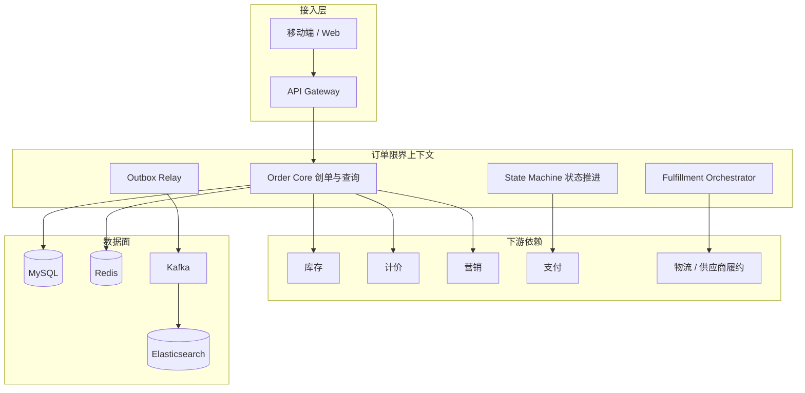
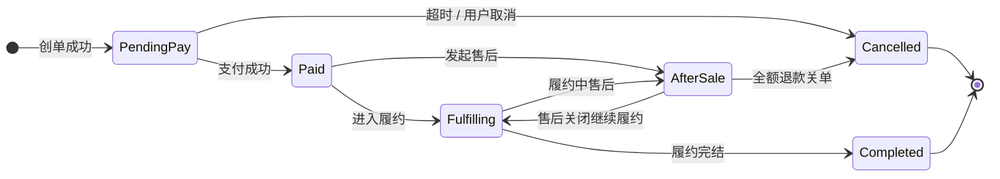
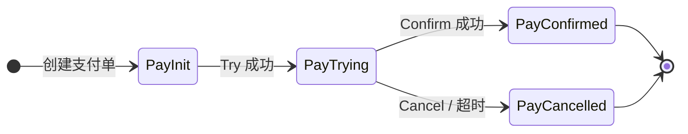
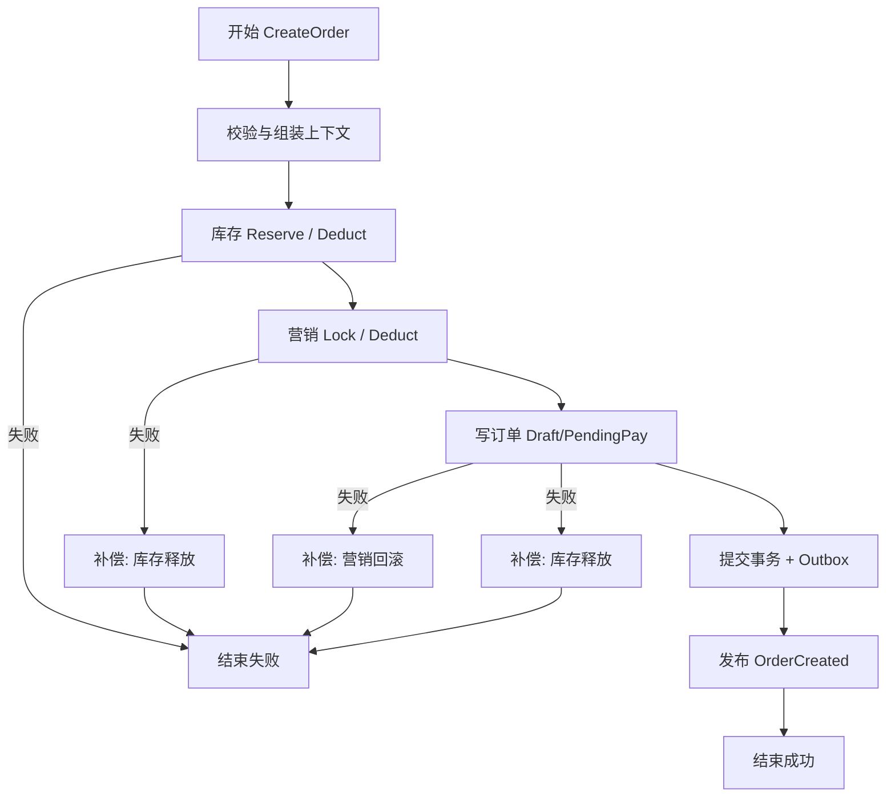
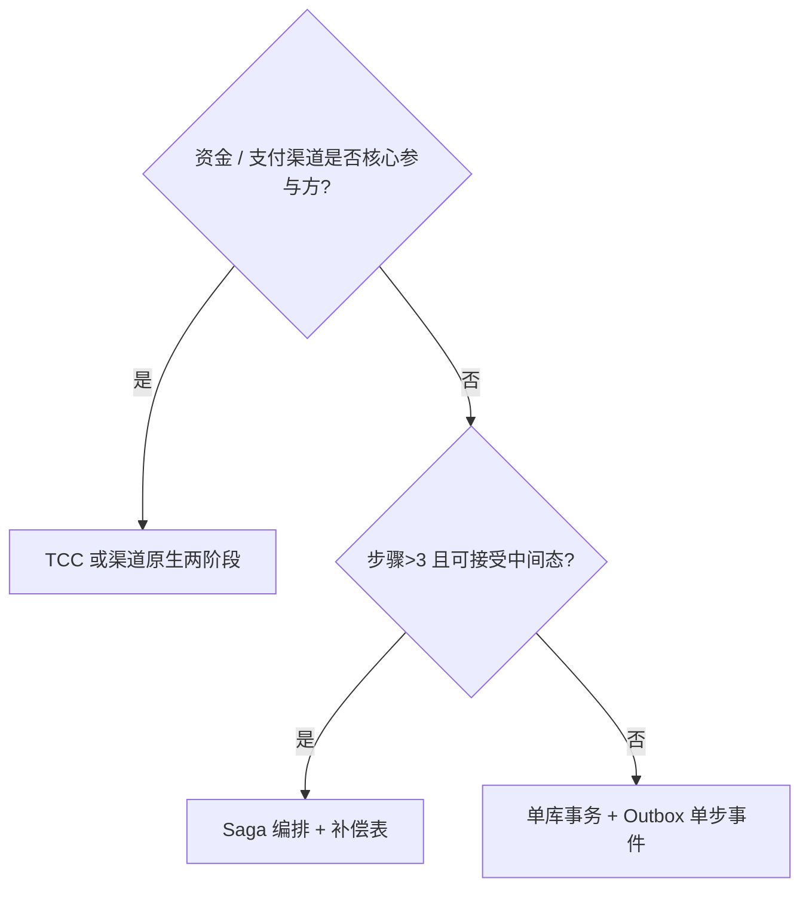
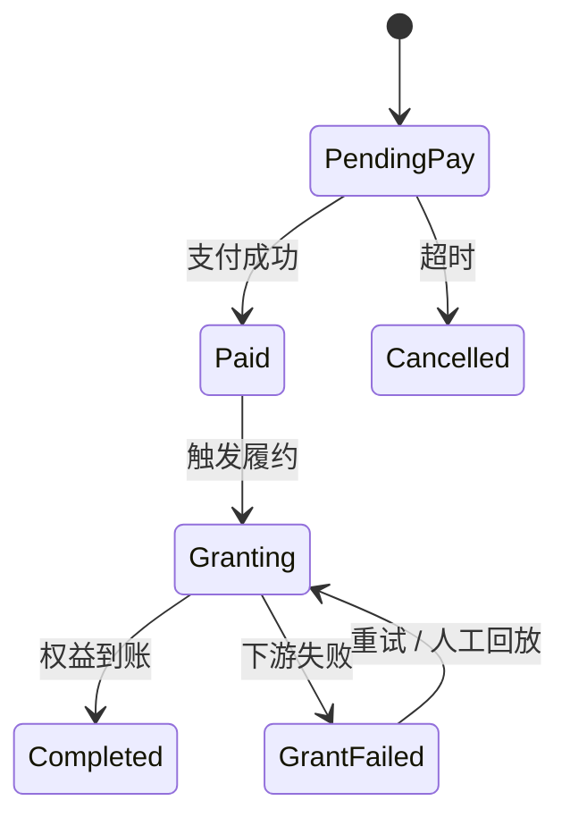
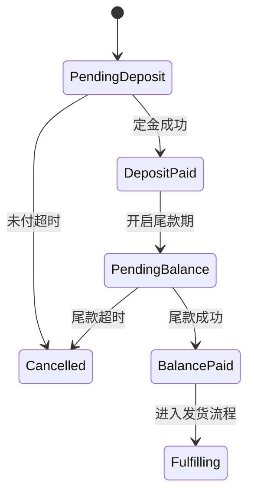
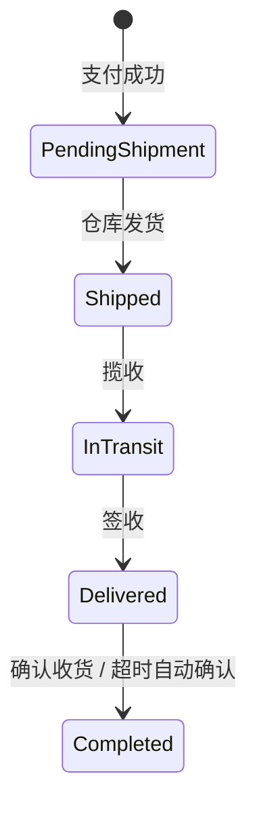
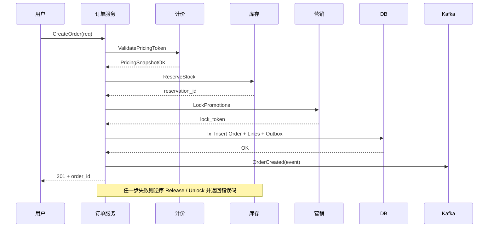

**导航**：[书籍主页](./index.html) | [完整目录](./TOC.html) | [上一章](./chapter13.html) | [下一章](./chapter15.html)

---

# 第14章 订单系统

> **本章定位**：订单系统是交易链路的**编排中枢**。本章在《电商系统设计（七）：订单系统》基础上按书籍体例重组，覆盖数据模型、状态机、创单 Saga、分布式事务（TCC / Saga）、幂等、特殊单类型、履约与系统边界；Go 示例为教学裁剪版，落地时请补全观测、鉴权与错误包装。

**阅读提示**：若你已读完第 11 章计价与第 13 章结算，可带着三个问题阅读——第一，**订单快照与计价快照如何对齐版本**；第二，**库存预占发生在结算还是创单，失败时谁补偿**；第三，**支付域与订单域的状态机如何解耦又不丢一致性**。搞清边界后，订单服务才不会长成「上帝对象」。

**与第 16 章案例的衔接**：在 B2B2C 聚合平台中，订单往往还要承载 **供应商订单号、供应商错误码、重试策略版本** 等跨域信息；本章给出的是「平台自营电商」的主干模型，落地到机票、酒店等品类时，应把供应商差异收敛到 **履约网关与扩展表**，避免主表字段爆炸。第 16 章 16.5.3 从全景角度回顾订单在微服务拓扑中的位置，可与本章边界小节交叉阅读。

---

## 14.1 系统概览

### 14.1.1 业务场景

订单系统连接用户、商品、库存、计价、营销、支付、履约与售后，典型职责包括：

- **创单编排**：校验、拆单、落库、驱动库存 / 营销等资源侧执行；
- **状态管理**：主单状态机与子域（支付、履约、售后）协同；
- **事件发布**：`OrderCreated`、`OrderPaid` 等驱动异步履约与数据分析；
- **可追溯**：行级快照、金额快照、状态流水满足审计与对账。

订单系统**负责**流程编排与订单事实的持久化；**不负责**库存原子扣减实现、支付渠道路由、物流轨迹计算——这些属于各自限界上下文。

从用户旅程看，订单是「一次购买意图」在系统中的**物化载体**：购物车表达意图，结算页收敛约束，订单把约束写成**不可抵赖的事实**（谁、在什么时间、以什么价格、买了什么、用了哪些权益）。因此订单域的 API 设计应偏向**命令式与幂等**（`CreateOrder`、`CancelOrder`），而不是把计价规则或库存脚本再暴露一遍。否则网关层会出现大量「为了创单临时拼出来的 DTO」，后续每次改营销口径都要联动发版。

在多租户或 B2B2C 场景下，订单还要携带**租户、店铺、销售渠道**等维度，这些字段会直接影响分库键、对账口径与发票主体。建议在模型早期就固定「主单维度集合」，避免后期把店铺 ID 塞进备注字段。对客服与风控而言，订单号是串联各系统的**公共关联键**，应在日志规范中强制全链路透传。

### 14.1.2 核心挑战

| 挑战 | 表现 | 设计抓手 |
|------|------|----------|
| 高并发 | 大促创单峰值、热点用户 | 分库分表、异步削峰、限流熔断 |
| 一致性 | 跨库存 / 营销 / 计价多写 | Saga + 补偿表 + 对账 |
| 状态复杂 | 主状态 + 子流程并行 | 子状态机 + 显式事件 + 审计日志 |
| 类型多样 | 实物、虚拟、O2O、预售 | 策略模式 + 扩展点 |
| 幂等 | 重试、回调、用户连点 | 幂等表 + 状态机 + 业务唯一键 |
| 可追溯 | 客诉、风控、财务 | 快照版本、Outbox、状态历史 |

**组织层面的补充**：订单团队常被拉去「顺便」做营销试算或支付路由，短期能救火，长期会造成**循环依赖与发布耦合**。建议在架构评审中把「编排」与「计算 / 执行」拆开画依赖图：订单只依赖**稳定的 RPC 契约**，不依赖对方存储模型。

**容量视角**：订单创建往往是洪峰「汇聚点」——上游购物车、结算已经做过一次编排，创单仍需在短时间内完成多次 RPC。此时瓶颈常在**下游库存热键、营销锁券、DB 事务持锁时间**。压测时应区分「创单接口自身 QPS」与「端到端成功率」，并单独观测 **Saga 每步 P99** 与 **补偿队列深度**，否则容易出现「接口没超时但用户看到一直转圈」的体验问题。

**一致性视角**：订单域最容易犯的错误，是把「用户看到的状态」与「内部资源状态」混在一张表里频繁互转。更稳妥的做法是：**主单状态只表达对用户承诺的阶段**；资源是否释放、券是否退回，由子域与补偿任务保证，主单只记录结果事件。这样客服解释成本更低，报表口径也更稳定。

### 14.1.3 系统架构

订单域内部可拆为：**Order Core（创单与查询）**、**Order State（状态机服务）**、**Fulfillment Orchestrator（履约编排，可与核心同进程或独立部署）**、**Projection Worker（读模型 / 搜索同步）**。存储上 **MySQL** 承载权威订单数据，**Redis** 做详情缓存与短时防重，**Kafka** 承载领域事件；搜索侧可由 **Elasticsearch** 异步投影。

**安全与合规**：订单表包含地址、电话等个人信息，需按最小权限原则控制导出接口；对客服脱敏展示与完整审计应分角色授权。对外部合作伙伴（如供应商、物流）同步订单数据时，应通过 **网关字段级裁剪** 而非直接暴露内部宽表。日志中禁止打印完整支付卡号与证件号，必要时使用 **tokenization** 后的引用 ID。

**多活与容灾**：订单写路径强依赖主库可用性，跨机房多活通常采用 **单元化 + 用户分片路由** 或 **主从切换** 策略；事件总线需配置跨集群复制与 **消费者位点备份**。演练时要验证：主库故障切换后 Outbox 是否重复投递、消费者是否幂等。

**版本化 API**：订单查询接口应对外标注 **响应 schema 版本**，并在字段弃用时保留兼容期；创单请求亦应携带 **客户端版本号**，便于回溯「哪一版 App 产生了异常参数」。在契约测试中，把 **错误码表** 与 **幂等语义** 一并纳入回归范围，可显著降低联调返工率。

**成本与存储治理**：订单明细与快照会随时间线性增长，需制定 **冷热分层**（热数据 SSD、冷数据归档到对象存储）与 **压缩策略**（对大 JSON 快照启用压缩列或拆表）。同时评估 **法务保留周期**，避免无限期囤积个人地址数据带来合规风险；到期匿名化应与状态机终态联动触发。

**开发者体验**：订单域建议提供 **本地夹具（fixtures）** 与 **一键造单脚本**，让前端与测试可在秒级生成处于各主状态的样例单；并在 Swagger / Buf 文档中写清每个错误码对应的用户提示与重试建议，减少「联调靠吼」的沟通成本。

**本章与第 6 章关系**：第 6 章从全局角度归纳 Saga、事件驱动与幂等模式；本章把它们落到订单这一 busiest 的编排点上，可作为第 6 章的案例化深读材料。

**阅读顺序建议**：若时间有限，可优先精读 14.3、14.4、14.5、14.6、14.9、14.10，其余小节作为查阅索引。

**术语提示**：文中英文术语如 Saga、Outbox、Process Manager 等在团队内首次落地时，请在词汇表写明中文对照与缩写规则，避免口头沟通歧义。



**读路径与写路径分流**：创单、支付回调、履约回传属于写模型；「我的订单列表」高 QPS 查询可走投影表或 ES，以 **eventual lag** 换取扩展性，但**订单详情页强一致读**仍建议回源主库或带版本号的缓存。

**部署与弹性**：订单核心通常按「有状态尽量避免」原则设计——会话态放在 Redis 或客户端 `request_id`，服务端保持无状态水平扩展。Outbox Relay 与履约 Worker 可独立扩缩容，避免与大盘创单抢 CPU。跨机房时，优先保证**写主就近**与 **Kafka 多副本**，读副本延迟通过版本号或「刷新」按钮产品化，而不是在接口层偷偷强读从库。

---

## 14.2 订单数据模型

数据模型是订单域与周边系统对话的「共同语言」。表结构一旦轻率扩展，会在数年后以 **报表口径漂移、对账困难、索引失效** 的方式反噬团队。设计时建议坚持三条约束：第一，**主表保持瘦**——只放跨行、跨流程的汇总与阶段字段；行级细节、履约扩展、风控标签下沉子表。第二，**金额字段语义单一**——每个金额列在数据字典中绑定唯一业务定义（含税 / 不含税、含运费 / 不含运费），禁止复用同一列表达多种口径。第三，**时间字段成体系**——`created_at`、`paid_at`、`closed_at` 与状态机一一对应，避免用 `updated_at` 推断业务时刻。

在国际化与多店铺场景，模型还要提前容纳 **税号、发票类型、买家身份（C 端 / B 端）** 等字段，即使首期不上线，也应预留扩展位或使用 JSON 扩展表，以免后续 ALTER 大表锁死业务。与数据仓库的衔接上，建议把订单变更以 **CDC 或领域事件** 方式同步到 ODS，避免数仓直接扫主库大表。

### 14.2.1 订单表设计

主表保存订单级事实：**用户、类型、主状态、金额汇总、版本号、时间戳**。金额一律用**分（int64）**存储，避免浮点误差。

```go
// Order 主表 ORM 示意
type Order struct {
	OrderID         string    `json:"order_id"`
	UserID          int64     `json:"user_id"`
	OrderType       int8      `json:"order_type"` // 1 实物 2 虚拟 3 O2O 4 预售
	Status          int16     `json:"status"`
	TotalAmount     int64     `json:"total_amount"`     // 商品应付合计（含运费等按口径）
	PaymentAmount   int64     `json:"payment_amount"`   // 用户实付
	DiscountAmount  int64     `json:"discount_amount"`  // 优惠合计
	FreightAmount   int64     `json:"freight_amount"`
	Currency        string    `json:"currency"`
	PricingSnapshot string    `json:"pricing_snapshot"` // JSON：计价中心快照 ID / 版本
	CASVersion      int64     `json:"cas_version"`
	CreatedAt       time.Time `json:"created_at"`
	UpdatedAt       time.Time `json:"updated_at"`
}
```

**索引建议**：

- 主键：`order_id`（Snowflake 或分段号段）；
- 查询：`(user_id, created_at DESC)` 支撑列表；
- 运营：`(status, updated_at)` 支撑关单扫描、履约队列。

**分库分表注意**：若以 `user_id` 为分片键，需保证 **订单号到分片的路由可逆**（例如 `order_id` 内嵌分片号，或维护全局路由表）。否则仅凭 `order_id` 查询会退化为全分片广播。另一种常见做法是按 `order_id` 哈希分片、列表查询走 ES 投影表，主库只服务按单号点查与写路径。

**软删除 vs 状态终态**：交易订单通常**不物理删除**，以 `Cancelled`、`Closed` 等终态表达关闭；合规与审计要求下，敏感字段脱敏也应保留主键与流水。若业务误用 `is_deleted` 与状态机双轨，会出现「状态已支付但记录被软删」的灾难组合。

### 14.2.2 订单明细

明细表一行对应一个 **SKU 实例**，保存数量、行小计、关联商品快照 ID，可选存 **分摊后的优惠** 以便部分退款闭合。

```go
type OrderLine struct {
	LineID       int64  `json:"line_id"`
	OrderID      string `json:"order_id"`
	ProductID    int64  `json:"product_id"`
	SkuID        int64  `json:"sku_id"`
	Quantity     int32  `json:"quantity"`
	SalePrice    int64  `json:"sale_price"`    // 行单价（已含当时营销结果视口径）
	LineAmount   int64  `json:"line_amount"`   // sale_price * quantity - line_discount
	LineDiscount int64  `json:"line_discount"`
	SnapshotID   string `json:"snapshot_id"`   // 商品展示快照
}
```

**拆单**：若业务要求「不同仓 / 不同商家」拆子单，可引入 `shipment_group_id` 或子订单表；主单与子单的支付关系需在模型层一次性说清，避免支付回调时无法定位行。

**行级扩展字段**：跨境、大宗或企业采购常在行上携带 **税率、HS 编码、采购合同号** 等。建议用 `line_extra JSON` 或独立扩展表，并在写入时做 schema 版本号，避免无约束 JSON 变成「第二个代码仓库」。部分退款时，需能根据行级快照与分摊规则还原「可退金额」，这与第 11 章的分摊口径强相关。

**赠品与换购**：赠品行可标记 `line_type=gift`，金额为 0 但仍占用库存与履约单元；换购行则绑定主行 `parent_line_id`。建模时务必让履约与库存识别「最小履约单元」，否则会出现赠品未发但主单已完成的口径争议。

### 14.2.3 价格快照

价格快照解决**事后解释**问题：用户下单后商品改价，应以快照为准。实践中常并存两层：

1. **计价中心快照**（第 11 章）：规则解释结果、分层明细、舍入版本；
2. **商品展示快照**：标题、主图、规格文案，用于客服与纠纷处理。

```go
type OrderPricingSnapshot struct {
	SnapshotID   string `json:"snapshot_id"`
	PricingJSON  []byte `json:"pricing_json"`  // 来自计价中心
	RuleVersion  string `json:"rule_version"`  // 活动 / 券批次版本
	CreatedAt    time.Time `json:"created_at"`
}
```

创单事务内写入 `order.pricing_snapshot` 外键或内嵌 JSON，支付校验阶段**只校验不重新全量试算**（与第 11 章口径一致），避免渠道变化导致「可支付金额漂移」。

**快照与客服工单**：客服系统应能按 `snapshot_id` 拉取**当时的展示文案与分层价格**，而不是实时读商品中心。否则用户截图与后台看到的不一致，纠纷成本极高。若快照体积过大，可采用 **对象存储 + 哈希引用**，MySQL 仅存指针与版本。

**多币种**：`Currency` 与汇率快照需同事务写入；支付若支持用户切换币种，应生成新的支付上下文而不是覆盖原订单金额字段，除非业务流程明确允许改价。

### 14.2.4 状态历史

`order_state_log` 记录 **from / to / operator / reason / event_name**，可选挂 `payment_id`、`fulfillment_id`、`refund_id`。与 Outbox 同事务写入，可投影 `OrderStateChanged` 供风控与 BI。

```go
type OrderStateLog struct {
	LogID      int64     `json:"log_id"`
	OrderID    string    `json:"order_id"`
	FromStatus int16     `json:"from_status"`
	ToStatus   int16     `json:"to_status"`
	Event      string    `json:"event"` // PaySuccess, Ship, Delivered...
	Operator   string    `json:"operator"`
	Reason     string    `json:"reason"`
	CreatedAt  time.Time `json:"created_at"`
}
```

**幂等辅助表**（可与通用幂等表合并）：`idempotent_record(idempotent_key UNIQUE, biz_type, biz_id, status, expire_at)`，支撑创单、回调、补偿。

**事件字段规范**：`event` 建议使用 **过去式英文枚举**（如 `PaySucceeded`）并在网关层统一大小写，避免日志检索分裂。`operator` 区分 `system`、`user:{id}`、`admin:{id}`、`payment_channel`，便于审计。若与 GDPR / 个人信息保护法合规，展示层再脱敏，但底层链路保留可追责 ID。

---

## 14.3 订单状态机

### 14.3.1 全局状态机

线上常用「**主状态** + **子状态机**」：主状态面向用户与报表；支付、履约、售后各自维护子状态，通过领域事件驱动主状态迁移。



**子状态机（支付侧示意）**：主单进入 `PendingPay` 后，支付域独立维护尝试次数、渠道、风控结果。主单不应细化为「微信处理中 / 支付宝处理中」，否则订单表会被渠道维度污染；必要时用 `payment_sub_status` 扩展列或独立 `order_payment` 表承载。



当 `PayConfirmed` 事件到达订单应用服务时，才触发主单 `PendingPay → Paid`，并写入状态日志 `event=PaySucceeded`。若只有主单状态没有子单记录，排障时很难解释「用户看到支付成功但订单仍待支付」的短暂不一致窗口。

### 14.3.2 状态转换规则

用 **显式白名单** 表达合法迁移，禁止散落 `if` 隐式跳转。下表为示意矩阵（行：from，列：to，`✓` 合法）。

| from \\ to | PendingPay | Paid | Fulfilling | Completed | Cancelled | AfterSale |
|------------|--------------|------|--------------|-----------|-----------|-----------|
| PendingPay | — | ✓ | ✗ | ✗ | ✓ | ✗ |
| Paid | ✗ | — | ✓ | ✗ | ✗ | ✓ |
| Fulfilling | ✗ | ✗ | — | ✓ | ✗ | ✓ |
| Completed | ✗ | ✗ | ✗ | — | ✗ | 视业务 |
| Cancelled | ✗ | ✗ | ✗ | ✗ | — | ✗ |
| AfterSale | ✗ | ✗ | ✓ | ✓ | ✓ | — |

**回退约束**：默认不允许 `Paid → PendingPay`；若支付风控冲正，应走 **支付域事件 `PaymentReversed`**，由订单编排显式迁移到 `Cancelled` 或特殊 `PaymentFailed` 终态，并触发资源回补 Saga。

**并发与乱序**：支付回调可能晚于用户主动取消；履约回调可能早于支付成功（脏数据）。统一策略是：**任何迁移前读取当前主状态 + CAS**；非法迁移记录审计并打指标，而不是「静默成功」。对疑似乱序消息可进入 **延迟队列** 二次投递，但要有上限避免永远悬挂。

**超时关单**：`PendingPay` 超时迁移到 `Cancelled` 时，应同时触发 **库存释放与营销解锁**；若关单任务与支付回调并发，必须以数据库行锁或 CAS 决定**只有一个赢家**，失败方进入补偿或幂等返回。

### 14.3.3 状态机实现

推荐 **表驱动 + CAS 更新**：引擎根据 `(from, event)` 查 `to`，再执行带 `WHERE status = ? AND cas_version = ?` 的更新，失败则视为并发抢占或重复事件。

**Guard 条件**：除 `(from, event)` 外，真实系统常需要额外守卫，例如「仅当 `pay_expire_at` 未到期才允许 `PendingPay → Paid`」「仅当所有子单已发货才允许 `Fulfilling → Completed`」。守卫逻辑建议写成 **纯函数** `func Guard(order *Order, ev Event) error`，便于单测与可视化文档同步维护。

**批量状态推进**：运营后台「批量关闭异常单」属于高危操作，应走 **审批流 + 异步任务**，每条订单仍执行单条 CAS 与日志，避免一条 SQL 批量 `UPDATE` 丢失审计信息。

```go
type Event string

const (
	EvtPayOK   Event = "PaySuccess"
	EvtTimeout Event = "PayTimeout"
	EvtShip    Event = "Shipped"
)

var transitionTable = map[int16]map[Event]int16{
	StatusPendingPay: {EvtPayOK: StatusPaid, EvtTimeout: StatusCancelled},
	StatusPaid:       {EvtShip: StatusFulfilling},
}

func ApplyEvent(ctx context.Context, repo OrderRepo, orderID string, from int16, ev Event, actor, reason string) error {
	to, ok := transitionTable[from][ev]
	if !ok {
		return ErrIllegalTransition
	}
	if err := repo.UpdateStatusCAS(ctx, orderID, from, to); err != nil {
		return err
	}
	return repo.AppendStateLog(ctx, orderID, from, to, string(ev), actor, reason)
}
```

### 14.3.4 状态变更历史

历史表与主表 CAS 同事务提交；若需 **对外通知**，使用 Outbox 保证「日志落库 ⇒ 消息必达」。监控上应对 `illegal_transition_total` 按 `from,to` 聚合，异常飙升多为回调乱序或重复投放。

**回放与对账**：状态日志是订单域最重要的**法务与财务证据链**之一。导出报表时，应能按时间序重放 `from → to` 与 `event`，并与支付流水、物流轨迹交叉验证。若仅保存终态而无过程日志，出现「用户声称未收到货」时将难以举证。

**测试策略**：为 `transitionTable` 维护单元测试矩阵，覆盖所有 `(from, event)`；对并发场景增加 **模糊测试**（随机交叉回调与关单任务）。生产灰度时，可短暂打开「非法迁移采样日志」定位历史脏规则。

---

## 14.4 订单创建流程

创单可拆四步：**参数校验 → 资源侧扣减 / 锁定 → 订单持久化 → 异步事件**。

### 14.4.1 参数校验

- 用户风控、地址、发票抬头；
- SKU 可售、限购、黑白名单；
- 计价快照版本与当前试算差异阈值（超限则拒绝创单提示刷新）；
- 营销资格（券批次、人群标签）。

**校验分层**：建议拆为 **语法校验（网关）**、**权限校验（用户会话）**、**业务不变式校验（订单域）**。不变式包括：行数上限、单用户并发创单上限、敏感 SKU 需二次验证等。不要把所有校验堆在单个「上帝函数」里，可按 **Pipeline** 组织，便于单测与观测每步耗时。

**与结算一致性**：若用户从结算页提交，创单请求应携带 **结算会话 ID 或 booking_token**（第 11 章），订单域校验其未过期且未被消费。否则会出现「结算页显示可买，创单失败」的合理但体验差场景——需用明确错误码驱动前端刷新。

**拆单预览**：若创单前已展示拆单结果，创单请求应携带 **拆单版本号**；服务端重新计算拆单，不一致则拒绝以保护用户预期。

### 14.4.2 库存扣减

与第 8 章对齐：创单常用 **Reserve（预占）** 或 **Deduct（直接扣）**，取决于品类 `deduct_timing`。失败快速返回，不必进入订单落库。

**失败语义**：库存返回 `INSUFFICIENT_STOCK` 与 `HOTKEY_THROTTLED` 应对前端不同提示；后者可触发排队或重试策略。订单域不应把供应商超时简单映射为库存不足，以免误导用户。

**跨仓**：多仓 reserve 应按「子单顺序」或「固定 SKU 字典序」调用，降低死锁概率；任一子仓失败应整体失败并释放已成功部分。

### 14.4.3 营销扣减

营销侧提供 **Lock / Deduct + Compensate** 语义；订单携带 `promotion_trace_id`，保证券与积分操作可回滚。

**券与积分顺序**：若同时用券与积分，营销接口应保证 **原子锁**；订单侧避免先发两次 RPC 再本地补偿。常见实现是营销提供 `BatchLockBenefits` 单接口，内部保证事务。

**风控联动**：营销返回「疑似黄牛」时，订单应快速失败并记录 `risk_trace_id`，避免进入复杂 Saga 后再被风控拦截，浪费库存预占窗口。

### 14.4.4 订单持久化

主单 + 明细 + 快照同事务写入；`PendingPay` 之前可存在短暂 `Draft` 态用于灰度，但对外接口应合并为一次成功语义。

#### Saga 编排总览



**与结算（第 13 章）边界**：若结算页已预占库存，创单应携带 `reservation_token` 做 **幂等转正式占**，避免二次扣减。

**完整 Saga 编排（Go 示意）**：下列代码将库存、营销、落库串为编排型 Saga；`InsertOrder` 与 Outbox 应在同一数据库事务内，保证事件与订单一致。

```go
type CreateOrderSaga struct {
	Inv InventoryClient
	Mk  MarketingClient
	Repo OrderRepo
	Req  *CreateRequest
}

func (s *CreateOrderSaga) Run(ctx context.Context) error {
	steps := []struct {
		name string
		do   func(context.Context) error
		undo func(context.Context) error
	}{
		{"reserve_stock", func(ctx context.Context) error {
			return s.Inv.Reserve(ctx, &ReserveInput{Token: s.Req.ReservationToken, Lines: s.Req.Lines})
		}, func(ctx context.Context) error {
			return s.Inv.Release(ctx, s.Req.ReservationToken)
		}},
		{"lock_promo", func(ctx context.Context) error {
			return s.Mk.Lock(ctx, &LockInput{OrderDraftID: s.Req.DraftID, UserID: s.Req.UserID})
		}, func(ctx context.Context) error {
			return s.Mk.Unlock(ctx, s.Req.DraftID)
		}},
		{"persist_order", func(ctx context.Context) error {
			return s.Repo.InsertOrderWithOutbox(ctx, buildOrder(s.Req))
		}, func(ctx context.Context) error {
			return s.Repo.DeleteDraft(ctx, s.Req.DraftID)
		}},
	}
	var done int
	for i, st := range steps {
		if err := st.do(ctx); err != nil {
			for j := done - 1; j >= 0; j-- {
				_ = steps[j].undo(ctx)
			}
			return fmt.Errorf("step %s: %w", st.name, err)
		}
		done = i + 1
	}
	return nil
}
```

**Outbox 同事务**：`InsertOrderWithOutbox` 内应写入 `outbox` 表，`relay` 进程异步投递 `OrderCreated`。若先写 Kafka 再写 DB，崩溃窗口会导致「消息已发但单未落库」的幽灵订单。

**典型故障复盘（示意）**：某次大促中，创单接口错误率飙升，监控显示库存 RPC P99 正常，但营销锁券出现大量超时。根因是订单线程池被 **同步调用营销 + 同步写大事务** 占满，健康检查仍返回 OK。改进包括：为营销调用单独 **bulkhead 线程池**；将非关键校验异步化；把 `InsertOrder` 事务拆小，先写主键占位再补全明细（需配合幂等与补偿）。该案例说明：**编排层的背压与隔离** 和下游性能同样重要。

**灰度与压测**：新营销规则上线前，应在预发环境用 **影子流量** 回放生产采样请求，对比新旧路径差异；创单接口要暴露 **feature flag** 控制是否启用新 Saga 步骤，避免一次性全量切换。

**订单草稿（Draft）模式**：高客单价或复杂 Bundling 场景，用户可能多次编辑地址与优惠券。可引入 **草稿单** 存储中间态，正式创单时把草稿 ID 作为幂等维度的一部分；草稿 TTL 与购物车 TTL 应协调，避免用户以为「已下单」实际草稿过期。草稿转正时仍需重新校验库存与价格，**不可盲信草稿内缓存**。

**拆单与父子单支付**：一次支付覆盖多子单时，支付回调需携带 **平台支付单号 → 子订单列表** 的映射；若映射缺失，会出现一笔支付成功但部分子单仍处于待支付。建议在支付创建阶段由支付服务持久化该映射，订单服务只消费标准化结构。

---

## 14.5 分布式事务

### 14.5.1 TCC 模式

**Try / Confirm / Cancel** 三阶段，适合**强一致资源预留**，典型在**支付**（见第 15 章）。订单创单一般不强行 TCC 全链路，以免参与方过多拖垮可用性。

```go
type PaymentTCC interface {
	Try(ctx context.Context, req *PaymentRequest) (*PaymentResource, error)
	Confirm(ctx context.Context, res *PaymentResource) error
	Cancel(ctx context.Context, res *PaymentResource) error
}
```

**空回滚与幂等**：Cancel 必须容忍 Try 未落地；Confirm / Cancel 重试需基于支付单状态短路。

**悬挂与对账**：Try 超时后业务可能已判定失败并走 Cancel，但晚到的 Try 成功仍可能落库，造成资源悬挂。需要 **Try 超时撤销任务** 与 **渠道对账** 双向收敛；订单域记录 `try_expires_at` 与渠道流水号，便于夜间批处理纠偏。

```go
func (p *PaymentCancel) Cancel(ctx context.Context, rid string) error {
	rec, err := p.store.GetReserve(ctx, rid)
	if errors.Is(err, ErrNotFound) {
		return nil
	}
	if rec.Phase == PhaseCanceled {
		return nil
	}
	if rec.Phase != PhaseTried {
		return ErrInvalidPhase
	}
	return p.store.MarkCanceled(ctx, rid)
}
```

### 14.5.2 Saga 模式

Saga 将长事务拆为**可补偿的本地事务序列**。订单创单、超时关单、售后退款均适合 **Orchestration（编排）**：由订单服务顺序调用下游，失败则逆序补偿。

```go
type Step struct {
	Name       string
	Try        func(ctx context.Context) error
	Compensate func(ctx context.Context) error
}

type Saga struct{ steps []Step }

func (s *Saga) Run(ctx context.Context) error {
	var done []Step
	for _, st := range s.steps {
		if err := st.Try(ctx); err != nil {
			for i := len(done) - 1; i >= 0; i-- {
				if cerr := done[i].Compensate(ctx); cerr != nil {
					// 记录补偿失败任务，进入异步重试
					_ = cerr
				}
			}
			return err
		}
		done = append(done, st)
	}
	return nil
}
```

**编排 vs 协同**：编排型 Saga 便于集中超时、重试、指标；协同型通过事件总线解耦，但排查「谁该补偿」困难。订单创建推荐 **编排为主、事件为辅**：同步阶段用编排保证用户得到明确成功 / 失败；异步阶段用事件驱动履约。协同式在售后长尾流程中更常见，但仍建议有 **流程实例表** 记录当前步骤，避免纯粹靠消息隐式状态。

**隔离与雪崩**：Saga 每步应设置 **独立超时与熔断**，避免单个下游拖垮整个创单线程池。失败返回时携带 **标准化错误码**（库存不足、券不可用、风控拒绝），网关映射为 HTTP 4xx，避免一律 500。

### 14.5.3 选型对比

| 维度 | TCC | Saga |
|------|-----|------|
| 一致性 | 更强，资源预留明确 | 最终一致 |
| 改造 | 参与方需三接口 | 正向 + 补偿即可 |
| 适用 | 支付、金融类 | 创单、售后、长流程 |
| 复杂度 | 高 | 中，高在补偿治理 |



### 14.5.4 补偿机制

补偿分 **同步逆序** 与 **异步重试队列** 两级：同步阶段只处理可快速失败回滚；库存 / 支付等慢 IO 失败写入 `compensation_task`，由 Worker 指数退避重试，超过阈值人工工单。

**优先级**：资金相关 > 库存 > 营销权益，降低「钱已退券未退」类客诉风险。

```go
func EnqueueCompensation(ctx context.Context, store TaskStore, t *CompensationTask) error {
	switch t.BizType {
	case "payment":
		t.Priority = 1
	case "inventory":
		t.Priority = 2
	default:
		t.Priority = 3
	}
	return store.Insert(ctx, t)
}
```

**人工介入**：补偿失败超过阈值应生成工单，附带 **Saga 上下文 JSON**（每步请求 / 响应摘要、trace_id）。不要在告警里只写「补偿失败」，否则 on-call 无法快速判断是库存还是营销。

**与消息一致性**：若补偿需要发「回滚券」消息，仍建议走 Outbox，避免补偿 RPC 成功但消息丢失导致用户仍看到券被锁。

**两阶段提交（2PC）在订单域的位置**：强一致 2PC 在互联网大规模订单核心路径已较少采用，但在 **与财务总账同一数据库集群** 的小范围场景仍可能出现。若团队评估引入全局事务协调器，应充分评估 **阻塞窗口与单点风险**；多数电商场景仍以 Saga + 对账替代。

**事务边界与领域事件**：本地事务内应只包含「本聚合必须同事务成功」的最小集合。把「写订单 + 写审计 + 写 Outbox」放在同事务是合理的；把「写订单 + 调库存远程提交」放在同一本地事务则不可行。事件命名建议采用过去式领域语言（`OrderCreated`），订阅方据此触发投影或履约，而不是用命令式 `CreateShipment` 事件污染语义。

---

## 14.6 幂等性设计

### 14.6.1 幂等性原则

- **技术幂等**：HTTP 重试、唯一约束防双插；
- **业务幂等**：同一业务键多次提交得到同一业务结果（返回首单）。

### 14.6.2 实现方案

1. **数据库唯一键**：`idempotent_key`；
2. **Redis SETNX**：短 TTL 防抖；
3. **状态机短路**：非法迁移直接返回成功或明确错误码；
4. **业务外键**：`order_id + coupon_id` 唯一扣减记录。

**处理中状态**：幂等表应有 `processing` 态，防止客户端疯狂重试导致风暴；可配合 **429 + Retry-After**。`processing` 超时由后台任务回收或允许用户重放（需业务决策）。

**时钟与 TTL**：`expire_at` 应略大于业务 SLA（如 24h），并定期清理历史幂等记录，避免表无限膨胀。清理前需确认该键不再可能被渠道重放。

### 14.6.3 各场景实现

| 场景 | 幂等键 | 说明 |
|------|--------|------|
| 创单 | `user_id + client_request_id` | 插入抢占，成功返回已有订单 |
| 支付回调 | `channel_order_id` 或 `payment_id + event` | 防渠道重放 |
| 物流回调 | `shipment_id + logistics_status` | 防状态重复推进 |
| 售后退款 | `refund_id` 分步幂等 | 每步独立去重表 |

```go
func CreateOrderIdempotent(ctx context.Context, repo OrderRepo, req *CreateRequest) (*Order, error) {
	key := fmt.Sprintf("order:create:%d:%s", req.UserID, req.ClientToken)
	rec := &IdempotentRecord{Key: key, BizType: "order_create", Status: StatusProcessing}
	if err := repo.InsertIdempotent(ctx, rec); err != nil {
		if existing, e := repo.GetIdempotent(ctx, key); e == nil && existing.Status == StatusSuccess {
			return repo.GetOrder(ctx, existing.BizID)
		}
		return nil, ErrDuplicateInProgress
	}
	order, err := runCreateSaga(ctx, repo, req)
	if err != nil {
		_ = repo.MarkIdempotent(ctx, key, StatusFailed)
		return nil, err
	}
	_ = repo.MarkIdempotentSuccess(ctx, key, order.OrderID)
	return order, nil
}
```

**支付回调三重防重**（与第 15 章衔接）：幂等表 + 主状态机 + `Confirm` 内部状态短路，缺一不可。只依赖状态机会在「重复回调但状态已前进」时误报失败；只依赖幂等表会在表损坏时放大风险。

**监控**：按 `biz_type` 统计幂等命中、冲突、处理中滞留；对 `idem_conflict_rate` 设定基线告警，异常上升通常意味着客户端重试策略变更或渠道重放策略调整。

**客户端协作**：移动端在弱网下会放大重试；应在 SDK 层统一生成 `client_request_id` 并持久化到本地，直到收到明确成功响应才清理。Web 端则可用 `sessionStorage` 暂存，刷新页面不丢失。服务端返回 **409 + 已有订单号** 优于静默成功，便于客户端跳转「订单详情」。

**安全视角**：幂等键不应可被枚举猜测；对匿名下单场景，应绑定 **设备指纹或会话令牌**，防止撞库式刷接口。对公开回调接口必须 **验签 + IP 白名单 + Replay window**。

---

## 14.7 特殊订单类型

### 14.7.1 虚拟订单

无物流，支付后 **即时履约**（发券、开通权益）。状态机在 `Paid` 后可直接进入 `Granting → Completed`，失败重试必须 **发放流水唯一约束**。



**资损防控**：虚拟履约接口必须具备 **可查询结果** 能力（`QueryGrantResult`），以便在超时后判断是「已成功未回包」还是「确实失败」。否则重试可能造成重复发放，不重试又可能用户付款无权益。

**与会员体系**：若权益挂在账号维度，订单应记录 **目标账号**（本人 / 赠送人），避免客服手工改绑带来的审计缺口。

### 14.7.2 O2O 订单

强调 **门店 / 骑手 / 超时**。支付后进入 `PendingAccept`，商家超时未接单触发关单与补偿。

```go
func CreateO2OOrder(ctx context.Context, lbs LBS, req *CreateRequest) error {
	storeID, err := lbs.ResolveStore(ctx, req.Lat, req.Lng, req.SKUs)
	if err != nil {
		return err
	}
	req.StoreID = storeID
	return runCreateSaga(ctx, orderRepo, req)
}
```

**运力与派单**：订单应保存 `store_id`、`expected_arrival` 等业务字段；配送系统回写骑手位置不属于订单核心表，可进入履约扩展表或实时查询接口。

**取消与部分退款**：O2O 常出现「商家缺货部分退款」，需要行级部分退与状态机协同；主单可能仍处于履约中，财务上已发生部分结算，报表需单独建模。

### 14.7.3 预售订单

**定金 + 尾款** 拆两张支付单；库存使用 `Reserve` 锁定到尾款结束。尾款超时释放预订并关单。



**财务与税务**：定金可能不计入收入确认节点，尾款成功后才触发 ERP 凭证；订单模型应能区分 **两笔支付子单** 与 **一笔主单** 的映射，避免对账系统把定金当全款。

**库存语义**：定金阶段常用 **软预留**（不占可售库存但占名额）或 **硬预留**（直接减可售），需与供应链共识；尾款失败释放策略必须可观测，否则大促会出现「幽灵占用」。

---

## 14.8 订单履约

### 14.8.1 履约流程

支付成功发布 `OrderPaid`，履约 Worker 消费后创建物流单或调用供应商 API；主单状态从 `Paid` 进入 `Fulfilling`，再随物流事件细化。



**异步 Worker 设计**：消费 `OrderPaid` 时应 **幂等检查主状态**，避免重复创建物流单；创建失败应区分可重试与不可重试。DLQ 消息要包含 `order_id` 与 `attempt` 计数，支持人工重放。

**拆包裹与多包裹**：一单多包裹时，用子表 `order_shipment` 记录多个运单；主状态聚合规则需定义（例如全部签收才 `Delivered`，或第一件发货即 `PartialShipped` 子状态）。

### 14.8.2 供应商对接

对机票、酒店等供应商品类，履约即 **供应商下单 / 出票 / 确认**；需映射供应商返回码到统一 `FulfillmentErrorCode`，并支持 **重试与人工工单**。

**幂等与供应商**：供应商接口常「同一请求重试返回同一确认号」，订单侧应保存 `supplier_request_id` 与响应指纹，避免重复下单造成双份资源。

**降级**：供应商大面积故障时，可暂停自动履约、进入 **人工队列**，并在订单详情展示「处理中」与预计时间，减少进线量。

### 14.8.3 状态同步

物流回调与供应商 Webhook 必须 **签名验证 + 幂等表**；异步链路用 Kafka 削峰，失败进 DLQ 并保留原始消息体。

```go
func OnLogisticsEvent(ctx context.Context, repo OrderRepo, ev *LogisticsEvent) error {
	key := fmt.Sprintf("logistics:%s:%s", ev.ShipmentID, ev.Status)
	if err := repo.InsertIdempotent(ctx, key); err != nil {
		return nil
	}
	return repo.ApplyLogisticsMapping(ctx, ev)
}
```

**时间语义**：物流状态常带时间戳，订单应保存 **供应商时间戳 + 接收时间**，便于跨时区纠纷。自动确认收货的计时一般从 `Delivered` 事件时间起算，而非支付时间。

**履约 SLA 与用户体验**：对虚拟与 O2O，用户更敏感于「多久到账 / 多久送达」。应在订单详情展示 **预计完成时间区间**，该区间由履约服务根据历史分位数计算，而不是订单域拍脑袋写死常量。超时未履约应自动触发 **补偿或客服工单**，并给用户明确状态而非无限「处理中」。

**仓配一体与自提**：自提点、门店自提等模式会改变履约状态机，新增 `ReadyForPickup`、`PickedUp` 等节点；主单聚合规则需重新定义「完成」含义（取货扫码 vs 离店）。这些差异最好通过 **履约子状态机配置** 注入，而不是复制一套订单主表。

---

## 14.9 系统边界与职责

### 14.9.1 订单系统的职责边界

**负责**：创单编排、主状态机、订单事实存储、领域事件、补偿编排入口。  
**不负责**：支付渠道协议、库存原子脚本、营销规则解释、物流路由算法。

**反模式清单**：在订单库里维护「渠道费率表」、在订单服务里直连 Elasticsearch 做商品搜索、在订单进程里跑供应商长轮询——这些都会让订单成为最难部署的巨石。应通过 **防腐层 + 专门服务** 吸收。

### 14.9.2 订单 vs 支付：边界划分

订单提供 **应付金额事实与支付上下文**；支付服务生成 **支付单** 并对接渠道。回调默认进入 **支付域**，由其校验签名后调用订单 **Application Service** 推进状态，避免订单服务直接解析多渠道报文导致膨胀。

**金额变更**：除部分业务（邮费后补、税费调整）外，支付金额应以订单快照为准；若必须改价，应走 **订单变更单** 或关闭旧单重建，而不是在支付回调里悄悄改 `payment_amount`。

### 14.9.3 订单 vs 物流：边界划分

订单保存 **运单号快照** 与履约状态；轨迹查询走物流查询服务。订单不应存储全量轨迹点。

**异常协同**：丢件、拒收、改址属于物流域流程，结果以事件通知订单；订单负责更新主状态与触发售后入口，而不是在订单服务内嵌物流公司客服规则。

### 14.9.4 订单作为编排者的角色

订单是 **Process Manager**：定义 Saga 顺序、超时、补偿策略；各子域提供幂等 API。编排者**不缓存**子域权威数据副本（除快照外）。

**可观测性**：编排者应输出 **结构化 Saga 日志**（`saga_id`、`step`、`latency`、`result`），并在 Trace 中把下游 Span 串为子节点，否则大促排障只能看「创单慢」而无法定位瓶颈环节。

### 14.9.5 订单 vs 履约：职责划分

**订单**给出「应履约什么」；**履约服务**决定「如何履约」：拆包裹、选承运商、对接供应商 API。虚拟品可将履约内嵌 Worker，但仍建议独立模块便于扩缩容。

**售后交错**：履约中发起售后时，应冻结部分发运或拦截未发商品；订单主状态进入 `AfterSale` 后，履约 Worker 需识别 **继续履约 / 中止** 的策略位，避免「已退款仍发货」的严重事故。

---

## 14.10 与其他系统的集成

### 14.10.1 与商品中心集成（快照读取）

创单只读 **商品只读视图 + 快照构建器**，禁止直接 join 商品运营库。快照哈希可复用第 7 章策略。

**变更传播**：商品标题、类目变更不应反写历史订单；若发生合规下架，应通过 **风控事件** 拦截新创单，而不是修改已落库快照。对 SEO 友好的长描述可不入库，仅保留客服需要的最小字段集以控存储。

### 14.10.2 与库存系统集成（扣减与回退）

统一使用库存暴露的 **Reserve / Commit / Release** 或 **Deduct / Restore** 语义；订单保存 `reservation_id` 便于超时释放。

**支付后确认**：若品类要求支付后才向供应商下单，创单阶段可能是 **软占**，支付成功后再 `Commit`；订单需记录两阶段 token，关单时只释放对应阶段。

### 14.10.3 与计价系统集成（价格快照）

创单请求携带 `pricing_token`，计价服务返回 **不可变快照**；订单落库字段与支付校验字段保持一致。

**舍入与分摊**：快照应包含 **行级分摊结果** 与 **尾差处理规则版本**（第 11 章），否则部分退款时营销与财务会对不上。支付校验只验证「渠道应付 == 快照应付」在允许误差内。

### 14.10.4 与营销系统集成（锁定与扣减）

先锁后付：创单锁券，支付成功转实扣；关单 / 超时统一走营销回滚接口，携带 `order_id` 幂等。

**平台与商家券**：若一单混合出资，营销回滚需支持 **按比例撤销**；订单应保存 `subsidy_split` 片段，避免退款时无法拆分平台补贴与商家让利。

### 14.10.5 与支付系统集成（支付触发）

订单在 `PendingPay` 调用支付 **创建支付单** API；之后状态迁移以支付回调为准，前端轮询仅作体验辅助。

**前端轮询**：轮询间隔应指数退避并设上限；服务端对同一用户并发轮询限流，防止把订单库打挂。更优方案是 **SSE / WebSocket** 推送支付结果，但仍要以回调为准。

### 14.10.6 与供应商系统集成（履约）

供应商网关隔离协议差异；订单只面向网关请求 **CreateSupplierOrder**，不感知对方 SOAP / REST 细节。

**契约版本**：网关应携带 **供应商契约版本号**，订单落库保存该版本，便于供应商升级后追溯「老单走老协议」。

### 14.10.7 集成编排：Saga 模式实践

下图展示创单阶段与外部系统的 **时序编排**（示意，省略签名与重试）。



### 14.10.8 失败补偿与重试策略

- **可重试错误**（网络抖动）：有限次重试 + 指数退避；
- **业务拒绝**（库存不足）：立即失败，不做无意义重试；
- **补偿失败**：入补偿表，**定时拉升** + 人工兜底；
- **监控**：`compensation_backlog`、`saga_step_latency`、`duplicate_callback_total`。

**跨系统对账**：每日按 **订单支付成功总额** 与支付系统、营销补贴账、供应商结算单进行三方抽样对账；出现差异时，以支付渠道流水为资金真相，以订单行快照为业务真相，营销与库存走补偿闭环。

**集成测试建议**：在 CI 中维护 **合约测试**（Pact 类）对库存 / 计价 / 营销的关键响应做快照校验；订单编排层的集成测试应覆盖「任一步失败」与「补偿失败入队」两条主线。

---

## 14.11 工程实践

### 14.11.1 订单 ID 生成

**Snowflake** 为主流：趋势递增、无 DB 往返。需处理 **时钟回拨**（拒绝生成并告警）与 **workerId 分配**（etcd / DB 租约）。

```go
type Snowflake struct {
	mu        sync.Mutex
	epochMs   int64
	workerID  int64
	sequence  int64
	lastMs    int64
}

func (s *Snowflake) Next() (int64, error) {
	s.mu.Lock()
	defer s.mu.Unlock()
	now := time.Now().UnixMilli()
	if now < s.lastMs {
		return 0, ErrClockMovedBackwards
	}
	if now == s.lastMs {
		s.sequence = (s.sequence + 1) & 0xFFF
		if s.sequence == 0 {
			for now <= s.lastMs {
				now = time.Now().UnixMilli()
			}
		}
	} else {
		s.sequence = 0
	}
	s.lastMs = now
	id := ((now - s.epochMs) << 22) | (s.workerID << 12) | s.sequence
	return id, nil
}
```

**号段模式**：部分银行或票据场景要求数字更短，可采用 DB / Redis 号段批量领取；代价是需要容灾切换时的 **跳号容忍** 与对账。

### 14.11.2 性能优化

- 分库分表键：优先 `user_id` 或 `order_id` 哈希；
- 热点用户：队列合并写、缓存扇出；
- 读多写少：详情 Redis + 短 TTL，写后删缓存；
- 异步：Outbox relay 批量发送。

**批量写与合并**：秒杀场景可用 **请求合并**（coalesce）将短时间窗口内的创单请求排队合并调用库存；需评估公平性与尾延迟，并设最大等待时间。

```go
func PublishOutbox(ctx context.Context, tx Tx, topic string, payload []byte) error {
	msg := OutboxMessage{Topic: topic, Payload: payload, Status: StatusPending}
	return tx.InsertOutbox(ctx, &msg)
}
```

### 14.11.3 监控告警

指标示例：`order_create_success_rate`、`pending_pay_timeout_count`、`pay_callback_latency`、`fulfillment_retry_count`、`idem_conflict_rate`。日志必须带 `order_id`、`trace_id`、`idempotent_key`。

**告警分级**：`compensation_backlog` 连续升高为 P0；`illegal_transition_total` 小量抖动可为 P2 观察。夜间告警需合并同根因，避免「短信轰炸」导致真正 P0 被忽略。

**容量演练**：定期做 **限流阈值演练** 与 **Kafka 分区迁移演练**，验证订单写路径在极端情况下的降级开关是否生效（例如暂停非核心消息投影）。

---

## 14.12 本章小结

本章从**数据模型**出发，强调订单主表、明细、快照与状态历史四位一体：主表表达用户可见阶段，明细绑定商品快照与分摊信息，计价快照锁定金额解释，状态日志提供审计证据链。在**状态机**层面，主单与子域（支付、履约、售后）协同，所有迁移走白名单 + CAS，乱序与并发通过幂等与行级竞争消解。

在**创单流程**中，我们以 Saga 编排库存、营销与本地落库，以 Outbox 保证事件可靠投递；**分布式事务**层面区分 TCC（支付资金）与 Saga（长流程资源），并配套补偿优先级与人工工单。**幂等**贯穿创单、回调与履约，三重防重降低资损概率。**特殊订单类型**通过差异化状态机与策略扩展点接入，避免污染核心路径。**履约**侧则强调异步、幂等与供应商契约版本。

从**系统边界**看，订单是交易编排者而非执行者：计价解释、库存原子、支付渠道、物流轨迹各有其主；订单负责把它们的**结果事实**串成可审计的业务故事。掌握这些原则后，阅读第 15 章支付系统时，可重点关注 **支付单状态机如何回调驱动订单**、以及 **清结算如何与订单快照对齐**。

**面试与答辩串联**：若需要在白板前讲解订单系统，推荐顺序为：先画主状态机，再画创单 Saga 时序，再补幂等键与补偿表，最后点出「订单不直连渠道」。评委追问超卖时，回到库存 Reserve 与 CAS；追问重复支付时，回到支付幂等与订单状态机；追问消息丢失时，回到 Outbox。把四条线闭合，通常比堆技术名词更有说服力。

**演进建议**：早期团队可用「单服务 + 清晰包边界」模拟限界上下文，待调用链路过长再拆 Order / Payment / Fulfillment。拆分时优先把 **回调入口** 与 **定时任务** 迁出，因为它们最容易与核心创单抢资源。无论是否微服务，本章强调的 **快照、状态机、Saga、幂等** 四件套都仍然成立。

下一章将进入支付系统，重点讨论 **渠道回调、清结算与资金安全**，请保持「订单事实不变，支付驱动状态」的心智模型继续阅读。

---

**导航**：[书籍主页](./index.html) | [完整目录](./TOC.html) | [上一章](./chapter13.html) | [下一章](./chapter15.html)
