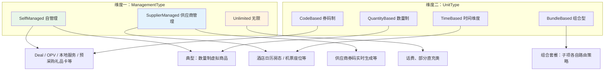
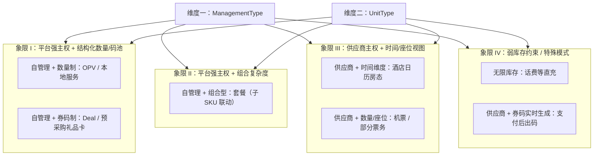
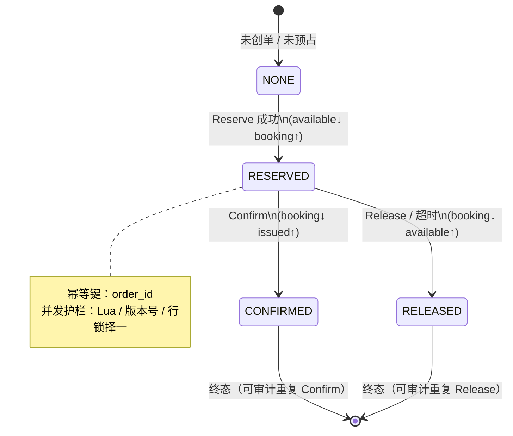
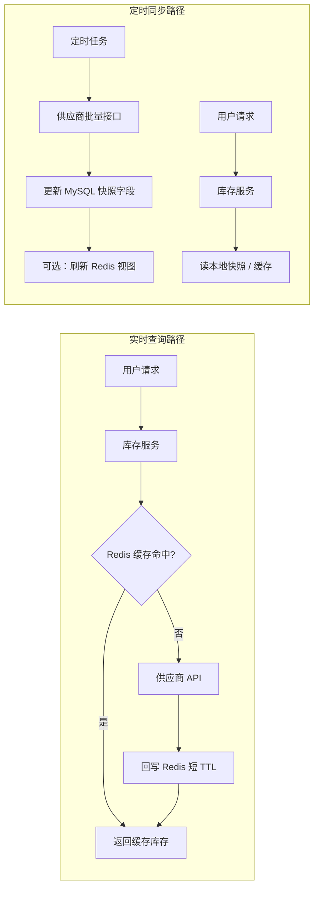
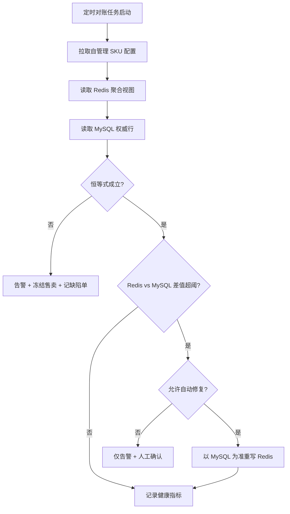
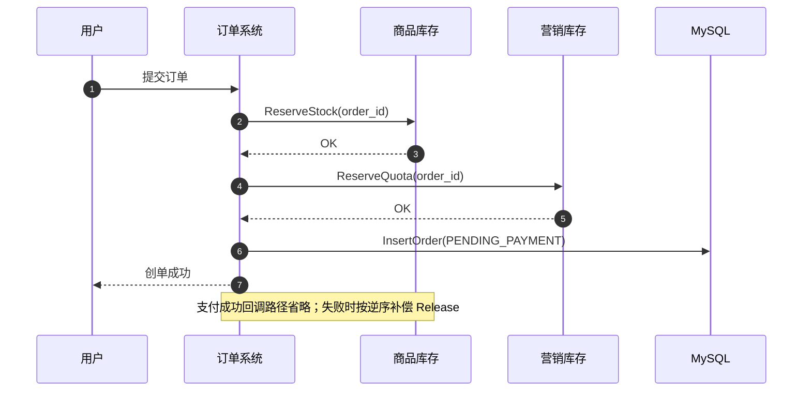

**导航**：[书籍主页](./index.html) | [完整目录](./TOC.html) | [上一章](./chapter7.html) | [下一章](./chapter9.html)

---

# 第8章 库存系统

> **本章定位**：库存是交易链路的硬约束之一。本章在统一「商品库存」视角下，给出可扩展到多品类的二维抽象、可落地的扣减与预占策略、供应商集成模式、Redis 与 MySQL 的最终一致性方案，以及清晰的系统边界与工程实践（含 Go 与 Redis Lua）。

---

## 8.1 背景与挑战

### 8.1.1 多品类库存差异

在数字商品、本地生活、旅行票务等场景中，**库存不是单一形态**：有的按数量售卖，有的按券码唯一性售卖，有的按日历房态管理，还有的由供应商实时掌握座位或房量。下表概括常见差异（与业务配置 `deduct_timing` 联动）。

| 品类 | 库存特点 | 典型扣减时机 | 平台侧关注点 |
|------|----------|--------------|--------------|
| 电子券（Deal） | 券码唯一 | 下单预占 | 券码池、防重复出货 |
| 虚拟服务券（OPV） | 数量制 | 下单预占 | 高并发扣减、营销叠加 |
| 酒店 | 按日期房态 | 多为支付后确认 | 供应商同步延迟、日历维度 |
| 机票 / 票务 | 座位 / 场次 | 多为支付后出票 | 实时查询、强一致 |
| 礼品卡 | 预采购或实时生成 | 视模式而定 | 安全、异步生成补偿 |
| 话费充值等 | 无限库存 | 无需扣减 | 仅审计与风控 |

**结论**：若每个品类单独实现一套库存服务，短期看似更快，长期必然走向「模型割裂、接口爆炸、对账困难」。本章采用 **二维分类 + 策略路由** 的方式，把差异收敛到配置与策略实现层。

### 8.1.2 核心痛点

1. **模型割裂**：代码里到处 `if category == hotel` 的分支，复用性差，测试成本高。
2. **数据不一致**：Redis 热路径与 MySQL 权威数据、供应商快照三者之间出现漂移。
3. **供应商策略不统一**：实时查询、定时同步、Webhook 推送混用，缺乏统一降级语言。
4. **边界不清**：订单、营销、商品、供应商网关都在「顺手改库存」，故障定位困难。
5. **可观测性不足**：超卖、差异、同步延迟往往在用户投诉后才暴露。

**容量与并发视角的补充**：库存系统往往是交易洪峰的「第一扇闸门」。当创单 QPS 在短时间内抬升一个数量级时，最先暴露的通常不是 CPU，而是 **热 Key、连接池、消息堆积与下游供应商配额**。因此在需求阶段就要区分两类指标：对用户承诺的 **创单成功率**，以及对内部承诺的 **库存服务自身 SLO**（例如 Reserve P99、对账修复时延）。两者混谈会导致「系统看起来没挂，但用户体验崩了」。

### 8.1.3 设计目标

| 目标 | 说明 | 优先级 |
|------|------|--------|
| **统一模型** | 以二维属性描述品类，策略可插拔 | P0 |
| **高性能** | 热路径走内存型存储与原子脚本 | P0 |
| **可扩展** | 新品类优先改配置与策略，不改核心编排 | P0 |
| **最终一致** | Redis、MySQL、供应商视图可异步对齐，但有对账闭环 | P0 |
| **清晰边界** | 预占、确认、释放的职责归属明确 | P0 |

---

## 8.2 库存分类体系

### 8.2.1 二维分类模型

统一库存的关键，是把品类差异抽象为两个**正交维度**：

- **维度一：谁管库存（Management Type）**——库存的「主权」在平台还是供应商，或无需管理。
- **维度二：库存单元形态（Unit Type）**——库存是可数数量、唯一券码、日历维度，还是组合型。

```go
// ManagementType：谁拥有库存事实来源
const (
	SelfManaged     = 1 // 平台自管：平台维护可用量与流水
	SupplierManaged = 2 // 供应商管理：平台保存快照 + 同步策略
	Unlimited       = 3 // 无限库存：不维护可用量（仍可有审计日志）
)

// UnitType：库存如何被扣减与表达
const (
	CodeBased     = 1 // 券码制：最小粒度为唯一 code
	QuantityBased = 2 // 数量制：最小粒度为整数数量
	TimeBased     = 3 // 时间维度：按日期 / 时段切片（酒店、部分票务）
	BundleBased   = 4 // 组合型：多子项联动扣减（套餐）
)
```

**设计要点**：

- 两个维度**独立变化**：例如「供应商管理 + 时间维度」刻画酒店房态；「自管理 + 券码制」刻画平台预采购礼品卡。
- **扣减时机（deduct_timing）** 常作为第三配置轴（下单 / 支付 / 发货），与二维模型一起写入 `inventory_config`，由上层交易编排解释。

下面的矩阵图用 Mermaid 表达「管理类型 × 单元类型」的组合空间（示意，非穷举所有业务）。



**读图方式**：先确定「事实来源」再走「单元形态」路径，最终在策略路由器里选择 `InventoryStrategy` 实现（见 8.8 节）。

### 8.2.2 管理类型（谁管）

| 类型 | 库存事实来源 | 平台侧数据角色 | 典型风险 |
|------|----------------|------------------|----------|
| 自管理 | 平台数据库 / Redis | 权威 + 热缓存 | 热冷数据漂移、补货并发 |
| 供应商管理 | 供应商系统 | 快照 + 预占记录 + 同步任务 | 同步延迟、重复预订 |
| 无限 | 无 | 日志 / 统计 | 供应商侧失败、账务不一致 |

### 8.2.3 单元类型（什么样）

| 类型 | 数据落点 | 并发控制要点 |
|------|----------|----------------|
| 券码制 | `inventory_code_pool` 分表 + Redis LIST | 出货原子性、补货游标、空池短路 |
| 数量制 | `inventory` 行 + Redis HASH | Lua 脚本保证 `available/booking/issued` 联动 |
| 时间维度 | 按 `calendar_date` 切片 | 日期范围校验、跨日边界、时区 |
| 组合型 | 子 SKU 多条配置 | 子项逐一成功或整体回滚（Saga） |

**时间维度（TimeBased）落地要点**：时间维度的难点不在「存日期」而在「一致性语义」。例如酒店连住多晚，可能要求 **每一天都有房** 才能售卖；也可能允许「部分日期升级 / 部分日期无早」等复杂包规。库存系统应优先实现 **可验证的硬约束**（每日可售量、最小可售窗口、闭店日），把复杂打包规则上移到商品 / 套餐域或规则引擎。技术上，`calendar_date` 常作为分片键之一，与 `sku_id` 组合唯一；查询走批量 `IN` 或区间扫描时要注意索引设计与缓存击穿。

**组合型（BundleBased）落地要点**：组合扣减建议采用「父单 + 子行」模型：父单代表用户购买的套餐实例，子行映射到真实库存 SKU。预占时按子 SKU 顺序扣减可以降低死锁概率（按字典序固定加锁顺序）；失败时按逆序释放。若子项跨越自管理与供应商管理，**不要试图在库存服务内做分布式强一致**——应以 Saga 编排为准，并在产品上明确「部分子项失败时整单失败」或「降级替换子项」的策略。

### 8.2.4 品类分类矩阵

下表将常见品类映射到 `(ManagementType, UnitType)`，并给出推荐扣减时机（业务可配置）。

| 品类 | 管理类型 | 单元类型 | 推荐扣减时机 |
|------|----------|----------|--------------|
| 电子券 Deal | Self | Code | 下单预占 |
| OPV / 本地服务 | Self | Quantity | 下单预占 |
| 酒店 | Supplier | Time | 支付 / 供应商确认（按合同） |
| 机票 | Supplier | Quantity / Time | 支付前后组合（按供应商能力） |
| 话费 TopUp | Unlimited | - | 无库存扣减 |
| 礼品卡（预采购） | Self | Code | 下单预占 |
| 礼品卡（实时生成） | Supplier | Code | 支付后生成 |
| 组合套餐 | Self | Bundle | 下单预占（子项联动） |

下面的 **四象限矩阵图** 用「平台是否掌握库存事实来源」与「库存单元是否强结构化」两个视角，把常见品类放到同一张图里讨论（示意，用于工作坊对齐；边界案例以合同与供应商能力为准）。



> **与营销库存的关系**：商品库存回答「有没有货」，营销库存回答「活动名额 / 补贴预算够不够」。秒杀等场景往往需要 **双扣减**（商品 + 营销），本章在 8.7 节说明集成边界；营销细节见第 9 章。

**统一数据模型（持久化层摘要）**：二维分类解决「策略选择」，持久化层解决「数据落在哪里」。实践中常用三张核心表承载配置、数量视图与券码池（字段可按团队规范微调，但语义建议保持一致）。

1. **`inventory_config`（按 SKU 一条）**：声明 `management_type`、`unit_type`、`deduct_timing`、`supplier_id`、`sync_strategy` 等，是策略路由的唯一配置源。
2. **`inventory`（数量 / 时间维度的聚合行）**：维护 `total/available/booking/locked/sold` 与供应商快照字段（如 `supplier_stock`），并承载库存恒等式校验。
3. **`inventory_code_pool_XX`（券码制分表）**：一码一行，状态机驱动；Redis LIST 仅存 codeId 热数据，权威仍在 MySQL。

```sql
CREATE TABLE inventory_config (
  id BIGINT PRIMARY KEY AUTO_INCREMENT,
  item_id BIGINT NOT NULL,
  sku_id BIGINT NOT NULL DEFAULT 0,
  management_type INT NOT NULL COMMENT '1=自管理,2=供应商,3=无限',
  unit_type INT NOT NULL COMMENT '1=券码,2=数量,3=时间,4=组合',
  deduct_timing INT NOT NULL DEFAULT 1 COMMENT '1=下单,2=支付,3=发货',
  supplier_id BIGINT NOT NULL DEFAULT 0,
  sync_strategy INT NOT NULL DEFAULT 0 COMMENT '1=定时,2=实时,3=推送',
  sync_interval INT NOT NULL DEFAULT 300,
  oversell_allowed TINYINT NOT NULL DEFAULT 0,
  low_stock_threshold INT NOT NULL DEFAULT 100,
  UNIQUE KEY uk_item_sku (item_id, sku_id)
);

CREATE TABLE inventory (
  id BIGINT PRIMARY KEY AUTO_INCREMENT,
  item_id BIGINT NOT NULL,
  sku_id BIGINT NOT NULL,
  batch_id BIGINT NOT NULL DEFAULT 0,
  calendar_date DATE DEFAULT NULL,
  total_stock INT NOT NULL DEFAULT 0,
  available_stock INT NOT NULL DEFAULT 0,
  booking_stock INT NOT NULL DEFAULT 0,
  locked_stock INT NOT NULL DEFAULT 0,
  sold_stock INT NOT NULL DEFAULT 0,
  supplier_stock INT NOT NULL DEFAULT 0,
  supplier_sync_time BIGINT NOT NULL DEFAULT 0,
  status INT NOT NULL DEFAULT 1,
  UNIQUE KEY uk_sku_batch_date (sku_id, batch_id, calendar_date)
);
```

**库存恒等式（自管理）**：

```text
total_stock = available_stock + booking_stock + locked_stock + sold_stock
```

**可售库存的计算要分管理类型**：自管理用平台 `total/sold/booking/locked`；供应商管理应用 `supplier_stock` 作为外部事实输入；无限库存返回业务定义的上限或哨兵值。把这段逻辑收敛在领域服务 `CalcAvailable` 中，避免在订单、搜索、结算各自复制一份。

---

## 8.3 库存扣减策略

### 8.3.1 扣减时机

扣减时机是交易体验与资损风险的权衡轴：

- **下单预占（Reserve / Book）**：用户体验好（下单即锁货），但占用时长内库存不可用，需要可靠的超时释放。
- **支付后扣减（Sell on pay）**：减少无效占用，更适合供应商成本高或确认链路长的品类。
- **发货扣减**：实物电商更常见；数字商品平台多用前两者的组合。

工程上建议把时机写入 `inventory_config.deduct_timing`，由订单 / 结算编排读取，而不是散落在订单代码的 `switch`。

**配置值与交易编排的契约**：`deduct_timing` 只是标签，真正决定行为的是订单状态机与库存 API 的组合。推荐在内部文档中固定一张「状态 × 库存动作」表，例如：`PENDING_PAYMENT → Release`、`PAID → Confirm`、`CLOSED → Release(幂等)`。当同一品类在不同国家 / 不同供应商合同中扣减时机不同，用配置驱动可以避免为每个市场复制一套订单服务。

### 8.3.2 预占与确认

**预占（Reserve）** 的本质：把「可售」迁移到「已占用（booking）」状态，并保证操作原子、可幂等、可追踪。

**确认（Confirm / Sell）** 的本质：把「占用」迁移到「已售（sold / issued）」，并与支付成功事件对齐。

自管理数量制的状态迁移（Redis HASH 字段视角）：

```text
available --(reserve)--> booking --(confirm)--> issued
available <---(release)--- booking
```

券码制则是 `AVAILABLE → BOOKING → SOLD` 的状态机，失败路径需要可逆。

**策略模式落地（路由与编排解耦）**：业务层只依赖统一的 `InventoryManager`（或应用服务），由它读取 `inventory_config` 后选择策略实现。这样「新品类接入」优先体现为 **配置 + 策略类**，而不是修改订单核心代码。

```go
// InventoryStrategy 抽象了库存生命周期中可被统一编排的动作集合。
type InventoryStrategy interface {
	CheckStock(ctx context.Context, req *CheckStockReq) (*CheckStockResp, error)
	BookStock(ctx context.Context, req *BookStockReq) (*BookStockResp, error)
	UnbookStock(ctx context.Context, req *UnbookStockReq) error
	SellStock(ctx context.Context, req *SellStockReq) error
	RefundStock(ctx context.Context, req *RefundStockReq) error
}

type StrategyRouter struct{}

func (StrategyRouter) MustStrategy(cfg *InventoryConfig) (InventoryStrategy, error) {
	switch cfg.ManagementType {
	case SelfManaged:
		return NewSelfManagedStrategy(cfg), nil
	case SupplierManaged:
		return NewSupplierManagedStrategy(cfg), nil
	case Unlimited:
		return NewUnlimitedStrategy(), nil
	default:
		return nil, fmt.Errorf("unknown management_type=%d", cfg.ManagementType)
	}
}
```

**与「营销锁定」的关系**：数量制 Redis HASH 常会增加 `locked` 以及按 `promotion_id` 维度的动态字段，用于表达「活动独占库存」。商品详情页展示的可售量，与下单强校验使用的可售量，可能不是同一个聚合口径——务必在接口契约里写清楚，避免运营配置误解导致客诉。

### 8.3.3 超时释放

超时释放至少要回答三个问题：**谁来触发？以什么为准？失败如何兜底？**

常见实现组合：

1. **Redis TTL / 预占记录过期**：快速回收「短期锁」。
2. **延时队列**：在创单时投递 `delay=15m` 的任务，到点检查订单是否已支付。
3. **定时扫描**：扫描 `PENDING_PAYMENT` 且超时的订单，幂等调用库存释放接口。

下面的时序图展示「下单预占 → 支付确认 / 超时释放」的主路径（商品库存服务视角）。

```mermaid
sequenceDiagram
  autonumber
  participant O as 订单系统
  participant I as 库存服务
  participant R as Redis
  participant Q as 延时队列
  participant P as 支付系统

  O->>I: ReserveStock(order_id, sku, qty, ttl=15m)
  I->>R: EVAL Lua 原子扣减 available 并增加 booking
  R-->>I: OK
  I-->>O: reserved
  O->>Q: schedule ReleaseStock(order_id) @T+15m

  alt 用户在 TTL 内完成支付
    P-->>O: PaymentSuccess
    O->>I: ConfirmStock(order_id)
    I->>R: booking -= qty; issued += qty
    I-->>O: confirmed
    Note over Q: 可选：取消延时任务（若支持精确去重）
  else 超时未支付
    Q-->>I: ReleaseStock(order_id) 幂等
    I->>R: booking -= qty; available += qty
    I-->>O: released
    O-->>O: CloseOrder(timeout)
  end
```

与上时序图互补，建议再用 **状态机** 固化「预占记录」本身的生命周期（尤其是 Redis 侧 `reservation:{order_id}` 与 DB 影子行并存时）。下图把「可重复进入的幂等终态」标出，避免研发在「重复回调 / 重复释放」上各写一套语义。



**关键细节**：

- **幂等键**：`order_id` 贯穿 Reserve / Confirm / Release，重复调用必须安全。
- **顺序依赖**：若营销与商品双预占，失败回滚顺序应与成功顺序相反（Saga 补偿语义）。

### 8.3.4 超卖防护

超卖防护应分层：

1. **热路径原子性**：Redis Lua 或单分片事务，保证「检查 + 扣减」不可分割。
2. **业务幂等**：同一 `order_id` 重复确认只生效一次。
3. **冷路径校验**：支付回调后，在确认库存前读取 MySQL 侧汇总做二次校验（容忍更高延迟）。
4. **对账兜底**：周期任务发现 `available + booking + sold` 恒等式破坏或 Redis / MySQL 偏差过大，自动冻结商品并告警（见 8.5.2）。

**CheckStock 与 ReserveStock 为什么要拆开？** 只读 Check 适合列表页、加购前的快速失败；但它不能保证并发下的正确性。正确做法是：**创单路径必须以 Reserve 这种「读改写原子操作」为准**，Check 只是辅助。否则会出现「校验时还有货，下单时被抢走」的经典竞态。

**秒杀场景的 Facade（可选优化）**：当商品库存与营销库存必须同事务化编排时，常规做法是订单 Saga 两步调用；在极端 QPS 下可以引入 `FlashSaleInventoryFacade.CheckAndReserve` 聚合接口，把限流、热点治理、重复请求拦截收敛到库存域的专用入口。注意：Facade 是性能与风控的「窄接口」，不要让它反向吞噬订单领域的编排职责。

---

## 8.4 供应商集成

供应商集成本质是 **把「外部库存事实」映射为平台可售视图**，并在预订 / 取消时调用供应商 API 对齐状态。

### 8.4.1 实时查询

**适用**：变化快、对超卖极度敏感（机票、部分热门票务）。

**模式**：

- 读路径：短 TTL 缓存 + 超时控制 + 熔断降级。
- 写路径：同步预订或异步预订（供应商返回 pending 时需轮询，见博客原文异步 booking 状态机）。

**读路径的 Go 骨架（与第 16 章风格一致：先缓存、后供应商、再回写、可观测）**：

```go
// CheckSupplierStock 演示：实时查询 + 短缓存 + 异步快照（示意代码）
func (s *SupplierManagedStrategy) CheckStock(ctx context.Context, req *CheckStockReq) (*CheckStockResp, error) {
	cacheKey := fmt.Sprintf("inventory:supplier:%d:%d:%s", req.ItemID, req.SKUID, req.Date)

	// 1) 先读 Redis 缓存（例如 30s TTL：机票可更短，酒店可更长）
	if v, err := s.rdb.Get(ctx, cacheKey).Int(); err == nil {
		return &CheckStockResp{Available: int32(v), FromCache: true}, nil
	}

	// 2) 供应商调用必须带超时；失败要映射为可重试/不可重试
	ctx, cancel := context.WithTimeout(ctx, 800*time.Millisecond)
	defer cancel()

	resp, err := s.supplier.QueryStock(ctx, &SupplierQuery{
		SupplierID: req.SupplierID,
		ProductID:  req.ExternalProductID,
		Date:       req.Date,
	})
	if err != nil {
		return nil, MapSupplierErr(err) // Retryable / Fatal / Unknown
	}

	// 3) 回写缓存 + 异步落快照（快照用于运营后台、对账与熔断时的最后成功视图）
	_ = s.rdb.Set(ctx, cacheKey, resp.Stock, 30*time.Second).Err()
	go func() {
		bg, cancel := context.WithTimeout(context.Background(), 2*time.Second)
		defer cancel()
		_ = s.snapshot.Save(bg, req.ItemID, req.SKUID, req.Date, resp.Stock, "api")
	}()

	return &CheckStockResp{Available: resp.Stock, FromCache: false}, nil
}
```

**工程要点（把「实时」变成可运营能力）**：

- **缓存击穿**：热点航线/场次在缓存过期瞬间会把供应商 QPS 顶满；需要单飞（singleflight）、随机抖动 TTL、以及网关层按 `supplier_id` 配额限流。
- **错误语义**：`Unknown` 不要当作「0 库存」返回，否则会把用户引导到错误决策；应显式返回「暂不可校验」并由前端降级展示。
- **观测**：必须记录 `from_cache`、`supplier_latency_ms`、`supplier_error_class`，否则线上只能看到「库存服务慢」，无法判断是供应商还是自研逻辑。

### 8.4.2 定时同步

**适用**：变化中等、可接受分钟级延迟（部分酒店库存）。

**模式**：

- 定时任务拉取供应商库存，写入本地 `inventory` 快照字段（如 `supplier_stock`、`supplier_sync_time`）。
- 读路径优先读本地快照，必要时触发「刷新任务」。

### 8.4.3 推送模式

**适用**：供应商能力较强，主动推送房态 / 价格变更。

**要点**：

- Webhook 入口必须鉴权、幂等、重放安全。
- 推送与定时拉取可并存：推送负责快变字段，拉取负责兜底对齐。

### 8.4.4 降级策略

| 触发条件 | 平台行为 | 用户侧体验 |
|----------|----------|------------|
| 供应商超时 | 返回可重试 / 排队；读缓存则明确标注「仅供参考」 | 可能看到「库存紧张」 |
| 连续失败超阈值 | 熔断一段时间，仅允许读取上次成功快照 | 可能暂停售卖 |
| 异步预订 pending 过久 | 进入人工处理队列，避免盲目关单造成纠纷 | 「处理中」 |

下面的架构图对比 **实时查询** 与 **定时同步** 在读路径上的差异（简化）。



**实践建议**：同一家供应商也可能混用（例如酒店：列表页用快照，下单页强刷一次实时），关键是把策略写进配置中心而非写死在代码分支。

**礼品卡横跨多种模式的启示**：预采购卡密（Self + Code）、实时生成卡密（Supplier + Code）、无限库存（Unlimited）往往并存于同一业务线。统一模型的价值在于：团队可以用同一张「策略决策表」讨论边界，而不是在三个服务里分别口述规则。

**异步预订（pending → confirmed）的工程清单**：当供应商只能异步确认时，至少补齐以下构件：`supplier_booking` 映射表、可重入的轮询 worker、超时与人工介入队列、订单侧状态机联动、对账任务对「平台已占 / 供应商未确认」的专项扫描。否则极易出现「钱扣了但供应商没单」或「供应商有单但平台没单」的双向不一致。

---

## 8.5 数据一致性保证

### 8.5.1 Redis 与 MySQL 同步

典型路径是 **「Redis 同步执行，MySQL 异步落库」**：

- **同步**：Lua 脚本更新 Redis 中的 `available/booking/issued` 或券码池。
- **异步**：发送 `InventoryEvent` 到 Kafka，消费者批量写 `inventory` 与 `inventory_operation_log`。

| 操作 | Redis | MySQL | 一致性语义 |
|------|-------|-------|--------------|
| 预占 | 同步 Lua | 异步事件 | 最终一致 |
| 确认售出 | 同步 Lua | 异步事件 | 最终一致 |
| 运营强锁 / 黑名单 | 视场景：可同步双写 DB | 强一致需求更高 |

**原则**：

- **Redis 不是账本**：故障恢复应以 MySQL + 日志为准，Redis 可重建。
- **Outbox**（可选）：若要求「绝不丢事件」，在订单或库存事务内写 outbox 表，再异步投递。

**双写与消息丢失的权衡**：纯「先 Redis 后发 Kafka」在进程崩溃时可能丢消息。工程上常见三种增强手段（按成本从低到高）：

1. **同步写操作日志表（简化版 outbox）**：Redis 成功后同步插入 `inventory_operation_log`（或写 binlog），再由后台任务投递 MQ；代价是热路径多一次 DB 写。
2. **事务消息 / Outbox**：与业务状态同事务提交，确保「状态变更」与「事件」原子一致。
3. **对账修复为主、消息为辅**：接受短窗口不一致，用对账把差异拉回（适合容忍度稍高、但吞吐极大的场景）。

选型没有银弹：机票酒店类强一致诉求更高，虚拟券码大促类更偏向吞吐与事后修复。

### 8.5.2 对账机制

对账目标不是「每时每刻 Redis == MySQL」，而是 **尽快发现破坏恒等式与异常漂移，并可控修复**。

建议对账维度：

1. **单行恒等式**：`total = available + booking + locked + sold`（字段含义以你的表结构为准）。
2. **跨存储视图**：Redis `available` vs MySQL `available_stock` 差值。
3. **订单侧一致性**：`PENDING_PAYMENT` 订单是否仍存在预占记录；是否出现「仅商品预占成功、营销失败」等半截状态。



**修复策略要谨慎**：自动以 MySQL 覆盖 Redis 适合「Redis 丢数据」类问题；若根因是重复消费导致 MySQL 多减，则应阻断自动修复，先定位消息幂等缺陷。

**对账任务的伪代码骨架（Go）**：对账不仅是数值 diff，更是「缺陷驱动」的运营工具。下面示例强调阈值、恒等式与人工门闩（`auto_reconcile`）。为便于阅读，`abs` / `max` 等函数省略实现。

```go
// 伪代码骨架：abs/max/alert/rewrite 需按项目工具库实现
func ReconcileItem(ctx context.Context, cfg InventoryConfig) error {
	redisAvail := readRedisAvailable(ctx, cfg.ItemID, cfg.SKUID)
	mysqlRow, err := loadInventoryRow(ctx, cfg.ItemID, cfg.SKUID)
	if err != nil {
		return err
	}

	if !mysqlRow.identityOK() {
		return fmt.Errorf("mysql identity broken: item=%d sku=%d", cfg.ItemID, cfg.SKUID)
	}

	diff := redisAvail - mysqlRow.AvailableStock
	if abs(diff) > max(100, mysqlRow.AvailableStock/10) {
		alert(ctx, "large inventory diff", cfg.ItemID, cfg.SKUID, diff)
	}

	if cfg.AutoReconcile {
		return rewriteRedisFromMySQL(ctx, cfg.ItemID, cfg.SKUID, mysqlRow)
	}
	return nil
}
```

### 8.5.3 补偿任务

补偿任务用于处理：

- Kafka 消费失败导致日志未落库。
- 供应商异步预订最终态与本地订单状态不一致。
- Saga 补偿某一步失败后的「人 + 程序」协同修复。

建议补偿任务具备：**可观测进度、可重入、可限流、可人工跳过**，并在执行前获取分布式锁或基于 `order_id` 的行级互斥，避免双写打架。

**补偿与对账的分工**：对账偏「批量、周期性、发现漂移」；补偿偏「单点、事件触发、把状态推进到合法终态」。两者叠加才能覆盖「消息乱序」「重复投递」「供应商晚到回调」等真实世界的粗糙边缘。

**Kafka 消费者的吞吐与顺序**：库存事件消费端建议「按 `item_id` 分区有序 + 批量落库」：`item_id` 分区可以保证同一商品变更串行应用，批量 `INSERT` 日志与合并更新可以降低 MySQL TPS。需要警惕的是：**重试会导致重复消息**，因此 MySQL 写入必须基于 `event_id` 或业务幂等键去重；否则对账会看到「日志重复 / 库存多减」。

**跨库存类型一致性（商品 + 营销）**：秒杀场景下商品预占成功但营销失败时，必须回滚商品预占。回滚失败不要把系统留在「半占用」状态：应记录缺陷单并阻塞该 `order_id` 的继续支付，直到补偿成功或人工判定。该话题与第 6 章 Saga、第 9 章营销库存紧密相关，本章强调 **库存侧 API 必须可单独幂等重放**，以便编排器反复补偿。

---

## 8.6 系统边界与职责

### 8.6.1 库存系统的职责边界

**库存系统应该负责**：

- SKU 维度的可售数量 / 券码 / 日历切片视图的维护。
- 预占、确认、释放、退款相关的原子操作与审计日志。
- 供应商库存同步策略的执行与降级。

**库存系统不应该负责**：

- 订单优惠分摊、支付路由、用户风控评分（可读取必要参数，但不拥有规则）。
- 商品详情文案、主图、类目属性（属于商品中心）。

### 8.6.2 库存 vs 商品：边界划分

| 维度 | 商品中心 | 库存系统 |
|------|----------|----------|
| 核心聚合 | SPU/SKU、属性、类目 | SKU（或批次 / 日期）库存数量与码池 |
| 上架 | 生成可售商品视图 | 根据模板初始化 `inventory_config` / 初始库存 |
| 快照 | 商品快照用于订单展示 | 可选择是否在快照中冗余「库存展示字段」 |

**建议**：商品详情页展示库存「有 / 无」可以来自搜索 / 商品聚合读模型；**下单路径的强校验**必须调用库存服务。

### 8.6.3 平台库存 vs 供应商库存

- **平台自管**：平台能强约束不超卖（在自有数据正确前提下）。
- **供应商管理**：平台只能「尽力而为」，必须定义 **同步延迟下** 的用户协议与技术降级（例如显示「库存紧张」、下单后异步确认）。

**把「可售」定义成合同**：供应商管理并不等于「平台不承担责任」。产品条款、详情页提示、客服话术需要与技术策略一致：例如列表页展示的是「上次同步快照」，下单页展示的是「下单瞬间强刷结果」，支付页又可能进入「供应商二次确认」。这些差异如果只靠前端临时拼接字段，极易引发纠纷；建议由商品 / 库存领域共同产出 **可售声明（availability disclaimer）** 的配置，并在关键触点统一渲染。

**时间维度下的边界**：酒店类库存往往以「入住日」为切片，查询与扣减都携带日期参数。库存服务应提供明确的日期合法性校验（不可售日期、最小连住、跨日边界），但不要吞掉「价格日历」职责——价格仍归计价系统，库存只回答「这一天还有没有房 / 席位」。

### 8.6.4 库存预占的归属

推荐由 **库存服务提供 Reserve / Confirm / Release API**，订单系统编排调用。避免订单服务直接写 Redis，否则：

- 权限边界模糊，排障困难；
- 原子脚本难以复用；
- 监控指标分散。

**进一步建议**：把「预占记录」视为库存域内的聚合片段（可用 Redis HASH、也可用独立表存储影子状态），对外只暴露语义化 API。订单系统持有 `order_id` 与支付超时策略；库存系统持有「这单占了多少、占在哪一批次 / 哪一天」。当两边都要保存时，必须明确 **主键映射与幂等回放** 规则：支付回调重复到达时，Confirm 只能执行一次；超时释放与支付成功并发时，必须以「订单最终状态」为仲裁者。

**组合型（Bundle）扣减的边界**：套餐类商品是「一个售卖单元，多个库存单元」。库存系统可以提供 `BundleReserve` 事务式 API，内部仍以子 SKU 为单位调用原子脚本，但整体成功准则由库存域定义（全成或全败）。不建议把子项拆解交给订单服务循环调用——否则补偿顺序、部分失败、日志关联都会变得脆弱。

---

## 8.7 与其他系统的集成

### 8.7.1 与商品中心集成（商品上架时初始化库存）

商品中心在 SKU 生效时发出领域事件（或消息）是最佳挂钩点：库存服务消费事件后创建 `inventory_config`，并初始化 `inventory` 行（数量、批次、默认阈值等）。这里的关键是 **幂等**：同一 SKU 的重复发布 / 回滚发布不得生成重复配置行；建议使用 `item_id + sku_id` 唯一键约束，并在消费端用「版本号 / 生效时间窗」判定是否应用变更。

对「供应商管理」品类，初始化阶段就要写入 `supplier_id` 与 `sync_strategy`，并创建供应商适配器所需的 **外部商品编码映射**（否则库存同步与预订调用会在上线后才发现无法对齐）。对于券码制，还要初始化 `batch_id` 维度与分表路由规则，避免大促时临时改路由。

### 8.7.2 与订单系统集成（预占 / 扣减 / 释放）

创单路径建议以 **Reserve** 作为硬闸门：订单系统先拿到库存服务的成功回执，再写入订单主表为 `PENDING_PAYMENT`。如果顺序反过来，会出现「订单已创建但库存未占」的不可恢复窗口，除非再引入复杂补偿。

支付成功后的 **Confirm** 应与支付回调幂等键绑定（支付单号 / 回调事件 id）。实践中常见错误是：支付重放导致库存二次加 `issued`，或支付失败却误触发 Confirm。**关单 / 超时释放** 应与订单状态机严格对齐：只有从可取消状态进入释放，才调用 `Release`；对于已进入履约的订单，释放必须转为退款域的逆向流程（可能涉及供应商取消接口）。

### 8.7.3 与供应商系统集成（实时查询 / 定时同步）

供应商集成建议落在 **供应商网关** 或 **库存适配器层**，由库存服务调用，而不是让订单服务直连供应商：订单系统只需要知道「库存服务承诺的结果」，不需要理解每家供应商的 OAuth、签名算法与重试语义。

适配器层应统一：超时、重试（仅对幂等读 / 明确幂等写）、熔断、隔离舱（bulkhead）、以及 **错误码映射**。强烈建议把供应商错误抽象为三类：`Retryable`（可重试）、`Fatal`（明确失败）、`Unknown`（需要人工核对）。`Unknown` 类错误不要自动重试写入路径，否则极易造成重复预订。

### 8.7.4 库存变更事件发布

事件字段建议包含：`event_id`、`event_type`、`item_id`、`sku_id`、`order_id`、`quantity`、`before/after` 快照、时间戳。消费者可以是：搜索引擎刷新可售标签、报表、风控。

事件设计要兼顾 **可排序** 与 **可去重**：`event_id` 建议全局唯一；`event_type` 建议稳定枚举；`before/after` 用于审计与对账回放。对于券码制，还应携带 `code_ids` 或哈希摘要（避免明文扩散到不该出现的下游）。如果下游是搜索索引，通常只需要「可售阈值变化」而非每一次微抖动，可增加 **聚合投影**（projector）把高频事件折叠为低频索引更新。

### 8.7.5 集成模式与降级策略

- **同步编排 + 异步对账** 是默认主路径；
- **秒杀聚合接口**（一次网络往返完成商品 + 营销预占）属于性能优化特例，应被清晰标记为「窄场景专用」，避免成为全局耦合点。

**集成时序（常规创单：订单编排库存）**：下图强调「库存服务不创建订单」，只提供原子操作；订单系统承担 Saga 与超时任务。



**降级策略（库存不可用）**：严格模式直接失败；宽松模式允许「先创单后补扣」（极易超卖，仅适合内部试单或供应商兜底能力极强且可取消的场景）。若启用宽松模式，必须同步启用 **更频繁对账 + 更强支付确认校验 + 明确法务条款**。

---

## 8.8 工程实践

### 8.8.1 Lua 脚本原子性

Redis 单线程执行 Lua，可保证脚本内多条命令原子执行，非常适合「读-判断-写」库存扣减。

**数量制预占脚本（示例）**：从 `available` 扣减并增加 `booking`，不足返回 `-1`。

```lua
-- KEYS[1]: inventory:qty:stock:{itemID}:{skuID}
-- ARGV[1]: qty
local key = KEYS[1]
local qty = tonumber(ARGV[1])

local available = tonumber(redis.call('HGET', key, 'available') or '0')
if available < qty then
  return -1
end

redis.call('HINCRBY', key, 'available', -qty)
redis.call('HINCRBY', key, 'booking', qty)
return available - qty
```

**带幂等门的预占（强烈建议）**：仅靠业务层判断「是否已预占」仍可能出现并发双调。更稳妥做法是把幂等状态写进同一个 HASH（或独立 key），让 Lua 一次完成「首次预占 / 重复预占返回成功」。

```lua
-- KEYS[1]: inventory:qty:stock:{itemID}:{skuID}
-- KEYS[2]: inventory:qty:reservation:{orderID}
-- ARGV[1]: qty
-- ARGV[2]: ttlSeconds
local stockKey = KEYS[1]
local resKey = KEYS[2]
local qty = tonumber(ARGV[1])
local ttl = tonumber(ARGV[2])

if redis.call('EXISTS', resKey) == 1 then
  return 1
end

local available = tonumber(redis.call('HGET', stockKey, 'available') or '0')
if available < qty then
  return -1
end

redis.call('HINCRBY', stockKey, 'available', -qty)
redis.call('HINCRBY', stockKey, 'booking', qty)

redis.call('HSET', resKey,
  'qty', qty,
  'status', 'RESERVED'
)
redis.call('EXPIRE', resKey, ttl)
return 0
```

**确认与释放（与预占配对）**：确认时将 `booking` 转为 `issued`；释放时退回 `available`。下面脚本演示「仅当 reservation key 仍存在且状态为 RESERVED 才确认」，用于防止重复支付回调导致二次加 `issued`。

```lua
-- KEYS[1]: inventory:qty:stock:{itemID}:{skuID}
-- KEYS[2]: inventory:qty:reservation:{orderID}
-- ARGV[1]: op -- CONFIRM or RELEASE
local stockKey = KEYS[1]
local resKey = KEYS[2]
local op = ARGV[1]

if redis.call('EXISTS', resKey) == 0 then
  return 2
end

local qty = tonumber(redis.call('HGET', resKey, 'qty') or '0')
local st = redis.call('HGET', resKey, 'status')

if st ~= 'RESERVED' then
  return 3
end

if op == 'CONFIRM' then
  local booking = tonumber(redis.call('HGET', stockKey, 'booking') or '0')
  if booking < qty then return -1 end
  redis.call('HINCRBY', stockKey, 'booking', -qty)
  redis.call('HINCRBY', stockKey, 'issued', qty)
  redis.call('HSET', resKey, 'status', 'CONFIRMED')
  redis.call('PERSIST', resKey)
  return 0
end

if op == 'RELEASE' then
  local booking = tonumber(redis.call('HGET', stockKey, 'booking') or '0')
  if booking < qty then return -1 end
  redis.call('HINCRBY', stockKey, 'booking', -qty)
  redis.call('HINCRBY', stockKey, 'available', qty)
  redis.call('DEL', resKey)
  return 0
end

return 4
```

**Go 侧调用（go-redis v9 示例）**：

```go
package inventory

import (
	"context"
	"fmt"

	"github.com/redis/go-redis/v9"
)

const reserveQtyLua = `
local key = KEYS[1]
local qty = tonumber(ARGV[1])
local available = tonumber(redis.call('HGET', key, 'available') or '0')
if available < qty then return -1 end
redis.call('HINCRBY', key, 'available', -qty)
redis.call('HINCRBY', key, 'booking', qty)
return available - qty
`

type RedisInventory struct {
	rdb redis.UniversalClient
}

func (s *RedisInventory) ReserveQuantity(ctx context.Context, itemID, skuID int64, qty int) (int64, error) {
	key := fmt.Sprintf("inventory:qty:stock:%d:%d", itemID, skuID)
	res, err := s.rdb.Eval(ctx, reserveQtyLua, []string{key}, qty).Int64()
	if err != nil {
		return 0, err
	}
	if res < 0 {
		return 0, ErrNotEnoughStock
	}
	return res, nil
}
```

**券码池出货脚本（示例）**：`LRANGE` + `LTRIM` 同事务化，避免读到数据却在截断前被并发修改。

```lua
-- KEYS[1]: inventory:code:pool:{item}:{sku}:{batch}
-- ARGV[1]: n
local n = tonumber(ARGV[1])
local codes = redis.call('LRANGE', KEYS[1], 0, n - 1)
redis.call('LTRIM', KEYS[1], n, -1)
return codes
```

**补货并发与空池短路**：券码制常见问题是 Redis LIST 空时频繁穿透数据库。应组合使用「空池标记（短 TTL）」「补货分布式锁」「MySQL 侧复合索引 + id 游标分页」，避免补货慢事务拖垮热路径。

**脚本版本管理**：生产环境建议把 SHA 载入或显式 `SCRIPT LOAD`，并对脚本变更做版本号控制，避免滚动发布期间混用旧脚本。

### 8.8.2 性能优化

- **热点 Key**：本地缓存、随机副本读、网关限流、拆分活动维度字段。
- **批量落库**：Kafka consumer 批量 `INSERT` 操作日志，减少 MySQL roundtrip。
- **预热**：大促前把券码池批量灌入 Redis，避免冷启动补货抖动。

**容量与峰值的经验法则（中型平台量级）**：当峰值下单 QPS 相对日均放大两个数量级以上时，瓶颈往往不在「业务 if-else」，而在 **Redis 热 Key、Kafka 消费滞后、MySQL 批量写入窗口**。因此性能优化应优先围绕：热点分散、消息攒批、限流前置、以及「允许短暂最终一致」的产品与风控共识。

**Redis 故障降级**：Redis 不可用时，可短期切到 MySQL 行级锁扣减（`UPDATE ... WHERE available_stock >= ?` 或 `SELECT ... FOR UPDATE`），并把实例标记为 degraded，待恢复后做一次 **以 MySQL 为准的全量回填**。降级期间的延迟与锁竞争上升是预期成本，需要在监控面板明确标注「降级模式」，避免误读 SLO。

### 8.8.3 监控告警

建议至少监控：

- `reserve/confirm/release` 成功率与 P99 延迟；
- Redis / MySQL 差异直方图；
- 供应商调用错误率与熔断状态；
- 对账修复次数与人工介入队列长度。

**告警分级示例（可与 Prometheus 规则结合）**：

| 级别 | 触发条件 | 响应目标 |
|------|----------|----------|
| P0 | 任意 SKU 出现「已售大于总量」或恒等式破坏 | 立即停售 + 紧急修复 |
| P1 | Redis / MySQL 可用量长期分叉且持续扩大 | 1 小时内定位根因 |
| P2 | 供应商同步延迟超阈值但未破坏交易 | 降级展示 + 供应商工单 |

---

## 8.9 本章小结

本章围绕「统一二维模型 + 策略实现 + 清晰系统边界」展开：

- 用 **ManagementType × UnitType** 收敛多品类差异，并以矩阵图帮助团队建立共同语言。
- 以 **预占 / 确认 / 超时释放** 为主轴设计扣减策略，并用时序图明确订单、库存、延时队列与支付的协作关系。
- 在供应商集成上区分 **实时查询与定时同步** 的读路径差异，并强调降级与产品文案的一致性。
- 在一致性上采用 **Redis 同步 + MySQL 异步 + 对账修复** 的组合拳，避免把 Redis 当作唯一账本。
- 在工程层用 **Go + Lua** 落实热路径原子性，配合监控与补偿任务形成闭环。

**落地检查清单（团队可用）**：

1. 每个 SKU 是否都能解释其 `(management_type, unit_type, deduct_timing)`？
2. 创单路径是否以 **Reserve 原子接口** 为准，而不是仅 Check？
3. `order_id` 是否在 Reserve / Confirm / Release 全链路幂等？
4. 是否同时具备 **TTL、延时队列、定时扫描** 至少两道释放防线？
5. 是否具备 **Redis / MySQL / 订单预占** 三角对账与人工门闩？
6. 供应商异步确认是否有 **映射表 + worker + 人工队列**？

**阅读建议**：若读者刚完成第 7 章商品中心与第 6 章一致性章节，可按「配置初始化 → 创单预占 → 支付确认 → 对账修复」的顺序对照本章示意图走读一遍；再把自家品类的 `(management_type, unit_type)` 填入矩阵，通常能在工作坊中快速对齐产品与工程预期。建议同时准备 1～2 个真实故障案例作为讨论锚点，避免停留在抽象原则层面。

**下一章预告**：第 9 章将深入营销系统，重点讨论优惠计算与营销库存（券、活动、补贴）如何与商品库存协同，避免「算得便宜却卖超了」这类跨域问题。

---

**导航**：[书籍主页](./index.html) | [完整目录](./TOC.html) | [上一章](./chapter7.html) | [下一章](./chapter9.html)
