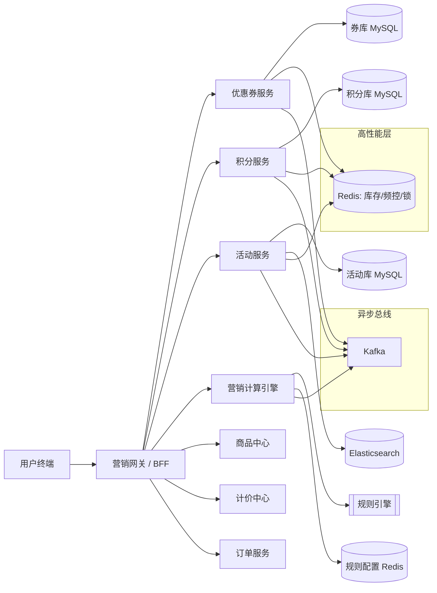
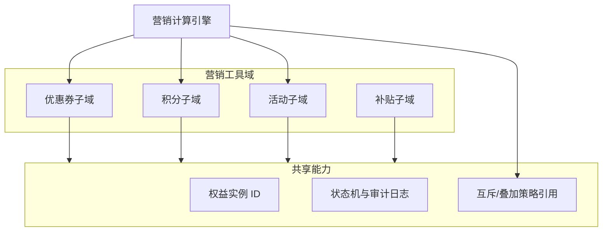
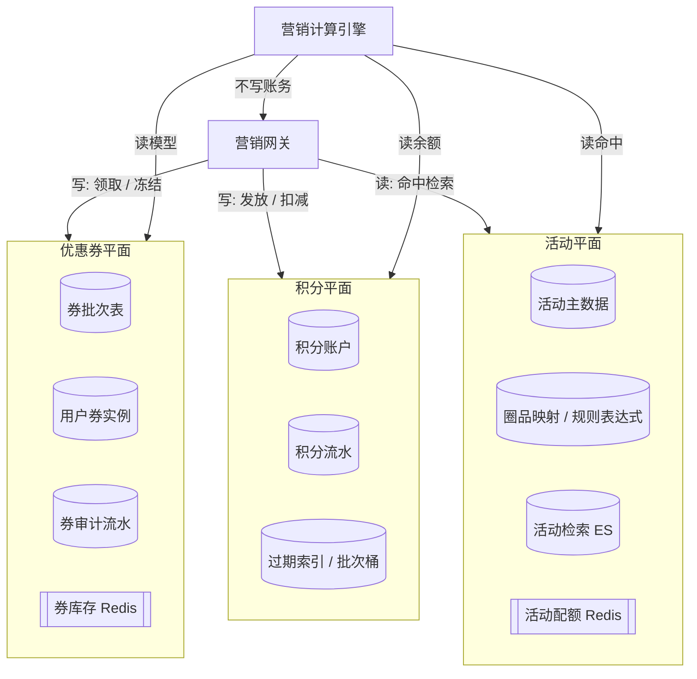
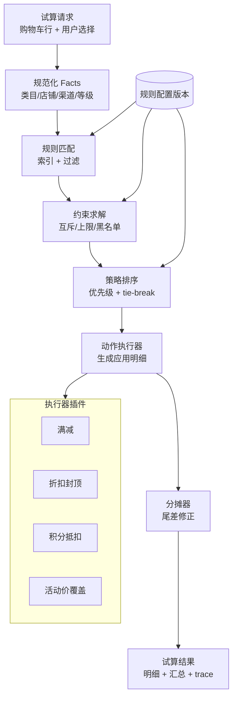
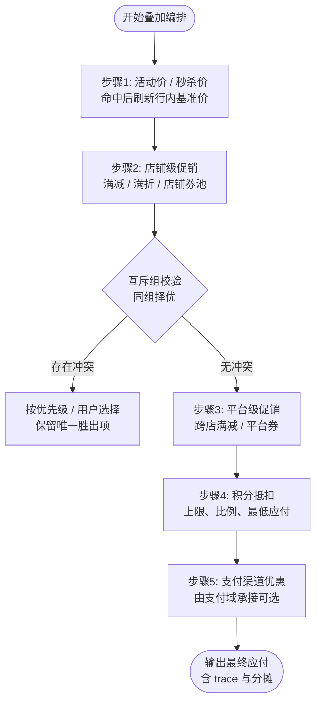
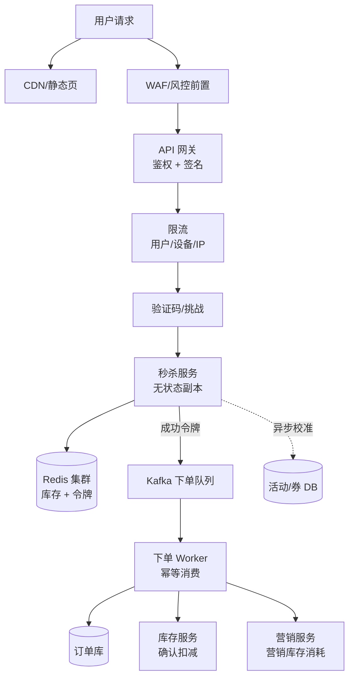
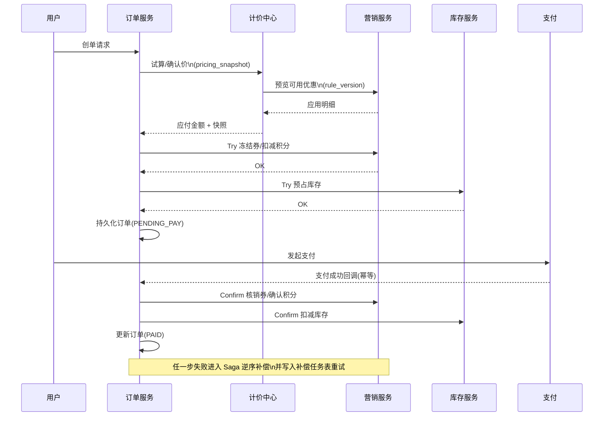

**导航**：[书籍主页](./index.html) | [完整目录](./TOC.html) | [上一章](./chapter8.html) | [下一章](./chapter10.html)

---

# 第9章 营销系统

> **交易链路关键域**：营销系统负责「增长与让利」的可编排表达——优惠券、积分、活动、补贴等工具在成本可控前提下提升转化；同时必须与计价、订单、库存、支付等系统严格分工，避免「算价口径漂移」与「资源扣减双写」。

---

## 9.1 系统概览

### 9.1.1 营销系统的定位

**一句话定位**：营销系统是电商平台的**增长引擎**与**让利规则中心**，它不替代「商品价格事实来源」（商品中心 / 计价中心），而是对可售商品集合施加**条件化权益**（券、活动价、积分抵扣、平台补贴），并在交易链路中完成**可审计的占用与核销**。

**与相邻系统的关系**（职责视角）：

| 系统 | 营销系统依赖它什么 | 营销系统不替它承担什么 |
|------|-------------------|------------------------|
| 商品中心 | 类目、SPU/SKU、可售状态、圈品范围 | 商品主数据维护、上下架编排 |
| 计价中心 | 统一试算编排、价格分层模型、快照口径 | 基础价/渠道价等「标价事实」的唯一来源（按组织边界而定） |
| 库存系统 | 可售库存、预占结果 | 实物库存扣减与释放 |
| 订单系统 | 创单编排、状态机、补偿入口 | 订单主单据生命周期（营销只参与其中资源步骤） |
| 用户系统 | 画像标签、等级、风控信号 | 账号体系与鉴权主责 |
| 支付系统 | 实付金额、分账、补贴清算 | 渠道对接与支付状态机 |

**价值闭环**：投放 → 领取/参与 → 试算曝光 → 下单锁定 → 支付核销 → 结算对账 → 报表 ROI。缺任何一环都会出现「看得见优惠、对不上账」的工程事故。

### 9.1.2 核心业务场景

典型场景可按用户生命周期与平台目标拆分：

**拉新**：新人券、首单立减、渠道专属券批次、注册礼包（券 + 积分组合）。

**促活与留存**：签到积分、任务体系、会员等级权益、生日礼、沉默召回券。

**成交提升（GMV / AOV）**：满减满折、跨店凑单、限时折扣、N 元购、买赠。

**热点营销（高并发）**：秒杀、抢券、限量补贴；对系统提出与普通促销完全不同的容量与一致性要求。

**平台型业务（B2B2C）**：商家自营销 + 平台统一规则 + 审核流；成本承担方可能是商家、平台或按比例共担，必须在支付与清结算链路可解释、可分摊。

**B2C 与 B2B2C 的营销差异**（决定你是否要引入「审核流、分账、跨店叠加」三件套）：

| 维度 | B2C（自营为主） | B2B2C（平台 + 商家） |
|------|----------------|----------------------|
| 营销主体 | 平台单一主体 | 平台与多商家并存 |
| 成本承担 | 平台预算闭环即可 | 需定义商家承担、平台补贴、联合出资比例 |
| 活动审核 | 通常内部运营闭环 | 商家活动常需平台审核与风控评分 |
| 优惠叠加 | 平台统一互斥组即可 | 需处理跨店、跨卖家券、店铺券与平台券的优先级 |
| 结算复杂度 | 订单金额 ≈ 平台收入口径 | 需分账、分润、逆向退款时的营销成本回冲 |

**非功能需求（NFR）速查**：营销系统既要「算得对」，也要「扛得住、赔得起、查得到」。建议在架构评审材料中显式写出下列指标，并与监控看板一一映射：

- **一致性**：券与积分的状态迁移与订单支付状态单调一致；允许的最终一致边界写清楚（例如报表延迟分钟级）。
- **幂等性**：领取、冻结、核销、回滚接口全部带业务幂等键；消息消费以 `event_id` 或 `(biz_type,biz_id,action)` 去重。
- **可用性**：试算路径可降级；写路径失败可补偿；热点活动具备独立熔断域，避免拖垮全站下单。
- **可观测性**：每一次试算输出 `trace_id`；每一次核销写审计流水；预算与库存类 Redis Key 有容量与过期策略。
- **安全与合规**：防刷、频控、隐私最小化；补贴与券的发放记录满足审计留存周期。

### 9.1.3 系统架构

工程上通常采用「**接入编排 + 工具域服务自治 + 计算引擎集中**」的形态：网关负责鉴权、路由、限流与实验分桶；券/积分/活动各自拥有独立数据库边界（逻辑或物理分库）；**营销计算引擎**聚合多源输入并调用规则引擎；异步事件通过消息总线广播给通知、风控、数据仓库与对账任务。



**协作要点**：

1. **读路径**：试算以「低耦合聚合」为目标，尽量通过计价中心统一编排（见 9.6、9.7），营销服务提供「可用工具集合 + 规则解释」。
2. **写路径**：领取、冻结、核销、回滚必须可幂等、可补偿；与订单 Saga 步骤一一对应（见 9.7.3）。
3. **观测路径**：任何金额差异必须能定位到「规则版本 + 输入快照 + 引擎输出」。

**典型技术选型（可按团队资产替换，但角色分工建议保留）**：

| 组件类型 | 常见选型 | 在营销系统中的职责 |
|----------|----------|----------------------|
| 关系型数据库 | MySQL / PostgreSQL | 券批次、用户券、积分流水、活动配置、审计表；强一致事实源 |
| 缓存与计数 | Redis | 热点库存、用户领券次数、预算桶、分布式锁、滑动窗口限流 |
| 消息队列 | Kafka / Pulsar | 异步通知、对账、数据仓库同步、延迟核销补偿 |
| 搜索与分析 | Elasticsearch | 活动检索、运营圈人、券批次检索；与交易主路径解耦 |
| 流量治理 | Sentinel / Envoy / 自研网关 | 热点接口限流、熔断、排队策略入口 |

**容量与体验的经验区间（用于评审对齐，不是 SLA 承诺）**：日常试算 QPS 与购物车刷新强相关；大促峰值往往来自「领券 + 秒杀下单」叠加。实践中常把「试算」与「领券写路径」在网关层拆分集群，避免读放大拖慢写。秒杀接口的目标不是无限吞吐，而是**失败要快、成功要稳**：失败请求在边缘以毫秒级返回，成功请求进入受控队列，尾部延迟可接受。

---

## 9.2 营销工具体系

营销工具体系的本质是**权益载体**不同：券是「凭证类权益」，积分是「账户类权益」，活动是「时段/集合类权益」，补贴是「清算类权益」。统一抽象有利于计算引擎与对账。

从领域建模角度，建议抽一层极薄的**营销权益（PromotionEntitlement）**通用语言：任何工具最终都落到「是否可用、可用多少、如何占用、如何确认、如何冲正」五问。这样订单编排层不必理解「满减与折扣的数学差异」，只理解统一的 Try/Confirm/Cancel 契约即可。

**反模式提醒**：

- 把「活动价」直接写进商品中心主价格字段，导致历史订单与供应商结算口径被破坏。
- 在订单服务内复制一份券规则计算逻辑，短期最快，长期必然与营销引擎漂移。
- 补贴只记在营销表、不落订单行快照，导致支付成功后的财务还原无法对齐。



**三大工具与数据平面的关系（落地视图）**：优惠券与积分强依赖「用户维度」一致性与账务流水；活动强依赖「商品维度」圈品与时段索引。下图从**读写路径**拆开，便于与容量规划对齐：写路径（领取、冻结、核销）走高一致通道；读路径（列表、试算）可走缓存与只读副本，但创单前必须有一次穿透校验。



### 9.2.1 优惠券系统

**模型拆分**：

- **Coupon（券批次）**：描述面额/折扣、门槛、总库存、每用户限领、适用范围（全场/类目/SKU）、承担方（平台/商家）。
- **CouponUser（用户券实例）**：领取时间、过期时间、状态（未使用/冻结/已使用/作废）。
- **CouponLog（审计流水）**：谁在何时以何因做了何动作；是对账与客服判责依据。

**关键实现约束**：

1. **超发控制**：热点券批次用 Redis 原子扣减「可领库存」，DB 落库作为最终事实；二者通过异步对账修正（见 9.8.2）。
2. **核销一致性**：下单冻结、支付成功确认核销、关单回滚；状态迁移必须落在**单用户券粒度锁**或等价乐观锁上，避免并发双花。

**券批次生命周期与运营协同**：除技术状态外，建议为运营提供「紧急下线」与「仅禁止新领取、已领取仍可用」两种模式。前者用于舆情与合规风险，后者用于预算将尽时的平滑收口。两种模式在网关与试算引擎侧都要有显式开关，避免只改数据库导致缓存层继续发券。

```go
import (
	"context"
	"strconv"
	"time"
)

// CouponUserStatus 描述用户券生命周期（示意）
type CouponUserStatus string

const (
	CouponUserUnused  CouponUserStatus = "UNUSED"
	CouponUserFrozen  CouponUserStatus = "FROZEN"
	CouponUserUsed    CouponUserStatus = "USED"
	CouponUserExpired CouponUserStatus = "EXPIRED"
)

type FreezeCouponCommand struct {
	UserID       int64
	CouponUserID int64
	OrderID      int64
	Idempotency  string
}

type CouponAppService struct {
	repo   CouponRepository
	locker DistributedLock
	bus    EventBus
}

func (s *CouponAppService) Freeze(ctx context.Context, cmd FreezeCouponCommand) error {
	unlock, err := s.locker.Lock(ctx, "coupon_user:"+strconv.FormatInt(cmd.CouponUserID, 10), 3*time.Second)
	if err != nil {
		return err
	}
	defer unlock()

	cu, err := s.repo.GetCouponUserForUpdate(ctx, cmd.CouponUserID)
	if err != nil {
		return err
	}
	if cu.UserID != cmd.UserID {
		return ErrNotOwner
	}

	// 幂等：同一订单重复冻结直接成功
	if cu.Status == CouponUserFrozen && cu.FrozenOrderID != nil && *cu.FrozenOrderID == cmd.OrderID {
		return nil
	}
	if cu.Status != CouponUserUnused {
		return ErrInvalidState
	}

	return s.repo.Transition(ctx, cmd.CouponUserID, Transition{
		From: CouponUserUnused,
		To:   CouponUserFrozen,
		OrderID: cmd.OrderID,
		Reason:  "freeze_for_order",
		IdemKey: cmd.Idempotency,
	})
}
```

### 9.2.2 积分系统

**账户模型**：`available` / `frozen` 双桶；**流水**追加不可变；**过期**建议「批次/桶」或「到期索引表」驱动，避免全表扫描。

**并发更新**：高冲突账户使用 `version` 乐观重试；低冲突可用单行 CAS。对外接口必须支持**业务幂等键**（例如 `biz_type + biz_id`）防止重复发放。

```go
import (
	"context"
	"strconv"
	"time"
)

type SpendPointsCommand struct {
	UserID      int64
	Points      int64
	OrderID     int64
	Idempotency string
}

func (s *PointsAppService) Spend(ctx context.Context, cmd SpendPointsCommand) error {
	if ok, err := s.repo.InsertIdempotency(ctx, "points_spend", cmd.Idempotency); err != nil {
		return err
	} else if !ok {
		return nil
	}

	for i := 0; i < 5; i++ {
		acct, err := s.repo.GetAccount(ctx, cmd.UserID)
		if err != nil {
			return err
		}
		if acct.Available < cmd.Points {
			return ErrInsufficientPoints
		}

		affected, err := s.repo.UpdateAvailableCAS(ctx, cmd.UserID, acct.Version, acct.Available-cmd.Points, acct.TotalSpent+cmd.Points)
		if err != nil {
			return err
		}
		if affected == 1 {
			_ = s.repo.AppendLog(ctx, PointsLog{
				UserID: cmd.UserID, Type: "SPEND", Delta: -cmd.Points,
				BizType: "ORDER", BizID: strconv.FormatInt(cmd.OrderID, 10),
			})
			return nil
		}
		time.Sleep(time.Duration(10*(i+1)) * time.Millisecond)
	}
	return ErrWriteConflict
}
```

### 9.2.3 活动系统

活动系统负责**规则配置 + 圈品 + 生命周期治理**。活动类型差异很大，但工程上可收敛为：

1. **活动元数据**：时间窗、状态机（草稿/待审/生效/结束/作废）。
2. **参与单元**：SKU 级活动价、店铺级满减、平台级跨店活动。
3. **执行策略**：由计算引擎解释 `rule_config`（JSON / DSL），活动服务自身避免堆叠 `switch` 地狱（与 9.3 联动）。

**圈品**（与商品中心集成详见 9.7.1）：活动侧存 `activity_product` 映射或存规则表达式；运行时以 `product_id/sku_id/category_id` 多路判定，注意索引与缓存击穿。

**活动运营与工程协作**：活动系统往往是运营配置最高频的子系统。建议把配置错误分为三类分别治理：**语法错误**（JSON Schema 校验拒绝保存）、**语义风险**（例如折扣低于成本阈值触发风控审核）、**容量风险**（圈品过大导致试算超时，需异步预计算 + 结果缓存）。Engineering 侧提供「沙箱试算」与「灰度发布」能力，比单纯堆人审核更有效。

**常见活动形态与工程关注点**（节选）：

| 活动形态 | 业务目标 | 工程关注点 |
|----------|----------|------------|
| 满减满折 | 提升客单价 | 跨店分摊、尾差、与券叠加顺序 |
| 限时直降 | 清库存 / 打爆款 | 与基础价、渠道价冲突检测 |
| 秒杀抢购 | 引流 | 热点库存、风控、异步下单、超卖校准 |
| 买赠 | 关联销售 | 赠品行生成、赠品库存、履约拆单 |

### 9.2.4 补贴系统

补贴与「券/活动」不同之处在于：**它往往不直接以用户可见凭证表达**，而是以**平台/商家承担比例**进入清结算。典型场景：

- 平台秒杀补贴：活动价低于供货价差额由平台承担。
- 联合营销：商家出资 70%，平台出资 30%。
- 支付立减：渠道补贴 + 平台补贴叠加（需风控与预算）。

**数据落点**：订单行级记录「营销成本分摊字段」；支付成功后由营销结算服务生成**结算事实表**，推送给财务/对账系统（与 9.7.5 呼应）。

```go
type SubsidySplit struct {
	OrderID        int64
	LineID         int64
	PlatformCent   int64
	MerchantCent   int64
	ThirdPartyCent int64
	Currency       string
}

func mulDiv64(a, b, denom int64) int64 {
	if denom == 0 {
		return 0
	}
	return (a * b) / denom
}

func BuildSubsidySplit(line LinePriceSnapshot, policy CostSharePolicy) SubsidySplit {
	discount := line.ListCent - line.PayableCent
	platform := mulDiv64(discount, policy.PlatformBP, 10_000)
	third := mulDiv64(discount, policy.ChannelBP, 10_000)
	merchant := discount - platform - third
	if merchant < 0 {
		merchant = 0
	}
	return SubsidySplit{OrderID: line.OrderID, LineID: line.LineID, PlatformCent: platform, MerchantCent: merchant, ThirdPartyCent: third, Currency: line.Currency}
}
```

---

## 9.3 营销计算引擎

营销计算引擎是「**把业务上含糊的便宜**」翻译成「**可执行、可分摊、可回滚**」的工程模块。它输入购物车行、用户工具实例、活动集合、规则版本；输出每个 SKU 行的优惠拆分与订单级汇总。

**为什么必须单独建设「引擎」而不是散落在各接口里？** 因为营销规则的变化频率远高于交易主流程：运营每周都可能调整叠加策略、临时插入互斥组、或对某渠道单独放量。若把规则散落在购物车、结算、创单多个服务，最终一定出现「页面能买、结算不能买」或「结算能买、支付少减」的漂移。引擎化的核心价值是把**规则解释**收敛到单一模块，并把输入输出契约化，让其他系统以「黑盒服务」方式依赖它。

**输入输出的工程契约（建议写进接口文档的第一页）**：

- **输入必须可序列化快照化**：不仅是商品 ID 列表，还应包含价格快照引用、店铺维度、会员等级、渠道、时区与活动版本。任何无法快照的输入都不应进入创单强一致路径。
- **输出必须可分摊**：除了订单级优惠总额，还要给出「行级拆分」与「税/运费处理建议字段」（若业务需要），否则财务与发票域会再次各自实现一套拆分。
- **输出必须可回放**：`trace` 不是日志炫技，而是客服判责与线上排障的最低成本工具；建议以结构化 JSON 存储关键决策点（命中、未命中原因、互斥裁决）。

### 9.3.1 规则引擎设计

规则引擎的目标不是追求通用 AI，而是追求：**可版本化、可灰度、可解释、可单测**。推荐分层：

1. **事实层（Facts）**：用户、店铺、渠道、会员等级、商品标签、时间窗。
2. **约束层（Constraints）**：互斥组、优先级、每单上限、每用户上限、黑白名单。
3. **策略层（Policies）**：叠加顺序（先活动后券 / 先券后活动）、分摊策略（按比例/按剩余价）、取整模式。
4. **执行层（Actions）**：生成 `AppliedPromotion` 列表与金额。



**落地建议**：规则配置存版本号；试算响应携带 `rule_version` 与 `engine_trace_id`；创单快照必须引用同一版本，避免「页面价 ≠ 创单价」纠纷。

**规则引擎实现梯度（从简到繁）**：

1. **配置驱动 + 少量代码**：适合多数电商平台；规则以结构化 JSON 存储，由固定管线解释；上线规则走版本表 + 灰度。
2. **DSL + 安全沙箱**：适合玩法极多、运营希望「自写表达式」的团队；需限制可调函数集合、CPU 时间、内存与外部 I/O。
3. **外置规则引擎（Rete 系）**：适合金融级复杂规则或强审计行业；引入成本高，需评估团队运维能力。

无论哪一梯度，都不要把「外部 I/O」藏在规则匹配的热路径里：事实应在进入引擎前由编排层并行拉齐并做超时兜底，引擎内部尽量纯函数化，便于单测与回放。

```go
type RuleEngine interface {
	Evaluate(ctx context.Context, in BasketInput, cfg RuleSetVersion) (Evaluation, error)
}

type Evaluation struct {
	Applied []AppliedPromotion
	Trace   []TraceStep
}

type DefaultRuleEngine struct {
	matcher   Matcher
	solver    ConstraintSolver
	applier   ApplierChain
	allocator LineAllocator
}

func (e *DefaultRuleEngine) Evaluate(ctx context.Context, in BasketInput, cfg RuleSetVersion) (Evaluation, error) {
	candidates, err := e.matcher.Match(ctx, in, cfg)
	if err != nil {
		return Evaluation{}, err
	}
	filtered, err := e.solver.ApplyConstraints(ctx, in, candidates)
	if err != nil {
		return Evaluation{}, err
	}
	applied, trace, err := e.applier.Apply(ctx, in, filtered, cfg.StackingPolicy)
	if err != nil {
		return Evaluation{}, err
	}
	if err := e.allocator.AllocateToLines(ctx, in.Lines, &applied); err != nil {
		return Evaluation{}, err
	}
	return Evaluation{Applied: applied, Trace: trace}, nil
}
```

### 9.3.2 优惠叠加与互斥

叠加规则是事故高发区。建议产品口径与实现口径合一：**用「互斥组 ID + 优先级 + 可叠加白名单」三要素表达一切**。



**互斥典型**：同一互斥组内多张券二选一；活动价与部分券互斥；渠道支付券与平台券互斥。实现上不要在多个服务各写一段 if，而应由引擎读取**同一份配置**。

```go
type StackingPolicy struct {
	Steps []StackStep
}

type StackStep struct {
	Name        string
	MutexGroups []string // promotions in same group are mutually exclusive within this step
}

type MutexGuard struct{}

func (MutexGuard) PickAtMostOne(ps []Candidate) ([]Candidate, error) {
	seen := map[string]Candidate{}
	out := make([]Candidate, 0, len(ps))
	for _, c := range ps {
		if c.MutexGroup == "" {
			out = append(out, c)
			continue
		}
		old, ok := seen[c.MutexGroup]
		if !ok || c.Priority > old.Priority {
			seen[c.MutexGroup] = c
		}
	}
	for _, v := range seen {
		out = append(out, v)
	}
	return out, nil
}
```

### 9.3.3 最优解求解

「最优」必须业务定义：常见是**用户应付最小**或**平台补贴最小**或**GMV 最大**。工程上可用：

- **小规模**：券张数 ≤ 3 且活动组合有限时，**有界枚举**最可靠。
- **中等规模**：动态规划（若可分解为线性结构）；或**贪心 + 校验**（先取门槛最高券，再修正）。
- **大规模**：启发式 + 约束剪枝；必须输出**可解释 trace**，避免黑盒。

```go
type Plan struct {
	ChosenCoupons []int64
	DiscountCent  int64
}

func BestCouponBruteForce(cents int64, coupons []CouponView) Plan {
	best := Plan{DiscountCent: -1}
	n := len(coupons)
	for mask := 0; mask < (1 << n); mask++ {
		var sum int64
		var ids []int64
		for i := 0; i < n; i++ {
			if mask&(1<<i) == 0 {
				continue
			}
			c := coupons[i]
			if cents < c.MinSpendCent {
				sum = -1
				break
			}
			sum += c.DiscountCent
			ids = append(ids, c.CouponUserID)
		}
		if sum < 0 {
			continue
		}
		if sum > best.DiscountCent {
			best = Plan{ChosenCoupons: append([]int64(nil), ids...), DiscountCent: sum}
		}
	}
	return best
}
```

**复杂度与工程边界**：有界枚举在「券实例候选数」与「活动组合数」上是指数级，评审时要写清楚上限。实践中常通过产品约束「一单最多使用 N 张券」「同一互斥组仅允许一张」把搜索空间压到可接受范围。若业务坚持「多券最优」，建议把求解器做成**独立服务**并设置硬超时与降级策略（返回用户已选方案或启发式方案），避免阻塞创单主链路。

**从枚举到「可证明正确」的贪心**：当互斥组把候选压成「每张券至多一张、每组至多一张」时，常见目标函数（应付最小）往往可通过「按门槛分层 + 组内按优惠额排序」的贪心得到最优，前提是产品承认规则满足 **拟阵（matroid）** 或近似结构。工程上不必引入过重数学证明，但应在设计文档写清 **贪心成立的前提**（例如：折扣不随剩余金额非单调变化、不存在「用券 A 才解锁券 B」这类交叉依赖）。一旦出现交叉依赖，应显式退回枚举或 MILP 小模型求解，并在超时后降级为「用户已选方案」。

**动态规划适用的一种典型子结构**：若订单可拆为若干「独立店铺子篮」，且店铺间仅存在「平台跨店满减」一条耦合边，可先按店求局部最优，再在平台层做一次低维 DP（阶梯满减档位通常 ≤10）。这与「全购物车暴力 bitmask」相比，复杂度从指数降到近似多项式，是大厂 B2B2C 场景常用的工程折中。

**与「用户主观选择」的冲突处理**：最优解未必等于用户勾选。常见策略是：结算页提供「系统推荐组合」与「用户手动选择」两种模式；手动模式以校验为主（不重新最优），并在 UI 明确提示损失金额或不可用原因，减少客诉。

### 9.3.4 试算与预览

试算接口必须**无副作用**；预览与创单必须使用**同一套输入契约**（行价格快照 ID、券实例 ID、活动版本、用户地址/会员状态）。

**建议字段**：

- `pricing_snapshot_id`：来自计价中心的基准价快照。
- `marketing_rule_version`：规则集版本。
- `client_scene`：`PDP` / `CART` / `CHECKOUT`（不同场景可用不同策略，但要显式）。

```go
type PreviewMarketingRequest struct {
	UserID              int64
	PricingSnapshotID   string
	SelectedCouponIDs   []int64
	UsePoints           int64
	Lines               []LineInput
	Scene               string
	IdempotencyKey      string
}

type PreviewMarketingResponse struct {
	RuleVersion     string
	PayableCent     int64
	DiscountCent    int64
	LineAllocations []LineAllocation
	Warnings        []string
}
```

**缓存与一致性策略**：试算读多写少，可对「活动命中结果」做短 TTL 缓存，但务必以 `pricing_snapshot_id` 作为缓存键的一部分，避免基准价变化后命中脏数据。对于「用户已领券列表」类数据，强一致诉求更高，建议短 TTL + 用户维度本地缓存谨慎使用，或在关键操作（创单）前做一次穿透校验。

**与创单的衔接**：预览返回的 `LineAllocations` 应可被订单原样持久化为「营销快照」子文档；创单重放时不得再次调用可能变化的试算逻辑去「修正」历史订单，除非走明确的改价流程（通常需要客服授权与审计）。

---

## 9.4 高并发场景设计

### 9.4.1 秒杀与抢券

秒杀本质是：**把绝大多数失败请求挡在极便宜的路径上**，把极少数成功请求放进**可串行化**的扣减与下单管道。它与普通促销的差异在于：热点 SKU 的**竞争半径**远大于库存规模。



**关键设计点**：

1. **库存拆分**：商品库存与营销库存（见 9.5）分别扣减，避免「营销卖爆但仓库没货」或反向超卖。
2. **令牌化**：网关层发放有限令牌，后端只验证令牌，避免打穿 DB。
3. **排队与等待**：返回「排队中」优于同步拖垮线程池（取决于体验要求）。

**抢券与秒杀的共性差异**：抢券失败通常是「库存耗尽」；秒杀失败还可能是「商品库存不足但营销库存仍显示可买」这类双库存不一致。务必在架构层定义**哪一个是用户可见的剩余量**，以及异步校准任务的 SLA（例如 1 秒内把 DB 回灌到 Redis）。

### 9.4.2 限流与降级

**限流维度**：用户 ID、设备指纹、IP 段、活动 ID、接口名。**降级策略**（需产品确认）：

- 试算失败：按原价或可延迟重试。
- 领券失败：明确「已抢光」与「系统繁忙」文案，避免重复猛刷。
- 引擎超时：熔断返回保守结果 + 记录补偿任务。

**限流实现分层（从外到内）**：

| 层级 | 手段 | 说明 |
|------|------|------|
| 边缘 | CDN、静态化、验证码 | 降低无效流量与脚本命中率 |
| 网关 | 全局限流、活动级配额 | 保护下游不被突发打满 |
| 服务实例 | 并发槽、队列长度 | 避免 goroutine/线程池堆积导致雪崩 |
| 数据层 | Redis 单 Key 分片、Lua 原子脚本 | 热点写入串行化且保持正确性 |

**降级与用户体验的契约**：降级不是「悄悄少优惠」，而是「明确告知当前无法应用优惠」。若业务允许静默降级，必须在法务与客服层面评估投诉风险；技术上建议至少记录 `degraded=true` 与原因码，便于事后补偿。

```go
import "github.com/sony/gobreaker"

func NewMarketingBreaker() *gobreaker.CircuitBreaker {
	return gobreaker.NewCircuitBreaker(gobreaker.Settings{
		Name:        "marketing_preview",
		MaxRequests: 5,
		Interval:    time.Second * 10,
		Timeout:     time.Second * 30,
		ReadyToTrip: func(c gobreaker.Counts) bool {
			if c.Requests < 20 {
				return false
			}
			failRatio := float64(c.TotalFailures) / float64(c.Requests)
			return failRatio >= 0.4
		},
	})
}
```

### 9.4.3 防刷与风控

防刷是「业务风控 + 工程限流」的组合：**设备指纹、代理 IP 聚类、异常领取节奏、黑名单、券码猜测防护**。工程上务必：

- 热点 Key 分片；避免单 Key 成为 Redis 热点。
- 异步写审计，主链路只做最小校验。
- 与风控系统通过**评分结果**而不是全量明细耦合，降低 RT。

**黑产对抗的分层策略**：第一层是「明显的工程滥用」（高频请求、批量注册、同设备多号），用限流与验证码解决；第二层是「业务规则套利」（拆单、凑单、退款薅券），需要规则与订单域联合治理；第三层是「支付侧套利」（拒付、chargeback），已超出营销系统边界，但必须把营销核销数据完整输出给风控与财务。

**策略落地建议**：不要把所有风控判断都改成同步 RPC。典型做法是：领券接口同步只做硬规则（黑名单、频控），复杂模型异步回扫；一旦发现异常，可下发「冻结券使用资格」事件，让用户在结算页看到需要人脸核验或客服介入。这样可以在不大幅增加主链路 RT 的前提下提升对抗能力。

---

## 9.5 营销库存系统

营销库存是**活动参与配额**，与商品可售库存解耦。秒杀中「500 件活动库存 + 10000 件商品库存」意味着两路都要成功才能成交。

**营销库存 vs 商品库存**（概念对齐表，避免团队各说各话）：

| 维度 | 商品库存 | 营销库存 |
|------|----------|----------|
| 本质 | 可售实物或履约能力 | 活动参与名额 / 补贴预算的数字化表达 |
| 典型驱动 | 采购、仓储、供应商可用量 | 营销预算、活动目标、风控阈值 |
| 管理维度 | SKU、仓、批次 | 活动、SKU、用户、时段 |
| 扣减含义 | 少一件货 | 少一次优惠资格或一分预算 |
| 失败体验 | 缺货 | 活动结束 / 已抢光 / 超出限购 |
| 一致性策略 | 强一致预占 + 补偿 | 常采用 Redis 原子脚本 + 异步校准 |

**工程结论**：下单链路里若同时存在两类库存，编排顺序必须写死（先营销后商品或相反）并配套一致的回滚顺序；任何「只扣一类」的实现都会在极端并发下出现难复现的幽灵订单。

### 9.5.1 券库存管理

券批次 `total / used / reserved` 三界清晰：`reserved` 对应创单未支付阶段的冻结量；支付成功由 reserved → used；关单释放 reserved。

**批次库存与 Redis 热计数的一致性策略**：公开领券场景下，常见做法是「Redis 原子扣减可领余量 + 异步刷新 DB 已领量」，主链路避免对券批次行高频 `UPDATE`。需要接受的前提是：极端情况下 Redis 与 DB 存在短暂偏差，因此必须配套 **日终对账**（按 `coupon_id` 聚合 `coupon_user` 与 Redis 计数）与 **紧急熔断**（运营一键停领后，网关与脚本两侧同时生效）。若业务要求「绝不能超发一张」，则要么将扣减下沉到单批次行的强一致事务（牺牲峰值），要么引入分桶库存（把 100 万张券拆成 N 个 sub-batch，各自 Redis 计数，DB 汇总）。

**用户券实例与批次维度的联动**：用户侧 `CouponUser` 状态迁移（未使用 → 冻结 → 已使用）应与批次维度的 `reserved/used` 单调一致；实现上可在 Confirm 阶段用 **单笔订单幂等键** 保证「批次已用 +1」只执行一次。冻结阶段是否同步增加批次 `reserved`，取决于财务口径——若冻结即占用预算，则批次层也应体现 reserved，便于运营实时看到「被锁住的成本」。

### 9.5.2 预算控制

活动预算与补贴池建议 **Redis 原子扣减 + 日终对账**；预算耗尽应**快速失败**并联动运营告警（短信/IM）。

**预算模型拆分**：至少区分「活动总预算」「单 SKU 子预算」「单用户补贴上限」三层。总预算用于财务控制；子预算用于防止单一 SKU 把活动打穿；用户上限用于防止单用户套利。上线前要与财务确认：**预占是否计入消耗**（通常创单即占用预算，关单释放），否则会出现「未支付订单占用预算导致活动提前结束」的体验问题。

**Redis 与 DB 的职责**：Redis 承担热点路径的原子判断与扣减；DB 承担审计与汇总；二者不一致时以 DB 为准修复 Redis 是常见策略，但要评估修复延迟期间的用户影响（短暂超发或短暂不可领）。若业务零容忍超发，需要把关键扣减下沉到 DB 或使用更强一致方案，代价是峰值容量下降。

```go
const decrBudgetLua = `
local v = redis.call("GET", KEYS[1])
if not v then return -1 end
local n = tonumber(v)
local d = tonumber(ARGV[1])
if n < d then return 0 end
redis.call("DECRBY", KEYS[1], d)
return 1
`

// budgetRedis 抽象 go-redis 的 Eval，便于单测注入 mock
type budgetRedis interface {
	Eval(ctx context.Context, script string, keys []string, args ...interface{}) interface {
		Int() (int64, error)
	}
}

func DecrBudgetAtomically(ctx context.Context, r budgetRedis, key string, delta int64) (bool, error) {
	res, err := r.Eval(ctx, decrBudgetLua, []string{key}, delta).Int()
	if err != nil {
		return false, err
	}
	if res == -1 {
		return false, ErrBudgetNotInitialized
	}
	return res == 1, nil
}
```

### 9.5.3 实时监控

核心指标：

- **领取成功率 / 拒绝原因分布**（库存不足 vs 风控 vs 限流）。
- **冻结/核销/回滚计数**与订单状态对齐曲线。
- **预算消耗速率**（每分钟消耗，预测耗尽时间）。
- **引擎 RT 分位**与规则版本维度下钻。

**从指标到告警的落地方法**：不要只对「错误率」告警，要对「结构变化」告警。例如：领取失败率不变，但「风控拒绝占比」突然上升，往往意味着活动被黑产盯上；又如：冻结成功但确认核销失败升高，通常是支付回调或订单状态机异常的前兆。营销监控看板建议固定三类视图：**活动运营视图**（转化、消耗、ROI）、**稳定性视图**（RT、限流、熔断）、**资金风险视图**（预算、异常大额订单、补贴分账失败队列）。

---

## 9.6 系统边界与职责

### 9.6.1 营销系统的职责边界

**营销系统应负责**：工具发放与状态机、活动配置与圈品、营销库存、补贴分摊事实生成、试算解释与审计日志、与订单冻结/回滚对应的资源操作。

**营销系统不应负责**：商品主数据、基础标价、支付渠道、物流、发票税务口径的唯一裁定。

**边界不清的典型症状**（出现任一条都值得开专项治理）：

- 订单表出现大量「手写促销字段」，营销服务却不知道这些字段如何产生。
- 同一个满减规则在详情页、购物车、结算页算出三种金额。
- 支付回调后才发现优惠无法分账，只能人工补单。
- 风控拦截发券，但试算仍展示可用，用户完成下单后失败。

### 9.6.2 营销 vs 计价：谁算什么

这是最容易跨团队扯皮的边界。推荐**清晰分工**：

| 计算内容 | 建议负责方 | 说明 |
|---------|-----------|------|
| 商品基础价、渠道价、会员价 | 计价中心（或商品+计价组合域） | 作为「价格事实」与快照源头 |
| 券/活动/积分是否可用与优惠额 | 营销计算引擎 | 输出结构化应用明细 |
| 购物车/结算页统一应付 | 计价中心编排调用营销 | 用户看到单一「应付」 |
| 创单价格快照 | 订单域落库 + 引用计价/营销版本 | 售后按快照解释 |

**反模式**：订单服务里手写一段「满 100 减 20」与营销服务另一套重复逻辑——必然漂移。

**推荐协作模式（一句话）**：计价中心负责「把钱算清楚并快照」，营销系统负责「把规则讲清楚并证明合规」。当两者接口契约稳定后，前端与订单域都应对营销细节保持「无知」，只消费结构化结果。

### 9.6.3 平台营销 vs 商家营销

平台券与商家券在**成本承担、审核、叠加策略、结算**上不同；系统上建议「券实例维度绑定承担方」，订单行维度记录分摊，支付后生成清算明细。

### 9.6.4 营销规则 vs 营销执行

**规则**：可配置、可版本、可读多。**执行**：冻结、扣减、回滚、消息投递，必须可幂等与可补偿。不要在规则脚本里直接写数据库副作用；执行器与规则解释器分离（9.3.1 的分层）。

---

## 9.7 与其他系统的集成

集成章节的目标是：把「同步调用边界」与「异步补偿边界」画清楚。营销系统处于交易链路中段，最容易出现**长事务**与**重试风暴**，因此接口设计要比普通 CRUD 更严格：超时、幂等、可观测三者缺一不可。

**跨系统调用的最小契约（建议作为内部 OpenAPI 规范附件）**：下列字段在多团队扯皮时最有用——`X-Idempotency-Key`（写路径必填）、`X-Rule-Version` / `pricing_snapshot_id`（试算与创单对齐）、`X-Biz-Scene`（`CHECKOUT` / `ORDER_CREATE`）、`X-Trace-Id`（全链路透传）。补偿任务消费侧应至少支持 `(biz_type, biz_id, action)` 唯一约束，避免 Kafka 重投导致二次核销。

| 调用方 → 被调方 | 典型接口 | 一致性语义 | 失败退避策略 |
|-----------------|----------|------------|----------------|
| 计价 → 营销 | `PreviewPromotions` | 只读，可缓存 | 超时 → 保守不可用券 |
| 订单 → 营销 | `TryFreeze` / `Confirm` / `Cancel` | 可补偿 | 幂等重试 + 逆序 Cancel |
| 订单 → 营销 | `ConsumeCampaignQuota` | 与支付回调对齐 | 补偿表重放 |
| 支付 → 营销 | `OnPaymentSucceeded`（事件） | 至少一次 | 幂等 + 对账 |
| 营销 → 商品 | `BatchGetProductTags` | 只读 | 短超时 + 部分失败降级 |

### 9.7.1 与商品中心集成（圈品规则）

商品中心提供类目、标签、上下架状态；营销读取时应**缓存 + 兜底超时降级**（降级策略需业务拍板：宁可不可用券，不可错误可用券）。

**失败模式**：商品中心超时 → 试算无法判断圈品 → 建议默认「该活动对此 SKU 不适用」而不是「适用」，避免错误让利。对于已加购用户，可提示稍后重试或刷新。

### 9.7.2 与用户系统集成（画像与风控）

画像用于定向投放；注意隐私合规与最小必要原则。风控评分作为硬门槛时，应有明确失败原因码供前端展示（避免「神秘失败」）。

**失败模式**：画像服务延迟 → 定向券领取接口可异步化处理（先返回受理中），但创单路径若依赖画像，必须设置硬超时并走保守策略（按非定向规则校验）。

### 9.7.3 与订单系统集成（锁定 / 扣减 / 回退）

订单创建立即涉及「资源锁定」；营销侧需提供 **Try/Confirm/Cancel** 语义或等价 Saga 接口：`freeze_coupon`、`confirm_coupon`、`rollback_coupon`，积分同理。

**失败模式**：订单 Try 成功但网络超时导致订单重试 → 营销接口必须幂等，重复 Try 不得重复扣减。Confirm 晚到必须先识别「已确认 / 已回滚」状态，避免二次核销。

### 9.7.4 与计价系统集成（试算接口）

计价中心调用营销预览接口时，传入**价格快照**而不是实时价字符串，避免时间差；返回应用明细后由计价做最终取整与应付。

**失败模式**：营销试算成功但创单延迟十分钟 → 必须以快照版本为准；若规则版本在此期间变更，创单应拒绝或提示用户重新结算，而不能静默改价。

### 9.7.5 与支付系统集成（补贴分账）

支付成功事件触发：营销确认核销、生成补贴分账数据、推送给清算系统。必须处理**重复回调幂等**。

**失败模式**：支付回调重复 → Confirm 幂等；支付成功但营销 Confirm 失败 → 必须有补偿任务把订单推到一致状态，并阻断发货或数字履约直到营销侧确认完成（视业务风险阈值而定）。

### 9.7.6 集成时序图与补偿机制



**补偿表**字段建议：`biz_id`、`action`、`payload`、`next_retry_at`、`status`；超过阈值人工介入。对账任务按日核对营销核销与订单快照。

---

## 9.8 工程实践

### 9.8.1 性能优化

- **多级缓存**：券批次元数据本地缓存 + Redis；注意失效传播。
- **并行 I/O**：预览时券列表、活动命中、用户等级查询可 `errgroup` 并行（注意超时串联）。
- **热点分片**：秒杀库存键按 `activity_id + shard` 拆分；避免单 Key QPS 顶满单线程。

**压测与容量规划建议**：至少拆三条压测曲线——「仅试算」「领券写路径」「秒杀下单全链路」。把下游依赖（商品、计价、库存）分别做故障注入，观察营销服务是否会出现重试放大。热点活动前执行 Redis 预热与连接池参数复核，避免冷启动把连接打满。

**连接池与 goroutine 背压**：试算接口最容易在大促被放大为「购物车行数 × 活动命中次数」次下游调用。除缓存外，应在网关或服务入口配置 **最大并发试算协程数** 与 **单请求活动匹配上限**（例如每 SKU 最多评估 K 个活动），超出部分直接标记为「未评估，用户可手动领券」。否则会出现「CPU 不高但延迟爆炸」的典型症状——根因是无限并行导致的协调开销与下游排队。

```go
import (
	"context"
	"golang.org/x/sync/errgroup"
	"time"
)

// PreviewParallel 演示：试算阶段并行拉取多源事实，统一超时兜底。
func PreviewParallel(ctx context.Context, userID int64) (coupons int, points int64, err error) {
	g, ctx := errgroup.WithContext(ctx)
	ctx, cancel := context.WithTimeout(ctx, 120*time.Millisecond)
	defer cancel()

	g.Go(func() error {
		// 伪代码：查询用户可用券数量
		coupons = 3
		return nil
	})
	g.Go(func() error {
		points = 1200
		return nil
	})

	if err := g.Wait(); err != nil {
		return 0, 0, err
	}
	return coupons, points, nil
}
```

### 9.8.2 数据一致性

主路径用 Saga；异步用 Outbox 发 Kafka；消费者幂等键用 `event_id` 或业务联合键；日终对账修数据。

**对账维度清单（营销侧最小集）**：

| 对账项 | 对比双方 | 发现差异后的处理 |
|--------|-----------|------------------|
| 券核销 | 营销核销流水 vs 订单快照 | 以订单快照为准回补或冲正 |
| 积分变动 | 积分流水 vs 订单支付事件 | 重放补偿任务 |
| 活动消耗 | Redis 计数 vs DB 汇总 | 以 DB 为准回灌或人工修正 |
| 补贴分账 | 订单行分摊 vs 支付清算单 | 冻结差异单，财务介入 |

### 9.8.3 成本控制

预算桶、单用户上限、异常消耗报警、活动 ROI 看板；技术上防止「无限重试放大写压力」。

**成本与体验平衡**：预算耗尽应「快速失败」而不是「排队重试吞吞吐」。对于平台补贴型活动，建议设置**分钟级消耗速率告警**：一旦斜率异常（脚本薅羊毛），可自动触发熔断与黑名单联动。

---

## 9.9 本章小结

本章从**工具体系**（券、积分、活动、补贴）出发，拆解了营销系统的职责边界与架构分层；深入讲解了**营销计算引擎**的规则分层、叠加互斥与最优求解；针对秒杀抢券给出了**高并发架构**与限流降级策略；阐述了**营销库存与预算**独立于商品库存的原因与原子扣减模式；重点厘清了**营销 vs 计价**的算价边界，并通过**集成时序图**说明订单、计价、营销、库存、支付在全链路的 Try/Confirm 与补偿关系。

**落地检查清单**：

1. 试算与创单是否引用同一 `pricing_snapshot_id` 与 `marketing_rule_version`？
2. 券/积分状态机是否覆盖冻结、过期、回滚全路径？
3. 秒杀链路是否分离商品库存与营销库存，并有异步校准？
4. 补贴分账是否能在财务对账中还原到订单行？

**与全书其他章节的阅读顺序建议**：若你正在实现交易链路，建议将本章与第 11 章（计价系统）、第 13 章（购物车与结算）、第 14 章（订单系统）交叉阅读：把「试算 → 锁定 → 支付确认 → 清算」同一条时间轴画在白板上，再把每个系统的接口填进去，你会很快发现团队里哪些职责被重复实现、哪些补偿路径尚未覆盖。

---

**延伸阅读**：本书第 6 章（一致性）、第 11 章（计价系统）、第 14 章（订单系统）、第 15 章（支付系统）；博客原文《电商系统设计（四）：营销系统深度解析》可作为附录级细节与 SQL/Lua 参考。
