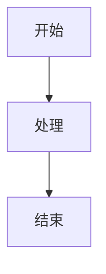

# Redis 数据结构可视化文档

本目录包含了 Redis 内部数据结构的详细可视化 Mermaid 图表。

## 📁 文件清单

### 电商系统架构
- **`1.mmd`** - 电商系统整体架构图（6层架构）

### Redis Hash 相关
- **`redis-hashtable.mmd`** - Dict 和 Hashtable 基础结构
- **`redis-rehash-process.mmd`** - 渐进式 Rehash 流程（4个阶段）
- **`redis-hash-encoding.mmd`** - ziplist vs hashtable 编码对比

### Redis Ziplist 相关
- **`redis-ziplist-detail.mmd`** - Ziplist 详细结构（entry 三部分）
- **`redis-ziplist-memory.mmd`** - 内存布局实例（含编码详解）
- **`redis-ziplist-hash-visual.mmd`** - Hash 实战可视化 `{name:"iPhone", price:5999}`
- **`redis-ziplist-hash-example.md`** - Hash 实战详细分析（字节级）

### 数据结构对比
- **`redis-datastructure-comparison.mmd`** - ziplist vs linkedlist vs hashtable 对比

### 预览文件
- **`redis-hashtable-preview.md`** - Hashtable 图表预览
- **`redis-ziplist-preview.md`** - Ziplist 图表预览
- **`redis-ziplist-hash-preview.md`** - Hash 实战预览（推荐！）

---

## 🌟 推荐：实战案例

### Hash `{name: "iPhone", price: 5999}` 完整分析 ⭐

这是一个**超详细的实战案例**，完整展示了 Redis Hash 在 ziplist 编码下的字节级内存布局。

**包含内容**：
- ✅ 完整的 36 字节内存映射（十六进制）
- ✅ 4 个 entry 的详细解析（prevlen + encoding + content）
- ✅ 整数优化示例（5999 只用 2 字节！）
- ✅ 与 hashtable、JSON 的内存对比（节省 83%）
- ✅ HGET、HINCRBY、HSET 操作演示

**快速预览**：
- 📄 `redis-ziplist-hash-example.md` - 详细文字说明
- 📊 `redis-ziplist-hash-preview.md` - 可视化图表（**推荐先看这个！**）

**内存对比结果**：
```
ziplist:     36 字节  ✅ 最优
String JSON: 50 字节  (+39%)
hashtable:  214 字节  (+494%)
```

---

## 🎯 快速导航

### 1. Redis Hash 底层原理

#### 双编码策略
```
小对象（<512 entries） → ziplist（节省内存）
大对象（≥512 entries） → hashtable（快速查找）
```

**核心文件**：
- 📊 `redis-hash-encoding.mmd` - 编码选择和转换
- 🏗️ `redis-hashtable.mmd` - Hashtable 结构
- 🔄 `redis-rehash-process.mmd` - Rehash 机制

**关键知识点**：
- Dict 包含 2 个 hashtable（`ht[0]` 和 `ht[1]`）
- 渐进式 rehash 避免阻塞
- 拉链法解决哈希冲突
- MurmurHash2 哈希函数

---

### 2. Redis Ziplist 压缩列表

#### 三层结构
```
1. 整体: zlbytes + zltail + zllen + entries + zlend
2. 节点: prevlen + encoding + content
3. 编码: 字符串3种 + 整数6种
```

**核心文件**：
- 📐 `redis-ziplist-detail.mmd` - 详细结构图
- 💾 `redis-ziplist-memory.mmd` - 内存布局示例

**关键知识点**：
- 连续内存，无指针开销
- 变长编码（0-12 直接编码）
- 双向遍历（zltail + prevlen）
- 连锁更新问题（O(n²) 最坏情况）

**内存对比**：
```
3个键值对存储：
- ziplist:     32 字节
- linkedlist:  69 字节 (+115%)
- hashtable:  160 字节 (+400%)
```

---

### 3. 数据结构选型指南

#### 使用 ziplist 的场景 ✅
- ✅ 数据量小（< 512 个元素）
- ✅ 单个数据小（< 64 字节）
- ✅ 顺序访问为主（`LRANGE`、`HGETALL`）
- ✅ 内存敏感场景

**典型应用**：
- Hash: Session、商品基础信息
- List: 浏览历史、消息队列（小）
- ZSet: TOP10 排行榜

#### 使用 hashtable 的场景 ✅
- ✅ 需要快速查找（`HGET`、`HEXISTS`）
- ✅ 数据量大（> 512 个字段）
- ✅ 随机访问为主
- ✅ 字段独立更新（`HINCRBY`）

**典型应用**：
- Hash: 用户画像、复杂对象
- Set: 大集合去重
- ZSet: 全站排行榜

**详细对比**：
- 📊 `redis-datastructure-comparison.mmd`

---

## 🖥️ 如何使用

### 方法 1: 在 Cursor 中预览

1. 打开预览文件：
   - `redis-hashtable-preview.md`
   - `redis-ziplist-preview.md`

2. 按快捷键：
   ```
   macOS: Cmd + Shift + V
   Windows/Linux: Ctrl + Shift + V
   ```

3. 如果图表未渲染，安装插件：
   - 打开扩展：`Cmd + Shift + X`
   - 搜索：`Markdown Preview Mermaid Support`
   - 安装并重启预览

### 方法 2: 在线预览

访问 https://mermaid.live，粘贴 `.mmd` 文件内容查看效果。

### 方法 3: 在博客中引用

在 Markdown 文章中直接嵌入：

````markdown

````

或引用文件：
```markdown
详见架构图：[redis-hashtable](/diagrams/mermaid/redis-hashtable.mmd)
```

---

## 📚 相关文章

- 📝 `/source/_posts/system-design/8-cache-redis.md`
  - Hash 底层实现原理详解
  - ziplist 详细结构说明
  - 电商场景最佳实践

---

## 🔑 核心概念速查

### Hashtable 关键点
- **双哈希表**：ht[0] 正常使用，ht[1] 用于 rehash
- **渐进式 rehash**：每次操作迁移一个桶，避免阻塞
- **负载因子**：used / size，触发扩容/缩容
- **拉链法**：解决哈希冲突

### Ziplist 关键点
- **prevlen**：1 或 5 字节，记录前一节点长度
- **encoding**：变长编码，标识类型和长度
- **连锁更新**：254 字节边界，最坏 O(n²)
- **阈值**：512 entries（Hash/List），128 entries（ZSet）

### 性能对比
| 操作 | ziplist | hashtable |
|------|---------|-----------|
| 查找 | O(n) | O(1) |
| 插入 | O(n) | O(1) 平均 |
| 删除 | O(n) | O(1) 平均 |
| 内存 | 极低 | 高（指针开销） |

---

## 🛠️ 配置参数参考

```conf
# Redis 配置文件 redis.conf

# Hash 编码阈值
hash-max-ziplist-entries 512
hash-max-ziplist-value 64

# List 编码阈值
list-max-ziplist-entries 512
list-max-ziplist-value 64

# ZSet 编码阈值
zset-max-ziplist-entries 128
zset-max-ziplist-value 64
```

---

## 📖 推荐阅读顺序

### 初学者路径 🌟
1. `redis-datastructure-comparison.mmd` - 整体对比
2. `redis-hash-encoding.mmd` - 编码选择
3. `redis-ziplist-detail.mmd` - Ziplist 基础
4. `redis-hashtable.mmd` - Hashtable 基础

### 进阶路径 🚀
1. `redis-ziplist-memory.mmd` - 内存布局细节
2. `redis-rehash-process.mmd` - Rehash 流程
3. 阅读博客文章的详细说明
4. 实践：查看线上 Redis 的编码类型

---

## 🔍 监控命令

```bash
# 查看数据类型
redis> TYPE mykey
"hash"

# 查看编码方式
redis> OBJECT ENCODING mykey
"ziplist"  # 或 "hashtable"

# 查看内存占用
redis> MEMORY USAGE mykey
(integer) 184

# 查找大 key
redis-cli --bigkeys

# 查看详细信息（调试用）
redis> DEBUG OBJECT mykey
```

---

## 📝 更新日志

- 2026-01-08: 创建完整的 Redis 数据结构可视化文档
  - 新增 Hash 底层实现（hashtable + ziplist）
  - 新增 ziplist 详细结构说明
  - 新增数据结构对比分析
  - 新增内存布局实例

