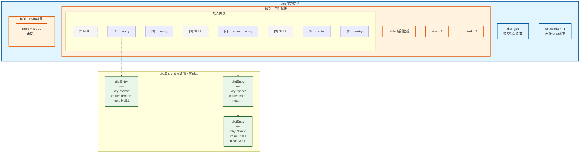
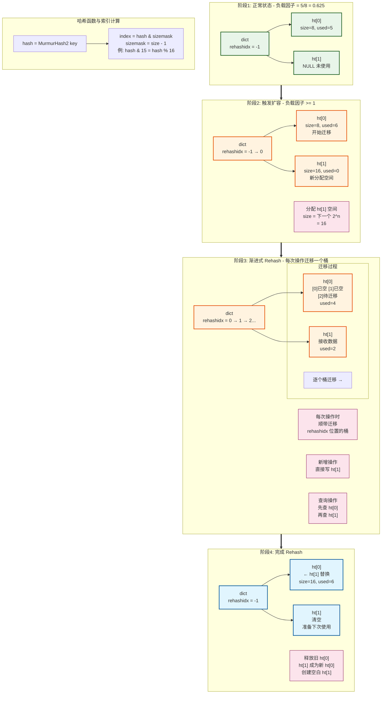

# Redis Hashtable 结构可视化

## 1. Dict 和 Hashtable 结构

```mermaid
graph TB
    subgraph dict ["dict 字典结构"]
        dictType["dictType<br/>类型特定函数"]
        rehashidx["rehashidx = -1<br/>未在rehash中"]
        
        subgraph ht0 ["ht[0] - 主哈希表"]
            ht0_table["table 指针数组"]
            ht0_size["size = 8"]
            ht0_used["used = 5"]
            
            subgraph ht0_array ["哈希表数组"]
                idx0["[0] NULL"]
                idx1["[1] → entry"]
                idx2["[2] → entry"]
                idx3["[3] NULL"]
                idx4["[4] → entry → entry"]
                idx5["[5] NULL"]
                idx6["[6] → entry"]
                idx7["[7] → entry"]
            end
        end
        
        subgraph ht1 ["ht[1] - Rehash用"]
            ht1_table["table = NULL<br/>未使用"]
        end
    end
    
    subgraph entries ["dictEntry 节点详情 - 拉链法"]
        entry1["dictEntry<br/>----<br/>key: 'name'<br/>value: 'iPhone'<br/>next: NULL"]
        
        entry2["dictEntry<br/>----<br/>key: 'price'<br/>value: '5999'<br/>next: →"]
        
        entry3["dictEntry<br/>----<br/>key: 'stock'<br/>value: '100'<br/>next: NULL"]
    end
    
    idx1 -.-> entry1
    idx4 -.-> entry2
    entry2 --> entry3
    
    classDef dictStyle fill:#e1f5fe,stroke:#01579b,stroke-width:2px
    classDef htStyle fill:#fff3e0,stroke:#e65100,stroke-width:2px
    classDef entryStyle fill:#e8f5e9,stroke:#1b5e20,stroke-width:2px
    classDef nullStyle fill:#f5f5f5,stroke:#9e9e9e,stroke-width:1px,stroke-dasharray: 5 5
    
    class dict,dictType,rehashidx dictStyle
    class ht0,ht1,ht0_table,ht0_size,ht0_used,ht1_table htStyle
    class entry1,entry2,entry3 entryStyle
    class idx0,idx3,idx5 nullStyle
```

## 2. 渐进式 Rehash 过程

```mermaid
graph TB
    subgraph phase1 ["阶段1: 正常状态 - 负载因子 = 5/8 = 0.625"]
        dict1["dict<br/>rehashidx = -1"]
        ht0_1["ht[0]<br/>size=8, used=5"]
        ht1_1["ht[1]<br/>NULL 未使用"]
        
        dict1 --> ht0_1
        dict1 --> ht1_1
    end
    
    subgraph phase2 ["阶段2: 触发扩容 - 负载因子 >= 1"]
        dict2["dict<br/>rehashidx = -1 → 0"]
        ht0_2["ht[0]<br/>size=8, used=6<br/>开始迁移"]
        ht1_2["ht[1]<br/>size=16, used=0<br/>新分配空间"]
        
        dict2 --> ht0_2
        dict2 --> ht1_2
        
        note1["分配 ht[1] 空间<br/>size = 下一个 2^n<br/>= 16"]
    end
    
    subgraph phase3 ["阶段3: 渐进式 Rehash - 每次操作迁移一个桶"]
        dict3["dict<br/>rehashidx = 0 → 1 → 2..."]
        
        subgraph migration ["迁移过程"]
            ht0_3["ht[0]<br/>[0]已空 [1]已空<br/>[2]待迁移<br/>used=4"]
            arrow["逐个桶迁移 →"]
            ht1_3["ht[1]<br/>接收数据<br/>used=2"]
        end
        
        dict3 --> ht0_3
        dict3 --> ht1_3
        
        note2["每次操作时<br/>顺带迁移<br/>rehashidx 位置的桶"]
        note3["新增操作<br/>直接写 ht[1]"]
        note4["查询操作<br/>先查 ht[0]<br/>再查 ht[1]"]
    end
    
    subgraph phase4 ["阶段4: 完成 Rehash"]
        dict4["dict<br/>rehashidx = -1"]
        ht0_4["ht[0]<br/>← ht[1] 替换<br/>size=16, used=6"]
        ht1_4["ht[1]<br/>清空<br/>准备下次使用"]
        
        dict4 --> ht0_4
        dict4 --> ht1_4
        
        note5["释放旧 ht[0]<br/>ht[1] 成为新 ht[0]<br/>创建空白 ht[1]"]
    end
    
    phase1 ==> phase2
    phase2 ==> phase3
    phase3 ==> phase4
    
    subgraph legend ["哈希函数与索引计算"]
        hash_func["hash = MurmurHash2 key"]
        index_calc["index = hash & sizemask<br/>sizemask = size - 1<br/>例: hash & 15 = hash % 16"]
        
        hash_func --> index_calc
    end
    
    classDef normalStyle fill:#e8f5e9,stroke:#1b5e20,stroke-width:2px
    classDef rehashStyle fill:#fff3e0,stroke:#e65100,stroke-width:2px
    classDef completeStyle fill:#e1f5fe,stroke:#01579b,stroke-width:2px
    classDef noteStyle fill:#fce4ec,stroke:#880e4f,stroke-width:1px
    
    class dict1,ht0_1,ht1_1 normalStyle
    class dict2,ht0_2,ht1_2,dict3,ht0_3,ht1_3 rehashStyle
    class dict4,ht0_4,ht1_4 completeStyle
    class note1,note2,note3,note4,note5 noteStyle
```

## 3. ziplist vs hashtable 编码对比

```mermaid
graph TB
    subgraph decision ["Redis Hash 编码选择"]
        start["创建 Hash"]
        
        check1{"元素个数 <= 512<br/>且<br/>单个value <= 64字节?"}
        
        ziplist["使用 ziplist<br/>压缩列表编码"]
        hashtable["使用 hashtable<br/>哈希表编码"]
        
        start --> check1
        check1 -->|是| ziplist
        check1 -->|否| hashtable
        
        trigger["后续操作触发转换"]
        convert["ziplist → hashtable<br/>不可逆转换"]
        
        ziplist --> trigger
        trigger -->|超过阈值| convert
        convert --> hashtable
    end
    
    subgraph ziplist_struct ["ziplist 结构 - 紧凑存储"]
        zl_header["zlbytes<br/>总字节数"]
        zl_tail["zltail<br/>尾节点偏移"]
        zl_len["zllen<br/>节点数量"]
        
        zl_entry1["field1<br/>'name'"]
        zl_value1["value1<br/>'iPhone'"]
        zl_entry2["field2<br/>'price'"]
        zl_value2["value2<br/>'5999'"]
        zl_entry3["field3<br/>'stock'"]
        zl_value3["value3<br/>'100'"]
        
        zl_end["zlend<br/>0xFF"]
        
        zl_header --> zl_tail --> zl_len
        zl_len --> zl_entry1 --> zl_value1 --> zl_entry2
        zl_value2 --> zl_entry3 --> zl_value3 --> zl_end
    end
    
    subgraph ht_struct ["hashtable 结构 - 快速索引"]
        ht_table["dictEntry** table<br/>指针数组"]
        
        ht_idx0["[0] NULL"]
        ht_idx1["[1] →"]
        ht_idx2["[2] →"]
        ht_idx3["[3] NULL"]
        
        ht_entry1["key: 'name'<br/>val: 'iPhone'<br/>next: NULL"]
        ht_entry2["key: 'price'<br/>val: '5999'<br/>next: →"]
        ht_entry3["key: 'stock'<br/>val: '100'<br/>next: NULL"]
        
        ht_table --> ht_idx0
        ht_table --> ht_idx1
        ht_table --> ht_idx2
        ht_table --> ht_idx3
        
        ht_idx1 --> ht_entry1
        ht_idx2 --> ht_entry2
        ht_entry2 --> ht_entry3
    end
    
    subgraph comparison ["性能对比"]
        direction LR
        
        subgraph zl_perf ["ziplist"]
            zl_get["HGET: O(n)<br/>顺序遍历"]
            zl_set["HSET: O(n)<br/>查找+插入"]
            zl_mem["内存: 低<br/>连续紧凑"]
            zl_cache["CPU缓存: 友好<br/>连续访问"]
        end
        
        subgraph ht_perf ["hashtable"]
            ht_get["HGET: O(1)<br/>哈希定位"]
            ht_set["HSET: O(1)<br/>直接插入"]
            ht_mem["内存: 高<br/>指针开销"]
            ht_cache["CPU缓存: 一般<br/>随机访问"]
        end
    end
    
    subgraph config ["配置参数 redis.conf"]
        param1["hash-max-ziplist-entries 512<br/>最大元素个数"]
        param2["hash-max-ziplist-value 64<br/>最大值长度 字节"]
        
        advice["建议:<br/>小对象用 ziplist 省内存<br/>大对象用 hashtable 保性能"]
    end
    
    classDef zlStyle fill:#e8f5e9,stroke:#1b5e20,stroke-width:2px
    classDef htStyle fill:#e1f5fe,stroke:#01579b,stroke-width:2px
    classDef decisionStyle fill:#fff3e0,stroke:#e65100,stroke-width:2px
    classDef configStyle fill:#fce4ec,stroke:#880e4f,stroke-width:2px
    
    class ziplist,zl_header,zl_entry1,zl_value1,zl_entry2,zl_value2,zl_entry3,zl_value3,zl_end,zl_get,zl_set,zl_mem,zl_cache zlStyle
    class hashtable,ht_table,ht_entry1,ht_entry2,ht_entry3,ht_get,ht_set,ht_mem,ht_cache htStyle
    class start,check1,trigger,convert decisionStyle
    class param1,param2,advice configStyle
```

