# Redis Ziplist 实战：Hash {name: "iPhone", price: 5999}

## 完整内存布局可视化

```mermaid
graph TB
    subgraph overview ["Hash {name: iPhone, price: 5999} 的 ziplist 内存布局"]
        direction TB
        
        subgraph header ["头部 10 字节"]
            h1["zlbytes<br/>0x0000002C<br/>44字节"]
            h2["zltail<br/>0x00000023<br/>尾节点@35"]
            h3["zllen<br/>0x0004<br/>4个节点"]
        end
        
        subgraph entries ["数据区域 25 字节 - field/value 交替存储"]
            direction TB
            
            subgraph e1 ["Entry 1: field name - 6字节"]
                e1_p["prevlen: 0x00<br/>前一节点 0B"]
                e1_e["encoding: 0x04<br/>00000100<br/>字符串长度4"]
                e1_c["content: name<br/>0x6E616D65"]
                
                e1_p --> e1_e --> e1_c
            end
            
            subgraph e2 ["Entry 2: value iPhone - 8字节"]
                e2_p["prevlen: 0x06<br/>前一节点 6B"]
                e2_e["encoding: 0x06<br/>00000110<br/>字符串长度6"]
                e2_c["content: iPhone<br/>0x69506F6E65"]
                
                e2_p --> e2_e --> e2_c
            end
            
            subgraph e3 ["Entry 3: field price - 7字节"]
                e3_p["prevlen: 0x08<br/>前一节点 8B"]
                e3_e["encoding: 0x05<br/>00000101<br/>字符串长度5"]
                e3_c["content: price<br/>0x7072696365"]
                
                e3_p --> e3_e --> e3_c
            end
            
            subgraph e4 ["Entry 4: value 5999 - 4字节 ⭐整数优化"]
                e4_p["prevlen: 0x07<br/>前一节点 7B"]
                e4_e["encoding: 0xC0<br/>11000000<br/>int16_t"]
                e4_c["content: 5999<br/>0x176F 小端序<br/>节省2字节!"]
                
                e4_p --> e4_e --> e4_c
            end
            
            e1 -.->|prevlen| e2
            e2 -.->|prevlen| e3
            e3 -.->|prevlen| e4
        end
        
        subgraph tail ["尾部 1 字节"]
            zlend["zlend: 0xFF<br/>结束标记"]
        end
        
        header --> entries --> tail
    end
    
    subgraph memory_map ["完整内存映射图"]
        direction LR
        
        m0["[0-3]<br/>zlbytes<br/>4B"]
        m1["[4-7]<br/>zltail<br/>4B"]
        m2["[8-9]<br/>zllen<br/>2B"]
        m3["[10-15]<br/>name<br/>6B"]
        m4["[16-23]<br/>iPhone<br/>8B"]
        m5["[24-30]<br/>price<br/>7B"]
        m6["[31-34]<br/>5999<br/>4B"]
        m7["[35]<br/>0xFF<br/>1B"]
        
        m0 ~~~ m1 ~~~ m2 ~~~ m3 ~~~ m4 ~~~ m5 ~~~ m6 ~~~ m7
        
        total["总计: 36 字节"]
    end
    
    subgraph encoding_types ["编码类型解析"]
        direction TB
        
        subgraph str_enc ["字符串编码 - Entry 1/2/3"]
            s1["00000100 = 长度4<br/>name"]
            s2["00000110 = 长度6<br/>iPhone"]
            s3["00000101 = 长度5<br/>price"]
        end
        
        subgraph int_enc ["整数编码 - Entry 4 ⭐"]
            i1["11000000 = int16<br/>5999 用 2 字节"]
            i2["如果是字符串:<br/>需要 4+2=6 字节<br/>节省 2 字节!"]
        end
    end
    
    subgraph comparison ["内存对比分析"]
        direction LR
        
        subgraph zl ["ziplist 方案"]
            zl1["头部: 10B"]
            zl2["name: 6B<br/>iPhone: 8B<br/>price: 7B<br/>5999: 4B"]
            zl3["尾部: 1B"]
            zl_total["总计: 36B"]
            
            zl1 --> zl2 --> zl3 --> zl_total
        end
        
        subgraph ht ["hashtable 方案"]
            ht1["dictht: 24B<br/>table[8]: 64B"]
            ht2["4个dictEntry<br/>每个24B = 96B"]
            ht3["字符串SDS<br/>约30B"]
            ht_total["总计: ~214B<br/>❌ 5.9倍"]
            
            ht1 --> ht2 --> ht3 --> ht_total
        end
        
        subgraph json ["String JSON 方案"]
            json1["JSON字符串<br/>32B"]
            json2["Redis开销<br/>~18B"]
            json_total["总计: ~50B<br/>❌ 1.4倍"]
            
            json1 --> json2 --> json_total
        end
    end
    
    subgraph operations ["操作演示"]
        direction TB
        
        subgraph op_get ["HGET product:1001 name"]
            get1["1. 从偏移10开始"]
            get2["2. 读取 prevlen+encoding"]
            get3["3. 对比 content = name?"]
            get4["4. 是! 读取下一个entry"]
            get5["5. 返回 iPhone"]
            get6["时间复杂度: O(n)<br/>需遍历"]
            
            get1 --> get2 --> get3 --> get4 --> get5 --> get6
        end
        
        subgraph op_incr ["HINCRBY product:1001 price 1"]
            incr1["1. 找到 price → 5999"]
            incr2["2. 解析 int16: 5999"]
            incr3["3. 加1 → 6000"]
            incr4["4. 仍在 int16 范围"]
            incr5["5. 原地更新 0x7017"]
            incr6["无需 realloc!<br/>高效!"]
            
            incr1 --> incr2 --> incr3 --> incr4 --> incr5 --> incr6
        end
        
        subgraph op_set ["HSET product:1001 stock 100"]
            set1["1. 检查 zllen < 512"]
            set2["2. realloc 扩展内存"]
            set3["3. 写入 stock field"]
            set4["4. 写入 100 整数"]
            set5["5. 更新 zlbytes等"]
            set6["可能触发连锁更新<br/>概率低"]
            
            set1 --> set2 --> set3 --> set4 --> set5 --> set6
        end
    end
    
    subgraph advantages ["ziplist 优势分析"]
        adv1["💾 内存极致优化<br/>36B vs 214B<br/>节省 83%"]
        adv2["🔢 整数压缩<br/>5999 仅用 2B<br/>智能编码"]
        adv3["🚀 CPU缓存友好<br/>连续内存<br/>预读优化"]
        adv4["↔️ 双向遍历<br/>prevlen反向<br/>zltail定位"]
    end
    
    subgraph limitations ["ziplist 限制"]
        lim1["⚠️ O(n) 查找<br/>不适合大量字段<br/>阈值 512"]
        lim2["⚠️ realloc 开销<br/>插入删除需<br/>内存重分配"]
        lim3["⚠️ 连锁更新<br/>254B边界<br/>概率低"]
        lim4["📊 适用场景<br/>小对象<br/>< 64B value"]
    end
    
    subgraph transition ["编码转换"]
        t1["条件1: entries > 512"]
        t2["条件2: value > 64B"]
        t3["触发转换<br/>ziplist → hashtable<br/>不可逆"]
        
        t1 --> t3
        t2 --> t3
    end
    
    classDef headerStyle fill:#e1f5fe,stroke:#01579b,stroke-width:2px
    classDef entryStyle fill:#fff3e0,stroke:#e65100,stroke-width:2px
    classDef intStyle fill:#c8e6c9,stroke:#2e7d32,stroke-width:3px
    classDef advStyle fill:#e8f5e9,stroke:#1b5e20,stroke-width:2px
    classDef warnStyle fill:#fce4ec,stroke:#880e4f,stroke-width:2px
    
    class h1,h2,h3,zlend,m0,m1,m2,m7 headerStyle
    class e1,e2,e3,e1_p,e1_e,e1_c,e2_p,e2_e,e2_c,e3_p,e3_e,e3_c,m3,m4,m5 entryStyle
    class e4,e4_p,e4_e,e4_c,m6,i1,i2 intStyle
    class adv1,adv2,adv3,adv4,zl,zl1,zl2,zl3,zl_total advStyle
    class lim1,lim2,lim3,lim4,ht,json,ht_total,json_total warnStyle
```



---

## 字节级详细表格

| 偏移 | 字段 | 十六进制 | 十进制 | 说明 |
|------|------|----------|--------|------|
| 0-3 | zlbytes | 0x0000002C | 44 | 总大小 |
| 4-7 | zltail | 0x00000023 | 35 | 尾节点偏移 |
| 8-9 | zllen | 0x0004 | 4 | 4个节点 |
| **10** | **Entry 1: "name"** | | | **field** |
| 10 | prevlen | 0x00 | 0 | 第一个节点 |
| 11 | encoding | 0x04 | 4 | 字符串长度4 |
| 12-15 | content | 0x6E616D65 | "name" | n-a-m-e |
| **16** | **Entry 2: "iPhone"** | | | **value** |
| 16 | prevlen | 0x06 | 6 | 前一节点6B |
| 17 | encoding | 0x06 | 6 | 字符串长度6 |
| 18-23 | content | 0x69506F6E65 | "iPhone" | i-P-h-o-n-e |
| **24** | **Entry 3: "price"** | | | **field** |
| 24 | prevlen | 0x08 | 8 | 前一节点8B |
| 25 | encoding | 0x05 | 5 | 字符串长度5 |
| 26-30 | content | 0x7072696365 | "price" | p-r-i-c-e |
| **31** | **Entry 4: 5999** | | | **value 整数** |
| 31 | prevlen | 0x07 | 7 | 前一节点7B |
| 32 | encoding | 0xC0 | 11000000 | int16_t |
| 33-34 | content | 0x6F17 | 5999 | 小端序 |
| **35** | **zlend** | **0xFF** | **255** | **结束标记** |

---

## 编码详解

### 字符串编码（前2位 = 00）
```
Entry 1: 0x04 = 00000100
  → 前2位 00 = 字符串
  → 后6位 000100 = 4 = 长度

Entry 2: 0x06 = 00000110
  → 前2位 00 = 字符串
  → 后6位 000110 = 6 = 长度

Entry 3: 0x05 = 00000101
  → 前2位 00 = 字符串
  → 后6位 000101 = 5 = 长度
```

### 整数编码（前2位 = 11）⭐
```
Entry 4: 0xC0 = 11000000
  → 前2位 11 = 整数
  → 后6位 000000 = int16_t (2字节)
  
Content: 0x6F17
  → 小端序: [0x6F] [0x17]
  → 计算: 0x17 * 256 + 0x6F = 23 * 256 + 111 = 5999
  
优化效果:
  - 整数编码: 1B encoding + 2B content = 3B
  - 字符串编码: 1B encoding + 4B "5999" = 5B
  - 节省: 2 字节!
```

---

## 内存对比总结

| 方案 | 总字节数 | 相对 ziplist | 说明 |
|------|----------|--------------|------|
| **ziplist** | **36** | **1.0x** | ✅ 最优 |
| String JSON | 50 | 1.4x | ❌ 无法部分更新 |
| hashtable | 214 | 5.9x | ❌ 内存开销大 |

---

## 关键要点

### 为什么这么省内存？

1. **无指针开销**：linkedlist 每节点 16B 指针，hashtable 每节点 8B 指针
2. **紧凑存储**：连续内存，无碎片
3. **整数优化**：5999 用 2B，不是 4B 字符串
4. **变长编码**：小数据用小空间

### 适用场景

```go
// ✅ 推荐：小对象
rdb.HSet(ctx, "session:123", map[string]interface{}{
    "uid":   88888,
    "name":  "alice",
    "role":  "buyer",
    "login": time.Now().Unix(),
})
// → ziplist 编码，内存极省

// ❌ 不推荐：大对象或大量字段
rdb.HSet(ctx, "user:123", "profile", longJSON)  // > 64B
// → 会转换为 hashtable
```

### 监控命令

```bash
redis> HSET product:1001 name "iPhone" price 5999
redis> OBJECT ENCODING product:1001
"ziplist"

redis> MEMORY USAGE product:1001
(integer) 64  # 包括 Redis 对象开销

redis> HLEN product:1001
(integer) 2
```

