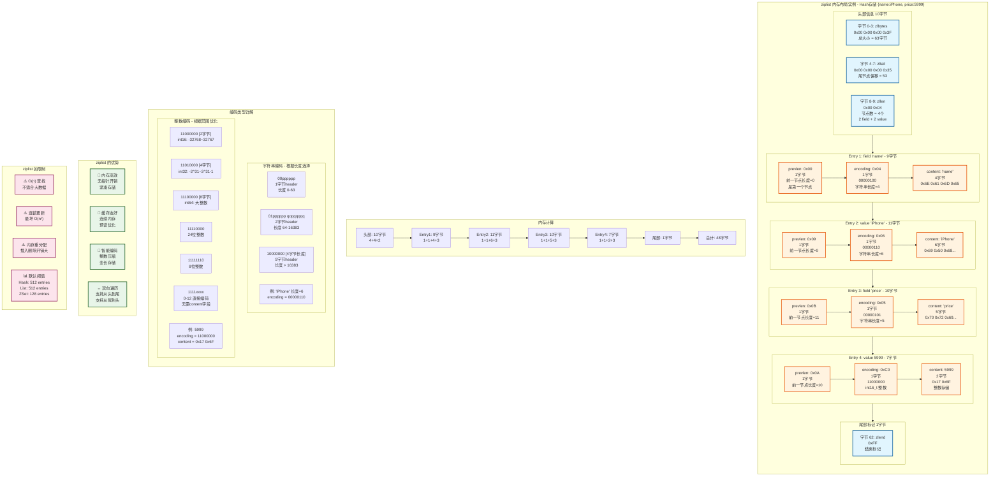

# Redis Ziplist 详细结构可视化

## 1. Ziplist 整体结构和 Entry 节点详解

```mermaid
graph TB
    subgraph overview ["ziplist 整体结构 - 连续内存块"]
        direction LR
        
        zlbytes["zlbytes<br/>4字节<br/>整个ziplist占用字节数"]
        zltail["zltail<br/>4字节<br/>到尾节点的偏移量"]
        zllen["zllen<br/>2字节<br/>节点数量<br/>最大65535"]
        
        entry1["entry 1"]
        entry2["entry 2"]
        entry3["entry 3"]
        entryn["entry N"]
        
        zlend["zlend<br/>1字节<br/>0xFF<br/>结束标记"]
        
        zlbytes --> zltail --> zllen --> entry1 --> entry2 --> entry3 --> entryn --> zlend
    end
    
    subgraph entry_struct ["Entry 节点详细结构 - 三部分"]
        direction TB
        
        subgraph prevlen ["1. prevlen - 前一节点长度"]
            prevlen_desc["记录前一个节点的长度<br/>用于从后向前遍历"]
            
            prevlen_1byte["< 254字节:<br/>用 1 字节存储<br/>直接存长度值"]
            prevlen_5byte[">= 254字节:<br/>用 5 字节存储<br/>第1字节=0xFE<br/>后4字节=实际长度"]
            
            prevlen_desc --> prevlen_1byte
            prevlen_desc --> prevlen_5byte
        end
        
        subgraph encoding ["2. encoding - 编码类型"]
            encoding_desc["记录 content 的类型和长度"]
            
            subgraph string_enc ["字符串编码"]
                enc_00["00pppppp<br/>长度<=63字节<br/>后6位存长度"]
                enc_01["01pppppp qqqqqqqq<br/>长度<=16383字节<br/>14位存长度"]
                enc_10["10______ [4字节]<br/>长度>16383字节<br/>后续4字节存长度"]
            end
            
            subgraph int_enc ["整数编码"]
                enc_11_00["11000000<br/>int16_t<br/>2字节整数"]
                enc_11_01["11010000<br/>int32_t<br/>4字节整数"]
                enc_11_10["11100000<br/>int64_t<br/>8字节整数"]
                enc_11_11["1111xxxx<br/>0-12的整数<br/>直接存在编码中"]
            end
            
            encoding_desc --> string_enc
            encoding_desc --> int_enc
        end
        
        subgraph content ["3. content - 实际数据"]
            content_desc["存储实际的数据<br/>根据 encoding 解析"]
            
            content_string["字符串:<br/>原始字节数组"]
            content_int["整数:<br/>二进制整数"]
            
            content_desc --> content_string
            content_desc --> content_int
        end
    end
    
    subgraph example1 ["示例1: Hash 存储 name=iPhone"]
        direction LR
        
        ex1_field["Entry (field)<br/>----<br/>prevlen: 0<br/>encoding: 00000100<br/>content: 'name'"]
        
        ex1_value["Entry (value)<br/>----<br/>prevlen: 9<br/>encoding: 00000110<br/>content: 'iPhone'"]
        
        ex1_field --> ex1_value
        
        ex1_note["解释:<br/>prevlen=0: 第一个节点<br/>00000100: 字符串长度4<br/>prevlen=9: 前一节点9字节"]
    end
    
    subgraph example2 ["示例2: List 存储整数 [100, 200, 12]"]
        direction LR
        
        ex2_1["Entry 1<br/>----<br/>prevlen: 0<br/>encoding: 11000000<br/>content: 100<br/>int16"]
        
        ex2_2["Entry 2<br/>----<br/>prevlen: 7<br/>encoding: 11000000<br/>content: 200<br/>int16"]
        
        ex2_3["Entry 3<br/>----<br/>prevlen: 7<br/>encoding: 11111100<br/>整数12直接编码"]
        
        ex2_1 --> ex2_2 --> ex2_3
    end
    
    subgraph cascade ["连锁更新问题 Cascade Update"]
        direction TB
        
        cascade_desc["问题: 插入/删除节点导致后续节点的 prevlen 字段变化"]
        
        before["更新前:<br/>[253B] [253B] [253B]<br/>每个 prevlen 占 1 字节"]
        
        after["插入大节点后:<br/>[253B] [260B] [?B] [?B]<br/>后续节点 prevlen 需扩展为 5 字节"]
        
        impact["影响:<br/>最坏情况: O(n²) 时间复杂度<br/>需要连续重新分配内存<br/>实际中很少发生"]
        
        cascade_desc --> before --> after --> impact
    end
    
    subgraph traverse ["遍历方式"]
        direction LR
        
        forward["正向遍历:<br/>zllen 获取长度<br/>从第一个 entry 开始<br/>根据 encoding 计算节点大小<br/>跳到下一个节点"]
        
        backward["反向遍历:<br/>zltail 直接定位尾节点<br/>根据 prevlen 跳到前一节点<br/>实现双向遍历能力"]
    end
    
    subgraph memory ["内存优化特点"]
        direction TB
        
        opt1["✅ 连续内存分配<br/>CPU缓存友好"]
        opt2["✅ 无指针开销<br/>节省内存"]
        opt3["✅ 变长编码<br/>小数据压缩存储"]
        opt4["❌ 插入/删除需内存重分配<br/>可能触发连锁更新"]
        opt5["❌ 查找是 O(n)<br/>不适合大量数据"]
    end
    
    classDef headerStyle fill:#e1f5fe,stroke:#01579b,stroke-width:2px
    classDef entryStyle fill:#fff3e0,stroke:#e65100,stroke-width:2px
    classDef exampleStyle fill:#e8f5e9,stroke:#1b5e20,stroke-width:2px
    classDef warnStyle fill:#fce4ec,stroke:#880e4f,stroke-width:2px
    
    class zlbytes,zltail,zllen,zlend headerStyle
    class prevlen_1byte,prevlen_5byte,enc_00,enc_01,enc_10,enc_11_00,enc_11_01,enc_11_10,enc_11_11 entryStyle
    class ex1_field,ex1_value,ex2_1,ex2_2,ex2_3 exampleStyle
    class cascade_desc,before,after,impact,opt4,opt5 warnStyle
```

## 2. 实际内存布局示例

## 关键要点总结

### Ziplist 的三层结构
1. **整体结构**：zlbytes + zltail + zllen + entries + zlend
2. **节点结构**：prevlen + encoding + content
3. **变长编码**：字符串（3种）+ 整数（6种）

### 内存优化技巧
- **无指针开销**：对比链表每个节点省 16 字节
- **整数压缩**：0-12 直接编码，无需 content 字段
- **变长 prevlen**：小节点 1 字节，大节点 5 字节

### 性能特点
- ✅ 小数据量（< 512）性能优秀
- ✅ 内存占用极低
- ❌ O(n) 查找，不适合大数据
- ❌ 连锁更新风险（实际很少）

### 应用场景
- Hash 小对象（商品详情、Session）
- List 消息队列（< 512 消息）
- ZSet 小型排行榜（< 128 成员）

